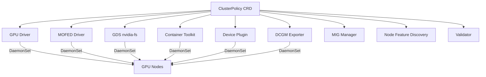

> 💡 **Quick Answer:** The ClusterPolicy CRD is the single configuration point for the NVIDIA GPU Operator — it controls driver installation, container toolkit, device plugin, MOFED, GDS, DCGM exporter, MIG manager, and node feature discovery.

## The Problem

The NVIDIA GPU Operator has dozens of configuration options spread across multiple components. Setting up a production GPU cluster requires understanding which options to enable, how they interact, and what the correct values are for your hardware.

## The Solution

### Production-Ready ClusterPolicy

```yaml
apiVersion: nvidia.com/v1
kind: ClusterPolicy
metadata:
  name: cluster-policy
spec:
  # === Operator Settings ===
  operator:
    defaultRuntime: containerd  # or crio for OpenShift
    initContainer:
      image: cuda
      repository: nvcr.io/nvidia
      version: "12.6.1-base-ubi8"

  # === GPU Driver ===
  driver:
    enabled: true
    image: driver
    repository: nvcr.io/nvidia
    version: "550.127.08"
    imagePullPolicy: IfNotPresent
    manager:
      image: k8s-driver-manager
      repository: nvcr.io/nvidia/cloud-native
      env:
        - name: ENABLE_GPU_DIRECT_STORAGE
          value: "true"
    rdma:
      enabled: true
      useHostMofed: false
    licensingConfig:
      nlsEnabled: false
    kernelModuleConfig:
      name: ""
    upgradePolicy:
      autoUpgrade: true
      maxParallelUpgrades: 1
      drain:
        enable: true
        force: true
        timeoutSeconds: 300

  # === MOFED Driver ===
  mofed:
    enabled: true
    image: mofed
    repository: nvcr.io/nvstaging/mellanox
    version: "24.07-0.6.1.0"
    env:
      - name: UNLOAD_STORAGE_MODULES
        value: "true"
      - name: RESTORE_DRIVER_ON_POD_TERMINATION
        value: "true"
    startupProbe:
      initialDelaySeconds: 10
      periodSeconds: 20
    upgradePolicy:
      autoUpgrade: true
      maxParallelUpgrades: 1
      drain:
        enable: true

  # === GPUDirect Storage ===
  gds:
    enabled: true
    image: nvidia-fs
    repository: nvcr.io/nvidia/cloud-native
    version: "2.20.5"

  # === Container Toolkit ===
  toolkit:
    enabled: true
    image: container-toolkit
    repository: nvcr.io/nvidia/k8s
    version: "v1.16.2-ubuntu20.04"
    env:
      - name: CONTAINERD_CONFIG
        value: "/etc/containerd/config.toml"
      - name: CONTAINERD_SOCKET
        value: "/run/containerd/containerd.sock"

  # === Device Plugin ===
  devicePlugin:
    enabled: true
    image: k8s-device-plugin
    repository: nvcr.io/nvidia
    version: "v0.16.2"
    env:
      - name: PASS_DEVICE_SPECS
        value: "true"
      - name: DEVICE_LIST_STRATEGY
        value: "envvar"
      - name: DEVICE_ID_STRATEGY
        value: "uuid"

  # === DCGM and DCGM Exporter ===
  dcgm:
    enabled: true
    image: dcgm
    repository: nvcr.io/nvidia/cloud-native
    version: "3.3.8-1-ubuntu22.04"
  dcgmExporter:
    enabled: true
    image: dcgm-exporter
    repository: nvcr.io/nvidia/k8s
    version: "3.3.8-3.6.0-ubuntu22.04"
    env:
      - name: DCGM_EXPORTER_LISTEN
        value: ":9400"
      - name: DCGM_EXPORTER_KUBERNETES
        value: "true"
    serviceMonitor:
      enabled: true
      interval: "15s"

  # === MIG Manager ===
  migManager:
    enabled: false  # Enable for A100/H100 MIG workloads
    image: k8s-mig-manager
    repository: nvcr.io/nvidia/cloud-native
    version: "v0.8.0"
    config:
      name: "default-mig-parted-config"
    env:
      - name: WITH_REBOOT
        value: "false"

  # === Node Feature Discovery ===
  nodeStatusExporter:
    enabled: true
  gfd:
    enabled: true
    image: k8s-device-plugin
    repository: nvcr.io/nvidia
    version: "v0.16.2"

  # === Validator ===
  validator:
    image: cuda-sample
    repository: nvcr.io/nvidia/k8s
    version: "vectorAdd-cuda12.5.0"
    env:
      - name: WITH_WORKLOAD
        value: "true"
```

### Component Overview



### Component Interaction Table

| Component | Depends On | Purpose |
|-----------|-----------|---------|
| Driver | — | Installs NVIDIA GPU kernel driver |
| MOFED | — | Installs Mellanox OFED for RDMA |
| GDS | Driver, MOFED | GPUDirect Storage kernel module |
| Toolkit | Driver | Configures container runtime for GPU access |
| Device Plugin | Toolkit | Exposes GPUs to Kubernetes scheduler |
| DCGM Exporter | Driver | Prometheus metrics for GPU monitoring |
| MIG Manager | Driver | Manages Multi-Instance GPU partitioning |
| GFD | Driver | Labels nodes with GPU feature info |
| Validator | All above | Validates the full stack is working |

### Common Configuration Patterns

**AI Training Cluster (full stack):**
```bash
helm install gpu-operator nvidia/gpu-operator \
  --set driver.rdma.enabled=true \
  --set mofed.enabled=true \
  --set gds.enabled=true \
  --set dcgmExporter.serviceMonitor.enabled=true
```

**Inference Cluster (minimal):**
```bash
helm install gpu-operator nvidia/gpu-operator \
  --set mofed.enabled=false \
  --set gds.enabled=false \
  --set migManager.enabled=false
```

**MIG Cluster (A100/H100 multi-tenant):**
```bash
helm install gpu-operator nvidia/gpu-operator \
  --set migManager.enabled=true \
  --set migManager.config.name=default-mig-parted-config \
  --set devicePlugin.env[0].name=MIG_STRATEGY \
  --set devicePlugin.env[0].value=mixed
```

**OpenShift (CRI-O runtime):**
```bash
helm install gpu-operator nvidia/gpu-operator \
  --set operator.defaultRuntime=crio \
  --set toolkit.env[0].name=CONTAINERD_CONFIG \
  --set toolkit.env[0].value="" \
  --set driver.rdma.enabled=true
```

## Common Issues

### ClusterPolicy Stuck in "NotReady"

```bash
# Check which component is failing
kubectl get clusterpolicy cluster-policy -o json | \
  jq '.status.state, .status.conditions'

# Check individual component pods
kubectl get pods -n gpu-operator --sort-by=.status.phase
```

### Component Version Mismatches

Always check the [GPU Operator compatibility matrix](https://docs.nvidia.com/datacenter/cloud-native/gpu-operator/latest/platform-support.html) for matching versions across driver, MOFED, GDS, and toolkit.

### Modifying ClusterPolicy After Install

```bash
# Patch individual components
kubectl patch clusterpolicy cluster-policy --type merge -p '{
  "spec": {
    "gds": {"enabled": true}
  }
}'

# Or edit interactively
kubectl edit clusterpolicy cluster-policy
```

## Best Practices

- **Start minimal, add components** — enable only what you need, add MOFED/GDS later
- **Pin all versions** — never use `latest` tags in production
- **Enable DCGM ServiceMonitor** — GPU metrics in Prometheus are essential for operations
- **Use `autoUpgrade` with `maxParallelUpgrades: 1`** — safe rolling upgrades
- **Enable drain on upgrades** — prevent workload disruption during driver updates
- **Validate after every change** — the Validator component runs a CUDA sample to confirm the stack works

## Key Takeaways

- ClusterPolicy is the single CRD that configures the entire NVIDIA GPU stack on Kubernetes
- Components deploy as DaemonSets on GPU-labeled nodes automatically
- Choose your pattern: full AI training stack, minimal inference, or MIG multi-tenant
- Always pin versions and enable upgrade policies for production clusters
