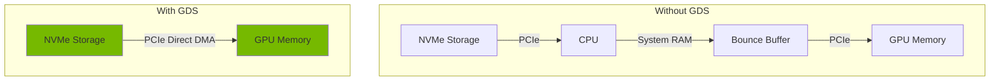

> 💡 **Quick Answer:** Enable GDS in the ClusterPolicy with `gds.enabled: true` and configure the `nvidia-fs` kernel module to allow GPUs to read/write directly from NVMe or RDMA-capable storage, bypassing CPU bounce buffers.

## The Problem

AI training and inference workloads process massive datasets — loading terabytes of training data through the traditional storage path creates a bottleneck:

```
Traditional: Storage → PCIe → CPU → System Memory → PCIe → GPU Memory
GPUDirect:   Storage → PCIe → GPU Memory (direct!)
```

Without GPUDirect Storage (GDS), every byte of data passes through the CPU and system memory, adding latency and consuming CPU resources. GDS eliminates this bottleneck with direct DMA transfers between storage and GPU memory.

## The Solution

### Step 1: Verify GDS Prerequisites

```bash
# Check GPU compatibility (A100, H100, H200, L40S)
nvidia-smi --query-gpu=name,pci.bus_id --format=csv

# Verify MOFED is running (required for RDMA-based storage)
kubectl get pods -n gpu-operator -l app=mofed-ubuntu

# Check NVMe devices (for local NVMe GDS)
lsblk | grep nvme
```

### Step 2: Enable GDS in ClusterPolicy

```yaml
apiVersion: nvidia.com/v1
kind: ClusterPolicy
metadata:
  name: cluster-policy
spec:
  driver:
    enabled: true
    version: "550.127.08"
    rdma:
      enabled: true
  gds:
    enabled: true
    image: nvidia-fs
    repository: nvcr.io/nvidia/cloud-native
    version: "2.20.5"
    imagePullPolicy: IfNotPresent
    args: []
    env:
      - name: GDS_LOG_LEVEL
        value: "3"
  mofed:
    enabled: true
    image: mofed
    repository: nvcr.io/nvstaging/mellanox
    version: "24.07-0.6.1.0"
  toolkit:
    enabled: true
  devicePlugin:
    enabled: true
```

```bash
kubectl apply -f cluster-policy.yaml
```

### Step 3: Verify GDS Module is Loaded

```bash
# Check nvidia-fs driver pods
kubectl get pods -n gpu-operator -l app=nvidia-fs-ctr

# Verify the nvidia-fs kernel module is loaded on nodes
kubectl exec -n gpu-operator -it $(kubectl get pod -n gpu-operator \
  -l app=nvidia-fs-ctr -o jsonpath='{.items[0].metadata.name}') \
  -- lsmod | grep nvidia_fs
# Expected: nvidia_fs  <size>  0

# Check GDS configuration
kubectl exec -n gpu-operator -it $(kubectl get pod -n gpu-operator \
  -l app=nvidia-fs-ctr -o jsonpath='{.items[0].metadata.name}') \
  -- cat /proc/driver/nvidia-fs/stats
```

### Step 4: Test GDS Performance

Use the `gdsio` benchmark tool:

```yaml
apiVersion: v1
kind: Pod
metadata:
  name: gds-benchmark
spec:
  nodeSelector:
    nvidia.com/gpu.present: "true"
  containers:
    - name: benchmark
      image: nvcr.io/nvidia/pytorch:24.07-py3
      command: ["sleep", "infinity"]
      resources:
        limits:
          nvidia.com/gpu: "1"
      securityContext:
        privileged: true
      volumeMounts:
        - name: nvme-data
          mountPath: /data
  volumes:
    - name: nvme-data
      hostPath:
        path: /mnt/nvme0
        type: Directory
```

```bash
kubectl apply -f gds-benchmark.yaml

# Run GDS benchmark (read test)
kubectl exec gds-benchmark -- gdsio -f /data/testfile \
  -d 0 -w 4 -s 1G -i 1M -x 0 -I 1

# Run without GDS for comparison (CPU path)
kubectl exec gds-benchmark -- gdsio -f /data/testfile \
  -d 0 -w 4 -s 1G -i 1M -x 0 -I 0

# Expected: GDS path shows 2-5x higher throughput
```

### Step 5: Configure GDS with cuFile API

Applications must use the cuFile API to leverage GDS. Example in Python with kvikio:

```python
import kvikio
import cupy as cp
import numpy as np

# Open file with GDS
f = kvikio.CuFile("/data/model-weights.bin", "r")

# Read directly into GPU memory — bypasses CPU!
gpu_buffer = cp.empty(1024 * 1024 * 1024, dtype=cp.uint8)  # 1GB
bytes_read = f.read(gpu_buffer)
f.close()

print(f"Read {bytes_read / 1e9:.2f} GB directly to GPU memory via GDS")
```

### GDS Architecture



## GDS Compatibility Matrix

| Storage Type | GDS Support | Notes |
|---|---|---|
| Local NVMe | ✅ Full | Best performance, direct PCIe path |
| NFS over RDMA | ✅ Full | Requires MOFED + NFS RDMA server |
| Lustre | ✅ Full | Parallel filesystem, common in HPC |
| GPFS/Spectrum Scale | ✅ Full | IBM parallel filesystem |
| WekaFS | ✅ Full | High-performance distributed FS |
| Ceph RBD | ⚠️ Partial | Requires RDMA-capable Ceph OSD |
| Standard NFS | ❌ No | TCP-based NFS doesn't support GDS |
| iSCSI | ❌ No | Not supported |

## Common Issues

### nvidia-fs Module Fails to Load

```bash
# Check pod logs
kubectl logs -n gpu-operator -l app=nvidia-fs-ctr --tail=50

# Common cause: kernel module version mismatch
# Fix: update GDS version to match GPU driver
```

### GDS Not Used Despite Being Enabled

Applications must explicitly use the cuFile API. Standard `read()`/`write()` syscalls bypass GDS:

```bash
# Verify GDS is being used by checking stats
kubectl exec gds-benchmark -- cat /proc/driver/nvidia-fs/stats
# "nr_reads" and "nr_writes" should increase during GDS operations
```

### Permission Issues

GDS requires elevated privileges for direct DMA:

```yaml
securityContext:
  privileged: true
  # Or more targeted:
  capabilities:
    add:
      - SYS_ADMIN
      - IPC_LOCK
```

## Best Practices

- **Use NVMe for highest throughput** — local NVMe provides the shortest PCIe path
- **Pin GDS version to GPU driver version** — mismatches cause module load failures
- **Monitor `/proc/driver/nvidia-fs/stats`** — verify GDS is actually being used
- **Use kvikio for Python workloads** — provides a Pythonic cuFile API wrapper
- **Enable MOFED first** — GDS over network storage requires RDMA drivers
- **Benchmark before and after** — use `gdsio` to quantify the improvement
- **Pre-stage data on NVMe** — GDS works best with data already on fast storage

## Key Takeaways

- GDS eliminates the CPU bounce buffer for storage I/O, enabling direct GPU-to-storage DMA
- Enable via `gds.enabled: true` in the GPU Operator ClusterPolicy
- Applications must use the cuFile API (or kvikio for Python) — standard I/O calls don't use GDS
- GDS provides 2-5x throughput improvement for data loading in AI training pipelines
- Works with NVMe, NFS over RDMA, Lustre, GPFS, and WekaFS
