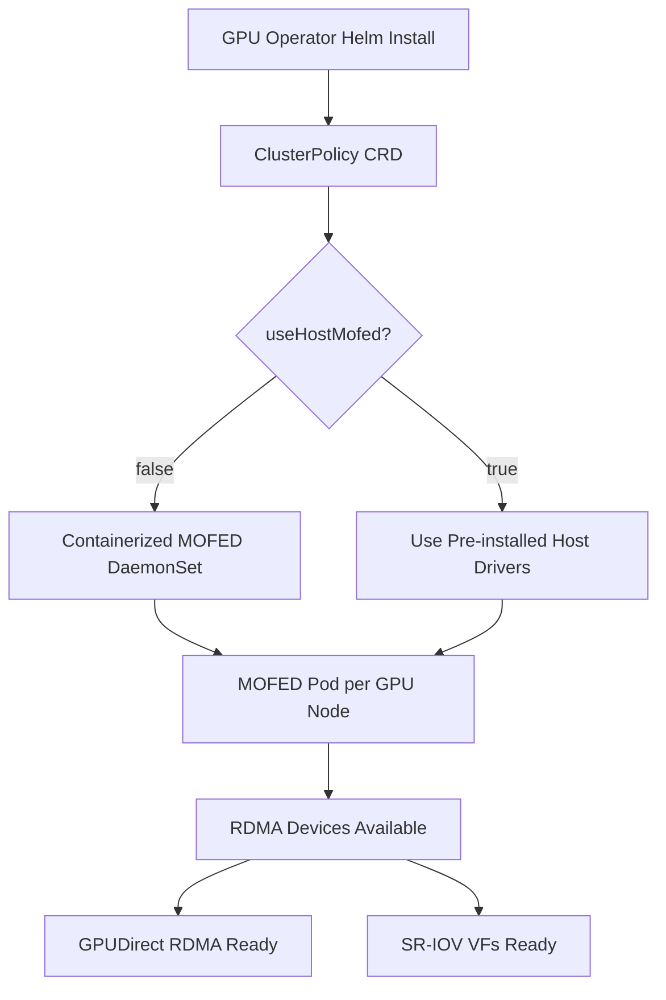

> 💡 **Quick Answer:** Enable MOFED in the GPU Operator ClusterPolicy with `driver.rdma.enabled=true` and `driver.rdma.useHostMofed=false` to deploy containerized Mellanox OFED drivers, or set `useHostMofed=true` to use pre-installed host drivers.

## The Problem

AI and HPC workloads running on Kubernetes need high-bandwidth, low-latency networking between GPU nodes. Standard TCP/IP networking adds unacceptable overhead for distributed training — you need RDMA (Remote Direct Memory Access) via InfiniBand or RoCE.

The Mellanox OFED (MOFED) driver stack enables RDMA on ConnectX NICs, but installing and managing these drivers across a fleet of GPU nodes is complex:

- **Driver version alignment** — MOFED version must match the kernel and GPU driver
- **Node lifecycle** — drivers must survive reboots, upgrades, and node replacements
- **Containerized vs host drivers** — choosing the right deployment model affects maintenance

The NVIDIA GPU Operator automates MOFED driver deployment through the ClusterPolicy CRD.

## The Solution

### Step 1: Install the GPU Operator with MOFED Enabled

```bash
# Add the NVIDIA Helm repository
helm repo add nvidia https://helm.ngc.nvidia.com/nvidia
helm repo update

# Install with MOFED driver support
helm install gpu-operator nvidia/gpu-operator \
  -n gpu-operator --create-namespace \
  --set driver.rdma.enabled=true \
  --set driver.rdma.useHostMofed=false
```

### Step 2: Configure ClusterPolicy for MOFED

For fine-grained control, create or patch the ClusterPolicy:

```yaml
apiVersion: nvidia.com/v1
kind: ClusterPolicy
metadata:
  name: cluster-policy
spec:
  operator:
    defaultRuntime: containerd
  driver:
    enabled: true
    version: "550.127.08"
    rdma:
      enabled: true
      useHostMofed: false
    upgradePolicy:
      autoUpgrade: true
      maxParallelUpgrades: 1
      drain:
        enable: true
        force: true
        timeoutSeconds: 300
  mofed:
    enabled: true
    image: mofed
    repository: nvcr.io/nvstaging/mellanox
    version: "24.07-0.6.1.0"
    startupProbe:
      initialDelaySeconds: 10
      periodSeconds: 20
    livenessProbe:
      initialDelaySeconds: 30
      periodSeconds: 30
    readinessProbe:
      initialDelaySeconds: 10
      periodSeconds: 30
    env:
      - name: UNLOAD_STORAGE_MODULES
        value: "true"
      - name: ENABLE_NFSRDMA
        value: "false"
      - name: RESTORE_DRIVER_ON_POD_TERMINATION
        value: "true"
  devicePlugin:
    enabled: true
  toolkit:
    enabled: true
```

```bash
kubectl apply -f cluster-policy.yaml
```

### Step 3: Verify MOFED Driver Deployment

```bash
# Check MOFED driver pods are running on GPU nodes
kubectl get pods -n gpu-operator -l app=mofed-ubuntu -o wide

# Verify the MOFED driver version
kubectl exec -n gpu-operator -it $(kubectl get pod -n gpu-operator \
  -l app=mofed-ubuntu -o jsonpath='{.items[0].metadata.name}') \
  -- ofed_info -s
# Expected output: MLNX_OFED_LINUX-24.07-0.6.1.0

# Check RDMA devices are visible
kubectl exec -n gpu-operator -it $(kubectl get pod -n gpu-operator \
  -l app=mofed-ubuntu -o jsonpath='{.items[0].metadata.name}') \
  -- ibstat
```

### Step 4: Host MOFED vs Containerized MOFED

**Containerized MOFED** (default — `useHostMofed: false`):
- GPU Operator deploys MOFED as a DaemonSet
- Automatic updates via ClusterPolicy
- Easier lifecycle management

**Host MOFED** (`useHostMofed: true`):
- Pre-install MOFED on nodes before GPU Operator
- Operator skips MOFED deployment, uses existing drivers
- Required when specific MOFED build or patches are needed

```yaml
# Use pre-installed host MOFED drivers
spec:
  driver:
    rdma:
      enabled: true
      useHostMofed: true
  mofed:
    enabled: false  # Don't deploy containerized MOFED
```

### Step 5: Configure MOFED Environment Variables

Key environment variables for MOFED driver pods:

```yaml
spec:
  mofed:
    enabled: true
    env:
      # Unload storage modules to avoid conflicts
      - name: UNLOAD_STORAGE_MODULES
        value: "true"
      # Enable NFS over RDMA (set true for storage workloads)
      - name: ENABLE_NFSRDMA
        value: "false"
      # Restore driver on pod restart
      - name: RESTORE_DRIVER_ON_POD_TERMINATION
        value: "true"
      # Force specific firmware version (optional)
      - name: FORCE_FW_UPDATE
        value: "false"
```



## Common Issues

### MOFED Pod Stuck in Init

```bash
# Check MOFED pod logs
kubectl logs -n gpu-operator -l app=mofed-ubuntu --tail=50

# Common cause: kernel headers not available
# Fix: ensure kernel-devel packages match the running kernel
```

### MOFED and Secure Boot Conflict

MOFED drivers are unsigned by default. On Secure Boot nodes:

```yaml
spec:
  mofed:
    enabled: true
    env:
      - name: CREATE_IFNAMES_UDEV
        value: "true"
    # Use pre-signed drivers or disable Secure Boot
```

### MOFED Version Compatibility

| MOFED Version | GPU Driver | Kubernetes | Notes |
|---------------|-----------|------------|-------|
| 24.07-0.6.1.0 | 550.x | 1.27+ | Current recommended |
| 23.10-x | 545.x | 1.25+ | Previous LTS |
| 24.01-x | 550.x | 1.27+ | Intermediate release |

## Best Practices

- **Pin MOFED versions** — don't use `latest`; match with your GPU driver version
- **Use `autoUpgrade` carefully** — test MOFED upgrades in staging before production
- **Enable drain on upgrade** — `drain.enable: true` prevents workload disruption
- **Monitor with `ibstat`** — regularly check link state and speed
- **Use containerized MOFED** unless you have specific host-level requirements
- **Set `RESTORE_DRIVER_ON_POD_TERMINATION: true`** — ensures drivers persist across pod restarts

## Key Takeaways

- The GPU Operator ClusterPolicy manages MOFED driver lifecycle as a DaemonSet
- Choose between containerized MOFED (automated) or host MOFED (pre-installed) based on your needs
- MOFED enables RDMA networking required for GPUDirect and high-performance distributed training
- Always pin MOFED versions and test upgrades in staging before rolling out to production
