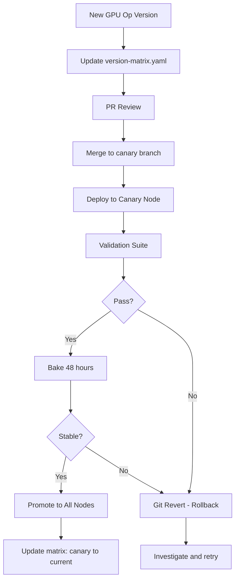

> 💡 **Quick Answer:** Label one GPU node as `gpu-canary: "true"`, upgrade GPU Operator with node affinity targeting canary only, bake for 48 hours with validation gates (smoke training, inference, RDMA health, GPU errors), then promote to all nodes. Rollback = git revert.

## The Problem

GPU Operator upgrades touch kernel modules, CUDA runtime, device plugin, and DCGM. A bad upgrade kills all GPU workloads cluster-wide. You can't "try it and see" on production — you need a staged rollout with validation before committing.

## The Solution

### Known-Good Version Matrix

```yaml
# gpu-version-matrix.yaml (stored in Git)
versions:
  current:
    gpu_operator: "v24.9.0"
    network_operator: "v24.7.0"
    driver: "560.35.03"
    cuda: "12.6"
    firmware: "28.40.1000"
    sriov: "4.18.0"
    openshift: "4.16.23"
    status: "production"
  canary:
    gpu_operator: "v24.12.0"
    network_operator: "v24.10.0"
    driver: "565.57.01"
    cuda: "12.8"
    firmware: "28.42.1000"
    sriov: "4.18.0"
    openshift: "4.16.23"
    status: "testing"
```

### Canary Node Setup

```bash
# Label canary GPU node
oc label node gpu-worker-4 gpu-canary=true

# Create canary MachineConfigPool (OpenShift)
cat <<EOF | oc apply -f -
apiVersion: machineconfiguration.openshift.io/v1
kind: MachineConfigPool
metadata:
  name: gpu-canary
spec:
  machineConfigSelector:
    matchExpressions:
      - key: machineconfiguration.openshift.io/role
        operator: In
        values: ["worker", "gpu-worker", "gpu-canary"]
  nodeSelector:
    matchLabels:
      gpu-canary: "true"
  paused: false
EOF
```

### Staged Upgrade

```bash
# Step 1: Drain canary node
oc adm drain gpu-worker-4 --ignore-daemonsets --delete-emptydir-data

# Step 2: Apply canary GPU Operator version
# In ClusterPolicy, use nodeSelector to target canary
oc patch clusterpolicy gpu-cluster-policy --type=merge -p '
{
  "spec": {
    "driver": {
      "version": "565.57.01",
      "nodeSelector": {"gpu-canary": "true"}
    }
  }
}'

# Step 3: Uncordon and verify
oc adm uncordon gpu-worker-4

# Step 4: Run validation suite
./validate-gpu.sh gpu-worker-4

# Step 5: Bake for 48 hours
echo "Canary deployed at $(date). Monitor for 48h before promotion."

# Step 6: Promote to all nodes (after validation)
oc patch clusterpolicy gpu-cluster-policy --type=merge -p '
{
  "spec": {
    "driver": {
      "version": "565.57.01",
      "nodeSelector": {}
    }
  }
}'
```

### Validation Gate Script

```bash
#!/bin/bash
# validate-gpu.sh — run on canary node
NODE=$1
echo "=== GPU Validation on $NODE ==="

# 1. Smoke training
echo "1. Smoke training test..."
kubectl run gpu-train-test --image=nvcr.io/nvidia/pytorch:24.03-py3 \
  --restart=Never --rm -it --node-name=$NODE \
  --limits='nvidia.com/gpu=1' -- \
  python -c "
import torch
x = torch.randn(1000, 1000, device='cuda')
y = torch.mm(x, x)
print(f'Training smoke: OK ({y.shape})')
"

# 2. Smoke inference
echo "2. Smoke inference test..."
kubectl run gpu-infer-test --image=nvcr.io/nvidia/pytorch:24.03-py3 \
  --restart=Never --rm -it --node-name=$NODE \
  --limits='nvidia.com/gpu=1' -- \
  python -c "
import torch
model = torch.nn.Linear(1024, 1024).cuda()
x = torch.randn(32, 1024, device='cuda')
with torch.no_grad():
    y = model(x)
print(f'Inference smoke: OK ({y.shape})')
"

# 3. RDMA health
echo "3. RDMA health check..."
kubectl exec -it $(kubectl get pods -n gpu-operator -l app=nvidia-driver-daemonset \
  --field-selector spec.nodeName=$NODE -o name | head -1) \
  -n gpu-operator -- ibstat | grep -E "State|Rate"

# 4. GPU errors
echo "4. GPU error check..."
kubectl exec -it $(kubectl get pods -n gpu-operator -l app=nvidia-driver-daemonset \
  --field-selector spec.nodeName=$NODE -o name | head -1) \
  -n gpu-operator -- nvidia-smi --query-gpu=ecc.errors.corrected.aggregate.total,ecc.errors.uncorrected.aggregate.total --format=csv

echo "=== Validation Complete ==="
```

### Upgrade Flow



## Common Issues

- **Canary upgrade breaks DaemonSet on all nodes** — use `nodeSelector` in ClusterPolicy to scope driver version to canary only
- **Validation passes but production fails** — canary may not exercise all workload patterns; extend validation to include multi-GPU and distributed training tests
- **Rollback takes too long** — git revert + ArgoCD sync is fastest; manual `oc patch` as fallback

## Best Practices

- Always maintain a version matrix in Git — know what's running everywhere
- Canary on a single GPU node first — never upgrade all nodes simultaneously
- Validate: smoke training, smoke inference, RDMA health, GPU ECC errors
- Bake for 48 hours minimum — some issues only surface under sustained load
- Rollback is a git revert — ArgoCD syncs previous known-good state
- Test canary with real tenant workloads if possible (route a subset of traffic)

## Key Takeaways

- Canary upgrade strategy: one node → validate → bake → promote
- Version matrix in Git provides audit trail and known-good reference
- Validation gates: training, inference, RDMA, GPU errors — all must pass
- 48-hour bake catches issues that quick tests miss
- Rollback = git revert → ArgoCD auto-syncs previous version
