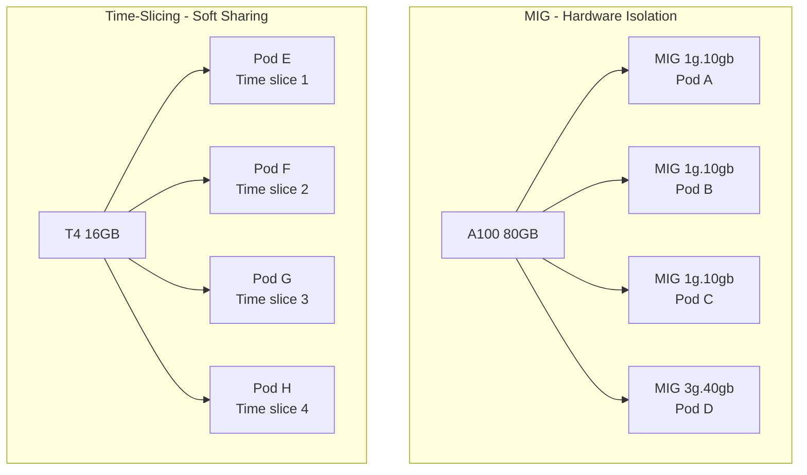

> 💡 **Quick Answer:** Use **MIG** (Multi-Instance GPU) on A100/H100 for hardware-isolated GPU partitions with guaranteed memory and compute. Use **time-slicing** on any NVIDIA GPU for soft sharing where pods take turns. MIG for production inference with SLA guarantees; time-slicing for dev/notebook workloads.

## The Problem

GPUs are expensive ($2-5/hour for A100). Running one model per GPU wastes resources when inference workloads use only 20-30% of GPU compute. You need to share GPUs across multiple pods — but safely, with predictable performance.

## The Solution

### MIG (Multi-Instance GPU)

Available on A100 (7 instances), H100 (7 instances), A30 (4 instances).

```yaml
# GPU Operator ClusterPolicy — enable MIG
apiVersion: nvidia.com/v1
kind: ClusterPolicy
metadata:
  name: gpu-cluster-policy
spec:
  mig:
    strategy: mixed
  migManager:
    enabled: true
    config:
      name: mig-config
---
# MIG configuration
apiVersion: v1
kind: ConfigMap
metadata:
  name: mig-config
  namespace: gpu-operator
data:
  config.yaml: |
    version: v1
    mig-configs:
      all-3g.40gb:
        - devices: all
          mig-enabled: true
          mig-devices:
            3g.40gb: 2
      all-1g.10gb:
        - devices: all
          mig-enabled: true
          mig-devices:
            1g.10gb: 7
```

### Request MIG Slices in Pods

```yaml
apiVersion: v1
kind: Pod
metadata:
  name: inference-small
spec:
  containers:
    - name: model
      image: registry.example.com/inference:1.0
      resources:
        limits:
          nvidia.com/mig-1g.10gb: 1
---
apiVersion: v1
kind: Pod
metadata:
  name: inference-large
spec:
  containers:
    - name: model
      image: registry.example.com/inference:1.0
      resources:
        limits:
          nvidia.com/mig-3g.40gb: 1
```

### Time-Slicing Configuration

```yaml
# GPU Operator device plugin config
apiVersion: v1
kind: ConfigMap
metadata:
  name: time-slicing-config
  namespace: gpu-operator
data:
  any: |-
    version: v1
    sharing:
      timeSlicing:
        renameByDefault: false
        failRequestsGreaterThanOne: false
        resources:
          - name: nvidia.com/gpu
            replicas: 4
```

With `replicas: 4`, each physical GPU appears as 4 `nvidia.com/gpu` resources. 4 pods can share one GPU.

### MIG vs Time-Slicing

| Feature | MIG | Time-Slicing |
|---------|-----|-------------|
| Isolation | Hardware (memory + compute) | None (shared context) |
| GPUs | A100, H100, A30 only | Any NVIDIA GPU |
| Memory | Dedicated per instance | Shared (OOM possible) |
| Performance | Guaranteed, predictable | Variable, contention |
| Use case | Production inference | Dev, notebooks, batch |
| Max instances | 7 per GPU | Configurable (4-10 typical) |



## Common Issues

**MIG slices not appearing as resources**

Check MIG manager: `kubectl logs -n gpu-operator ds/nvidia-mig-manager`. MIG mode must be enabled on the GPU first — requires node reboot.

**Time-sliced pods OOMKilled on GPU**

Time-slicing doesn't partition GPU memory. If 4 pods each try to use 12GB on a 16GB GPU, some will OOM. Set `CUDA_MPS_PINNED_DEVICE_MEM_LIMIT` to cap per-pod GPU memory.

## Best Practices

- **MIG for production inference** — guaranteed memory and compute isolation
- **Time-slicing for dev/notebooks** — simple, works on any GPU, but no isolation
- **Don't time-slice more than 4-8x** — diminishing returns and increased latency
- **Monitor GPU utilization** — `nvidia-smi dmon` shows per-MIG and per-process stats
- **MIG reconfiguration requires draining the node** — plan changes during maintenance windows

## Key Takeaways

- MIG provides hardware-isolated GPU partitions on A100/H100/A30
- Time-slicing provides soft GPU sharing on any NVIDIA GPU
- MIG guarantees memory and compute; time-slicing shares everything
- MIG for production inference with SLA; time-slicing for dev and notebooks
- Up to 7 MIG instances per A100/H100; time-slicing configurable (4-10 typical)
