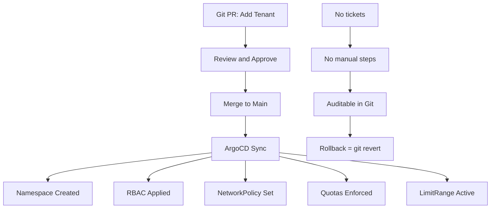

> 💡 **Quick Answer:** Create a Kustomize base tenant template with namespace, RBAC, NetworkPolicy, ResourceQuota, and LimitRange. Each new tenant is an overlay with patches for tenant-specific values. One PR to Git = one tenant provisioned via ArgoCD.

## The Problem

Provisioning a new GPU tenant requires creating 5-10 Kubernetes resources in the right order with consistent naming. Manual provisioning leads to forgotten NetworkPolicies, misconfigured quotas, and inconsistent RBAC. Tickets take days; mistakes take weeks to find.

## The Solution

A Kustomize tenant template that bundles all required resources. Adding a tenant means adding an overlay directory with tenant-specific patches. ArgoCD syncs it automatically.

### Tenant Template Base

```yaml
# cluster-config/base/tenant-template/kustomization.yaml
apiVersion: kustomize.config.k8s.io/v1beta1
kind: Kustomization
resources:
  - namespace.yaml
  - rbac.yaml
  - networkpolicy.yaml
  - resourcequota.yaml
  - limitrange.yaml
```

```yaml
# namespace.yaml
apiVersion: v1
kind: Namespace
metadata:
  name: tenant-PLACEHOLDER
  labels:
    tenant: PLACEHOLDER
    gpu-enabled: "true"
```

```yaml
# rbac.yaml
apiVersion: rbac.authorization.k8s.io/v1
kind: Role
metadata:
  name: tenant-user
  namespace: tenant-PLACEHOLDER
rules:
  - apiGroups: ["", "apps", "batch", "kubeflow.org"]
    resources: ["pods", "pods/log", "pods/exec", "deployments", "statefulsets", "jobs", "cronjobs", "services", "configmaps", "secrets", "persistentvolumeclaims", "pytorchjobs"]
    verbs: ["get", "list", "watch", "create", "update", "delete"]
---
apiVersion: rbac.authorization.k8s.io/v1
kind: RoleBinding
metadata:
  name: tenant-users
  namespace: tenant-PLACEHOLDER
subjects:
  - kind: Group
    name: tenant-PLACEHOLDER-team
    apiGroup: rbac.authorization.k8s.io
roleRef:
  kind: Role
  name: tenant-user
  apiGroup: rbac.authorization.k8s.io
```

```yaml
# resourcequota.yaml
apiVersion: v1
kind: ResourceQuota
metadata:
  name: gpu-quota
  namespace: tenant-PLACEHOLDER
spec:
  hard:
    requests.nvidia.com/gpu: "4"
    limits.nvidia.com/gpu: "4"
    requests.cpu: "32"
    limits.cpu: "64"
    requests.memory: 128Gi
    limits.memory: 256Gi
    pods: "30"
```

### Tenant Overlay

```yaml
# cluster-config/overlays/prod/tenants/alpha/kustomization.yaml
apiVersion: kustomize.config.k8s.io/v1beta1
kind: Kustomization
resources:
  - ../../../../base/tenant-template
namePrefix: ""
patches:
  - target:
      kind: Namespace
      name: tenant-PLACEHOLDER
    patch: |
      - op: replace
        path: /metadata/name
        value: tenant-alpha
      - op: replace
        path: /metadata/labels/tenant
        value: alpha
      - op: add
        path: /metadata/annotations
        value:
          openshift.io/description: "Team Alpha - ML Training"
  - target:
      kind: ResourceQuota
    patch: |
      - op: replace
        path: /metadata/namespace
        value: tenant-alpha
      - op: replace
        path: /spec/hard/requests.nvidia.com~1gpu
        value: "8"
      - op: replace
        path: /spec/hard/limits.nvidia.com~1gpu
        value: "8"
```

### Add New Tenant (One PR)

```bash
# Adding a new tenant is 3 steps:
# 1. Copy overlay directory
cp -r cluster-config/overlays/prod/tenants/alpha \
      cluster-config/overlays/prod/tenants/gamma

# 2. Edit kustomization.yaml with tenant-specific values
sed -i 's/alpha/gamma/g' cluster-config/overlays/prod/tenants/gamma/kustomization.yaml

# 3. Git commit and PR
git add cluster-config/overlays/prod/tenants/gamma/
git commit -m "Add tenant: gamma (8 GPUs, ML training)"
git push origin feat/add-tenant-gamma
# PR → review → merge → ArgoCD auto-syncs
```



## Common Issues

- **Kustomize name replacement incomplete** — use JSON patches (`op: replace`) for reliable namespace substitution across all resources
- **ArgoCD out of sync after overlay change** — ensure overlay is referenced in the parent kustomization.yaml or ApplicationSet
- **Quota values not applied** — GPU resource names contain `/` which needs escaping in JSON patch paths (`~1`)

## Best Practices

- One overlay directory per tenant — keeps changes isolated and reviewable
- Store tenant metadata (team, contact, GPU allocation) in annotations
- Use ArgoCD ApplicationSets to auto-discover tenant overlay directories
- Version the tenant template base — breaking changes require updating all overlays
- No tickets, no manual steps — Git PR = tenant provisioned

## Key Takeaways

- Kustomize base + overlay pattern makes tenant provisioning reproducible
- One PR = one tenant — namespace, RBAC, NetworkPolicy, quotas all in one commit
- ArgoCD auto-syncs on merge — zero manual intervention
- Git history provides full audit trail of who added what tenant and when
- Rollback = git revert → ArgoCD removes the tenant resources
