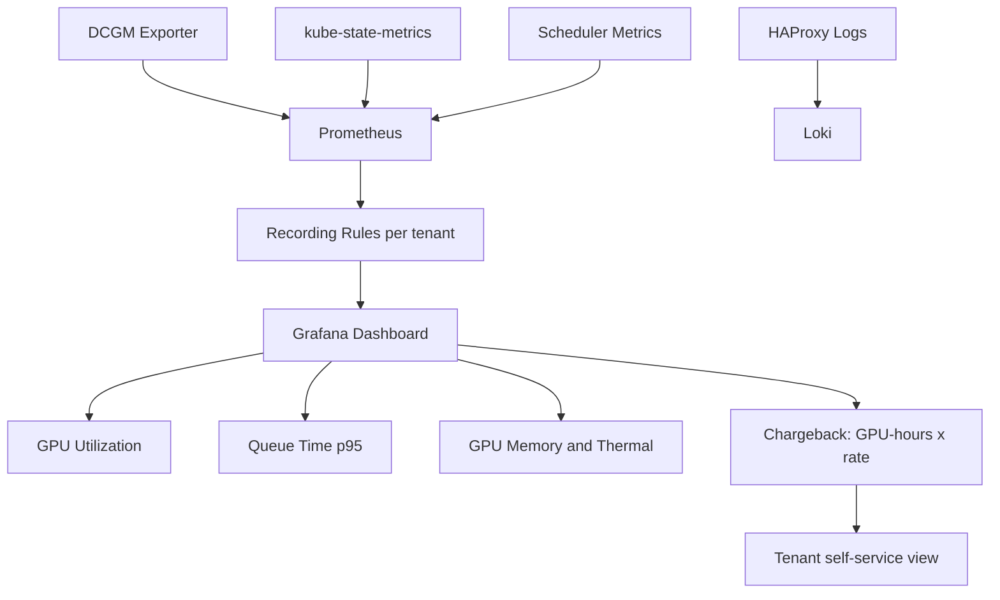

> 💡 **Quick Answer:** Use DCGM Exporter for GPU metrics, `kube_pod_labels` for tenant association, and PromQL queries like `DCGM_FI_DEV_GPU_UTIL * on(pod) group_left(namespace) kube_pod_info{namespace=~"tenant-.*"}` for per-tenant GPU utilization. Calculate GPU-hours for chargeback with `sum(rate(DCGM_FI_DEV_GPU_UTIL[1h])) by (namespace) / 100 * count by (namespace)`.

## The Problem

When teams can't see their GPU usage, behavior doesn't change. Over-provisioning, idle GPUs, and queue starvation remain invisible. Without chargeback, there's no incentive to optimize. Teams need self-service dashboards showing their queue time, GPU utilization, and costs.

## The Solution

### DCGM Exporter Metrics

```yaml
# Key DCGM metrics for tenant monitoring:
# DCGM_FI_DEV_GPU_UTIL          — GPU utilization %
# DCGM_FI_DEV_MEM_COPY_UTIL     — Memory utilization %
# DCGM_FI_DEV_GPU_TEMP          — GPU temperature
# DCGM_FI_DEV_POWER_USAGE       — Power draw (W)
# DCGM_FI_DEV_FB_USED           — Framebuffer memory used (MB)
# DCGM_FI_DEV_FB_FREE           — Framebuffer memory free (MB)
# DCGM_FI_PROF_GR_ENGINE_ACTIVE — GPU engine active ratio
```

### Per-Tenant GPU Utilization

```yaml
# PrometheusRule for per-tenant GPU alerts
apiVersion: monitoring.coreos.com/v1
kind: PrometheusRule
metadata:
  name: gpu-tenant-alerts
  namespace: openshift-monitoring
spec:
  groups:
    - name: gpu-tenant
      interval: 30s
      rules:
        # Per-tenant GPU utilization
        - record: tenant:gpu_utilization:avg
          expr: |
            avg(DCGM_FI_DEV_GPU_UTIL
              * on(pod, namespace) group_left()
              kube_pod_info{namespace=~"tenant-.*"}
            ) by (namespace)

        # Per-tenant GPU memory usage
        - record: tenant:gpu_memory_used_bytes:sum
          expr: |
            sum(DCGM_FI_DEV_FB_USED
              * on(pod, namespace) group_left()
              kube_pod_info{namespace=~"tenant-.*"}
            ) by (namespace) * 1024 * 1024

        # GPU-hours per tenant (for chargeback)
        - record: tenant:gpu_hours:rate1h
          expr: |
            sum(
              count by (namespace, pod) (
                DCGM_FI_DEV_GPU_UTIL{namespace=~"tenant-.*"} > 0
              )
            ) by (namespace) / 3600

        # Alert: GPU idle >30min
        - alert: GPUIdleTenant
          expr: |
            tenant:gpu_utilization:avg < 5
            and on(namespace)
            count(DCGM_FI_DEV_GPU_UTIL{namespace=~"tenant-.*"} >= 0) by (namespace) > 0
          for: 30m
          labels:
            severity: warning
          annotations:
            summary: "Tenant {{ $labels.namespace }} has idle GPUs for >30m"
```

### Chargeback Dashboard Queries

```yaml
# Grafana dashboard panels (PromQL):

# Panel 1: GPU-hours per tenant (daily)
query: |
  sum(
    increase(
      tenant:gpu_hours:rate1h[24h]
    )
  ) by (namespace)

# Panel 2: Queue time by priority class
query: |
  histogram_quantile(0.95,
    sum(rate(scheduler_queue_incoming_pods_total[5m])) by (le, priority_level)
  )

# Panel 3: GPU utilization heatmap per tenant
query: |
  avg(DCGM_FI_DEV_GPU_UTIL
    * on(pod, namespace) group_left()
    kube_pod_info{namespace=~"tenant-.*"}
  ) by (namespace)

# Panel 4: Cost estimation ($3.50/GPU-hour for H200)
query: |
  sum(increase(tenant:gpu_hours:rate1h[720h])) by (namespace) * 3.50
```

### Queue Time Monitoring

```yaml
# Scheduler metrics for queue wait time
- record: tenant:scheduler_queue_time_p95:5m
  expr: |
    histogram_quantile(0.95,
      sum(rate(scheduler_scheduling_attempt_duration_seconds_bucket[5m]))
      by (le, result)
    )
```

### Self-Service Dashboard ConfigMap

```yaml
apiVersion: v1
kind: ConfigMap
metadata:
  name: tenant-gpu-dashboard
  namespace: openshift-monitoring
  labels:
    grafana_dashboard: "true"
data:
  tenant-gpu.json: |
    {
      "dashboard": {
        "title": "GPU Tenant Dashboard",
        "templating": {
          "list": [{
            "name": "namespace",
            "type": "query",
            "query": "label_values(DCGM_FI_DEV_GPU_UTIL, namespace)",
            "regex": "tenant-.*"
          }]
        },
        "panels": [
          {"title": "GPU Utilization", "type": "gauge"},
          {"title": "GPU Memory", "type": "timeseries"},
          {"title": "Queue Time p95", "type": "stat"},
          {"title": "GPU-Hours (MTD)", "type": "stat"},
          {"title": "Estimated Cost", "type": "stat"}
        ]
      }
    }
```



## Common Issues

- **DCGM metrics missing namespace label** — DCGM exports per-GPU; join with `kube_pod_info` to get namespace association
- **Chargeback counts idle GPUs** — use `DCGM_FI_DEV_GPU_UTIL > 5` threshold to only count active GPUs
- **Dashboard too slow** — use recording rules for expensive per-tenant aggregations; pre-compute hourly

## Best Practices

- Use recording rules for per-tenant aggregations — avoid expensive real-time PromQL
- Provide self-service dashboards per tenant (Grafana with namespace variable)
- Alert on idle GPUs (>30min at <5% utilization) to improve utilization
- GPU-hour chargeback changes team behavior — visibility drives optimization
- Track queue time p95 as a key SLO — if teams wait >10min for GPUs, add capacity or adjust priorities

## Key Takeaways

- DCGM Exporter + kube_pod_info join enables per-tenant GPU metrics
- GPU-hours = primary chargeback metric (count of GPUs × hours active)
- Queue time, utilization, memory, thermal — four key metrics per tenant
- Self-service dashboards change behavior — teams optimize when they see costs
- Recording rules prevent expensive real-time aggregations in Prometheus
