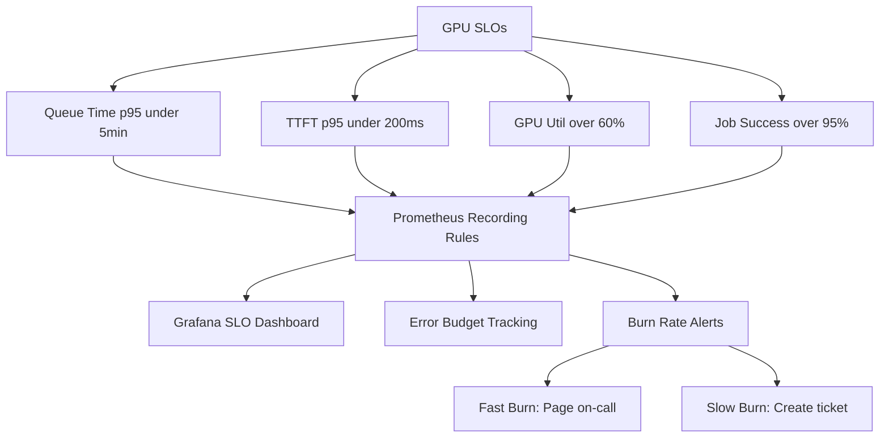

> 💡 **Quick Answer:** Define four GPU SLOs per tenant: queue time p95 < 5min, inference TTFT p95 < 200ms, GPU utilization > 60%, job completion rate > 95%. Implement with Prometheus recording rules, Grafana SLO dashboards, and PagerDuty/Slack alerting on burn rate.

## The Problem

Without SLOs, GPU platform health is subjective. Teams complain about slow scheduling, ops has no data to prioritize, and capacity planning is guesswork. You need measurable targets tied to alerts that fire before users notice degradation.

## The Solution

### SLO Definitions

```yaml
slos:
  queue_time:
    description: "Time from job submission to GPU allocation"
    target: "p95 < 5 minutes"
    window: "30 days rolling"
    budget: "99.5% of jobs within target"
    alert_burn_rate: "5x in 1h"

  inference_latency:
    description: "Time-to-first-token for inference requests"
    target: "TTFT p95 < 200ms"
    window: "30 days rolling"
    budget: "99.9% of requests within target"
    alert_burn_rate: "14x in 5min"

  gpu_utilization:
    description: "Average GPU compute utilization per tenant"
    target: "> 60% during active hours"
    window: "7 days rolling"
    alert_threshold: "< 40% for 2 hours"

  job_completion:
    description: "Training jobs completing without OOM or preemption failure"
    target: "> 95% success rate"
    window: "7 days rolling"
    budget: "< 5% failure rate"
```

### Prometheus Recording Rules

```yaml
apiVersion: monitoring.coreos.com/v1
kind: PrometheusRule
metadata:
  name: gpu-slo-rules
  namespace: openshift-monitoring
spec:
  groups:
    - name: gpu-slo-recording
      interval: 30s
      rules:
        # Queue time SLO
        - record: slo:gpu_queue_time:p95_5m
          expr: |
            histogram_quantile(0.95,
              sum(rate(scheduler_pending_pods_duration_seconds_bucket{
                queue=~"tenant-.*"
              }[5m])) by (le, queue)
            )

        # Inference TTFT SLO (from custom metrics)
        - record: slo:inference_ttft:p95_5m
          expr: |
            histogram_quantile(0.95,
              sum(rate(inference_time_to_first_token_seconds_bucket{
                namespace=~"tenant-.*"
              }[5m])) by (le, namespace)
            )

        # GPU utilization SLO
        - record: slo:gpu_utilization:avg_1h
          expr: |
            avg(avg_over_time(DCGM_FI_DEV_GPU_UTIL[1h])
              * on(pod, namespace) group_left()
              kube_pod_info{namespace=~"tenant-.*"}
            ) by (namespace)

        # Job completion rate
        - record: slo:job_completion_rate:7d
          expr: |
            sum(kube_job_status_succeeded{namespace=~"tenant-.*"}) by (namespace)
            / (
              sum(kube_job_status_succeeded{namespace=~"tenant-.*"}) by (namespace)
              + sum(kube_job_status_failed{namespace=~"tenant-.*"}) by (namespace)
            )

    - name: gpu-slo-alerts
      rules:
        # Queue time SLO breach
        - alert: GPUQueueTimeSLOBreach
          expr: slo:gpu_queue_time:p95_5m > 300
          for: 10m
          labels:
            severity: warning
            slo: queue_time
          annotations:
            summary: "GPU queue time p95 > 5min for {{ $labels.queue }}"
            description: "Tenant {{ $labels.queue }} queue time p95 is {{ $value | humanizeDuration }}. SLO target: < 5min."

        # Inference TTFT SLO breach
        - alert: InferenceTTFTSLOBreach
          expr: slo:inference_ttft:p95_5m > 0.2
          for: 5m
          labels:
            severity: critical
            slo: inference_latency
          annotations:
            summary: "Inference TTFT p95 > 200ms for {{ $labels.namespace }}"

        # GPU underutilization
        - alert: GPUUnderutilized
          expr: slo:gpu_utilization:avg_1h < 40
          for: 2h
          labels:
            severity: warning
            slo: gpu_utilization
          annotations:
            summary: "GPU utilization < 40% for 2h in {{ $labels.namespace }}"

        # Job failure rate
        - alert: GPUJobFailureRate
          expr: slo:job_completion_rate:7d < 0.95
          for: 30m
          labels:
            severity: warning
            slo: job_completion
          annotations:
            summary: "Job completion rate < 95% in {{ $labels.namespace }}"
```

### Error Budget Tracking

```yaml
# Error budget burn rate alerts (Google SRE style)
# Fast burn: 14x budget consumption in 5min → page
- alert: GPUInferenceSLOFastBurn
  expr: |
    (
      sum(rate(inference_requests_total{status="error", namespace=~"tenant-.*"}[5m])) by (namespace)
      / sum(rate(inference_requests_total{namespace=~"tenant-.*"}[5m])) by (namespace)
    ) > (14 * 0.001)  # 14x the 0.1% error budget
  for: 2m
  labels:
    severity: critical
    page: "true"

# Slow burn: 3x budget consumption in 6h → ticket
- alert: GPUInferenceSLOSlowBurn
  expr: |
    (
      sum(rate(inference_requests_total{status="error", namespace=~"tenant-.*"}[6h])) by (namespace)
      / sum(rate(inference_requests_total{namespace=~"tenant-.*"}[6h])) by (namespace)
    ) > (3 * 0.001)
  for: 30m
  labels:
    severity: warning
```



## Common Issues

- **Queue time metric missing** — default scheduler doesn't expose per-queue latency histograms; Run:AI/KAI scheduler provides these; alternatively measure with `kube_pod_status_phase` timestamps
- **TTFT metric not available** — inference servers must export custom histograms; vLLM and Triton expose these via Prometheus endpoint
- **Error budget exhausted** — investigate root cause (OOM, preemption, hardware failure) before adjusting SLO targets

## Best Practices

- Four SLOs are sufficient: queue time, inference latency, utilization, job completion
- Use burn rate alerts (Google SRE style) instead of static thresholds — catches both fast and slow degradation
- Display error budgets on tenant dashboards — teams self-manage when they see remaining budget
- Review SLO targets quarterly — adjust based on actual usage patterns and business needs
- Separate SLOs per tenant — one tenant's training load shouldn't affect another's inference SLO

## Key Takeaways

- GPU SLOs make platform health measurable and actionable
- Queue time, TTFT, utilization, and job completion are the four key SLOs
- Burn rate alerts catch both sudden failures and gradual degradation
- Error budgets quantify how much failure is acceptable before intervention
- Per-tenant SLOs ensure fair monitoring across the multi-tenant platform
