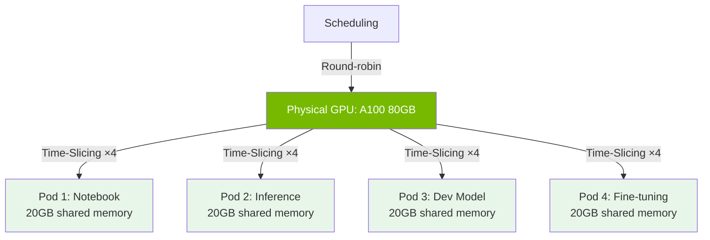

> 💡 **Quick Answer:** Create a ConfigMap with `sharing.timeSlicing.replicas: 4` and reference it in the GPU Operator's device plugin config. Each physical GPU appears as 4 `nvidia.com/gpu` resources, letting 4 pods share one GPU via CUDA time-slicing — no MIG hardware partitioning needed.

## The Problem

GPUs are expensive. A single NVIDIA A100 costs ~$10,000, yet many workloads (notebooks, dev inference, small models) use only 10-30% of GPU capacity. Without sharing, each pod requesting `nvidia.com/gpu: 1` gets exclusive access to an entire GPU, wasting resources. You need GPU sharing that works with any NVIDIA GPU — not just MIG-capable ones.

## The Solution

### How Time-Slicing Works

CUDA time-slicing shares a physical GPU across multiple processes by rapidly switching execution context. Each workload gets a "slice" of GPU time. Unlike MIG (which partitions GPU hardware), time-slicing:
- Works on **any NVIDIA GPU** (not just A100/H100)
- Shares **all GPU memory** (no hard memory isolation)
- Provides **fair scheduling** via CUDA scheduler
- Has **minimal overhead** (~2-5%)

### Step 1: Create Device Plugin Config

```yaml
# gpu-time-slicing-config.yaml
apiVersion: v1
kind: ConfigMap
metadata:
  name: device-plugin-config
  namespace: gpu-operator
data:
  default: |
    version: v1
    sharing:
      timeSlicing:
        renameByDefault: false
        failRequestsGreaterThanOne: true
        resources:
          - name: nvidia.com/gpu
            replicas: 4
  dev: |
    version: v1
    sharing:
      timeSlicing:
        renameByDefault: false
        failRequestsGreaterThanOne: true
        resources:
          - name: nvidia.com/gpu
            replicas: 8
```

**Key settings:**
- `replicas: 4` — each physical GPU advertised as 4 virtual GPUs
- `failRequestsGreaterThanOne: true` — reject pods requesting >1 GPU (prevents accidental full-GPU allocation)
- `renameByDefault: false` — keep `nvidia.com/gpu` resource name (set to `true` to use `nvidia.com/gpu.shared`)

### Step 2: Apply and Configure GPU Operator

```bash
kubectl apply -f gpu-time-slicing-config.yaml

# Update ClusterPolicy to reference the config
kubectl patch clusterpolicy cluster-policy \
  --type merge \
  -p '{"spec":{"devicePlugin":{"config":{"name":"device-plugin-config","default":"default"}}}}'
```

Or set during Helm install:

```bash
helm install gpu-operator nvidia/gpu-operator \
  --namespace gpu-operator \
  --create-namespace \
  --set devicePlugin.config.name=device-plugin-config \
  --set devicePlugin.config.default=default
```

### Step 3: Label Nodes for Different Profiles

```bash
# Dev nodes: 8-way sharing (more pods, less GPU per pod)
kubectl label node dev-gpu-node nvidia.com/device-plugin.config=dev

# Production nodes: 4-way sharing (default)
# No label needed — uses "default" profile

# Training nodes: no sharing (exclusive GPU access)
kubectl label node train-gpu-node nvidia.com/device-plugin.config=no-sharing
```

Add a no-sharing profile:

```yaml
data:
  no-sharing: |
    version: v1
    sharing:
      timeSlicing:
        resources:
          - name: nvidia.com/gpu
            replicas: 1
```

### Step 4: Verify Time-Slicing

```bash
# Check advertised GPU count (should be physical × replicas)
kubectl get node gpu-node -o jsonpath='{.status.allocatable}' | jq '."nvidia.com/gpu"'
# "8"  (2 physical GPUs × 4 replicas)

# Deploy test pods
for i in $(seq 1 4); do
  kubectl run gpu-test-$i --image=nvcr.io/nvidia/cuda:12.4.0-base-ubuntu22.04 \
    --command -- sleep infinity \
    --overrides='{"spec":{"containers":[{"name":"gpu-test-'$i'","image":"nvcr.io/nvidia/cuda:12.4.0-base-ubuntu22.04","command":["sleep","infinity"],"resources":{"limits":{"nvidia.com/gpu":"1"}}}]}}'
done

# All 4 pods should be Running on the same GPU
kubectl get pods -o wide
```



### Choosing the Right Replica Count

| Workload Type | Replicas | Use Case |
|--------------|----------|----------|
| 1 | Exclusive | Training, large models |
| 2 | Light sharing | Production inference |
| 4 | Standard | Mixed dev/inference |
| 8 | Heavy sharing | Notebooks, small models |
| 10+ | Maximum | CI/CD, testing |

### When to Use Time-Slicing vs MIG

| Feature | Time-Slicing | MIG |
|---------|-------------|-----|
| GPU support | Any NVIDIA GPU | A100, H100, H200 only |
| Memory isolation | ❌ Shared | ✅ Hardware-isolated |
| Fault isolation | ❌ Shared | ✅ Independent |
| Configuration | ConfigMap | GPU Operator + device plugin |
| Overhead | ~2-5% | ~0% |
| Flexibility | Easy to change | Requires reconfiguration |
| Best for | Dev, notebooks, small inference | Production, multi-tenant |

## Common Issues

### OOM When Sharing GPUs

Time-slicing doesn't isolate GPU memory. If one pod allocates too much VRAM, others get OOM:

```yaml
# Set CUDA memory limits per container
env:
  - name: NVIDIA_VISIBLE_DEVICES
    value: "all"
  - name: CUDA_MPS_ACTIVE_THREAD_PERCENTAGE
    value: "25"  # Limit to 25% of GPU compute
```

Or use framework-level limits:

```python
# PyTorch
torch.cuda.set_per_process_memory_fraction(0.25)

# TensorFlow
gpus = tf.config.experimental.list_physical_devices('GPU')
tf.config.experimental.set_memory_growth(gpus[0], True)
```

### Pods Stuck Pending After Config Change

The device plugin needs to restart to pick up new config:

```bash
kubectl -n gpu-operator delete pods -l app=nvidia-device-plugin-daemonset
# Wait for restart, then check allocatable
kubectl get nodes -o json | jq '.items[].status.allocatable["nvidia.com/gpu"]'
```

### Uneven GPU Utilization

Time-slicing uses round-robin scheduling. For fairer allocation, use KAI Scheduler:

```yaml
# See kai-scheduler-gpu-sharing recipe for fair queueing
schedulerName: kai-scheduler
```

## Best Practices

- **4 replicas for general use** — good balance of sharing and performance
- **8+ replicas for dev/notebooks** — maximize density, accept performance variability
- **1 replica for training** — never time-slice training workloads
- **Set `failRequestsGreaterThanOne: true`** — prevent pods from hogging GPUs
- **Monitor with DCGM** — watch `DCGM_FI_DEV_GPU_UTIL` to detect oversubscription
- **Use node labels for profiles** — different sharing ratios for dev vs production nodes
- **Set framework memory limits** — time-slicing doesn't isolate memory; apps must self-limit

## Key Takeaways

- Time-slicing multiplies advertised GPU count by `replicas` in device plugin config
- Works on any NVIDIA GPU — no MIG-capable hardware required
- No GPU memory isolation — workloads share the full VRAM
- Use per-node labels to assign different sharing profiles (dev: 8x, prod: 4x, training: 1x)
- Combine with DCGM monitoring to detect oversubscription
- For hard memory isolation, use MIG on A100/H100/H200 instead
