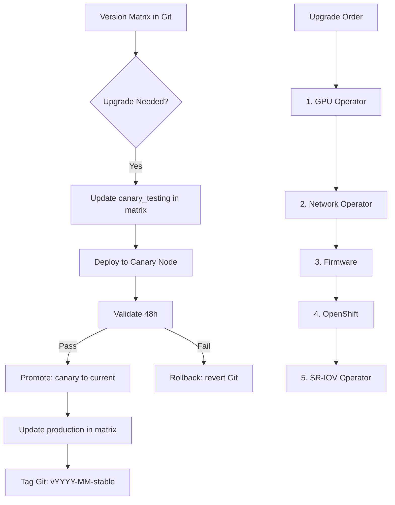

> 💡 **Quick Answer:** Store a version matrix in Git tracking GPU Operator, Network Operator, driver, CUDA, firmware, SR-IOV, and OpenShift versions. Test combinations on canary before production. Never upgrade more than one major component at a time.

## The Problem

A GPU cluster has 7+ interdependent components with version coupling. Upgrading GPU Operator may require a new driver, which requires a compatible CUDA version, which requires a compatible kernel. Upgrading OpenShift changes the kernel, which may break the GPU driver. Without a tested version matrix, upgrades are gambling.

## The Solution

### Version Matrix (Git-Tracked)

```yaml
# gpu-version-matrix.yaml — single source of truth
apiVersion: v1
kind: ConfigMap
metadata:
  name: gpu-version-matrix
  namespace: gpu-operator
data:
  matrix.yaml: |
    # ============================
    # GPU Cluster Version Matrix
    # Last tested: 2026-02-20
    # Tested by: Luca Berton
    # ============================

    current_production:
      openshift: "4.16.23"
      kernel: "5.14.0-427.40.1.el9_4.x86_64"
      gpu_operator: "v24.9.0"
      gpu_driver: "560.35.03"
      cuda: "12.6"
      network_operator: "v24.7.0"
      mofed: "24.07-0.6.1.0"
      firmware_cx7: "28.40.1000"
      firmware_cx6: "22.40.1000"
      sriov_operator: "4.18.0"
      dcgm: "3.3.8-3.6.0"
      device_plugin: "v0.16.2"
      container_toolkit: "v1.16.2"
      nccl: "2.22.3"
      status: "production"
      deployed: "2026-01-15"
      notes: "Stable. 48h bake passed on all canary nodes."

    canary_testing:
      openshift: "4.16.23"      # Same OCP version
      kernel: "5.14.0-427.40.1.el9_4.x86_64"
      gpu_operator: "v24.12.0"  # ← Upgrading this
      gpu_driver: "565.57.01"   # ← Required by new GPU Op
      cuda: "12.8"              # ← Compatible CUDA
      network_operator: "v24.7.0"  # ← Keep same
      mofed: "24.07-0.6.1.0"      # ← Keep same
      firmware_cx7: "28.40.1000"   # ← Keep same
      firmware_cx6: "22.40.1000"   # ← Keep same
      sriov_operator: "4.18.0"    # ← Keep same
      dcgm: "3.3.9-3.6.1"
      device_plugin: "v0.17.0"
      container_toolkit: "v1.17.0"
      nccl: "2.23.4"
      status: "canary-testing"
      deployed: "2026-02-18"
      canary_node: "gpu-worker-4"
      notes: "Testing GPU Op upgrade only. 24h into 48h bake."

    next_planned:
      openshift: "4.17.5"       # OCP upgrade after GPU Op stable
      kernel: "6.x TBD"
      gpu_operator: "v24.12.0"
      gpu_driver: "565.57.01"
      cuda: "12.8"
      network_operator: "v24.10.0"
      mofed: "24.10-1.0.0.0"
      firmware_cx7: "28.42.1000"
      sriov_operator: "4.19.0"
      status: "planned"
      target_date: "2026-03-15"
      notes: "OCP 4.17 brings kernel 6.x — enables DMA-BUF. Must rebuild MOFED/DOCA."

    rollback:
      openshift: "4.16.20"
      gpu_operator: "v24.6.0"
      gpu_driver: "555.42.06"
      cuda: "12.5"
      network_operator: "v24.4.0"
      mofed: "24.04-0.7.0.0"
      status: "rollback-available"
      notes: "Previous known-good. Git tag: v2025-12-stable."
```

### Compatibility Rules

```yaml
# Version coupling rules:
rules:
  - name: "GPU Operator ↔ Driver"
    rule: "Each GPU Op version ships with supported driver range"
    check: "nvidia.com/gpu-operator compatibility matrix"

  - name: "Driver ↔ Kernel"
    rule: "Open modules reduce coupling but still need compatible kernel"
    check: "driver release notes for supported kernel range"

  - name: "MOFED ↔ Kernel"
    rule: "MOFED must be rebuilt for each kernel version"
    check: "DOCA/MOFED compatibility matrix"

  - name: "OpenShift ↔ Kernel"
    rule: "Each OCP version ships specific RHCOS kernel"
    check: "oc adm release info for kernel version"

  - name: "Firmware ↔ MOFED"
    rule: "Firmware must be compatible with MOFED version"
    check: "NVIDIA firmware release notes"

  - name: "One upgrade at a time"
    rule: "Never upgrade OCP + GPU Op + MOFED simultaneously"
    rationale: "If something breaks, you need to know which change caused it"
```

### Upgrade Sequence

```bash
# Safe upgrade order:
# 1. GPU Operator (driver, CUDA, device plugin)
#    - Canary test 48h → promote
# 2. Network Operator (MOFED)
#    - Canary test 48h → promote
# 3. Firmware (ConnectX-7, ConnectX-6)
#    - Rolling upgrade via iDRAC
# 4. OpenShift (kernel change)
#    - Pause GPU MCP, upgrade control plane + infra first
#    - Rebuild MOFED/DOCA for new kernel
#    - Test on canary GPU node
#    - Unpause GPU MCP for rolling upgrade
# 5. SR-IOV Operator
#    - After OCP upgrade stable

# Never: steps 1+2+4 simultaneously
```

### Automated Version Check

```bash
#!/bin/bash
# check-versions.sh — compare running vs expected
echo "=== GPU Cluster Version Audit ==="

EXPECTED_GPU_OP="v24.9.0"
EXPECTED_DRIVER="560.35.03"
EXPECTED_OCP="4.16.23"

# Check GPU Operator
ACTUAL_GPU_OP=$(oc get csv -n gpu-operator -o jsonpath='{.items[0].spec.version}')
echo "GPU Operator: $ACTUAL_GPU_OP (expected: $EXPECTED_GPU_OP)"
[ "$ACTUAL_GPU_OP" != "$EXPECTED_GPU_OP" ] && echo "  ⚠️ MISMATCH"

# Check driver
ACTUAL_DRIVER=$(oc exec -n gpu-operator $(oc get pods -n gpu-operator \
  -l app=nvidia-driver-daemonset -o name | head -1) \
  -- cat /proc/driver/nvidia/version | grep -oP '\d+\.\d+\.\d+')
echo "GPU Driver: $ACTUAL_DRIVER (expected: $EXPECTED_DRIVER)"

# Check OCP
ACTUAL_OCP=$(oc get clusterversion -o jsonpath='{.items[0].status.desired.version}')
echo "OpenShift: $ACTUAL_OCP (expected: $EXPECTED_OCP)"

# Check kernel
ACTUAL_KERNEL=$(oc debug node/gpu-worker-1 -- chroot /host uname -r 2>/dev/null)
echo "Kernel: $ACTUAL_KERNEL"

echo "=== Audit Complete ==="
```



## Common Issues

- **Driver incompatible with new kernel** — always check kernel support before OCP upgrade; open modules reduce but don't eliminate this risk
- **MOFED fails after OCP upgrade** — MOFED must be rebuilt for new kernel; pre-build DOCA image for N+1 OCP version
- **Firmware mismatch after MOFED upgrade** — check firmware compatibility matrix; upgrade firmware before or with MOFED
- **Rollback needed but matrix not updated** — always keep `rollback` entry in matrix; tag Git at each stable point

## Best Practices

- Store version matrix in Git — it's the source of truth for what's running and what's tested
- One upgrade at a time — if something breaks, you know which component caused it
- Canary test for 48 hours minimum before promoting any GPU component upgrade
- Keep a rollback entry — always know the last known-good combination
- Automate version auditing — run `check-versions.sh` as a CronJob or in monitoring
- Tag Git at each stable promotion — `git tag v2026-02-stable`
- Plan OCP upgrades last — kernel changes cascade to GPU driver, MOFED, and DOCA

## Key Takeaways

- 7+ interdependent components require a tested version matrix for safe upgrades
- Git-tracked matrix provides audit trail, rollback reference, and team communication
- Upgrade order: GPU Op → Network Op → Firmware → OpenShift → SR-IOV
- Never upgrade multiple major components simultaneously
- 48-hour canary bake catches issues that quick tests miss
- Automated version audit scripts detect drift between expected and actual versions
