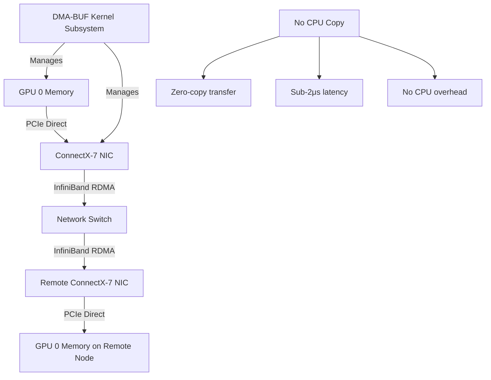

> 💡 **Quick Answer:** With kernel ≥ 6.x and open GPU kernel modules, GPUDirect RDMA uses DMA-BUF instead of nvidia-peermem. Set `NCCL_NET_GDR_LEVEL=5` and ensure `gdrcopy` is enabled in ClusterPolicy. Data flows directly from GPU memory to NIC via DMA, bypassing CPU entirely.

## The Problem

Multi-node GPU training requires gradient synchronization across nodes. Without GPUDirect RDMA, data follows: GPU → CPU memory → kernel → NIC → network → NIC → kernel → CPU → GPU. This path adds latency and consumes CPU. Legacy nvidia-peermem was a fragile out-of-tree module that broke on kernel updates.

## The Solution

### DMA-BUF Data Path

```yaml
# Legacy path (without GPUDirect RDMA):
# GPU → PCIe → CPU Memory → Kernel TCP/IP → NIC → Network
# Latency: ~50μs, CPU overhead: high

# GPUDirect RDMA via nvidia-peermem (legacy):
# GPU → PCIe → NIC → Network (direct, kernel module)
# Latency: ~2μs, but nvidia-peermem breaks on kernel updates

# GPUDirect RDMA via DMA-BUF (current):
# GPU → PCIe → NIC → Network (direct, in-tree kernel subsystem)
# Latency: ~2μs, stable across kernel updates
```

### Enable in ClusterPolicy

```yaml
apiVersion: nvidia.com/v1
kind: ClusterPolicy
metadata:
  name: gpu-cluster-policy
spec:
  driver:
    enabled: true
    useOpenKernelModules: true
  gdrcopy:
    enabled: true        # GPUDirect RDMA Copy library
  dcgm:
    enabled: true
  devicePlugin:
    enabled: true
```

### NCCL Configuration for GPUDirect RDMA

```yaml
env:
  # Enable GPUDirect RDMA
  - name: NCCL_NET_GDR_LEVEL
    value: "5"          # LOC=0, SYS=3, PHB=4, PIX=5 (most aggressive)
  - name: NCCL_IB_DISABLE
    value: "0"
  - name: NCCL_IB_HCA
    value: "mlx5_0,mlx5_1"
  # Verify GDR is active in debug logs
  - name: NCCL_DEBUG
    value: "INFO"
  - name: NCCL_DEBUG_SUBSYS
    value: "NET"
```

### Verify GPUDirect RDMA

```bash
# Check DMA-BUF support
cat /proc/modules | grep dma_buf

# Verify nvidia-peermem is NOT loaded (replaced by DMA-BUF)
lsmod | grep nvidia_peermem
# Should be empty

# Check GDR devices
ls /dev/nvidia-uvm*
nvidia-smi topo -m
# Look for "NV#" (NVLink) and "SYS" with PIX/PHB connections

# Run GDR bandwidth test
gdrcopy_copybw
# Expected: 10-12 GB/s for GPU↔NIC path

# NCCL test with GDR
all_reduce_perf -b 8 -e 2G -f 2 -g 8
# Look for "Using GPUDirect RDMA" in output
```



## Common Issues

- **NCCL falls back to non-GDR path** — check `NCCL_NET_GDR_LEVEL=5`; verify GPU and NIC are on same PCIe switch (check `nvidia-smi topo -m`)
- **nvidia-peermem still loading** — remove old MachineConfig that loads nvidia-peermem; open modules use DMA-BUF automatically
- **GDR performance worse than expected** — GPU and NIC must be on same NUMA node; check `numactl -H` and `nvidia-smi topo -m`
- **gdrcopy test fails** — ensure `gdrcopy` is enabled in ClusterPolicy and kernel ≥ 6.x

## Best Practices

- Use open kernel modules + DMA-BUF — eliminates nvidia-peermem upgrade fragility
- Verify GPU-NIC affinity with `nvidia-smi topo -m` — best performance when on same PCIe switch
- Set `NCCL_NET_GDR_LEVEL=5` (PIX) for most aggressive GDR usage
- Run `all_reduce_perf` to verify GDR is active before production training
- Enable `gdrcopy` in ClusterPolicy for optimized GPU memory copy operations

## Key Takeaways

- GPUDirect RDMA enables zero-copy GPU-to-NIC data transfer for NCCL
- DMA-BUF (kernel ≥ 6.x) replaces nvidia-peermem with stable in-tree subsystem
- Reduces inter-node communication latency to ~2μs with zero CPU overhead
- Critical for multi-node distributed training performance
- GPU-NIC PCIe affinity directly impacts GDR bandwidth
