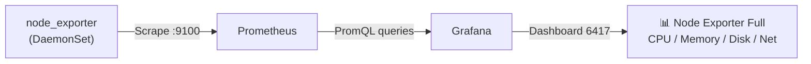

> 💡 **Quick Answer:** Grafana Dashboard 6417 ("Node Exporter Full") is the most popular Grafana dashboard for Linux/Kubernetes node monitoring. Import it via Grafana UI (Dashboards → Import → ID \`6417\`), select your Prometheus data source, and get instant visibility into CPU, memory, disk I/O, network, and system metrics from \`node_exporter\`.

## The Problem

You need comprehensive node-level monitoring for your Kubernetes cluster. While Kubernetes provides pod metrics, you need visibility into the underlying nodes: CPU saturation, memory pressure, disk I/O bottlenecks, and network throughput. Dashboard 6417 is the community standard for this — but you need Prometheus + node_exporter set up correctly.



## The Solution

### Prerequisites

Ensure Prometheus and node_exporter are running:

```bash
# Install kube-prometheus-stack (includes everything)
helm repo add prometheus-community https://prometheus-community.github.io/helm-charts
helm repo update

helm install monitoring prometheus-community/kube-prometheus-stack \
  --namespace monitoring \
  --create-namespace \
  --set prometheus.prometheusSpec.retention=30d

# Verify node_exporter is running on all nodes
kubectl get pods -n monitoring -l app.kubernetes.io/name=prometheus-node-exporter
# NAME                                    READY   STATUS    NODE
# monitoring-prometheus-node-exporter-abc  1/1     Running   worker-01
# monitoring-prometheus-node-exporter-def  1/1     Running   worker-02
# monitoring-prometheus-node-exporter-ghi  1/1     Running   worker-03
```

### Import Dashboard 6417

#### Method 1: Grafana UI

1. Open Grafana → **Dashboards** → **New** → **Import**
2. Enter dashboard ID: **6417**
3. Click **Load**
4. Select your **Prometheus** data source
5. Click **Import**

#### Method 2: Helm Values (Automatic)

```yaml
# values.yaml for kube-prometheus-stack
grafana:
  dashboardProviders:
    dashboardproviders.yaml:
      apiVersion: 1
      providers:
        - name: default
          orgId: 1
          folder: "Node Monitoring"
          type: file
          disableDeletion: false
          editable: true
          options:
            path: /var/lib/grafana/dashboards/default
  dashboards:
    default:
      node-exporter-full:
        gnetId: 6417
        revision: 38             # Latest revision
        datasource: Prometheus
```

#### Method 3: ConfigMap (GitOps)

```bash
# Download dashboard JSON
curl -o dashboard-6417.json \
  "https://grafana.com/api/dashboards/6417/revisions/38/download"

# Create ConfigMap
kubectl create configmap grafana-dashboard-6417 \
  --from-file=node-exporter-full.json=dashboard-6417.json \
  -n monitoring

# Label it for auto-discovery by Grafana sidecar
kubectl label configmap grafana-dashboard-6417 \
  grafana_dashboard=1 \
  -n monitoring
```

### Dashboard Panels

Dashboard 6417 includes these panels:

| Section | Metrics | What to Watch |
|---------|---------|---------------|
| **CPU** | Usage, iowait, steal, system/user | Sustained >80% = add nodes |
| **Memory** | Used, cached, buffers, swap | Swap usage > 0 = OOM risk |
| **Disk** | Space used %, inode usage, I/O throughput | >85% full = urgent |
| **Network** | Bandwidth in/out, errors, drops | Drops > 0 = investigate |
| **System** | Load average, context switches, interrupts | Load > CPU cores = overloaded |
| **File Descriptors** | Open FDs, max FDs | Near max = app leaking FDs |

### Key PromQL Queries Used

```promql
# CPU Usage (%)
100 - (avg by(instance)(rate(node_cpu_seconds_total{mode="idle"}[5m])) * 100)

# Memory Usage (%)
(1 - node_memory_MemAvailable_bytes / node_memory_MemTotal_bytes) * 100

# Disk Usage (%)
100 - (node_filesystem_avail_bytes{mountpoint="/"} / node_filesystem_size_bytes{mountpoint="/"} * 100)

# Network Receive (bytes/sec)
rate(node_network_receive_bytes_total{device!~"lo|veth.*|docker.*|flannel.*|cali.*"}[5m])
```

### Customize for Kubernetes

Add node labels to filter by node pool:

```yaml
# In Prometheus scrape config or ServiceMonitor
apiVersion: monitoring.coreos.com/v1
kind: ServiceMonitor
metadata:
  name: node-exporter
spec:
  selector:
    matchLabels:
      app.kubernetes.io/name: prometheus-node-exporter
  endpoints:
    - port: http-metrics
      relabelings:
        - sourceLabels: [__meta_kubernetes_node_label_node_kubernetes_io_instance_type]
          targetLabel: instance_type
        - sourceLabels: [__meta_kubernetes_node_label_topology_kubernetes_io_zone]
          targetLabel: zone
```

### Alternative Popular Dashboards

| Dashboard ID | Name | Focus |
|:------------:|------|-------|
| **6417** | Node Exporter Full | Comprehensive node metrics |
| **1860** | Node Exporter Full (alternative) | Similar, different layout |
| **15759** | K8s Views - Global | Cluster-wide overview |
| **15760** | K8s Views - Namespaces | Namespace resource usage |
| **15757** | K8s Views - Pods | Pod-level metrics |

## Common Issues

| Issue | Cause | Fix |
|-------|-------|-----|
| Dashboard shows "No data" | Prometheus data source not configured | Settings → Data Sources → Add Prometheus URL |
| Missing nodes | node_exporter not running on all nodes | Check DaemonSet: \`kubectl get ds -n monitoring\` |
| Metrics are empty after import | Wrong data source selected during import | Edit dashboard → Settings → Variables → update \`datasource\` |
| Old dashboard revision | Using outdated revision | Re-import with latest revision number |
| Network panels empty | Interface filter doesn't match | Edit panel → change \`device\` regex to match your interfaces |

## Best Practices

- **Import via Helm values** — ensures dashboard survives Grafana restarts
- **Pin dashboard revision** — avoid unexpected changes from auto-updates
- **Add alerting rules** — dashboard is monitoring, add Prometheus alerts for notification
- **Filter by node pool** — use template variables to separate GPU/CPU/storage nodes
- **Set refresh interval to 30s** — balances freshness vs Prometheus load

## Key Takeaways

- Dashboard 6417 is the community-standard node monitoring dashboard (10M+ downloads)
- Requires Prometheus + node_exporter (included in kube-prometheus-stack)
- Import via UI (ID: 6417), Helm values, or ConfigMap with sidecar label
- Covers CPU, memory, disk, network, and system metrics per node
- Combine with pod-level dashboards (15757) for full-stack visibility
- For GitOps: store dashboard JSON in ConfigMap with \`grafana_dashboard=1\` label
