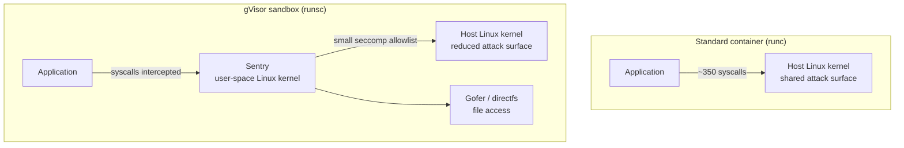

> 💡 **Quick Answer:** gVisor (`runsc`) is an application kernel written in Go that intercepts a container's system calls in user space, so the workload never talks to the host kernel directly. On each node install `runsc`, add a `runsc` runtime handler to containerd, then create `RuntimeClass` `gvisor` (`handler: runsc`) and set `spec.runtimeClassName: gvisor` on the pods to sandbox. On **GKE**, enable GKE Sandbox on a node pool and the `gvisor` RuntimeClass already exists.
>
> **Verify:** `kubectl exec <pod> -- dmesg` prints `Starting gVisor...` instead of host kernel messages.
>
> **Gotcha:** Expect overhead on syscall-heavy and I/O-heavy workloads and some unsupported syscalls/ioctls — test compatibility; GPU support exists (`nvproxy`) but is limited to specific drivers and frameworks.

## The Problem

runc containers share the host kernel: one kernel exploit from any pod compromises the node and every tenant on it. NetworkPolicies and Pod Security restrict network and API access but not the kernel attack surface. For untrusted code — CI builds, user-submitted jobs, AI agents executing tools, multi-tenant SaaS — you want a stronger boundary without the weight of full VMs.



## The Solution

### Step 1: Install runsc on Nodes

```bash
# Debian/Ubuntu (on every node that will run sandboxed pods)
curl -fsSL https://gvisor.dev/archive.key | sudo gpg --dearmor -o /usr/share/keyrings/gvisor-archive-keyring.gpg
echo "deb [arch=$(dpkg --print-architecture) signed-by=/usr/share/keyrings/gvisor-archive-keyring.gpg] https://storage.googleapis.com/gvisor/releases release main" | \
  sudo tee /etc/apt/sources.list.d/gvisor.list
sudo apt-get update && sudo apt-get install -y runsc   # installs runsc + containerd-shim-runsc-v1

runsc --version
which containerd-shim-runsc-v1
```

Other distros: download `runsc` and `containerd-shim-runsc-v1` from `https://storage.googleapis.com/gvisor/releases/release/latest/$(uname -m)/` and put them in `/usr/local/bin`.

### Step 2: Configure containerd

```toml
# /etc/containerd/config.toml  (containerd 1.x config version 2)
version = 2

[plugins."io.containerd.grpc.v1.cri".containerd.runtimes.runc]
  runtime_type = "io.containerd.runc.v2"
  [plugins."io.containerd.grpc.v1.cri".containerd.runtimes.runc.options]
    SystemdCgroup = true

[plugins."io.containerd.grpc.v1.cri".containerd.runtimes.runsc]
  runtime_type = "io.containerd.runsc.v1"
  [plugins."io.containerd.grpc.v1.cri".containerd.runtimes.runsc.options]
    TypeUrl = "io.containerd.runsc.v1.options"
    ConfigPath = "/etc/containerd/runsc.toml"
```

On containerd 2.x (config `version = 3`) the section is `[plugins."io.containerd.cri.v1.runtime".containerd.runtimes.runsc]`.

```toml
# /etc/containerd/runsc.toml — runsc flags, one per key
[runsc_config]
  platform = "systrap"        # default; "kvm" on bare metal / nested-virt for lower syscall overhead
  file-access = "exclusive"   # rootfs owned exclusively by the sandbox (faster)
  network = "sandbox"         # gVisor netstack (full isolation); "host" trades isolation for speed
  debug = false
  # debug-log = "/var/log/runsc/%ID%/"   # enable temporarily when troubleshooting
```

```bash
sudo systemctl restart containerd
sudo crictl info | grep -A3 runsc     # handler registered with CRI
```

### Step 3: Create the RuntimeClass

```yaml
apiVersion: node.k8s.io/v1
kind: RuntimeClass
metadata:
  name: gvisor
handler: runsc                 # must equal the containerd runtime name
overhead:
  podFixed:                    # added to pod requests for scheduling/quota (Sentry + Gofer)
    memory: "64Mi"
    cpu: "50m"
scheduling:
  nodeSelector:
    gvisor.io/enabled: "true"  # only nodes that have runsc
  tolerations:
    - key: gvisor.io/sandbox
      operator: Equal
      value: "true"
      effect: NoSchedule
```

```bash
kubectl label nodes node1 node2 gvisor.io/enabled=true
kubectl taint nodes node1 node2 gvisor.io/sandbox=true:NoSchedule   # optional: dedicate the pool
```

`scheduling` in the RuntimeClass is merged into every pod that uses it, so workloads don't need their own nodeSelector/tolerations.

### Step 4: Run Sandboxed Workloads

```yaml
apiVersion: apps/v1
kind: Deployment
metadata:
  name: untrusted-app
  namespace: sandbox
spec:
  replicas: 3
  selector:
    matchLabels:
      app: untrusted-app
  template:
    metadata:
      labels:
        app: untrusted-app
    spec:
      runtimeClassName: gvisor
      containers:
        - name: app
          image: untrusted-app:v1.0
          ports:
            - containerPort: 8080
          resources:
            requests: { memory: 128Mi, cpu: 100m }
            limits: { memory: 256Mi, cpu: 200m }
          securityContext:
            readOnlyRootFilesystem: true
            runAsNonRoot: true
            runAsUser: 1000
            allowPrivilegeEscalation: false
---
# CI build runner — contain breakouts from arbitrary build scripts
apiVersion: batch/v1
kind: Job
metadata:
  name: ci-build
  namespace: ci-builds
spec:
  template:
    spec:
      runtimeClassName: gvisor
      restartPolicy: Never
      containers:
        - name: builder
          image: golang:1.24
          command: ["go", "build", "-o", "/tmp/app", "./..."]
          workingDir: /workspace
          volumeMounts:
            - name: source
              mountPath: /workspace
      volumes:
        - name: source
          emptyDir: {}
```

### GKE Sandbox

```bash
gcloud container node-pools create sandbox-pool \
  --cluster=my-cluster --region=europe-west1 \
  --sandbox type=gvisor --machine-type=e2-standard-4
kubectl get runtimeclass gvisor     # created by GKE
```

```yaml
# GKE sandbox pod spec example
apiVersion: v1
kind: Pod
metadata:
  name: sandboxed
spec:
  runtimeClassName: gvisor   # GKE adds the sandbox node selector/toleration automatically
  containers:
    - name: app
      image: nginx:1.27
```

GKE Autopilot also accepts `runtimeClassName: gvisor`. Some features (hostPath, privileged pods, host namespaces) are rejected in sandboxed pods.

### Step 5: Platform and Multiple Handlers

| Platform | When |
|---|---|
| `systrap` (default) | Works everywhere, including VMs without nested virtualization |
| `kvm` | Bare metal or VMs with nested virt; lower syscall overhead |
| `ptrace` | Legacy; slowest, kept for compatibility/debugging |

Expose variants as separate handlers — each needs its **own containerd runtime entry** and RuntimeClass:

```toml
[plugins."io.containerd.grpc.v1.cri".containerd.runtimes.runsc-kvm]
  runtime_type = "io.containerd.runsc.v1"
  [plugins."io.containerd.grpc.v1.cri".containerd.runtimes.runsc-kvm.options]
    TypeUrl = "io.containerd.runsc.v1.options"
    ConfigPath = "/etc/containerd/runsc-kvm.toml"   # [runsc_config] platform = "kvm"
```

```yaml
apiVersion: node.k8s.io/v1
kind: RuntimeClass
metadata:
  name: gvisor-kvm
handler: runsc-kvm
scheduling:
  nodeSelector:
    gvisor.io/kvm: "true"
```

### Step 6: Enforce gVisor per Namespace

```yaml
apiVersion: kyverno.io/v1
kind: ClusterPolicy
metadata:
  name: gvisor-for-untrusted
spec:
  rules:
    # Default untrusted pods to gVisor...
    - name: add-gvisor-runtime
      match:
        any:
          - resources:
              kinds: [Pod]
              namespaces: [sandbox, ci-builds]
      mutate:
        patchStrategicMerge:
          spec:
            runtimeClassName: gvisor
    # ...and reject anything that tries to opt out
    - name: require-gvisor
      match:
        any:
          - resources:
              kinds: [Pod]
              namespaces: [sandbox, ci-builds]
      validate:
        failureAction: Enforce
        message: "Pods in untrusted namespaces must use the gvisor RuntimeClass"
        pattern:
          spec:
            runtimeClassName: gvisor
```

A `ValidatingAdmissionPolicy` with `object.spec.runtimeClassName == 'gvisor'` works without Kyverno on Kubernetes 1.30+.

### Step 7: Verify the Sandbox

```bash
kubectl get runtimeclass gvisor
kubectl run gvisor-test --image=alpine --restart=Never \
  --overrides='{"spec":{"runtimeClassName":"gvisor"}}' -- sleep 3600

kubectl exec gvisor-test -- dmesg | head -3
# [   0.000000] Starting gVisor...
kubectl exec gvisor-test -- uname -r
# 4.4.0   <- synthetic kernel version reported by the Sentry, not the host's
kubectl get pod gvisor-test -o jsonpath='{.spec.runtimeClassName}{"\n"}'

# On the node
sudo runsc --root /run/containerd/runsc/k8s.io list
sudo runsc --root /run/containerd/runsc/k8s.io events <container-id>   # resource stats
kubectl get pods -A -o custom-columns=NS:.metadata.namespace,NAME:.metadata.name,RUNTIME:.spec.runtimeClassName
```

### Step 8: Measure the Overhead

```yaml
apiVersion: batch/v1
kind: Job
metadata:
  name: bench-gvisor
spec:
  template:
    spec:
      runtimeClassName: gvisor      # duplicate the Job without this line for a runc baseline
      restartPolicy: Never
      containers:
        - name: bench
          image: alpine:3.20
          command: ["sh", "-c", "time sh -c 'for i in $(seq 1 5000); do echo x > /tmp/f; cat /tmp/f >/dev/null; done'"]
```

CPU-bound code runs at near-native speed; the cost shows up in syscall-heavy paths (many small file ops, process spawning, high packet rates).

### runc vs gVisor vs Kata

| | runc | gVisor (runsc) | Kata Containers |
|---|---|---|---|
| Isolation | Namespaces + cgroups + seccomp | User-space kernel | Lightweight VM per pod |
| Startup | Fastest | Fast (~sub-second) | Slower (VM boot) |
| Memory overhead | None | Tens of MiB per pod | ~100+ MiB per pod |
| Needs virtualization | No | No (KVM optional) | Yes (bare metal / nested virt) |
| Syscall compatibility | Full | Most, not all | Full (guest kernel) |
| GPU | Yes | Limited (nvproxy) | Yes (passthrough) |
| Best for | Trusted workloads | Untrusted code, multi-tenant, CI | Strong isolation, confidential computing |

Side-by-side setup on k3s: [gVisor and Kata with RuntimeClass](/recipes/security/kubernetes-gvisor-kata-containers-runtimeclass/).

## Common Issues

| Symptom | Cause | Fix |
|---|---|---|
| `RuntimeClass "gvisor" not found` | RuntimeClass not created | `kubectl apply` the RuntimeClass |
| Pod `ContainerCreating`: `no runtime for "runsc" is configured` | Handler missing in containerd or containerd not restarted on that node | Fix `config.toml` (right section for containerd 1.x vs 2.x), restart containerd |
| Pod Pending | RuntimeClass nodeSelector matches no node, or taint not tolerated | Label nodes; check `scheduling` in the RuntimeClass |
| App crashes with `function not implemented` / `operation not supported` | Syscall or ioctl not implemented (e.g. io_uring, some raw socket ops) | Check gVisor compatibility docs and `debug-log` output; run that workload on runc or Kata |
| Slow file I/O | Gofer round-trips | Keep `file-access = "exclusive"` (directfs), use emptyDir for scratch |
| Low network throughput | gVisor netstack | Try `kvm` platform; `network = "host"` only if you accept weaker isolation |
| `docker run --runtime=runsc` fails locally | Docker doesn't know the runtime | `sudo runsc install && sudo systemctl restart docker` |

## Best Practices

1. **Sandbox untrusted workloads only** — trusted internal services don't need the overhead
2. **Dedicated, labelled, tainted node pool** referenced from the RuntimeClass `scheduling`
3. **Set `overhead.podFixed`** so quotas and scheduling account for the Sentry
4. **Enforce with policy** (Kyverno/VAP) per namespace rather than relying on developers
5. **Keep defense in depth** — Pod Security `restricted`, NetworkPolicy, non-root, read-only rootfs still apply
6. **Test compatibility and benchmark** critical paths before rollout
7. **Patch runsc** regularly alongside node OS updates

## Frequently Asked Questions

### How does gVisor work with Kubernetes?

Kubernetes selects the low-level runtime through a `RuntimeClass`. Its `handler` names a runtime configured in containerd (or CRI-O); when a pod sets `runtimeClassName: gvisor`, the kubelet asks containerd to start it with `containerd-shim-runsc-v1`, which launches the gVisor Sentry instead of runc.

### What is the GKE Sandbox runtimeClassName?

`gvisor`. After creating a node pool with `--sandbox type=gvisor`, GKE provides a RuntimeClass named `gvisor`; add `runtimeClassName: gvisor` to the pod spec and GKE schedules it onto sandbox nodes.

### Does Cloud Run use gVisor?

Cloud Run's first-generation execution environment is gVisor-based; the second-generation environment runs containers in a microVM with a full Linux kernel instead. You pick the generation per service; there is no separate gVisor toggle.

### gVisor vs Kata Containers?

gVisor re-implements the Linux syscall surface in user space — light, fast to start and no hardware virtualization needed, but not 100% syscall-compatible. Kata runs each pod in a lightweight VM with its own kernel — full compatibility and hardware isolation, at higher memory and startup cost, and it needs KVM.

### Can I run GPU workloads in gVisor?

Partially. gVisor's `nvproxy` supports NVIDIA GPUs for common CUDA frameworks on specific driver versions (enable with the `nvproxy` flag or GKE's GPU sandbox support). Validate your exact stack; Kata with GPU passthrough is the broader-compatibility option.

## Key Takeaways

- gVisor inserts a user-space kernel between the container and the host kernel
- Install runsc + shim, add a containerd handler, create RuntimeClass `gvisor`, set `runtimeClassName`
- GKE Sandbox gives you the same `gvisor` RuntimeClass as a managed feature
- Enforce it for untrusted namespaces and verify with `dmesg` inside the pod
- Budget for overhead on syscall/I/O-heavy workloads and test compatibility
