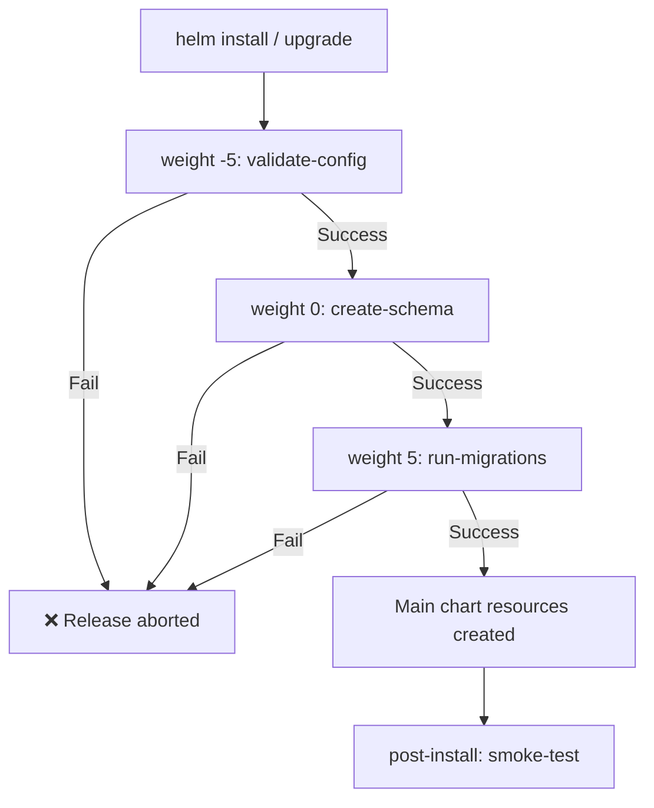

> 💡 **Quick Answer:** Annotate a resource with `"helm.sh/hook": before-hook-creation` to run it before other hook resources are created. More commonly, use `pre-install` / `pre-upgrade` hooks for database migrations and setup tasks that must complete before your app starts.

## The Problem

You need to run tasks before your application deploys — database migrations, schema creation, config validation, secret generation, or health checks against external dependencies. If these tasks fail, the deployment should abort. Helm hooks solve this, but the hook lifecycle and ordering can be confusing.

## The Solution

### Helm Hook Lifecycle

Hooks execute at specific points during `helm install` and `helm upgrade`:

```
helm install / helm upgrade
  │
  ├── pre-install / pre-upgrade hooks execute
  │     ├── weight -5: validate-config (Job)
  │     ├── weight 0:  create-schema (Job)
  │     └── weight 5:  run-migrations (Job)
  │
  ├── All chart resources are created/updated
  │
  └── post-install / post-upgrade hooks execute
        └── weight 0: smoke-test (Job)
```

### Database Migration Hook (Most Common Use Case)

```yaml
# templates/migration-job.yaml
apiVersion: batch/v1
kind: Job
metadata:
  name: {{ .Release.Name }}-db-migrate
  labels:
    app.kubernetes.io/managed-by: {{ .Release.Service }}
    app.kubernetes.io/instance: {{ .Release.Name }}
  annotations:
    # Run BEFORE the main app resources are created
    "helm.sh/hook": pre-install,pre-upgrade
    # Order: lower weight runs first
    "helm.sh/hook-weight": "0"
    # Clean up the Job after it succeeds
    "helm.sh/hook-delete-policy": before-hook-creation,hook-succeeded
spec:
  backoffLimit: 3
  activeDeadlineSeconds: 300
  template:
    metadata:
      labels:
        app: {{ .Release.Name }}-migrate
    spec:
      restartPolicy: Never
      {{- with .Values.imagePullSecrets }}
      imagePullSecrets:
        {{- toYaml . | nindent 8 }}
      {{- end }}
      containers:
        - name: migrate
          image: "{{ .Values.image.repository }}:{{ .Values.image.tag }}"
          command:
            - /bin/sh
            - -c
            - |
              echo "Running database migrations..."
              /app/migrate up
              echo "Migrations complete ✅"
          env:
            - name: DATABASE_URL
              valueFrom:
                secretKeyRef:
                  name: {{ .Release.Name }}-db-credentials
                  key: url
          resources:
            requests:
              cpu: "100m"
              memory: "128Mi"
            limits:
              cpu: "500m"
              memory: "256Mi"
```

### Hook Delete Policies Explained

The `helm.sh/hook-delete-policy` annotation controls cleanup of hook resources:

| Policy | When It Deletes | Use Case |
|--------|----------------|----------|
| `before-hook-creation` | Before new hook runs (next install/upgrade) | **Default choice** — keeps last Job for debugging |
| `hook-succeeded` | Immediately after hook succeeds | Clean clusters, don't need debug history |
| `hook-failed` | Immediately after hook fails | Remove failed Jobs (unusual) |

**Combine them:**
```yaml
# Delete old hook before creating new one, AND delete if it succeeds
"helm.sh/hook-delete-policy": before-hook-creation,hook-succeeded
```

**`before-hook-creation` in detail:**

This is the policy that answers "what happens to the OLD hook resource when I run `helm upgrade` again?"

```
First helm install:
  → Creates migration-job (runs, succeeds, stays)

Second helm upgrade:
  → before-hook-creation: deletes the OLD migration-job
  → Creates NEW migration-job (runs new migrations)
```

Without `before-hook-creation`, the second install fails because the Job already exists with the same name.

### Hook Weight Ordering

When multiple hooks have the same hook type, `hook-weight` controls execution order:

```yaml
# templates/hooks/01-validate-config.yaml
apiVersion: batch/v1
kind: Job
metadata:
  name: {{ .Release.Name }}-validate-config
  annotations:
    "helm.sh/hook": pre-install,pre-upgrade
    "helm.sh/hook-weight": "-5"              # Runs FIRST (lowest weight)
    "helm.sh/hook-delete-policy": before-hook-creation,hook-succeeded
spec:
  template:
    spec:
      restartPolicy: Never
      containers:
        - name: validate
          image: busybox:1.36
          command:
            - /bin/sh
            - -c
            - |
              echo "Validating configuration..."
              {{- if not .Values.database.host }}
              echo "ERROR: database.host is required!" && exit 1
              {{- end }}
              {{- if not .Values.database.password }}
              echo "ERROR: database.password is required!" && exit 1
              {{- end }}
              echo "Configuration valid ✅"

---
# templates/hooks/02-create-schema.yaml
apiVersion: batch/v1
kind: Job
metadata:
  name: {{ .Release.Name }}-create-schema
  annotations:
    "helm.sh/hook": pre-install
    "helm.sh/hook-weight": "0"               # Runs SECOND
    "helm.sh/hook-delete-policy": before-hook-creation,hook-succeeded
spec:
  template:
    spec:
      restartPolicy: Never
      containers:
        - name: schema
          image: "{{ .Values.image.repository }}:{{ .Values.image.tag }}"
          command: ["/app/create-schema"]
          env:
            - name: DATABASE_URL
              valueFrom:
                secretKeyRef:
                  name: {{ .Release.Name }}-db-credentials
                  key: url

---
# templates/hooks/03-run-migrations.yaml
apiVersion: batch/v1
kind: Job
metadata:
  name: {{ .Release.Name }}-migrate
  annotations:
    "helm.sh/hook": pre-install,pre-upgrade
    "helm.sh/hook-weight": "5"               # Runs THIRD (highest weight)
    "helm.sh/hook-delete-policy": before-hook-creation,hook-succeeded
spec:
  template:
    spec:
      restartPolicy: Never
      containers:
        - name: migrate
          image: "{{ .Values.image.repository }}:{{ .Values.image.tag }}"
          command: ["/app/migrate", "up"]
          env:
            - name: DATABASE_URL
              valueFrom:
                secretKeyRef:
                  name: {{ .Release.Name }}-db-credentials
                  key: url
```



### Hook Resource Types

Hooks aren't limited to Jobs — any Kubernetes resource can be a hook:

```yaml
# Secret created before anything else
apiVersion: v1
kind: Secret
metadata:
  name: {{ .Release.Name }}-generated-secret
  annotations:
    "helm.sh/hook": pre-install
    "helm.sh/hook-weight": "-10"
    "helm.sh/hook-delete-policy": before-hook-creation
type: Opaque
data:
  api-key: {{ randAlphaNum 32 | b64enc | quote }}

---
# ConfigMap hook
apiVersion: v1
kind: ConfigMap
metadata:
  name: {{ .Release.Name }}-init-config
  annotations:
    "helm.sh/hook": pre-install
    "helm.sh/hook-delete-policy": before-hook-creation
data:
  init.sql: |
    CREATE DATABASE IF NOT EXISTS myapp;
    GRANT ALL ON myapp.* TO 'appuser'@'%';

---
# ServiceAccount for hooks (created before hook Jobs)
apiVersion: v1
kind: ServiceAccount
metadata:
  name: {{ .Release.Name }}-hook-sa
  annotations:
    "helm.sh/hook": pre-install,pre-upgrade
    "helm.sh/hook-weight": "-100"     # Very first — other hooks may need this SA
    "helm.sh/hook-delete-policy": before-hook-creation
```

### Post-Install/Upgrade Smoke Test

```yaml
# templates/tests/smoke-test.yaml
apiVersion: batch/v1
kind: Job
metadata:
  name: {{ .Release.Name }}-smoke-test
  annotations:
    "helm.sh/hook": post-install,post-upgrade
    "helm.sh/hook-weight": "0"
    "helm.sh/hook-delete-policy": before-hook-creation,hook-succeeded
spec:
  backoffLimit: 0
  activeDeadlineSeconds: 120
  template:
    spec:
      restartPolicy: Never
      containers:
        - name: smoke-test
          image: curlimages/curl:8.5.0
          command:
            - /bin/sh
            - -c
            - |
              echo "Waiting for service to be ready..."
              for i in $(seq 1 30); do
                if curl -sf http://{{ .Release.Name }}:{{ .Values.service.port }}/healthz; then
                  echo ""
                  echo "Smoke test passed ✅"
                  exit 0
                fi
                echo "Attempt $i/30 — retrying in 5s..."
                sleep 5
              done
              echo "Smoke test FAILED ❌"
              exit 1
```

### All Hook Types Reference

| Hook | When It Runs |
|------|-------------|
| `pre-install` | After templates render, before any resources created |
| `post-install` | After all resources are created |
| `pre-delete` | Before any resources are deleted |
| `post-delete` | After all resources are deleted |
| `pre-upgrade` | After templates render, before any resources updated |
| `post-upgrade` | After all resources are updated |
| `pre-rollback` | Before rollback |
| `post-rollback` | After rollback |
| `test` | When `helm test` is run |

### Complete values.yaml for Hook Configuration

```yaml
# values.yaml
migrations:
  enabled: true
  timeout: 300           # activeDeadlineSeconds
  backoffLimit: 3
  
smokeTest:
  enabled: true
  timeout: 120

hooks:
  deletePolicy: "before-hook-creation,hook-succeeded"
  
database:
  host: "postgres.default.svc"
  port: 5432
  name: "myapp"
  # password: set via --set or external secret
```

```yaml
# Conditional hook based on values
{{- if .Values.migrations.enabled }}
apiVersion: batch/v1
kind: Job
metadata:
  name: {{ .Release.Name }}-migrate
  annotations:
    "helm.sh/hook": pre-install,pre-upgrade
    "helm.sh/hook-weight": "5"
    "helm.sh/hook-delete-policy": {{ .Values.hooks.deletePolicy }}
spec:
  backoffLimit: {{ .Values.migrations.backoffLimit }}
  activeDeadlineSeconds: {{ .Values.migrations.timeout }}
  # ...
{{- end }}
```

## Common Issues

### Hook Job Already Exists

Without `before-hook-creation` delete policy, the second install/upgrade fails:
```
Error: rendered manifests contain a resource that already exists:
  Job "myapp-migrate" in namespace "default" already exists
```

Fix: Add `"helm.sh/hook-delete-policy": before-hook-creation`

### Hook Timeout — Helm Waits Forever

Helm waits for hook Jobs to complete. Set `activeDeadlineSeconds` on the Job AND use `--timeout` on the Helm command:
```bash
helm upgrade myapp ./chart --timeout 10m --wait
```

### Hook Fails but Resources Were Already Created

`pre-upgrade` hook failure does NOT roll back already-applied resources from the previous release. Use `--atomic` to auto-rollback on any failure:
```bash
helm upgrade myapp ./chart --atomic --timeout 10m
```

### Hook Resources Not Managed by Helm

Hook resources are NOT part of `helm get manifest`. They're created and deleted separately. Don't expect them in `helm diff` output.

### Secret Hook Regenerates on Every Upgrade

If your secret hook uses `randAlphaNum`, it generates a new value each upgrade. Use `lookup` to preserve existing values:
```yaml
{{- $existing := lookup "v1" "Secret" .Release.Namespace (printf "%s-generated-secret" .Release.Name) }}
data:
  api-key: {{ $existing.data.apiKey | default (randAlphaNum 32 | b64enc) | quote }}
```

## Best Practices

- **Always set `before-hook-creation` delete policy** — prevents "already exists" errors
- **Set `activeDeadlineSeconds` on hook Jobs** — don't let hooks run forever
- **Use `--atomic` for production upgrades** — auto-rollback on hook failure
- **Weight ordering: validate → create → migrate** — fail fast on bad config
- **Use `pre-install,pre-upgrade`** together — hooks should run on both
- **Set `restartPolicy: Never`** on hook Jobs — failed migrations shouldn't auto-retry without investigation
- **Keep hook images small** — they add to deployment time
- **Log clearly in hooks** — "Running migrations..." / "Migrations complete ✅" helps debugging

## Key Takeaways

- `before-hook-creation` is a **delete policy**, not a hook type — it cleans up the old hook resource before creating a new one
- `pre-install` / `pre-upgrade` hooks run before your app deploys — perfect for migrations
- Hook weight controls ordering: lower numbers run first (-5 before 0 before 5)
- If a hook fails, the release is marked as failed — `--atomic` enables auto-rollback
- Combine `before-hook-creation,hook-succeeded` for clean clusters with debug capability on failure
