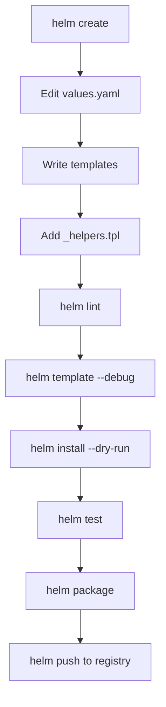

> 💡 **Quick Answer:** Build production-ready Helm charts with templates, values, helpers, hooks, tests, and CI validation. Complete guide from chart create to publishing.

## The Problem

You need to package your Kubernetes application as a reusable, configurable Helm chart. This covers everything from `helm create` to publishing on a chart repository.

## The Solution

### Step 1: Create Chart Scaffold

```bash
helm create my-app
cd my-app
# Structure:
# Chart.yaml          — metadata
# values.yaml         — default configuration
# templates/          — Kubernetes manifests with Go templates
# templates/_helpers.tpl — reusable template functions
# templates/NOTES.txt — post-install message
# charts/             — dependencies
```

### Step 2: Define Values Schema

```yaml
# values.yaml
replicaCount: 2

image:
  repository: myregistry.example.com/my-app
  tag: ""          # Defaults to chart appVersion
  pullPolicy: IfNotPresent

service:
  type: ClusterIP
  port: 80
  targetPort: 8080

ingress:
  enabled: false
  className: nginx
  host: my-app.example.com
  tls:
    enabled: true
    secretName: my-app-tls

resources:
  requests:
    cpu: 100m
    memory: 128Mi
  limits:
    cpu: 500m
    memory: 256Mi

autoscaling:
  enabled: false
  minReplicas: 2
  maxReplicas: 10
  targetCPUUtilization: 80

postgresql:
  enabled: true
  auth:
    database: myapp
    username: myapp
```

### Step 3: Write Templates with Helpers

```yaml
# templates/_helpers.tpl
{{- define "my-app.name" -}}
{{- default .Chart.Name .Values.nameOverride | trunc 63 | trimSuffix "-" }}
{{- end }}

{{- define "my-app.labels" -}}
helm.sh/chart: {{ include "my-app.chart" . }}
app.kubernetes.io/name: {{ include "my-app.name" . }}
app.kubernetes.io/instance: {{ .Release.Name }}
app.kubernetes.io/version: {{ .Chart.AppVersion | quote }}
app.kubernetes.io/managed-by: {{ .Release.Service }}
{{- end }}

# templates/deployment.yaml
apiVersion: apps/v1
kind: Deployment
metadata:
  name: {{ include "my-app.name" . }}
  labels:
    {{- include "my-app.labels" . | nindent 4 }}
spec:
  {{- if not .Values.autoscaling.enabled }}
  replicas: {{ .Values.replicaCount }}
  {{- end }}
  selector:
    matchLabels:
      app.kubernetes.io/name: {{ include "my-app.name" . }}
  template:
    metadata:
      labels:
        app.kubernetes.io/name: {{ include "my-app.name" . }}
      annotations:
        checksum/config: {{ include (print $.Template.BasePath "/configmap.yaml") . | sha256sum }}
    spec:
      containers:
        - name: {{ .Chart.Name }}
          image: "{{ .Values.image.repository }}:{{ .Values.image.tag | default .Chart.AppVersion }}"
          imagePullPolicy: {{ .Values.image.pullPolicy }}
          ports:
            - containerPort: {{ .Values.service.targetPort }}
          {{- with .Values.resources }}
          resources:
            {{- toYaml . | nindent 12 }}
          {{- end }}
          livenessProbe:
            httpGet:
              path: /healthz
              port: {{ .Values.service.targetPort }}
          readinessProbe:
            httpGet:
              path: /ready
              port: {{ .Values.service.targetPort }}
```

### Step 4: Add Tests

```yaml
# templates/tests/test-connection.yaml
apiVersion: v1
kind: Pod
metadata:
  name: "{{ include "my-app.name" . }}-test"
  annotations:
    "helm.sh/hook": test
spec:
  containers:
    - name: wget
      image: busybox
      command: ['wget']
      args: ['{{ include "my-app.name" . }}:{{ .Values.service.port }}/healthz']
  restartPolicy: Never
```

```bash
# Validate chart
helm lint my-app/
helm template my-app my-app/ --debug

# Test install
helm install my-app-test my-app/ --dry-run

# Run tests
helm test my-app-test
```

### Step 5: Package and Publish

```bash
# Package
helm package my-app/

# Push to OCI registry
helm push my-app-0.1.0.tgz oci://myregistry.example.com/charts

# Or push to ChartMuseum
curl --data-binary "@my-app-0.1.0.tgz" https://charts.example.com/api/charts
```



## Best Practices

- **Start small and iterate** — don't over-engineer on day one
- **Monitor and measure** — you can't improve what you don't measure
- **Automate repetitive tasks** — reduce human error and toil
- **Document your decisions** — future you will thank present you

## Key Takeaways

- This is essential knowledge for production Kubernetes operations
- Start with the simplest approach that solves your problem
- Monitor the impact of every change you make
- Share knowledge across your team with internal runbooks
