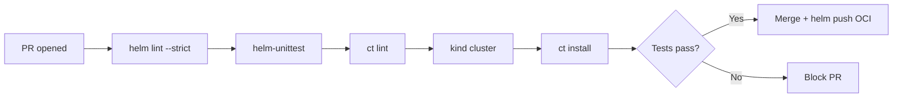

> 💡 **Quick Answer:** Test Helm charts automatically with ct (chart-testing), helm unittest, and GitHub Actions. Validate templates, lint values, and run integration tests before release.

## The Problem

Shipping untested Helm charts leads to broken deployments. A typo in `values.yaml`, a missing template condition, or an incompatible Kubernetes API version can take down production. You need automated testing in CI that catches issues before they reach any cluster.

## The Solution

### Helm Lint (Built-in)

```bash
# Basic linting — catches YAML syntax and chart structure issues
helm lint ./my-chart
helm lint ./my-chart --values values-production.yaml
helm lint ./my-chart --set replicas=0  # Test edge cases

# Strict mode — treats warnings as errors
helm lint ./my-chart --strict

# Template rendering — verify output without deploying
helm template my-release ./my-chart --values values-production.yaml > rendered.yaml
kubectl apply --dry-run=server -f rendered.yaml
```

### chart-testing (ct) — The Standard Tool

```bash
# Install ct
brew install chart-testing  # macOS
# or
pip install chart-testing

# Lint all changed charts (Git-aware)
ct lint --config ct.yaml

# Full integration test (installs on cluster, runs tests, cleans up)
ct install --config ct.yaml
```

```yaml
# ct.yaml — chart-testing configuration
remote: origin
target-branch: main
chart-dirs:
  - charts
chart-repos:
  - bitnami=https://charts.bitnami.com/bitnami
helm-extra-args: --timeout 600s
validate-maintainers: false
```

### helm-unittest — Unit Tests for Templates

```bash
# Install plugin
helm plugin install https://github.com/helm-unittest/helm-unittest

# Run tests
helm unittest ./my-chart
```

```yaml
# tests/deployment_test.yaml
suite: Deployment tests
templates:
  - deployment.yaml
tests:
  - it: should create a deployment with correct replicas
    set:
      replicaCount: 3
    asserts:
      - isKind:
          of: Deployment
      - equal:
          path: spec.replicas
          value: 3

  - it: should set resource limits
    set:
      resources.limits.cpu: "500m"
      resources.limits.memory: "256Mi"
    asserts:
      - equal:
          path: spec.template.spec.containers[0].resources.limits.cpu
          value: "500m"

  - it: should not create PDB when disabled
    set:
      podDisruptionBudget.enabled: false
    asserts:
      - hasDocuments:
          count: 0
        template: pdb.yaml

  - it: should add GPU tolerations when GPU enabled
    set:
      gpu.enabled: true
    asserts:
      - contains:
          path: spec.template.spec.tolerations
          content:
            key: nvidia.com/gpu
            operator: Exists
            effect: NoSchedule

  - it: should fail without required values
    set:
      image.repository: ""
    asserts:
      - failedTemplate: {}
```

### GitHub Actions CI Pipeline

```yaml
# .github/workflows/helm-test.yaml
name: Helm Chart CI

on:
  pull_request:
    paths:
      - 'charts/**'

jobs:
  lint:
    runs-on: ubuntu-latest
    steps:
      - uses: actions/checkout@v4
        with:
          fetch-depth: 0

      - uses: azure/setup-helm@v4

      - name: Helm lint
        run: |
          for chart in charts/*/; do
            helm lint "$chart" --strict
            helm lint "$chart" --values "$chart/values-production.yaml" --strict || true
          done

  unit-test:
    runs-on: ubuntu-latest
    steps:
      - uses: actions/checkout@v4
      - uses: azure/setup-helm@v4

      - name: Install helm-unittest
        run: helm plugin install https://github.com/helm-unittest/helm-unittest

      - name: Run unit tests
        run: |
          for chart in charts/*/; do
            helm unittest "$chart"
          done

  integration-test:
    runs-on: ubuntu-latest
    needs: [lint, unit-test]
    steps:
      - uses: actions/checkout@v4
        with:
          fetch-depth: 0

      - uses: azure/setup-helm@v4

      - name: Create kind cluster
        uses: helm/kind-action@v1

      - name: Install chart-testing
        uses: helm/chart-testing-action@v2

      - name: Run chart-testing
        run: ct install --config ct.yaml

  release:
    runs-on: ubuntu-latest
    needs: [integration-test]
    if: github.ref == 'refs/heads/main'
    steps:
      - uses: actions/checkout@v4
        with:
          fetch-depth: 0

      - name: Configure Git
        run: |
          git config user.name "helm-bot"
          git config user.email "helm-bot@example.com"

      - name: Publish to ChartMuseum / OCI
        run: |
          helm package charts/my-chart
          helm push my-chart-*.tgz oci://ghcr.io/myorg/charts
```

### Schema Validation

```json
// charts/my-chart/values.schema.json
{
  "$schema": "https://json-schema.org/draft/2020-12/schema",
  "type": "object",
  "required": ["image", "replicaCount"],
  "properties": {
    "replicaCount": {
      "type": "integer",
      "minimum": 1,
      "maximum": 100
    },
    "image": {
      "type": "object",
      "required": ["repository", "tag"],
      "properties": {
        "repository": { "type": "string", "minLength": 1 },
        "tag": { "type": "string", "minLength": 1 }
      }
    }
  }
}
```



## Common Issues

| Issue | Cause | Fix |
|-------|-------|-----|
| ct finds no charts | Wrong chart-dirs in ct.yaml | Check paths match repo structure |
| Template renders but fails on cluster | API version mismatch | Use `kubectl apply --dry-run=server` |
| Unit test path wrong | Array indexing | Use `[0]` for first container |
| Schema validation fails | Missing required field | Add defaults in values.yaml |

## Best Practices

- **Lint + unit test on every PR** — fast feedback (<30 seconds)
- **Integration test on merge** — slower but catches runtime issues
- **Schema validate values.yaml** — catch misconfigurations early
- **Test multiple value combinations** — production, staging, minimal
- **Version bump in CI** — auto-increment chart version on release

## Key Takeaways

- helm-unittest catches template logic bugs without a cluster
- chart-testing (ct) validates full install/upgrade cycles on kind
- GitHub Actions provides free CI for open-source Helm charts
- Schema validation prevents invalid values before deployment
- Test pyramid: lint (fast) → unit (medium) → integration (slow)
