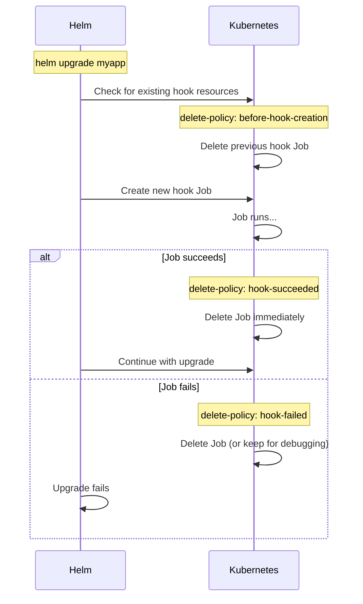

> 💡 **Quick Answer:** Set `"helm.sh/hook-delete-policy"` annotation to control when hook resources are deleted: `before-hook-creation` (delete previous before running new), `hook-succeeded` (delete after success), `hook-failed` (delete after failure). Default: hooks are never deleted automatically.

## The Problem

Helm hooks (pre-install Jobs, post-upgrade migrations) leave resources behind:
- Failed Jobs accumulate with each retry
- Completed Jobs clutter the namespace
- Previous hook resources conflict with new runs
- You want different cleanup behavior for different scenarios

## The Solution

### Hook Delete Policies

```yaml
apiVersion: batch/v1
kind: Job
metadata:
  name: db-migration
  annotations:
    "helm.sh/hook": post-install,post-upgrade
    "helm.sh/hook-weight": "1"
    "helm.sh/hook-delete-policy": before-hook-creation,hook-succeeded
spec:
  template:
    spec:
      restartPolicy: Never
      containers:
        - name: migrate
          image: myapp:1.0.0
          command: ["./migrate.sh"]
```

### Policy Options

| Policy | When Resource is Deleted | Use Case |
|--------|--------------------------|----------|
| `before-hook-creation` | Before new hook runs (next install/upgrade) | Default choice — clean slate each time |
| `hook-succeeded` | Immediately after hook succeeds | Don't need to inspect successful Jobs |
| `hook-failed` | Immediately after hook fails | Clean up failed attempts (use with caution) |

### Common Combinations

```yaml
# Recommended: clean previous + delete on success (keep failures for debugging)
"helm.sh/hook-delete-policy": before-hook-creation,hook-succeeded

# Aggressive cleanup: delete regardless of outcome
"helm.sh/hook-delete-policy": before-hook-creation,hook-succeeded,hook-failed

# Keep everything (default if annotation is omitted)
# No delete policy = hooks persist until manually deleted or chart uninstalled
```

### Complete Hook Example

```yaml
# Pre-install: Create database schema
apiVersion: batch/v1
kind: Job
metadata:
  name: "{{ .Release.Name }}-db-init"
  annotations:
    "helm.sh/hook": pre-install
    "helm.sh/hook-weight": "0"
    "helm.sh/hook-delete-policy": before-hook-creation,hook-succeeded
spec:
  backoffLimit: 3
  template:
    spec:
      restartPolicy: Never
      containers:
        - name: init
          image: "{{ .Values.image.repository }}:{{ .Values.image.tag }}"
          command: ["./scripts/init-db.sh"]
          env:
            - name: DATABASE_URL
              valueFrom:
                secretKeyRef:
                  name: db-credentials
                  key: url
---
# Post-upgrade: Run migrations
apiVersion: batch/v1
kind: Job
metadata:
  name: "{{ .Release.Name }}-migrate"
  annotations:
    "helm.sh/hook": post-upgrade
    "helm.sh/hook-weight": "1"
    "helm.sh/hook-delete-policy": before-hook-creation,hook-succeeded
spec:
  backoffLimit: 1
  ttlSecondsAfterFinished: 600  # K8s-native TTL cleanup as backup
  template:
    spec:
      restartPolicy: Never
      containers:
        - name: migrate
          image: "{{ .Values.image.repository }}:{{ .Values.image.tag }}"
          command: ["./scripts/migrate.sh"]
---
# Test hook: verify deployment
apiVersion: v1
kind: Pod
metadata:
  name: "{{ .Release.Name }}-test"
  annotations:
    "helm.sh/hook": test
    "helm.sh/hook-delete-policy": before-hook-creation
spec:
  restartPolicy: Never
  containers:
    - name: test
      image: curlimages/curl:8.7.1
      command: ["curl", "-f", "http://{{ .Release.Name }}:80/healthz"]
```

### Hook Execution Flow



### Hook Weight (Execution Order)

```yaml
# Lower weight runs first
metadata:
  annotations:
    "helm.sh/hook": pre-install
    "helm.sh/hook-weight": "-5"  # Runs first
---
metadata:
  annotations:
    "helm.sh/hook": pre-install
    "helm.sh/hook-weight": "0"   # Runs second
---
metadata:
  annotations:
    "helm.sh/hook": pre-install
    "helm.sh/hook-weight": "10"  # Runs third
```

## Common Issues

| Issue | Cause | Fix |
|-------|-------|-----|
| "already exists" error | No delete policy, previous hook still there | Add `before-hook-creation` |
| Can't debug failed migration | `hook-failed` deleting evidence | Remove `hook-failed` from policy |
| Jobs accumulate over upgrades | No delete policy set | Add `before-hook-creation,hook-succeeded` |
| Hook runs out of order | Weight not set | Use `hook-weight` annotations |
| Hook timeout | Job takes too long | Set `--timeout` on `helm install/upgrade` |
| Hook blocks rollback | Failed hook prevents rollback | Add `hook-failed` or manual cleanup |

## Best Practices

1. **Always set `before-hook-creation`** — prevents "already exists" on retry
2. **Add `hook-succeeded` for non-debug hooks** — keeps namespace clean
3. **Don't set `hook-failed` on migrations** — keep failed Jobs for investigation
4. **Use `ttlSecondsAfterFinished` as backup** — K8s-native cleanup if Helm misses
5. **Set `backoffLimit: 1-3`** — prevent infinite retry on broken migrations

## Key Takeaways

- Default: hooks are NEVER deleted automatically — they accumulate
- `before-hook-creation` is essential for idempotent upgrades
- `hook-succeeded` + `before-hook-creation` is the recommended combo
- Omit `hook-failed` on database migrations — you need the logs
- `hook-weight` controls execution order (lower = first)
