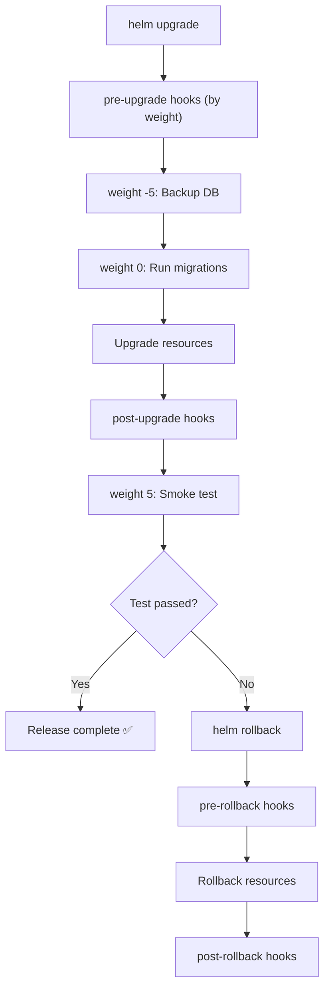

> 💡 **Quick Answer:** Use Helm hooks to run database migrations, backups, and validation jobs during install, upgrade, and rollback. Control execution order with hook weights and deletion policies.

## The Problem

Your application needs a database migration before the new version starts, a backup before any upgrade, and a smoke test after deployment completes. Running these manually is error-prone and often forgotten. Helm hooks automate lifecycle tasks as part of the release process.

## The Solution

### Hook Types

```yaml
# Available hook annotations:
# pre-install    — Before any resources are created
# post-install   — After all resources are created
# pre-upgrade    — Before an upgrade starts
# post-upgrade   — After an upgrade completes
# pre-delete     — Before deletion starts
# post-delete    — After deletion completes
# pre-rollback   — Before a rollback
# post-rollback  — After a rollback
# test           — When `helm test` is run
```

### Database Migration Hook

```yaml
# templates/migration-job.yaml
apiVersion: batch/v1
kind: Job
metadata:
  name: {{ .Release.Name }}-migrate
  annotations:
    "helm.sh/hook": pre-upgrade,pre-install
    "helm.sh/hook-weight": "0"
    "helm.sh/hook-delete-policy": before-hook-creation
spec:
  backoffLimit: 3
  activeDeadlineSeconds: 600
  template:
    spec:
      restartPolicy: Never
      securityContext:
        runAsNonRoot: true
        runAsUser: 1000
      initContainers:
        - name: wait-for-db
          image: busybox:1.36
          command: ['sh', '-c', 'until nc -z {{ .Values.database.host }} {{ .Values.database.port }}; do sleep 2; done']
      containers:
        - name: migrate
          image: "{{ .Values.image.repository }}:{{ .Values.image.tag }}"
          command: ["./migrate", "up"]
          env:
            - name: DATABASE_URL
              valueFrom:
                secretKeyRef:
                  name: {{ .Release.Name }}-db-credentials
                  key: url
          resources:
            requests:
              cpu: 100m
              memory: 256Mi
            limits:
              cpu: 500m
              memory: 512Mi
```

### Pre-Upgrade Backup Hook

```yaml
# templates/backup-job.yaml
apiVersion: batch/v1
kind: Job
metadata:
  name: {{ .Release.Name }}-backup-{{ now | date "20060102-150405" }}
  annotations:
    "helm.sh/hook": pre-upgrade
    "helm.sh/hook-weight": "-5"              # Run BEFORE migration (lower = first)
    "helm.sh/hook-delete-policy": hook-succeeded
spec:
  backoffLimit: 1
  activeDeadlineSeconds: 1800
  template:
    spec:
      restartPolicy: Never
      containers:
        - name: backup
          image: postgres:16
          command:
            - pg_dump
            - --format=custom
            - --file=/backups/{{ .Release.Name }}-{{ now | date "20060102" }}.dump
          env:
            - name: PGHOST
              value: {{ .Values.database.host }}
            - name: PGDATABASE
              value: {{ .Values.database.name }}
            - name: PGUSER
              valueFrom:
                secretKeyRef:
                  name: {{ .Release.Name }}-db-credentials
                  key: username
            - name: PGPASSWORD
              valueFrom:
                secretKeyRef:
                  name: {{ .Release.Name }}-db-credentials
                  key: password
          volumeMounts:
            - name: backups
              mountPath: /backups
      volumes:
        - name: backups
          persistentVolumeClaim:
            claimName: {{ .Release.Name }}-backups
```

### Post-Upgrade Smoke Test

```yaml
# templates/smoke-test.yaml
apiVersion: batch/v1
kind: Job
metadata:
  name: {{ .Release.Name }}-smoke-test
  annotations:
    "helm.sh/hook": post-upgrade,post-install
    "helm.sh/hook-weight": "5"
    "helm.sh/hook-delete-policy": before-hook-creation
spec:
  backoffLimit: 3
  activeDeadlineSeconds: 120
  template:
    spec:
      restartPolicy: Never
      containers:
        - name: smoke-test
          image: curlimages/curl:8.5.0
          command: ["/bin/sh", "-c"]
          args:
            - |
              echo "Testing health endpoint..."
              for i in $(seq 1 30); do
                if curl -sf http://{{ include "my-app.fullname" . }}:{{ .Values.service.port }}/healthz; then
                  echo "Health check passed!"
                  exit 0
                fi
                echo "Attempt $i failed, retrying in 5s..."
                sleep 5
              done
              echo "Smoke test FAILED"
              exit 1
```

### Hook Execution Order



### Hook Delete Policies

```yaml
# before-hook-creation — Delete previous hook resource before creating new one
# hook-succeeded       — Delete after hook succeeds
# hook-failed          — Delete after hook fails (keeps successful for debugging)

# Recommended combinations:
# Migrations:  before-hook-creation (keep last attempt visible)
# Backups:     hook-succeeded (clean up after success, keep failures)
# Smoke tests: before-hook-creation (always have latest)
```

### Test Hooks

```yaml
# templates/tests/connection-test.yaml
apiVersion: v1
kind: Pod
metadata:
  name: {{ .Release.Name }}-connection-test
  annotations:
    "helm.sh/hook": test
spec:
  restartPolicy: Never
  containers:
    - name: test
      image: busybox:1.36
      command: ['sh', '-c']
      args:
        - |
          echo "Testing service connectivity..."
          wget -qO- http://{{ include "my-app.fullname" . }}:{{ .Values.service.port }}/healthz
          echo "Testing database connectivity..."
          nc -z {{ .Values.database.host }} {{ .Values.database.port }}
          echo "All tests passed!"
```

```bash
# Run tests after install
helm test my-release
helm test my-release --logs  # Show test output
```

## Common Issues

| Issue | Cause | Fix |
|-------|-------|-----|
| Hook hangs forever | No `activeDeadlineSeconds` | Always set a timeout |
| Old hook jobs accumulate | No delete policy | Add `hook-delete-policy` |
| Migration runs before DB ready | No init container wait | Add `wait-for-db` init container |
| Hook order wrong | Missing hook-weight | Lower weight = runs first |
| Rollback doesn't undo migration | Migrations are one-way | Write down migrations or use versioned schema |

## Best Practices

- **Always set `activeDeadlineSeconds`** — hooks without timeouts can block releases forever
- **Use hook weights** to control order: backup (-5) → migrate (0) → smoke test (5)
- **Idempotent migrations** — hooks may run multiple times on retry
- **Keep hooks fast** — long-running hooks block the entire release
- **Test hooks in staging** — a broken hook in production blocks all upgrades

## Key Takeaways

- Helm hooks automate lifecycle tasks (backup, migrate, test) as part of releases
- Hook weights control execution order — lower runs first
- Delete policies prevent resource accumulation
- Pre-upgrade backups + migrations + post-upgrade smoke tests = safe deployments
- Always set timeouts and make hooks idempotent
