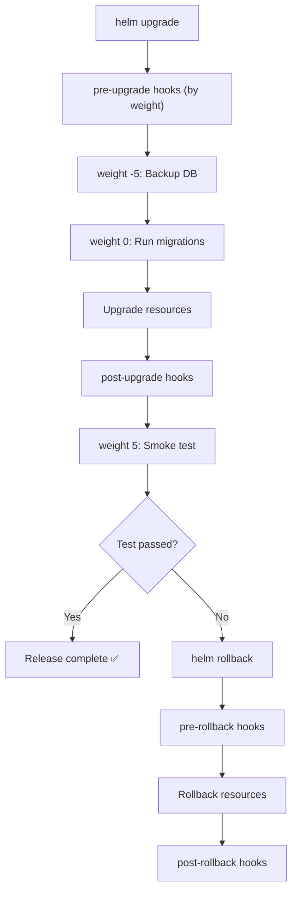

> 💡 **Quick Answer:** Add the `helm.sh/hook` annotation to a Job or Pod to run it at a release lifecycle point: `pre-install`, `post-install`, `pre-upgrade`, `post-upgrade`, `pre-delete`, `post-delete`, `pre-rollback`, `post-rollback`, or `test`. Order multiple hooks with `helm.sh/hook-weight` (a quoted string, lowest runs first) and control cleanup with `helm.sh/hook-delete-policy` (`before-hook-creation`, `hook-succeeded`, `hook-failed`).
>
> **Gotcha:** Helm waits for each hook Job to complete before continuing — always set `activeDeadlineSeconds`, or a stuck hook blocks the release until `--timeout` fails it.

## The Problem

Your application needs a database migration before the new version starts, a backup before any upgrade, and a smoke test after deployment completes. Running these manually is error-prone and often forgotten. Helm hooks automate lifecycle tasks as part of the release process.

## The Solution

### Hook Types

```yaml
# Available hook annotations:
# pre-install    — Before any resources are created
# post-install   — After all resources are created
# pre-upgrade    — Before an upgrade starts
# post-upgrade   — After an upgrade completes
# pre-delete     — Before deletion starts
# post-delete    — After deletion completes
# pre-rollback   — Before a rollback
# post-rollback  — After a rollback
# test           — When `helm test` is run
```

```yaml
# Minimal hook annotations
metadata:
  annotations:
    "helm.sh/hook": pre-install,pre-upgrade      # comma-separate multiple events
    "helm.sh/hook-weight": "-5"                   # must be a quoted string
    "helm.sh/hook-delete-policy": before-hook-creation,hook-succeeded
```

Hook resources are **not** managed as part of the release: `helm uninstall` won't delete them, and a failed hook fails the whole install/upgrade. Delete policies are what control their lifecycle.

### Database Migration Hook

```yaml
# templates/migration-job.yaml
apiVersion: batch/v1
kind: Job
metadata:
  name: {{ .Release.Name }}-migrate
  annotations:
    "helm.sh/hook": pre-upgrade,pre-install
    "helm.sh/hook-weight": "0"
    "helm.sh/hook-delete-policy": before-hook-creation
spec:
  backoffLimit: 3
  activeDeadlineSeconds: 600
  template:
    spec:
      restartPolicy: Never
      securityContext:
        runAsNonRoot: true
        runAsUser: 1000
      initContainers:
        - name: wait-for-db
          image: busybox:1.36
          command: ['sh', '-c', 'until nc -z {{ .Values.database.host }} {{ .Values.database.port }}; do sleep 2; done']
      containers:
        - name: migrate
          image: "{{ .Values.image.repository }}:{{ .Values.image.tag }}"
          command: ["./migrate", "up"]
          env:
            - name: DATABASE_URL
              valueFrom:
                secretKeyRef:
                  name: {{ .Release.Name }}-db-credentials
                  key: url
          resources:
            requests:
              cpu: 100m
              memory: 256Mi
            limits:
              cpu: 500m
              memory: 512Mi
```

### Pre-Upgrade Backup Hook

```yaml
# templates/backup-job.yaml
apiVersion: batch/v1
kind: Job
metadata:
  name: {{ .Release.Name }}-backup-{{ now | date "20060102-150405" }}
  annotations:
    "helm.sh/hook": pre-upgrade
    "helm.sh/hook-weight": "-5"              # Run BEFORE migration (lower = first)
    "helm.sh/hook-delete-policy": hook-succeeded
spec:
  backoffLimit: 1
  activeDeadlineSeconds: 1800
  template:
    spec:
      restartPolicy: Never
      containers:
        - name: backup
          image: postgres:16
          command:
            - pg_dump
            - --format=custom
            - --file=/backups/{{ .Release.Name }}-{{ now | date "20060102" }}.dump
          env:
            - name: PGHOST
              value: {{ .Values.database.host }}
            - name: PGDATABASE
              value: {{ .Values.database.name }}
            - name: PGUSER
              valueFrom:
                secretKeyRef:
                  name: {{ .Release.Name }}-db-credentials
                  key: username
            - name: PGPASSWORD
              valueFrom:
                secretKeyRef:
                  name: {{ .Release.Name }}-db-credentials
                  key: password
          volumeMounts:
            - name: backups
              mountPath: /backups
      volumes:
        - name: backups
          persistentVolumeClaim:
            claimName: {{ .Release.Name }}-backups
```

### Post-Upgrade Smoke Test

```yaml
# templates/smoke-test.yaml
apiVersion: batch/v1
kind: Job
metadata:
  name: {{ .Release.Name }}-smoke-test
  annotations:
    "helm.sh/hook": post-upgrade,post-install
    "helm.sh/hook-weight": "5"
    "helm.sh/hook-delete-policy": before-hook-creation
spec:
  backoffLimit: 3
  activeDeadlineSeconds: 120
  template:
    spec:
      restartPolicy: Never
      containers:
        - name: smoke-test
          image: curlimages/curl:8.5.0
          command: ["/bin/sh", "-c"]
          args:
            - |
              echo "Testing health endpoint..."
              for i in $(seq 1 30); do
                if curl -sf http://{{ include "my-app.fullname" . }}:{{ .Values.service.port }}/healthz; then
                  echo "Health check passed!"
                  exit 0
                fi
                echo "Attempt $i failed, retrying in 5s..."
                sleep 5
              done
              echo "Smoke test FAILED"
              exit 1
```

### Backup Before Deletion (pre-delete)

```yaml
# templates/pre-delete-backup.yaml
apiVersion: batch/v1
kind: Job
metadata:
  name: {{ .Release.Name }}-predelete-backup
  annotations:
    "helm.sh/hook": pre-delete
    "helm.sh/hook-delete-policy": before-hook-creation
spec:
  backoffLimit: 1
  activeDeadlineSeconds: 1800
  template:
    spec:
      restartPolicy: Never
      containers:
        - name: backup
          image: postgres:16
          command: ["/bin/sh", "-c", "pg_dump \"$DATABASE_URL\" > /backup/{{ .Release.Name }}-$(date +%Y%m%d-%H%M%S).sql"]
          env:
            - name: DATABASE_URL
              valueFrom:
                secretKeyRef:
                  name: {{ .Release.Name }}-db-credentials
                  key: url
          volumeMounts:
            - name: backup-storage
              mountPath: /backup
      volumes:
        - name: backup-storage
          persistentVolumeClaim:
            claimName: backup-pvc     # must NOT be part of the release, or uninstall deletes it
```

### Hook Weights: Ordering Multiple Hooks

Hooks for the same event are sorted by weight ascending (negative first), then by resource kind and name, and Helm runs them one after another, waiting for each Job to complete:

```yaml
# -10: preflight check that required Secrets/namespaces exist
annotations: {"helm.sh/hook": pre-install, "helm.sh/hook-weight": "-10"}
---
# -5: run schema migration
annotations: {"helm.sh/hook": pre-install, "helm.sh/hook-weight": "-5"}
---
# 0: seed initial data
annotations: {"helm.sh/hook": pre-install, "helm.sh/hook-weight": "0"}
```

### Hook Execution Order


```mermaid
graph TD
    A[helm upgrade] --> B["pre-upgrade hooks (by weight)"]
    B --> C["weight -5: Backup DB"]
    C --> D["weight 0: Run migrations"]
    D --> E[Upgrade resources]
    E --> F["post-upgrade hooks"]
    F --> G["weight 5: Smoke test"]
    G --> H{Test passed?}
    H -->|Yes| I[Release complete ✅]
    H -->|No| J[helm rollback]
    J --> K["pre-rollback hooks"]
    K --> L[Rollback resources]
    L --> M["post-rollback hooks"]
```

### Hook Delete Policies

```yaml
# before-hook-creation — Delete previous hook resource before creating new one
# hook-succeeded       — Delete after hook succeeds
# hook-failed          — Delete after hook fails (keeps successful for debugging)
# Combine with commas: before-hook-creation,hook-succeeded
# No annotation at all  → Helm 3 defaults to before-hook-creation

# Recommended combinations:
# Migrations:  before-hook-creation (keep last attempt visible)
# Backups:     hook-succeeded (clean up after success, keep failures)
# Smoke tests: before-hook-creation (always have latest)
```

Deep dives: [hook-delete-policy options](/recipes/helm/helm-hook-delete-policy/) and [before-hook-creation](/recipes/helm/helm-before-hook-creation/).

### Test Hooks

```yaml
# templates/tests/connection-test.yaml
apiVersion: v1
kind: Pod
metadata:
  name: {{ .Release.Name }}-connection-test
  annotations:
    "helm.sh/hook": test
spec:
  restartPolicy: Never
  containers:
    - name: test
      image: busybox:1.36
      command: ['sh', '-c']
      args:
        - |
          echo "Testing service connectivity..."
          wget -qO- http://{{ include "my-app.fullname" . }}:{{ .Values.service.port }}/healthz
          echo "Testing database connectivity..."
          nc -z {{ .Values.database.host }} {{ .Values.database.port }}
          echo "All tests passed!"
```

```bash
# Run tests after install
helm test my-release
helm test my-release --logs  # Show test output
```

## Common Issues

| Issue | Cause | Fix |
|-------|-------|-----|
| Hook hangs forever | No `activeDeadlineSeconds` | Always set a timeout |
| Old hook jobs accumulate | No delete policy | Add `hook-delete-policy` |
| Migration runs before DB ready | No init container wait | Add `wait-for-db` init container |
| Hook order wrong | Missing hook-weight | Lower weight = runs first |
| Rollback doesn't undo migration | Migrations are one-way | Write down migrations or use versioned schema |
| `helm upgrade` fails with "already exists" | Previous hook resource wasn't deleted (e.g. `hook-succeeded` only, after a failure) | Include `before-hook-creation` in the delete policy |
| `hook-weight` ignored / template error | Weight is a bare number | Quote it: `"helm.sh/hook-weight": "-5"` |
| Hook Job left behind after uninstall | Hooks aren't release-managed resources | Set a delete policy; clean up manually with `kubectl delete job` |

## Best Practices

- **Always set `activeDeadlineSeconds`** — hooks without timeouts can block releases forever
- **Use hook weights** to control order: backup (-5) → migrate (0) → smoke test (5)
- **Idempotent migrations** — `pre-upgrade` hooks re-run on every upgrade, and Jobs may retry
- **Don't mount release-managed PVCs in `pre-delete`/`post-delete` hooks** — keep backup storage outside the chart
- **Keep hooks fast** — long-running hooks block the entire release
- **Test hooks in staging** — a broken hook in production blocks all upgrades

## Key Takeaways

- Helm hooks automate lifecycle tasks (backup, migrate, test) as part of releases
- Hook weights control execution order — lower runs first
- Delete policies prevent resource accumulation — hooks aren't removed by `helm uninstall`
- Pre-upgrade backups + migrations + post-upgrade smoke tests = safe deployments
- Always set timeouts and make hooks idempotent
