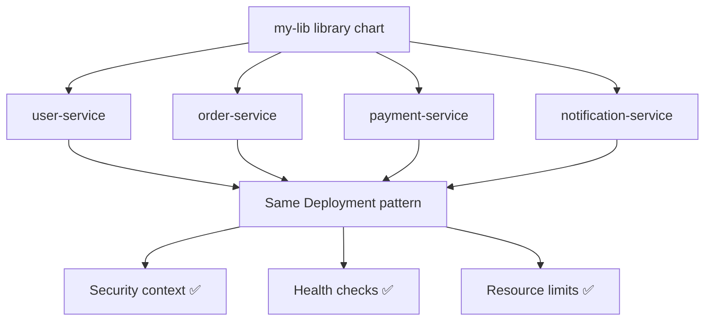

> 💡 **Quick Answer:** Create Helm library charts to share common templates across multiple charts. DRY up deployments, services, and config patterns with reusable library functions.

## The Problem

You have 20 microservices, each with their own Helm chart, and they all have nearly identical Deployment, Service, and Ingress templates. Every time you update a pattern (add a security context, change probe defaults), you update 20 charts. Library charts solve this by defining reusable template functions once.

## The Solution

### Create the Library Chart

```bash
helm create my-lib
# Edit Chart.yaml to make it a library
```

```yaml
# charts/my-lib/Chart.yaml
apiVersion: v2
name: my-lib
version: 1.0.0
type: library        # <-- This makes it a library chart
description: Shared Helm templates for all microservices
```

### Define Reusable Templates

```yaml
# charts/my-lib/templates/_deployment.tpl
{{- define "my-lib.deployment" -}}
apiVersion: apps/v1
kind: Deployment
metadata:
  name: {{ include "my-lib.fullname" . }}
  labels:
    {{- include "my-lib.labels" . | nindent 4 }}
spec:
  replicas: {{ .Values.replicaCount | default 2 }}
  selector:
    matchLabels:
      {{- include "my-lib.selectorLabels" . | nindent 6 }}
  template:
    metadata:
      labels:
        {{- include "my-lib.selectorLabels" . | nindent 8 }}
      annotations:
        checksum/config: {{ include (print .Template.BasePath "/configmap.yaml") . | sha256sum }}
    spec:
      serviceAccountName: {{ include "my-lib.fullname" . }}
      securityContext:
        runAsNonRoot: true
        runAsUser: 1000
        fsGroup: 1000
        seccompProfile:
          type: RuntimeDefault
      containers:
        - name: {{ .Chart.Name }}
          image: "{{ .Values.image.repository }}:{{ .Values.image.tag }}"
          imagePullPolicy: {{ .Values.image.pullPolicy | default "IfNotPresent" }}
          ports:
            - name: http
              containerPort: {{ .Values.containerPort | default 8080 }}
          {{- if .Values.healthCheck.enabled | default true }}
          livenessProbe:
            httpGet:
              path: {{ .Values.healthCheck.livenessPath | default "/healthz" }}
              port: http
            initialDelaySeconds: 15
            periodSeconds: 20
            failureThreshold: 3
          readinessProbe:
            httpGet:
              path: {{ .Values.healthCheck.readinessPath | default "/readyz" }}
              port: http
            initialDelaySeconds: 5
            periodSeconds: 10
          {{- end }}
          resources:
            {{- toYaml .Values.resources | nindent 12 }}
          securityContext:
            allowPrivilegeEscalation: false
            capabilities:
              drop: [ALL]
            readOnlyRootFilesystem: true
          {{- with .Values.extraEnv }}
          env:
            {{- toYaml . | nindent 12 }}
          {{- end }}
          volumeMounts:
            - name: tmp
              mountPath: /tmp
      volumes:
        - name: tmp
          emptyDir: {}
      {{- with .Values.nodeSelector }}
      nodeSelector:
        {{- toYaml . | nindent 8 }}
      {{- end }}
      {{- with .Values.tolerations }}
      tolerations:
        {{- toYaml . | nindent 8 }}
      {{- end }}
{{- end -}}
```

```yaml
# charts/my-lib/templates/_service.tpl
{{- define "my-lib.service" -}}
apiVersion: v1
kind: Service
metadata:
  name: {{ include "my-lib.fullname" . }}
  labels:
    {{- include "my-lib.labels" . | nindent 4 }}
spec:
  type: {{ .Values.service.type | default "ClusterIP" }}
  ports:
    - port: {{ .Values.service.port | default 80 }}
      targetPort: http
      protocol: TCP
      name: http
  selector:
    {{- include "my-lib.selectorLabels" . | nindent 4 }}
{{- end -}}
```

```yaml
# charts/my-lib/templates/_helpers.tpl
{{- define "my-lib.fullname" -}}
{{- .Release.Name | trunc 63 | trimSuffix "-" }}
{{- end -}}

{{- define "my-lib.labels" -}}
app.kubernetes.io/name: {{ .Chart.Name }}
app.kubernetes.io/instance: {{ .Release.Name }}
app.kubernetes.io/version: {{ .Chart.AppVersion | default "latest" }}
app.kubernetes.io/managed-by: {{ .Release.Service }}
helm.sh/chart: {{ printf "%s-%s" .Chart.Name .Chart.Version }}
{{- end -}}

{{- define "my-lib.selectorLabels" -}}
app.kubernetes.io/name: {{ .Chart.Name }}
app.kubernetes.io/instance: {{ .Release.Name }}
{{- end -}}
```

### Use the Library in Application Charts

```yaml
# charts/user-service/Chart.yaml
apiVersion: v2
name: user-service
version: 1.0.0
type: application
dependencies:
  - name: my-lib
    version: "1.x.x"
    repository: "oci://ghcr.io/myorg/charts"
```

```yaml
# charts/user-service/templates/deployment.yaml
# Just one line! All the logic comes from the library.
{{ include "my-lib.deployment" . }}
```

```yaml
# charts/user-service/templates/service.yaml
{{ include "my-lib.service" . }}
```

```yaml
# charts/user-service/values.yaml
replicaCount: 3
image:
  repository: ghcr.io/myorg/user-service
  tag: v2.1.0
containerPort: 8080
resources:
  requests:
    cpu: 100m
    memory: 128Mi
  limits:
    cpu: 500m
    memory: 256Mi
healthCheck:
  enabled: true
  livenessPath: /health
  readinessPath: /ready
```

```bash
# Update library dependency
helm dependency update charts/user-service

# Deploy — uses library templates with app-specific values
helm install user-svc charts/user-service
```



## Common Issues

| Issue | Cause | Fix |
|-------|-------|-----|
| Library not found | Dependency not updated | `helm dependency update` |
| Template not rendering | Wrong `define`/`include` name | Match names exactly |
| Values not passing through | Scope issue in template | Use `.` (root scope) in include |
| Library changes not picked up | Cached dependency | `helm dependency build --skip-refresh` |

## Best Practices

- **One library for all microservices** — consistency across the org
- **Version the library** semantically — breaking changes = major bump
- **Keep templates configurable** — use defaults for everything
- **Document all values** — library users need to know what's available
- **Test the library itself** with helm-unittest

## Key Takeaways

- Library charts eliminate duplication across microservice Helm charts
- Application charts become trivial — just values and one-line template includes
- Security patterns (non-root, read-only fs, drop capabilities) enforced everywhere
- Update the library once, all charts get the improvement on next dependency update
