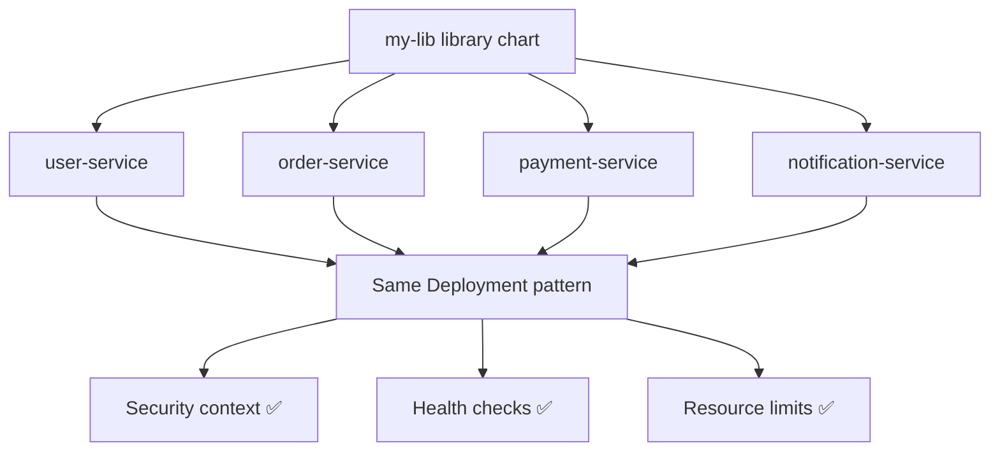

> 💡 **Quick Answer:** A library chart is a chart with `type: library` in `Chart.yaml` that contains only named templates (`{{ define "my-lib.deployment" }}` in `_*.tpl` files) and renders nothing on its own. Publish it (e.g. to an OCI registry), add it as a `dependency` of each application chart, run `helm dependency update`, and reduce each app template to one line: `{{ include "my-lib.deployment" . }}`. Change the library once, bump its version, and every chart picks it up.
>
> **Gotcha:** Library charts can't be installed and their non-`_` templates are ignored — delete the scaffolding `helm create` generates, and always pass the root context (`.`) to `include`.

## The Problem

You have 20 microservices, each with their own Helm chart, and they all have nearly identical Deployment, Service, and Ingress templates. Every time you update a pattern (add a security context, change probe defaults), you update 20 charts. Library charts solve this by defining reusable template functions once.

## The Solution

### Create the Library Chart

```bash
helm create my-lib
rm -rf my-lib/templates/* my-lib/values.yaml my-lib/templates/tests
# keep only _*.tpl files in templates/; set type: library below
```

```yaml
# charts/my-lib/Chart.yaml
apiVersion: v2
name: my-lib
version: 1.0.0
type: library        # <-- This makes it a library chart
description: Shared Helm templates for all microservices
```

### Define Reusable Templates

```yaml
# charts/my-lib/templates/_deployment.tpl
{{- define "my-lib.deployment" -}}
apiVersion: apps/v1
kind: Deployment
metadata:
  name: {{ include "my-lib.fullname" . }}
  labels:
    {{- include "my-lib.labels" . | nindent 4 }}
spec:
  replicas: {{ .Values.replicaCount | default 2 }}
  selector:
    matchLabels:
      {{- include "my-lib.selectorLabels" . | nindent 6 }}
  template:
    metadata:
      labels:
        {{- include "my-lib.selectorLabels" . | nindent 8 }}
      {{- with .Values.configChecksum }}
      annotations:
        checksum/config: {{ . }}      # parent chart passes: configChecksum: <sha of its ConfigMap>
      {{- end }}
    spec:
      {{- with .Values.serviceAccountName }}
      serviceAccountName: {{ . }}
      {{- end }}
      securityContext:
        runAsNonRoot: true
        runAsUser: 1000
        fsGroup: 1000
        seccompProfile:
          type: RuntimeDefault
      containers:
        - name: {{ .Chart.Name }}
          image: "{{ .Values.image.repository }}:{{ .Values.image.tag }}"
          imagePullPolicy: {{ .Values.image.pullPolicy | default "IfNotPresent" }}
          ports:
            - name: http
              containerPort: {{ .Values.containerPort | default 8080 }}
          {{- $hc := .Values.healthCheck | default dict }}
          {{- if (hasKey $hc "enabled" | ternary $hc.enabled true) }}
          livenessProbe:
            httpGet:
              path: {{ $hc.livenessPath | default "/healthz" }}
              port: http
            initialDelaySeconds: 15
            periodSeconds: 20
            failureThreshold: 3
          readinessProbe:
            httpGet:
              path: {{ $hc.readinessPath | default "/readyz" }}
              port: http
            initialDelaySeconds: 5
            periodSeconds: 10
          {{- end }}
          {{- with .Values.resources }}
          resources:
            {{- toYaml . | nindent 12 }}
          {{- end }}
          securityContext:
            allowPrivilegeEscalation: false
            capabilities:
              drop: [ALL]
            readOnlyRootFilesystem: true
          {{- with .Values.extraEnv }}
          env:
            {{- toYaml . | nindent 12 }}
          {{- end }}
          volumeMounts:
            - name: tmp
              mountPath: /tmp
      volumes:
        - name: tmp
          emptyDir: {}
      {{- with .Values.nodeSelector }}
      nodeSelector:
        {{- toYaml . | nindent 8 }}
      {{- end }}
      {{- with .Values.tolerations }}
      tolerations:
        {{- toYaml . | nindent 8 }}
      {{- end }}
{{- end -}}
```

```yaml
# charts/my-lib/templates/_service.tpl
{{- define "my-lib.service" -}}
apiVersion: v1
kind: Service
metadata:
  name: {{ include "my-lib.fullname" . }}
  labels:
    {{- include "my-lib.labels" . | nindent 4 }}
spec:
  type: {{ .Values.service.type | default "ClusterIP" }}
  ports:
    - port: {{ .Values.service.port | default 80 }}
      targetPort: http
      protocol: TCP
      name: http
  selector:
    {{- include "my-lib.selectorLabels" . | nindent 4 }}
{{- end -}}
```

```yaml
# charts/my-lib/templates/_helpers.tpl
{{- define "my-lib.fullname" -}}
{{- .Release.Name | trunc 63 | trimSuffix "-" }}
{{- end -}}

{{- define "my-lib.labels" -}}
app.kubernetes.io/name: {{ .Chart.Name }}
app.kubernetes.io/instance: {{ .Release.Name }}
app.kubernetes.io/version: {{ .Chart.AppVersion | default "latest" }}
app.kubernetes.io/managed-by: {{ .Release.Service }}
helm.sh/chart: {{ printf "%s-%s" .Chart.Name .Chart.Version }}
{{- end -}}

{{- define "my-lib.selectorLabels" -}}
app.kubernetes.io/name: {{ .Chart.Name }}
app.kubernetes.io/instance: {{ .Release.Name }}
{{- end -}}
```

### Use the Library in Application Charts

```yaml
# charts/user-service/Chart.yaml
apiVersion: v2
name: user-service
version: 1.0.0
type: application
dependencies:
  - name: my-lib
    version: "1.x.x"
    repository: "oci://ghcr.io/myorg/charts"
```

```yaml
# charts/user-service/templates/deployment.yaml
# Just one line! All the logic comes from the library.
{{ include "my-lib.deployment" . }}
```

```yaml
# charts/user-service/templates/service.yaml
{{ include "my-lib.service" . }}
```

```yaml
# charts/user-service/values.yaml
replicaCount: 3
image:
  repository: ghcr.io/myorg/user-service
  tag: v2.1.0
containerPort: 8080
resources:
  requests:
    cpu: 100m
    memory: 128Mi
  limits:
    cpu: 500m
    memory: 256Mi
healthCheck:
  enabled: true
  livenessPath: /health
  readinessPath: /ready
```

Note `| default true` would be wrong for booleans: `default` treats `false` as empty, so `enabled: false` could never turn probes off — hence the `hasKey`/`ternary` pattern.

### Let Charts Override Library Output

For per-chart tweaks without forking the library, use the merge pattern (the same one Bitnami's `common` chart uses): the library renders a base object, the app chart supplies an override template, and `mergeOverwrite` combines them.

```yaml
# my-lib/templates/_util.tpl
{{- define "my-lib.util.merge" -}}
{{- $top := first . -}}
{{- $overrides := fromYaml (include (index . 1) $top) | default (dict) -}}
{{- $tpl := fromYaml (include (index . 2) $top) | default (dict) -}}
{{- toYaml (merge $overrides $tpl) -}}
{{- end -}}
```

```yaml
# user-service/templates/deployment.yaml
{{- include "my-lib.util.merge" (list . "user-service.deployment" "my-lib.deployment") }}
{{- define "user-service.deployment" -}}
spec:
  template:
    spec:
      priorityClassName: high-priority
{{- end -}}
```

`merge` gives precedence to the first dict (the overrides). Lists are replaced, not merged — override whole `containers` entries carefully.

```bash
# Update library dependency
helm dependency update charts/user-service

# Deploy — uses library templates with app-specific values
helm install user-svc charts/user-service
```


```mermaid
graph TD
    A[my-lib library chart] --> B[user-service]
    A --> C[order-service]
    A --> D[payment-service]
    A --> E[notification-service]
    B --> F[Same Deployment pattern]
    C --> F
    D --> F
    E --> F
    F --> G[Security context ✅]
    F --> H[Health checks ✅]
    F --> I[Resource limits ✅]
```

## Common Issues

| Issue | Cause | Fix |
|-------|-------|-----|
| Library not found | Dependency not updated | `helm dependency update` |
| Template not rendering | Wrong `define`/`include` name | Match names exactly |
| Values not passing through | Scope issue in template | Use `.` (root scope) in include |
| Library changes not picked up | Old `.tgz` in `charts/` or `Chart.lock` pins the old version | Bump the library version, `helm dependency update`, commit the new `Chart.lock` |
| `nil pointer evaluating interface {}.enabled` | Nested value missing in the app chart | Guard with `default dict` / `with` / `dig` in the library |
| `error calling include: template: no template "my-lib.x"` | Library not in `charts/` or wrong name | `helm dependency update`; names are global across all charts, so prefix them |
| `library charts are not installable` | Tried `helm install` on the library | Install an application chart that depends on it |

## Best Practices

- **One library for all microservices** — consistency across the org
- **Version the library** semantically — breaking changes = major bump
- **Keep templates configurable** — use defaults for everything
- **Document all values** — library users need to know what's available
- **Test the library itself** with helm-unittest

## Key Takeaways

- Library charts eliminate duplication across microservice Helm charts
- Application charts become trivial — just values and one-line template includes
- Security patterns (non-root, read-only fs, drop capabilities) enforced everywhere
- Update the library once, all charts get the improvement on next dependency update

## Frequently Asked Questions

### What is the difference between a library chart and a subchart?

An application subchart renders its own resources with its own values scope. A library chart renders nothing; it only exports named templates that run in the **parent's** context with the parent's `.Values`, `.Release` and `.Chart`.

### Can a library chart have values.yaml?

It can ship a `values.yaml`, but those defaults are not merged into the parent automatically the way subchart values are. Put defaults inside the templates (`default`, `dig`) or document the keys the parent must set.

### How do I test a library chart?

Create a small test application chart in the same repo that depends on it via `repository: "file://../my-lib"`, render it with `helm template` in CI, and assert output with helm-unittest or `kubeconform`.

### Should I use Bitnami's common chart or my own library?

`bitnami/common` is a good reference and dependency for generic helpers (names, labels, images, affinities). Most platform teams still keep their own library to encode org-specific defaults: security context, probes, labels, and resource policies.
