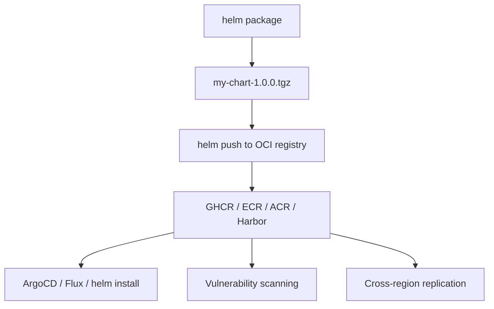

> 💡 **Quick Answer:** Store and distribute Helm charts using OCI registries like GHCR, ECR, ACR, and Harbor. Migrate from ChartMuseum to OCI-native chart management.

## The Problem

Traditional Helm chart repositories (ChartMuseum, GitHub Pages `index.yaml`) are separate infrastructure to maintain. OCI registries (the same ones storing your container images) now support Helm charts natively — one registry for everything, with built-in auth, replication, and vulnerability scanning.

## The Solution

### Push Charts to OCI Registries

```bash
# Package the chart
helm package ./my-chart
# Creates: my-chart-1.0.0.tgz

# Login to registry
helm registry login ghcr.io -u myuser -p $GITHUB_TOKEN

# Push to GHCR
helm push my-chart-1.0.0.tgz oci://ghcr.io/myorg/charts

# Push to ECR
aws ecr create-repository --repository-name charts/my-chart
helm push my-chart-1.0.0.tgz oci://123456789.dkr.ecr.us-east-1.amazonaws.com/charts

# Push to ACR
helm push my-chart-1.0.0.tgz oci://myregistry.azurecr.io/charts

# Push to Harbor
helm push my-chart-1.0.0.tgz oci://harbor.example.com/charts
```

### Install from OCI

```bash
# Install directly from OCI
helm install my-release oci://ghcr.io/myorg/charts/my-chart --version 1.0.0

# Pull locally first
helm pull oci://ghcr.io/myorg/charts/my-chart --version 1.0.0

# Show chart info
helm show chart oci://ghcr.io/myorg/charts/my-chart --version 1.0.0
helm show values oci://ghcr.io/myorg/charts/my-chart --version 1.0.0

# Template without installing
helm template my-release oci://ghcr.io/myorg/charts/my-chart --version 1.0.0
```

### ArgoCD with OCI Helm Charts

```yaml
apiVersion: argoproj.io/v1alpha1
kind: Application
metadata:
  name: my-app
  namespace: argocd
spec:
  source:
    chart: my-chart
    repoURL: ghcr.io/myorg/charts
    targetRevision: 1.0.0
    helm:
      values: |
        replicaCount: 3
        image:
          tag: v2.0.0
  destination:
    server: https://kubernetes.default.svc
    namespace: production
```

### Flux with OCI Helm Charts

```yaml
apiVersion: source.toolkit.fluxcd.io/v1beta2
kind: HelmRepository
metadata:
  name: my-charts
  namespace: flux-system
spec:
  type: oci
  interval: 5m
  url: oci://ghcr.io/myorg/charts
  secretRef:
    name: ghcr-credentials
---
apiVersion: helm.toolkit.fluxcd.io/v2beta2
kind: HelmRelease
metadata:
  name: my-app
  namespace: production
spec:
  interval: 5m
  chart:
    spec:
      chart: my-chart
      version: "1.0.0"
      sourceRef:
        kind: HelmRepository
        name: my-charts
        namespace: flux-system
```

### CI/CD Release Pipeline

```bash
#!/bin/bash
# release-chart.sh — Automated OCI chart release
set -euo pipefail

CHART_DIR="$1"
REGISTRY="oci://ghcr.io/myorg/charts"

# Get version from Chart.yaml
VERSION=$(grep '^version:' "$CHART_DIR/Chart.yaml" | awk '{print $2}')
CHART_NAME=$(grep '^name:' "$CHART_DIR/Chart.yaml" | awk '{print $2}')

echo "Releasing $CHART_NAME v$VERSION to $REGISTRY"

# Lint
helm lint "$CHART_DIR" --strict

# Package
helm package "$CHART_DIR"

# Push
helm push "${CHART_NAME}-${VERSION}.tgz" "$REGISTRY"

# Verify
helm show chart "$REGISTRY/$CHART_NAME" --version "$VERSION"

echo "Released $CHART_NAME v$VERSION"
```



## Common Issues

| Issue | Cause | Fix |
|-------|-------|-----|
| 401 Unauthorized | Token expired | `helm registry login` with fresh token |
| Chart not found | Wrong OCI URL format | Use `oci://` prefix, no `/v2/` path |
| ArgoCD can't pull | Missing repository credentials | Add OCI secret in ArgoCD settings |
| Version conflict | Same version pushed twice | OCI registries are immutable — bump version |

## Best Practices

- **One registry for images and charts** — simplifies auth and management
- **Immutable versions** — never overwrite a published chart version
- **Sign charts** with cosign for supply chain security
- **Use digest pinning** in production ArgoCD/Flux manifests
- **Automate releases** in CI — no manual `helm push`

## Key Takeaways

- OCI registries replace ChartMuseum as the standard for Helm chart distribution
- Same auth, replication, and scanning as container images
- ArgoCD and Flux both support OCI Helm sources natively
- Immutable versioning prevents accidental overwrites
