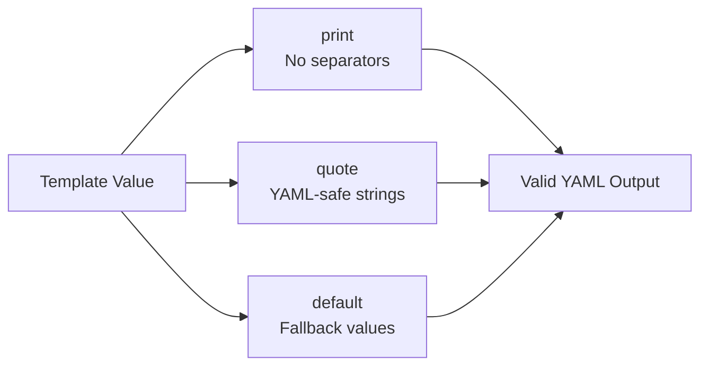

> 💡 **Quick Answer:** \`print\` concatenates values without separators, \`quote\` wraps strings in double quotes for YAML safety, and \`default\` provides fallback values when a variable is empty or undefined. These three Sprig functions handle 90% of Helm string formatting needs.

## The Problem

Helm templates generate YAML, and YAML is whitespace-sensitive and type-sensitive. Common issues include:

- Values with special characters breaking YAML parsing
- Undefined values causing template rendering failures
- Need to format strings without the spaces that \`cat\` inserts



## The Solution

### The \`print\` Function

\`print\` concatenates values **without spaces** (unlike \`cat\` which adds spaces):

```yaml
# cat vs print comparison
{{ cat "hello" "world" }}        # → "hello world" (space between)
{{ print "hello" "world" }}      # → "helloworld"  (no space)

# Build resource names
{{ print .Release.Name "-" .Chart.Name }}
# → "myrelease-mychart"

# Construct image references
image: {{ print .Values.image.registry "/" .Values.image.repository ":" .Values.image.tag }}
# → "registry.example.com/myapp:v1.2.3"
```

#### \`printf\` — Formatted Output

```yaml
# printf uses Go fmt verbs
{{ printf "%s-%s" .Release.Name .Chart.Name }}
# → "myrelease-mychart"

# With numbers
{{ printf "port-%d" .Values.service.port }}
# → "port-8080"

# Padding
{{ printf "%-20s %s" .Values.name .Values.version }}
# → "myapp                v1.2.3"

# Common Kubernetes pattern: generate annotation values
annotations:
  app.kubernetes.io/version: {{ printf "%s+build.%s" .Chart.AppVersion .Values.buildId | quote }}
```

### The \`quote\` Function

\`quote\` wraps a value in double quotes, escaping special characters:

```yaml
# Basic quoting
{{ quote .Values.config.message }}
# Input: Hello "World"
# Output: "Hello \"World\""

# CRITICAL for annotations and labels with special chars
metadata:
  annotations:
    description: {{ .Values.description | quote }}
    # Without quote: description: My app: the best → YAML ERROR (colon)
    # With quote:    description: "My app: the best" → Valid YAML

  labels:
    version: {{ .Values.version | quote }}
    # Without quote: version: 1.0 → parsed as float
    # With quote:    version: "1.0" → kept as string
```

#### When to Quote

| Scenario | Without \`quote\` | With \`quote\` | Need Quote? |
|----------|:---:|:---:|:---:|
| Simple alphanumeric | \`myapp\` | \`"myapp"\` | Optional |
| Contains colon | YAML error | \`"value: here"\` | **Yes** |
| Contains hash | Truncated | \`"value # here"\` | **Yes** |
| Numeric string | Parsed as number | \`"1.0"\` | **Yes** |
| Boolean-like | Parsed as bool | \`"true"\` | **Yes** |
| Empty string | Missing | \`""\` | **Yes** |

```yaml
# Real-world: Prometheus annotations
metadata:
  annotations:
    prometheus.io/scrape: {{ .Values.metrics.enabled | quote }}
    prometheus.io/port: {{ .Values.metrics.port | quote }}
    prometheus.io/path: {{ .Values.metrics.path | quote }}
```

#### \`squote\` — Single Quotes

```yaml
# squote uses single quotes instead of double
{{ squote .Values.password }}
# → 'mysecretpassword'

# Useful for shell commands in containers
command:
  - /bin/sh
  - -c
  - echo {{ squote .Values.message }}
```

### The \`default\` Function

\`default\` returns a fallback value when the input is empty, nil, zero, or false:

```yaml
# Basic usage
{{ default "nginx" .Values.image.repository }}
# If .Values.image.repository is set:   → its value
# If .Values.image.repository is empty:  → "nginx"

# Common Kubernetes patterns
image: {{ default "latest" .Values.image.tag }}
replicas: {{ default 1 .Values.replicas }}
namespace: {{ default .Release.Namespace .Values.namespace }}
```

#### What Triggers \`default\`

| Value | Triggers default? |
|-------|:-:|
| \`""\` (empty string) | ✅ |
| \`nil\` / undefined | ✅ |
| \`0\` (zero) | ✅ |
| \`false\` | ✅ |
| \`[]\` (empty list) | ✅ |
| \`{}\` (empty map) | ✅ |
| \`"anything"\` | ❌ |
| \`1\` or more | ❌ |
| \`true\` | ❌ |

```yaml
# Chain defaults with other functions
metadata:
  labels:
    app: {{ default .Chart.Name .Values.nameOverride | trunc 63 | trimSuffix "-" | quote }}
    version: {{ default .Chart.AppVersion .Values.image.tag | quote }}

# Resource limits with defaults
resources:
  limits:
    cpu: {{ default "500m" .Values.resources.limits.cpu | quote }}
    memory: {{ default "256Mi" .Values.resources.limits.memory | quote }}
  requests:
    cpu: {{ default "200m" .Values.resources.requests.cpu | quote }}
    memory: {{ default "128Mi" .Values.resources.requests.memory | quote }}
```

### Combining All Three

```yaml
# Full deployment label block
metadata:
  name: {{ printf "%s-%s" .Release.Name (default .Chart.Name .Values.nameOverride) }}
  labels:
    app.kubernetes.io/name: {{ default .Chart.Name .Values.nameOverride | quote }}
    app.kubernetes.io/instance: {{ .Release.Name | quote }}
    app.kubernetes.io/version: {{ default .Chart.AppVersion .Values.image.tag | quote }}
    helm.sh/chart: {{ printf "%s-%s" .Chart.Name .Chart.Version | replace "+" "_" | quote }}

# ConfigMap with safe values
data:
  DATABASE_URL: {{ printf "postgresql://%s:%s@%s:%d/%s"
    (default "postgres" .Values.db.user)
    (default "password" .Values.db.password)
    (default "localhost" .Values.db.host)
    (default 5432 .Values.db.port | int)
    (default "mydb" .Values.db.name) | quote }}
```

### Helper Template Pattern

```yaml
{{/* templates/_helpers.tpl */}}

{{/* Generate image reference */}}
{{- define "myapp.image" -}}
{{ print (default "docker.io" .Values.image.registry) "/" .Values.image.repository ":" (default .Chart.AppVersion .Values.image.tag) }}
{{- end }}

{{/* Generate fullname with defaults */}}
{{- define "myapp.fullname" -}}
{{ printf "%s-%s" .Release.Name (default .Chart.Name .Values.fullnameOverride) | trunc 63 | trimSuffix "-" }}
{{- end }}
```

## Common Issues

| Issue | Cause | Fix |
|-------|-------|-----|
| YAML parse error on colons | Unquoted value with \`:\` | Pipe through \`quote\` |
| \`1.0\` becomes float | YAML type inference | Use \`quote\` for version strings |
| \`"true"\` becomes boolean | YAML type inference | Use \`quote\` to preserve string |
| Default not triggering | Value is \`0\` or \`false\` intentionally | Use \`ternary\` or \`if\` instead |
| Spaces in print output | Using \`cat\` instead of \`print\` | Switch to \`print\` for no-space concat |
| Nested quotes broken | Double-escaping | Use \`squote\` for outer, \`quote\` for inner |

## Best Practices

- **Always \`quote\` annotations and labels** — prevents YAML parsing surprises
- **Use \`default\` for every optional value** — makes charts self-documenting
- **Prefer \`printf\` over \`print\`** — format strings are more readable
- **Quote numeric strings** — version numbers, port strings, boolean-like values
- **Chain functions with pipes** — \`{{ .Values.name | default "app" | quote }}\`
- **Test with \`helm template\`** — always verify output before deploying

## Key Takeaways

- \`print\` concatenates without spaces (vs \`cat\` which adds spaces)
- \`printf\` uses Go format verbs (\`%s\`, \`%d\`) for structured string formatting
- \`quote\` wraps in double quotes and escapes — essential for YAML safety
- \`default\` provides fallback for empty/nil/zero/false values
- Combine all three for robust, self-documenting Helm templates
