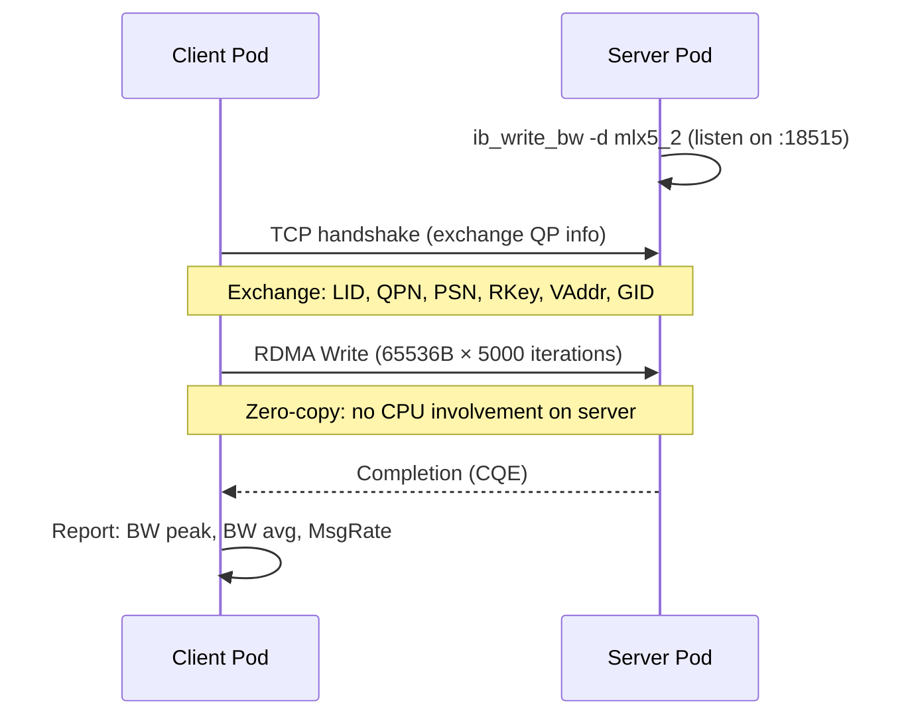

> 💡 **Quick Answer:** `ib_write_bw` is the classic RDMA bandwidth benchmark from the perftest package. Run a server pod (`ib_write_bw`) and client pod (`ib_write_bw <server-ip>`) to measure point-to-point RDMA write throughput. Use `-a` for all message sizes, `-b` for bidirectional, `-D 10` for duration mode, and `--report_gbits` for Gb/s output.

## The Problem

You need a quick, reliable point-to-point RDMA bandwidth measurement between two Kubernetes nodes to:
- Validate NIC-to-NIC throughput (expecting 100/200/400 Gb/s)
- Compare before/after a network change (PFC, MTU, firmware update)
- Verify GPUDirect RDMA with `--mmap` or `--use_hugepages`
- Isolate fabric issues before running NCCL or DOCA perftest
- Measure the impact of multiple QPs, inline size, or rate limiting

While DOCA perftest handles multi-node orchestration, `ib_write_bw` remains the go-to quick diagnostic — it's pre-installed in most RDMA-capable containers and requires zero configuration files.

## The Solution

### Quick Two-Pod Test

```yaml
apiVersion: v1
kind: Pod
metadata:
  name: rdma-server
  namespace: ai-infra
  annotations:
    k8s.v1.cni.cncf.io/networks: rdma-net
spec:
  containers:
    - name: perftest
      image: nvcr.io/nvidia/mellanox/mofed-container:24.07-0.7.0.0
      command:
        - ib_write_bw
        - -d
        - mlx5_2
        - -D
        - "30"
        - --report_gbits
      resources:
        requests:
          openshift.io/mlxrdma: "1"
        limits:
          openshift.io/mlxrdma: "1"
      securityContext:
        capabilities:
          add: ["IPC_LOCK"]
---
apiVersion: v1
kind: Pod
metadata:
  name: rdma-client
  namespace: ai-infra
  annotations:
    k8s.v1.cni.cncf.io/networks: rdma-net
spec:
  containers:
    - name: perftest
      image: nvcr.io/nvidia/mellanox/mofed-container:24.07-0.7.0.0
      command:
        - bash
        - -c
        - |
          # Wait for server to be ready
          sleep 10
          # Get server's RDMA IP
          SERVER_IP=$(getent hosts rdma-server | awk '{print $1}')
          ib_write_bw -d mlx5_2 -D 30 --report_gbits $SERVER_IP
      resources:
        requests:
          openshift.io/mlxrdma: "1"
        limits:
          openshift.io/mlxrdma: "1"
      securityContext:
        capabilities:
          add: ["IPC_LOCK"]
```

### Common Test Scenarios

```bash
# Basic bandwidth (default: 64KB messages, 5000 iterations, RC)
ib_write_bw -d mlx5_0                         # Server
ib_write_bw -d mlx5_0 <server-ip>             # Client

# All message sizes (2B → 8MB) — shows bandwidth curve
ib_write_bw -d mlx5_0 -a --report_gbits       # Server
ib_write_bw -d mlx5_0 -a --report_gbits <ip>  # Client

# Duration mode (10 seconds per size)
ib_write_bw -d mlx5_0 -D 10 --report_gbits
ib_write_bw -d mlx5_0 -D 10 --report_gbits <ip>

# Bidirectional bandwidth
ib_write_bw -d mlx5_0 -b -D 10 --report_gbits
ib_write_bw -d mlx5_0 -b -D 10 --report_gbits <ip>

# Multiple QPs (saturate NIC)
ib_write_bw -d mlx5_0 -q 4 -D 10 --report_gbits
ib_write_bw -d mlx5_0 -q 4 -D 10 --report_gbits <ip>

# RoCE with GID index (Ethernet)
ib_write_bw -d mlx5_0 -x 3 -D 10 --report_gbits
ib_write_bw -d mlx5_0 -x 3 -D 10 --report_gbits <ip>

# Specific message size
ib_write_bw -d mlx5_0 -s 1048576 -D 10 --report_gbits
ib_write_bw -d mlx5_0 -s 1048576 -D 10 --report_gbits <ip>

# HugePages for large transfers
ib_write_bw -d mlx5_0 --use_hugepages -D 10 --report_gbits
ib_write_bw -d mlx5_0 --use_hugepages -D 10 --report_gbits <ip>

# Run infinitely with periodic reports
ib_write_bw -d mlx5_0 --run_infinitely -D 5 --report_gbits
ib_write_bw -d mlx5_0 --run_infinitely -D 5 --report_gbits <ip>

# With CPU utilization reporting
ib_write_bw -d mlx5_0 -D 10 --cpu_util --report_gbits
ib_write_bw -d mlx5_0 -D 10 --cpu_util --report_gbits <ip>
```

### Full CLI Reference

| Flag | Long Option | Description | Default |
|------|-------------|-------------|---------|
| `-a` | `--all` | Test all sizes 2B → 8MB | Single size |
| `-b` | `--bidirectional` | Bidirectional bandwidth | Unidirectional |
| `-c` | `--connection=<type>` | RC, XRC, UC, or DC | RC |
| `-d` | `--ib-dev=<dev>` | RDMA device name | First found |
| `-D` | `--duration=<sec>` | Run for N seconds (per size) | Iteration-based |
| `-i` | `--ib-port=<port>` | IB device port | 1 |
| `-I` | `--inline_size=<bytes>` | Max inline message size | 0 |
| `-l` | `--post_list=<size>` | Post list of WQEs | 1 (single post) |
| `-m` | `--mtu=<mtu>` | MTU: 256-4096 | Port MTU |
| `-n` | `--iters=<n>` | Number of exchanges | 5000 |
| `-N` | `--noPeak` | Disable peak BW calculation | Peak enabled |
| `-O` | `--dualport` | Dual-port mode | Off |
| `-p` | `--port=<port>` | TCP control port | 18515 |
| `-q` | `--qp=<num>` | Number of Queue Pairs | 1 |
| `-Q` | `--cq-mod=<n>` | CQE generation frequency | Every completion |
| `-R` | `--rdma_cm` | Use rdma_cm for connection | IB verbs |
| `-s` | `--size=<bytes>` | Message size | 65536 |
| `-S` | `--sl=<sl>` | Service Level (priority) | 0 |
| `-t` | `--tx-depth=<n>` | TX queue depth | 128 |
| `-T` | `--tos=<value>` | Type of Service (DSCP) | Off |
| `-x` | `--gid-index=<idx>` | GID index (RoCE) | IB: none, ETH: 0 |
| | `--report_gbits` | Report in Gbit/s | MB/s |
| | `--use_hugepages` | Use HugePages | Regular allocation |
| | `--run_infinitely` | Run forever, print per `-D` | Single run |
| | `--cpu_util` | Report CPU utilization | Off (duration only) |
| | `--perform_warm_up` | Warmup before measuring | Off |
| | `--odp` | On Demand Paging | Memory registration |
| | `--reversed` | Server sends to client | Client sends |
| | `--report-both` | Report RX & TX separately | Combined |
| | `--mr_per_qp` | Separate MR per QP | Shared MR |

### Rate Limiting

```bash
# Hardware rate limiting at 50 Gbps
ib_write_bw -d mlx5_0 --rate_limit=50 --rate_limit_type=HW -D 10 --report_gbits
ib_write_bw -d mlx5_0 --rate_limit=50 --rate_limit_type=HW -D 10 --report_gbits <ip>

# Software rate limiting with burst
ib_write_bw -d mlx5_0 --rate_limit=25 --rate_limit_type=SW --burst_size=64 -D 10
ib_write_bw -d mlx5_0 --rate_limit=25 --rate_limit_type=SW --burst_size=64 -D 10 <ip>
```

| Rate Option | Description |
|-------------|-------------|
| `--rate_limit=<rate>` | Max send rate (default unit: Gbps) |
| `--rate_units=<M\|g\|p>` | MBps, Gbps, or packets/sec |
| `--rate_limit_type=<HW\|SW\|PP>` | Hardware, software, or packet-pacing |
| `--burst_size=<n>` | Messages per burst with rate limiter |

### Connection Types

```bash
# Reliable Connection (default — retransmits on loss)
ib_write_bw -d mlx5_0 -c RC <ip>

# Unreliable Connection (no retransmits — tests raw fabric)
ib_write_bw -d mlx5_0 -c UC <ip>

# Extended Reliable Connection (shared QP resources)
ib_write_bw -d mlx5_0 -c XRC <ip>

# Dynamic Connection (scalable, on-demand QP creation)
ib_write_bw -d mlx5_0 -c DC <ip>
```

### Interpreting Results

```
---------------------------------------------------------------------------------------
                    RDMA_Write BW Test
 Dual-port       : OFF          Device         : mlx5_0
 Number of qps   : 1            Transport type : IB
 Connection type  : RC           Using SRQ      : OFF
 PCIe relaxed order enabled
 ibv_wr* API used
 TX depth         : 128
 CQ Moderation    : 128
 Mtu              : 4096[B]
 Link type        : Ethernet
 GID index        : 3
 Max inline data  : 0[B]
 rdma_cm QPs      : OFF
 Data ex. method  : Ethernet
---------------------------------------------------------------------------------------
 local address: LID 0000 QPN 0x0107 PSN 0x3bc140 RKey 0x080528 VAddr 0x7f5a98200000
 GID: 00:00:00:00:00:00:00:00:00:00:255:255:10:56:01:05
 remote address: LID 0000 QPN 0x0107 PSN 0xd7a5c0 RKey 0x080528 VAddr 0x7f1b58200000
 GID: 00:00:00:00:00:00:00:00:00:00:255:255:10:56:02:05
---------------------------------------------------------------------------------------
 #bytes     #iterations    BW peak[Gb/sec]    BW average[Gb/sec]   MsgRate[Mpps]
 65536      5000           196.42             195.87               0.373512
---------------------------------------------------------------------------------------
```

| Field | What to Check |
|-------|---------------|
| BW peak | Should be close to line rate (200/400 Gb/s) |
| BW average | Should be >95% of peak for healthy fabric |
| MsgRate | Messages per second — important for small payloads |
| Link type | Ethernet (RoCE) or InfiniBand |
| GID | Verify correct RDMA interface IP |
| Mtu | Should be 4096 for maximum throughput |

### Kubernetes Benchmark Job (All Sizes)

```yaml
apiVersion: batch/v1
kind: Job
metadata:
  name: ib-write-bw-all
  namespace: ai-infra
spec:
  parallelism: 2
  completions: 2
  completionMode: Indexed
  template:
    metadata:
      annotations:
        k8s.v1.cni.cncf.io/networks: rdma-net
    spec:
      restartPolicy: Never
      subdomain: perftest-svc
      setHostnameAsFQDN: true
      containers:
        - name: perftest
          image: nvcr.io/nvidia/mellanox/mofed-container:24.07-0.7.0.0
          command:
            - bash
            - -c
            - |
              if [ "$JOB_COMPLETION_INDEX" = "0" ]; then
                echo "Starting server..."
                ib_write_bw -d mlx5_2 -a -D 10 --report_gbits --perform_warm_up
              else
                echo "Waiting for server..."
                while ! getent hosts ib-write-bw-all-0.perftest-svc; do sleep 2; done
                sleep 5
                SERVER=$(getent hosts ib-write-bw-all-0.perftest-svc | awk '{print $1}')
                echo "Connecting to $SERVER"
                ib_write_bw -d mlx5_2 -a -D 10 --report_gbits --perform_warm_up $SERVER
              fi
          resources:
            requests:
              openshift.io/mlxrdma: "1"
            limits:
              openshift.io/mlxrdma: "1"
          securityContext:
            capabilities:
              add: ["IPC_LOCK"]
---
apiVersion: v1
kind: Service
metadata:
  name: perftest-svc
  namespace: ai-infra
spec:
  clusterIP: None
  selector:
    job-name: ib-write-bw-all
  ports:
    - port: 18515
      name: perftest
```



## Common Issues

**`Unable to init the socket connection`**

Server isn't listening yet. Add a sleep or retry loop on the client:
```bash
while ! nc -z $SERVER_IP 18515; do sleep 1; done
```

**Low bandwidth with RoCE**

Check GID index — wrong GID maps to wrong interface:
```bash
# List GID table
ibv_devinfo -d mlx5_0 -v | grep GID
# Use the index matching your RDMA network
ib_write_bw -d mlx5_0 -x 3 <ip>
```

Also verify PFC is enabled: `mlnx_qos -i eth0 | grep -A2 "PFC"`

**BW average much lower than peak**

Possible causes:
- Congestion (check PFC counters: `ethtool -S mlx5_0 | grep prio3_pause`)
- MTU mismatch (use `-m 4096`)
- Single QP can't saturate the link — try `-q 4`

**`Couldn't allocate MR` error**

memlock ulimit too low for RDMA memory registration:
```bash
ulimit -l  # Should be "unlimited"
# Fix: CRI-O 99-ulimits.conf with memlock=-1:-1
```

**Inconsistent results between runs**

Use `--perform_warm_up` to eliminate cold-cache effects. Use `-D 10` (duration mode) instead of iteration-based for more stable measurements.

**`cpufreq_ondemand` warning**

CPU frequency scaling causes variable results. Suppress with `-F` or fix properly:
```bash
# Set CPU governor to performance
cpupower frequency-set -g performance
```

## Best Practices

- Always use `--report_gbits` for network engineers (default MB/s is confusing)
- Use `-D 10` (duration mode) for stable measurements — iteration mode can finish too fast
- Use `-a` (all sizes) for the first test to see the full bandwidth curve
- Use `--perform_warm_up` to eliminate cold-start variance
- Match MTU on both sides: `-m 4096` for maximum throughput
- Use `-x 3` for RoCE (GID index 3 = RoCEv2 with IPv4)
- Use `-q 4` or more QPs to saturate high-speed links (200G+)
- Set Service Level (`-S`) to match your PFC priority (e.g., `-S 3` for priority 3)
- Server and client must use the same flags (size, connection type, QPs)
- Compare against DOCA perftest for production benchmarking — `ib_write_bw` is for quick diagnostics
- Use `--run_infinitely -D 5` for continuous monitoring during maintenance windows

## Key Takeaways

- `ib_write_bw` is the standard quick RDMA bandwidth diagnostic — pre-installed in most RDMA containers
- Server/client model: server listens on TCP 18515, exchanges QP info, then RDMA writes bypass TCP entirely
- RDMA write = zero-copy, zero-CPU on the server side — only the client drives the operation
- `-a` shows the full bandwidth curve: small messages test message rate, large messages test throughput
- For RoCE, always specify `-x <gid-index>` — wrong GID = wrong interface = zero bandwidth
- Multiple QPs (`-q 4+`) needed to saturate 200G+ links from a single process
- Rate limiting (`--rate_limit`) tests behavior under throttled conditions (QoS validation)
- Connection types: RC (reliable, production), UC (unreliable, raw fabric test), DC (scalable)
- Use alongside `ib_read_bw`, `ib_send_bw`, `ib_write_lat`, `ib_read_lat` for complete RDMA profiling
- For multi-node, orchestrated benchmarking → migrate to DOCA perftest
