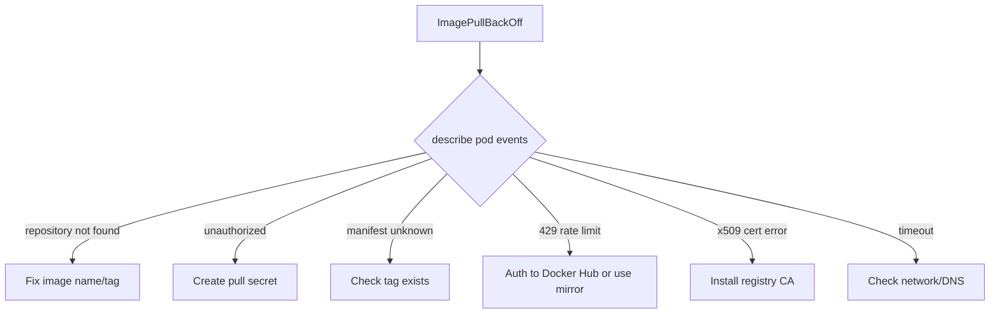

> 💡 **Quick Answer:** ImagePullBackOff means Kubernetes can't pull your container image. Check `kubectl describe pod` events for the exact error: wrong image name/tag, missing pull secret, private registry auth failure, or Docker Hub rate limit. Fix: correct the image reference, create/attach the pull secret, or use an internal registry mirror.

## The Problem

```bash
$ kubectl get pods
NAME                    READY   STATUS             RESTARTS   AGE
myapp-7b9f5c6d4-x2k8j  0/1     ImagePullBackOff   0          2m
```

## The Solution

### Step 1: Get the Exact Error

```bash
kubectl describe pod myapp-7b9f5c6d4-x2k8j | grep -A10 Events
```

### Fix by Error Type

**"repository does not exist" — wrong image name:**
```yaml
# Wrong
image: myapp:latest
# Right — include registry and namespace
image: docker.io/myorg/myapp:latest
```

**"unauthorized" — missing pull secret:**
```bash
# Create the secret
kubectl create secret docker-registry my-registry \
  --docker-server=registry.example.com \
  --docker-username=myuser \
  --docker-password=mypass \
  -n my-namespace

# Attach to pod spec
```

```yaml
spec:
  imagePullSecrets:
    - name: my-registry
  containers:
    - name: myapp
      image: registry.example.com/myorg/myapp:v1.2.3
```

**"manifest unknown" — tag doesn't exist:**
```bash
# List available tags
skopeo list-tags docker://registry.example.com/myorg/myapp
# Or check with crane
crane ls registry.example.com/myorg/myapp
```

**"429 Too Many Requests" — Docker Hub rate limit:**
```bash
# Check remaining pulls
curl -s "https://auth.docker.io/token?service=registry.docker.io&scope=repository:library/nginx:pull" \
  | jq -r .token | xargs -I {} \
  curl -sI -H "Authorization: Bearer {}" \
  https://registry-1.docker.io/v2/library/nginx/manifests/latest \
  | grep ratelimit
```

Fix: authenticate to Docker Hub or use a registry mirror.

**"x509: certificate signed by unknown authority" — custom CA:**

See the [Custom CA Registry](/recipes/security/custom-ca-openshift-kubernetes/) recipe.



## Common Issues

### Pull works locally but not in cluster
Your local machine has Docker Hub credentials cached. Kubernetes nodes don't. Create a pull secret.

### ErrImagePull vs ImagePullBackOff
`ErrImagePull` is the first failure. `ImagePullBackOff` is Kubernetes backing off on retries (increasing delay). Same root cause.

### OpenShift: "unable to retrieve auth token"
The global pull secret may be missing your registry. Update it:
```bash
oc set data secret/pull-secret -n openshift-config \
  --from-file=.dockerconfigjson=merged-pull-secret.json
```

## Best Practices

- **Always use specific tags** (`v1.2.3`) not `latest` — prevents "manifest unknown" after tag moves
- **Use `imagePullPolicy: IfNotPresent`** for tagged images to avoid unnecessary pulls
- **Set up a registry mirror** for Docker Hub to avoid rate limits
- **Pre-pull critical images** to nodes using a DaemonSet if you expect cold-start issues

## Key Takeaways

- `kubectl describe pod` events tell you exactly why the pull failed
- Most common causes: wrong name/tag, missing auth, rate limits, custom CA
- Pull secrets must be in the same namespace as the pod
- Use registry mirrors for air-gapped or rate-limited environments
