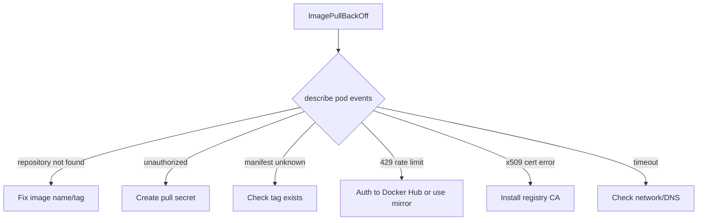

> 💡 **Quick Answer:** ImagePullBackOff means Kubernetes can't pull your container image. Check `kubectl describe pod` events for the exact error: wrong image name/tag, missing pull secret, private registry auth failure, or Docker Hub rate limit. Fix: correct the image reference, create/attach the pull secret, or use an internal registry mirror.

## The Problem

```bash
$ kubectl get pods
NAME                    READY   STATUS             RESTARTS   AGE
myapp-7b9f5c6d4-x2k8j  0/1     ImagePullBackOff   0          2m
myapp-7b9f5c6d4-k9p2m  0/1     ErrImagePull       0          10s
```

Events show `Failed to pull image ... failed to pull and unpack image`, then `Back-off pulling image "..."`.

## The Solution

### Step 1: Get the Exact Error

```bash
kubectl describe pod myapp-7b9f5c6d4-x2k8j | grep -A10 Events

# What image and secrets is the pod actually using?
kubectl get pod myapp-7b9f5c6d4-x2k8j -o jsonpath='{.spec.containers[*].image}{"\n"}{.spec.imagePullSecrets}{"\n"}'
```

| Event message | Cause |
|---|---|
| `manifest unknown` / `not found` | Tag doesn't exist (typo, `v2` vs `2.0`) |
| `repository does not exist` / `pull access denied` | Wrong repo path, or private repo without credentials |
| `unauthorized` / `authentication required` | Missing/wrong pull secret |
| `FailedToRetrieveImagePullSecret` | Referenced secret doesn't exist in the pod's namespace |
| `toomanyrequests` / `429` | Docker Hub rate limit |
| `x509: certificate signed by unknown authority` | Registry CA not trusted by containerd/CRI-O |
| `no such host` / `i/o timeout` | Node DNS, firewall or proxy |
| `ErrImageNeverPull` | `imagePullPolicy: Never` and image not on the node |

### Fix by Error Type

**"repository does not exist" — wrong image name:**
```yaml
# Wrong
image: myapp:latest
# Right — include registry and namespace
image: docker.io/myorg/myapp:latest
```

**"unauthorized" — missing pull secret:**
```bash
# Create the secret
kubectl create secret docker-registry my-registry \
  --docker-server=registry.example.com \
  --docker-username=myuser \
  --docker-password=mypass \
  -n my-namespace

# Attach to the Deployment
kubectl patch deployment myapp -n my-namespace \
  -p '{"spec":{"template":{"spec":{"imagePullSecrets":[{"name":"my-registry"}]}}}}'

# Or to the ServiceAccount (all pods using it inherit the secret)
kubectl patch serviceaccount default -n my-namespace \
  -p '{"imagePullSecrets":[{"name":"my-registry"}]}'
```

```yaml
spec:
  imagePullSecrets:
    - name: my-registry
  containers:
    - name: myapp
      image: registry.example.com/myorg/myapp:v1.2.3
```

**"manifest unknown" — tag doesn't exist:**
```bash
# List available tags
skopeo list-tags docker://registry.example.com/myorg/myapp
# Or check with crane
crane ls registry.example.com/myorg/myapp
```

**"429 Too Many Requests" — Docker Hub rate limit:**
```bash
# Check remaining pulls
curl -s "https://auth.docker.io/token?service=registry.docker.io&scope=repository:library/nginx:pull" \
  | jq -r .token | xargs -I {} \
  curl -sI -H "Authorization: Bearer {}" \
  https://registry-1.docker.io/v2/library/nginx/manifests/latest \
  | grep ratelimit
```

Since April 2025 Docker Hub allows 10 pulls/hour per IP for unauthenticated users and 100 pulls/hour for authenticated personal accounts — a whole cluster behind one NAT IP hits the anonymous limit fast. Fix: authenticate with a Docker Hub pull secret (`--docker-server=https://index.docker.io/v1/`) or use a pull-through registry mirror.

**"x509: certificate signed by unknown authority" — custom CA:**

Trust the CA in containerd per registry:

```toml
# /etc/containerd/certs.d/registry.example.com/hosts.toml
server = "https://registry.example.com"
[host."https://registry.example.com"]
  ca = "/etc/containerd/certs.d/registry.example.com/ca.crt"
```

See [containerd certs.d CA trust](/recipes/configuration/containerd-certs-d-registry-ca-trust/) and [custom CA in Kubernetes](/recipes/security/custom-ca-kubernetes/). On OpenShift, add the CA to `image.config.openshift.io/cluster` via `additionalTrustedCA`.

**"dial tcp: lookup ... no such host" — DNS resolution failure:**
```bash
# Test from a node and from a pod
nslookup registry.example.com
kubectl run dns-test --rm -it --image=busybox -- nslookup registry.example.com
```

**"dial tcp ...: connect: connection refused/timeout" — network path blocked:**
```bash
# Test connectivity from a node directly
kubectl debug node/worker-1 -it --image=busybox:1.36 -- wget -qO- https://registry.example.com/v2/
# or SSH to the node:
curl -v https://registry.example.com/v2/
# If a proxy is required, set HTTP_PROXY/HTTPS_PROXY in the containerd config
```

**Only failing on some nodes:**

Pull secrets and per-node containerd CA trust are per-node state — a secret created after some nodes already cached credentials, or a CA cert only copied to some nodes, produces exactly this pattern. Check `/etc/containerd/certs.d/<registry>/` matches across every node.

### Verify a Pull Secret Actually Works

```bash
# Test the pull manually from a node using the same credentials
crictl pull --creds "user:pass" registry.example.com/app:v1

# Decode the secret to confirm its contents are what you expect
kubectl get secret my-registry -n my-namespace -o jsonpath='{.data.\.dockerconfigjson}' | base64 -d | jq .
```

### Force a Re-Pull

```bash
# Delete the pod to reset the exponential backoff timer immediately
kubectl delete pod myapp-7b9f5c6d4-x2k8j

# Or force every restart to re-pull instead of using a cached image
spec:
  containers:
    - name: myapp
      imagePullPolicy: Always
```


```mermaid
graph TD
    A[ImagePullBackOff] --> B{describe pod events}
    B -->|repository not found| C[Fix image name/tag]
    B -->|unauthorized| D[Create pull secret]
    B -->|manifest unknown| E[Check tag exists]
    B -->|429 rate limit| F[Auth to Docker Hub or use mirror]
    B -->|x509 cert error| G[Install registry CA]
    B -->|timeout| H[Check network/DNS]
```

## Common Issues

### Pull works locally but not in cluster
Your local machine has Docker Hub credentials cached. Kubernetes nodes don't. Create a pull secret.

### Default imagePullPolicy surprises
If `imagePullPolicy` is omitted: `:latest` or no tag → `Always`; any other tag or a digest → `IfNotPresent`. A moved tag won't be re-pulled on nodes that cached it.

### OpenShift: "unable to retrieve auth token"
The global pull secret may be missing your registry. Update it:
```bash
oc set data secret/pull-secret -n openshift-config \
  --from-file=.dockerconfigjson=merged-pull-secret.json
```

## Frequently Asked Questions

### What is the difference between ErrImagePull and ImagePullBackOff?
`ErrImagePull` is the status right after a pull fails. After repeated failures the kubelet switches to `ImagePullBackOff` and waits longer between attempts. Same root cause — read the pod events.

### What does "Back-off pulling image" mean?
It's the event the kubelet emits while in `ImagePullBackOff`: it will retry the pull with exponential backoff (10s, 20s, 40s ... capped at 5 minutes) indefinitely until the image can be pulled.

### How do I fix "failed to pull and unpack image"?
It's the containerd wrapper around the real error — read the rest of the message: `not found` means a bad tag, `unauthorized` a missing pull secret, `x509` an untrusted CA, `unknown blob` a broken/partially pushed image in the registry.

### Do image pull secrets work across namespaces?
No. The secret must exist in the same namespace as the pod. Copy it to each namespace or attach it via each namespace's ServiceAccount. On OpenShift, add the registry to the global pull secret in `openshift-config`.

## Best Practices

- **Always use specific tags** (`v1.2.3`) or digests (`@sha256:...`) in production, not `latest`
- **Attach pull secrets to the ServiceAccount** so every pod in the namespace inherits them
- **Use `imagePullPolicy: IfNotPresent`** for tagged images to avoid unnecessary pulls
- **Set up a registry mirror** for Docker Hub to avoid rate limits
- **Pre-pull critical images** to nodes using a DaemonSet if you expect cold-start issues

## Key Takeaways

- `kubectl describe pod` events tell you exactly why the pull failed
- Most common causes: wrong name/tag, missing auth, rate limits, custom CA
- Pull secrets must be in the same namespace as the pod
- Use registry mirrors for air-gapped or rate-limited environments
