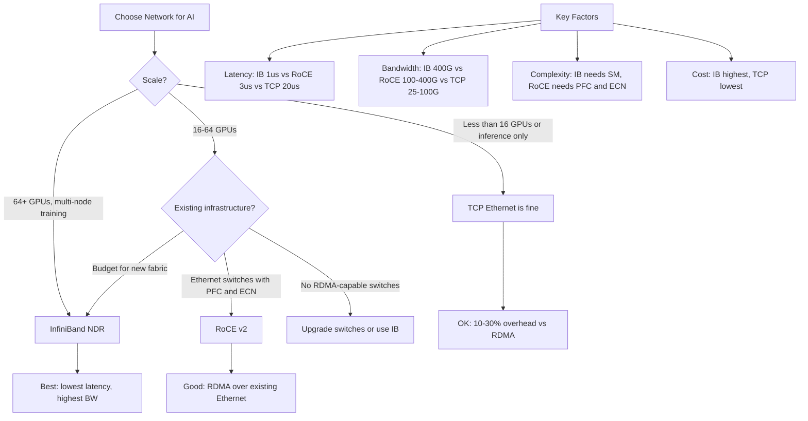

> 💡 **Quick Answer:** InfiniBand delivers 1-2μs latency and 400+ Gb/s RDMA with zero CPU overhead — ideal for multi-node distributed training. RoCE (RDMA over Converged Ethernet) provides RDMA over Ethernet infrastructure but requires PFC/ECN configuration. Pure Ethernet (TCP/IP) adds 10-30% training overhead vs RDMA.

## The Problem

Multi-node GPU training requires all-reduce operations across nodes, where gradient synchronization speed directly impacts training throughput. Network choice — InfiniBand, RoCE Ethernet, or standard TCP Ethernet — can mean a 30% performance difference. Choosing wrong wastes GPU hours and money.

## The Solution

Understand the tradeoffs between InfiniBand, RoCE, and TCP Ethernet for NCCL communication in AI workloads. Each has different requirements for Kubernetes configuration, switch infrastructure, and driver setup.

### Network Technology Comparison

```yaml
InfiniBand_NDR:
  speed: "400 Gb/s per port"
  latency: "0.5-1 μs"
  rdma: "Native RDMA (zero-copy, kernel bypass)"
  cpu_overhead: "Near zero"
  requires:
    - "InfiniBand switches (Quantum-2)"
    - "ConnectX-7 HCAs (or newer)"
    - "MOFED/DOCA drivers"
    - "Subnet Manager (OpenSM or UFM)"
  cost: "High (dedicated IB fabric)"
  best_for: "Large-scale training (64+ GPUs)"
  nccl_env:
    NCCL_IB_DISABLE: "0"
    NCCL_IB_HCA: "mlx5"
    NCCL_NET_GDR_LEVEL: "5"    # GPU Direct RDMA

RoCE_v2:
  speed: "100-400 Gb/s per port"
  latency: "2-5 μs"
  rdma: "RDMA over Ethernet (needs PFC/ECN)"
  cpu_overhead: "Near zero (with proper config)"
  requires:
    - "Ethernet switches with PFC and ECN support"
    - "ConnectX-6/7 NICs"
    - "MOFED/DOCA drivers"
    - "DCB (Data Center Bridging) configuration"
    - "Lossless Ethernet fabric"
  cost: "Medium (enterprise Ethernet switches)"
  best_for: "Converged infrastructure, mid-scale training"
  nccl_env:
    NCCL_IB_DISABLE: "0"
    NCCL_IB_HCA: "mlx5"
    NCCL_IB_GID_INDEX: "3"
    NCCL_NET_GDR_LEVEL: "5"

TCP_Ethernet:
  speed: "25-100 Gb/s per port"
  latency: "10-50 μs"
  rdma: "None (kernel TCP/IP stack)"
  cpu_overhead: "Significant (kernel copies)"
  requires:
    - "Standard Ethernet switches"
    - "Any NIC"
    - "No special drivers"
  cost: "Low (standard infrastructure)"
  best_for: "Inference, small-scale training (<16 GPUs)"
  nccl_env:
    NCCL_IB_DISABLE: "1"
    NCCL_SOCKET_IFNAME: "eth0"
```

### NCCL Configuration for InfiniBand

```yaml
apiVersion: apps/v1
kind: Deployment
metadata:
  name: training-infiniband
  namespace: ai-training
spec:
  template:
    metadata:
      annotations:
        k8s.v1.cni.cncf.io/networks: ib-sriov-net
    spec:
      containers:
        - name: trainer
          image: nvcr.io/nvidia/pytorch:24.03-py3
          env:
            # InfiniBand NCCL settings
            - name: NCCL_IB_DISABLE
              value: "0"
            - name: NCCL_IB_HCA
              value: "mlx5_0,mlx5_1,mlx5_2,mlx5_3"
            - name: NCCL_IB_GID_INDEX
              value: "3"
            - name: NCCL_NET_GDR_LEVEL
              value: "5"          # GPU Direct RDMA
            - name: NCCL_IB_QPS_PER_CONNECTION
              value: "4"
            - name: NCCL_IB_TC
              value: "136"        # Traffic class for DSCP
            - name: NCCL_ALGO
              value: "Ring,Tree"
            - name: NCCL_DEBUG
              value: "INFO"
          resources:
            limits:
              nvidia.com/gpu: 8
              rdma/rdma_shared_device_a: 1
```

### NCCL Configuration for RoCE

```yaml
apiVersion: apps/v1
kind: Deployment
metadata:
  name: training-roce
  namespace: ai-training
spec:
  template:
    metadata:
      annotations:
        k8s.v1.cni.cncf.io/networks: roce-sriov-net
    spec:
      containers:
        - name: trainer
          image: nvcr.io/nvidia/pytorch:24.03-py3
          env:
            # RoCE NCCL settings
            - name: NCCL_IB_DISABLE
              value: "0"
            - name: NCCL_IB_HCA
              value: "mlx5_0"
            - name: NCCL_IB_GID_INDEX
              value: "3"          # RoCEv2 GID
            - name: NCCL_NET_GDR_LEVEL
              value: "5"
            - name: NCCL_IB_ROCE_VERSION_NUM
              value: "2"
            # RoCE-specific tuning
            - name: NCCL_IB_SL
              value: "0"
            - name: NCCL_IB_TC
              value: "136"
            - name: NCCL_IB_TIMEOUT
              value: "22"
            - name: NCCL_IB_RETRY_CNT
              value: "13"
            # PFC must be configured on switches
          resources:
            limits:
              nvidia.com/gpu: 8
              rdma/rdma_shared_device_a: 1
```

### NCCL Configuration for TCP Ethernet

```yaml
apiVersion: apps/v1
kind: Deployment
metadata:
  name: training-tcp
  namespace: ai-training
spec:
  template:
    spec:
      containers:
        - name: trainer
          image: nvcr.io/nvidia/pytorch:24.03-py3
          env:
            # TCP fallback (no RDMA)
            - name: NCCL_IB_DISABLE
              value: "1"
            - name: NCCL_SOCKET_IFNAME
              value: "eth0"
            - name: NCCL_SOCKET_NTHREADS
              value: "4"
            - name: NCCL_NSOCKS_PERTHREAD
              value: "8"
            # TCP tuning
            - name: NCCL_BUFFSIZE
              value: "8388608"    # 8MB buffer
            - name: NCCL_P2P_LEVEL
              value: "NVL"        # NVLink within node
          resources:
            limits:
              nvidia.com/gpu: 8
```

### Switch Configuration Reference

```yaml
# InfiniBand switch (Quantum-2):
InfiniBand:
  subnet_manager: "UFM or OpenSM"
  partitioning: "Optional P_Key isolation"
  adaptive_routing: "Enabled for large fabrics"
  port_config: "Auto-negotiate NDR (400 Gb/s)"

# Ethernet switch for RoCE:
RoCE_Switch:
  pfc:
    enabled: true
    priority: 3              # Priority for RoCE traffic
    # Without PFC, RoCE drops packets and stalls training
  ecn:
    enabled: true
    threshold: 150000        # ECN marking threshold (bytes)
  dcbx:
    mode: "ieee"
    willing: false
  mtu: 9216                  # Jumbo frames
  # Example (Cumulus/SONIC):
  # nv set qos roce mode lossless
  # nv set interface swp1-48 link mtu 9216

# Standard Ethernet (TCP):
TCP_Switch:
  mtu: 9000                  # Jumbo frames recommended
  # No PFC/ECN needed
  # Standard L2/L3 switching
```

### Performance Benchmarking

```bash
# NCCL all-reduce benchmark
kubectl exec -it training-pod -- \
  /usr/local/bin/all_reduce_perf \
  -b 8 -e 2G -f 2 -g 8

# Expected results (8x A100/H100, message size 1GB):
# InfiniBand NDR:  ~380 Gb/s busbw, ~1.0 ms latency
# RoCE 100G:       ~90 Gb/s busbw,  ~2.5 ms latency
# TCP 100G:        ~60 Gb/s busbw,  ~15 ms latency

# ib_write_bw for raw RDMA bandwidth
kubectl exec -it training-pod -- \
  ib_write_bw --size=65536 --duration=10

# Check RDMA devices
kubectl exec -it training-pod -- ibstat
kubectl exec -it training-pod -- rdma link show

# Verify GPU Direct RDMA
kubectl exec -it training-pod -- \
  nvidia-smi topo -m
# Look for "NV#" (NVLink) and "SYS" connections
```

### Decision Matrix



## Common Issues

- **RoCE PFC storms** — misconfigured PFC causes network-wide pause frames; verify ECN is enabled alongside PFC
- **NCCL falls back to TCP despite IB available** — check `NCCL_IB_DISABLE=0`; verify `ibstat` shows Active ports; check RDMA device plugin
- **GPU Direct RDMA not working** — requires `NCCL_NET_GDR_LEVEL=5` and `nvidia-peermem` kernel module loaded
- **InfiniBand subnet manager missing** — IB fabric needs exactly one SM; deploy OpenSM or use NVIDIA UFM
- **RoCE performance worse than expected** — verify PFC is not dropping frames (`ethtool -S | grep pause`); check ECN marks

## Best Practices

- InfiniBand for large-scale training (64+ GPUs) — lowest latency, highest bandwidth
- RoCE v2 for converged infrastructure — RDMA over existing Ethernet with proper PFC/ECN
- TCP Ethernet is acceptable for inference and small training jobs (<16 GPUs)
- Always enable GPU Direct RDMA (`NCCL_NET_GDR_LEVEL=5`) with IB or RoCE
- Use jumbo frames (MTU 9000+) for all AI network interfaces
- Run `all_reduce_perf` benchmarks before production training to validate network
- Monitor NCCL debug logs during initial runs to verify transport selection
- Use multiple HCAs (`NCCL_IB_HCA=mlx5_0,mlx5_1,...`) for multi-rail bandwidth

## Key Takeaways

- InfiniBand: 400 Gb/s, <1μs latency, native RDMA — best for large-scale training
- RoCE v2: RDMA over Ethernet, needs PFC/ECN on switches — good for converged networks
- TCP Ethernet: 10-30% slower than RDMA — acceptable for inference and small training
- GPU Direct RDMA bypasses CPU for GPU-to-GPU transfers across nodes
- NCCL auto-selects transport but needs correct environment variables
- Network choice has diminishing returns for inference (compute-bound) vs training (communication-bound)
- Cost-performance sweet spot depends on scale: TCP for <16 GPUs, RDMA for 16+
