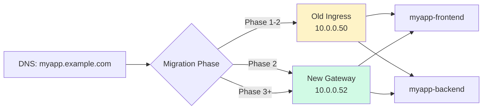

> 💡 **Quick Answer:** Install `ingress2gateway` (`go install github.com/kubernetes-sigs/ingress2gateway@latest`), run `ingress2gateway print --all-resources` to generate Gateway API equivalents of your Ingress resources, review the output, then apply alongside existing Ingress for zero-downtime parallel migration.

## The Problem

Kubernetes Ingress API is frozen — no new features since v1. Gateway API is the successor with support for HTTP header routing, traffic splitting, request mirroring, and multi-tenancy. You have dozens of Ingress resources and need to migrate without downtime and without manually rewriting every YAML.

## The Solution

### Step 1: Install ingress2gateway

```bash
# Install the CLI tool
go install github.com/kubernetes-sigs/ingress2gateway@latest

# Or download the binary
curl -Lo ingress2gateway https://github.com/kubernetes-sigs/ingress2gateway/releases/latest/download/ingress2gateway-linux-amd64
chmod +x ingress2gateway
sudo mv ingress2gateway /usr/local/bin/
```

### Step 2: Install Gateway API CRDs

```bash
# Install the standard Gateway API CRDs
kubectl apply -f https://github.com/kubernetes-sigs/gateway-api/releases/download/v1.2.0/standard-install.yaml

# Verify
kubectl get crd | grep gateway
# gatewayclasses.gateway.networking.k8s.io
# gateways.gateway.networking.k8s.io
# httproutes.gateway.networking.k8s.io
# referencegrants.gateway.networking.k8s.io
```

### Step 3: Review Your Current Ingress Resources

```bash
# List all Ingress resources
kubectl get ingress -A
# NAMESPACE   NAME            CLASS   HOSTS              ADDRESS        PORTS
# production  myapp-ingress   nginx   myapp.example.com  10.0.0.50      80, 443
# production  api-ingress     nginx   api.example.com    10.0.0.50      80, 443
# staging     staging-ingress nginx   staging.example.com 10.0.0.51     80

# Export for reference
kubectl get ingress -A -o yaml > /tmp/all-ingress-backup.yaml
```

### Step 4: Generate Gateway API Resources

```bash
# Convert ALL Ingress resources in the cluster
ingress2gateway print --all-resources

# Convert specific namespace
ingress2gateway print --namespace production

# Convert specific Ingress controller type
ingress2gateway print --providers=ingress-nginx --all-resources

# Save to file for review
ingress2gateway print --all-resources > gateway-resources.yaml
```

### Example: Before and After

**Before — Ingress:**

```yaml
apiVersion: networking.k8s.io/v1
kind: Ingress
metadata:
  name: myapp-ingress
  namespace: production
  annotations:
    nginx.ingress.kubernetes.io/rewrite-target: /
    nginx.ingress.kubernetes.io/ssl-redirect: "true"
    nginx.ingress.kubernetes.io/proxy-body-size: "50m"
    nginx.ingress.kubernetes.io/rate-limit-connections: "10"
    cert-manager.io/cluster-issuer: letsencrypt-prod
spec:
  ingressClassName: nginx
  tls:
    - hosts:
        - myapp.example.com
      secretName: myapp-tls
  rules:
    - host: myapp.example.com
      http:
        paths:
          - path: /
            pathType: Prefix
            backend:
              service:
                name: myapp-frontend
                port:
                  number: 80
          - path: /api
            pathType: Prefix
            backend:
              service:
                name: myapp-backend
                port:
                  number: 8080
          - path: /static
            pathType: Prefix
            backend:
              service:
                name: myapp-cdn
                port:
                  number: 80
```

**After — Gateway API (generated by ingress2gateway):**

```yaml
# Gateway — shared infrastructure (one per cluster or team)
apiVersion: gateway.networking.k8s.io/v1
kind: Gateway
metadata:
  name: production-gateway
  namespace: production
spec:
  gatewayClassName: nginx  # or istio, envoy-gateway, etc.
  listeners:
    - name: http
      protocol: HTTP
      port: 80
      hostname: "*.example.com"
      allowedRoutes:
        namespaces:
          from: Same
    - name: https
      protocol: HTTPS
      port: 443
      hostname: "*.example.com"
      tls:
        mode: Terminate
        certificateRefs:
          - name: myapp-tls
      allowedRoutes:
        namespaces:
          from: Same
---
# HTTPRoute — per-application routing (replaces Ingress rules)
apiVersion: gateway.networking.k8s.io/v1
kind: HTTPRoute
metadata:
  name: myapp-route
  namespace: production
spec:
  parentRefs:
    - name: production-gateway
      namespace: production
  hostnames:
    - myapp.example.com
  rules:
    # Static content — most specific first
    - matches:
        - path:
            type: PathPrefix
            value: /static
      backendRefs:
        - name: myapp-cdn
          port: 80
    # API backend
    - matches:
        - path:
            type: PathPrefix
            value: /api
      backendRefs:
        - name: myapp-backend
          port: 8080
    # Frontend catch-all
    - matches:
        - path:
            type: PathPrefix
            value: /
      backendRefs:
        - name: myapp-frontend
          port: 80
```

### Step 5: Handle Provider-Specific Annotations

`ingress2gateway` converts standard Ingress fields automatically. Provider-specific annotations need manual handling:

```bash
# See which annotations weren't converted
ingress2gateway print --all-resources 2>&1 | grep -i "warning\|skipped\|unsupported"
```

**Common annotation mappings:**

| Ingress Annotation | Gateway API Equivalent |
|---|---|
| `nginx.ingress.kubernetes.io/rewrite-target` | HTTPRoute `URLRewrite` filter |
| `nginx.ingress.kubernetes.io/ssl-redirect` | HTTPRoute `RequestRedirect` filter |
| `nginx.ingress.kubernetes.io/proxy-body-size` | Implementation-specific Policy |
| `nginx.ingress.kubernetes.io/rate-limit` | Implementation-specific Policy |
| `cert-manager.io/cluster-issuer` | Gateway TLS `certificateRefs` + cert-manager Gateway integration |

**URL Rewrite (manual):**

```yaml
apiVersion: gateway.networking.k8s.io/v1
kind: HTTPRoute
metadata:
  name: api-rewrite
  namespace: production
spec:
  parentRefs:
    - name: production-gateway
  hostnames:
    - api.example.com
  rules:
    - matches:
        - path:
            type: PathPrefix
            value: /v1
      filters:
        - type: URLRewrite
          urlRewrite:
            path:
              type: ReplacePrefixMatch
              replacePrefixMatch: /api/v1
      backendRefs:
        - name: api-service
          port: 8080
```

**HTTP to HTTPS Redirect:**

```yaml
apiVersion: gateway.networking.k8s.io/v1
kind: HTTPRoute
metadata:
  name: https-redirect
  namespace: production
spec:
  parentRefs:
    - name: production-gateway
      sectionName: http           # Attach to HTTP listener only
  hostnames:
    - myapp.example.com
  rules:
    - filters:
        - type: RequestRedirect
          requestRedirect:
            scheme: https
            statusCode: 301
```

### Step 6: Zero-Downtime Parallel Migration

Run both Ingress and Gateway API simultaneously during migration:

```bash
# Phase 1: Deploy Gateway resources alongside existing Ingress
kubectl apply -f gateway-resources.yaml

# Verify Gateway is programmed
kubectl get gateway production-gateway -n production
# NAME                  CLASS   ADDRESS      PROGRAMMED
# production-gateway    nginx   10.0.0.52    True

# Verify HTTPRoutes are accepted
kubectl get httproute -n production
# NAME          HOSTNAMES                 PARENTREFS              AGE
# myapp-route   ["myapp.example.com"]     ["production-gateway"]  30s

# Phase 2: Test via the Gateway address
curl -H "Host: myapp.example.com" https://10.0.0.52/
curl -H "Host: myapp.example.com" https://10.0.0.52/api/health

# Phase 3: Switch DNS to Gateway address (or update LoadBalancer)
# myapp.example.com → 10.0.0.52 (Gateway) instead of 10.0.0.50 (old Ingress)

# Phase 4: Monitor for errors, then remove old Ingress
kubectl delete ingress myapp-ingress -n production
```



### Step 7: Advanced Gateway API Features (Post-Migration)

Once migrated, unlock features Ingress never had:

**Traffic Splitting (Canary):**

```yaml
apiVersion: gateway.networking.k8s.io/v1
kind: HTTPRoute
metadata:
  name: myapp-canary
spec:
  parentRefs:
    - name: production-gateway
  hostnames:
    - myapp.example.com
  rules:
    - matches:
        - path:
            type: PathPrefix
            value: /
      backendRefs:
        - name: myapp-v1
          port: 80
          weight: 90              # 90% to stable
        - name: myapp-v2
          port: 80
          weight: 10              # 10% to canary
```

**Header-Based Routing:**

```yaml
rules:
  - matches:
      - headers:
          - name: X-Feature-Flag
            value: new-ui
    backendRefs:
      - name: myapp-v2
        port: 80
  - matches:
      - path:
            type: PathPrefix
            value: /
    backendRefs:
      - name: myapp-v1
        port: 80
```

**Request Mirroring:**

```yaml
rules:
  - matches:
      - path:
          type: PathPrefix
          value: /api
    filters:
      - type: RequestMirror
        requestMirror:
          backendRef:
            name: api-shadow       # Mirror traffic here for testing
            port: 8080
    backendRefs:
      - name: api-production
        port: 8080
```

**Cross-Namespace Routing (Multi-Tenancy):**

```yaml
# Gateway in infra namespace allows routes from app namespaces
apiVersion: gateway.networking.k8s.io/v1
kind: Gateway
metadata:
  name: shared-gateway
  namespace: gateway-infra
spec:
  gatewayClassName: envoy-gateway
  listeners:
    - name: https
      port: 443
      protocol: HTTPS
      allowedRoutes:
        namespaces:
          from: Selector
          selector:
            matchLabels:
              gateway-access: "true"    # Only labeled namespaces
---
# ReferenceGrant allows cross-namespace backend references
apiVersion: gateway.networking.k8s.io/v1beta1
kind: ReferenceGrant
metadata:
  name: allow-gateway-ref
  namespace: production
spec:
  from:
    - group: gateway.networking.k8s.io
      kind: HTTPRoute
      namespace: gateway-infra
  to:
    - group: ""
      kind: Service
```

### Batch Migration Script

```bash
#!/bin/bash
# migrate-ingress.sh — Convert and apply all Ingress resources

set -e

echo "=== Ingress to Gateway API Migration ==="

# Backup
echo "1. Backing up all Ingress resources..."
kubectl get ingress -A -o yaml > ingress-backup-$(date +%Y%m%d).yaml

# Generate
echo "2. Generating Gateway API resources..."
ingress2gateway print --all-resources > gateway-generated.yaml

# Count
INGRESS_COUNT=$(kubectl get ingress -A --no-headers | wc -l)
ROUTE_COUNT=$(grep -c "kind: HTTPRoute" gateway-generated.yaml || echo 0)
echo "   Found: $INGRESS_COUNT Ingress → $ROUTE_COUNT HTTPRoutes"

# Review
echo ""
echo "3. Review gateway-generated.yaml before applying!"
echo "   Check for:"
echo "   - Unconverted annotations (grep for 'WARNING' in stderr)"
echo "   - Correct GatewayClass name"
echo "   - TLS certificate references"
echo ""
read -p "Apply gateway resources? (y/N) " confirm
[ "$confirm" = "y" ] || exit 0

# Apply
echo "4. Applying Gateway resources..."
kubectl apply -f gateway-generated.yaml

# Verify
echo "5. Verifying..."
kubectl get gateway -A
kubectl get httproute -A

echo ""
echo "✅ Gateway resources applied. Old Ingress resources still active."
echo "   Next: test via Gateway address, switch DNS, then remove old Ingress."
```

## Common Issues

### GatewayClass Not Found

You need a Gateway API controller installed (not just the CRDs):
```bash
# For NGINX
kubectl apply -f https://raw.githubusercontent.com/nginxinc/nginx-gateway-fabric/main/deploy/default/deploy.yaml

# For Istio
istioctl install --set profile=minimal

# For Envoy Gateway
helm install eg oci://docker.io/envoyproxy/gateway-helm --version v1.2.0 -n envoy-gateway-system --create-namespace

# Check available GatewayClasses
kubectl get gatewayclass
```

### OpenShift: Use OpenShift Gateway API

```bash
# OpenShift 4.15+ has built-in Gateway API support
# Enable via the ingress operator
oc patch ingresscontroller default -n openshift-ingress-operator \
  --type merge -p '{"spec":{"routeAdmission":{"enableGatewayAPI":true}}}'

# GatewayClass: openshift-default
```

### cert-manager Integration

cert-manager supports Gateway API natively since v1.15:
```yaml
# Gateway with cert-manager annotation
apiVersion: gateway.networking.k8s.io/v1
kind: Gateway
metadata:
  name: production-gateway
  annotations:
    cert-manager.io/cluster-issuer: letsencrypt-prod
spec:
  listeners:
    - name: https
      port: 443
      protocol: HTTPS
      hostname: myapp.example.com
      tls:
        mode: Terminate
        certificateRefs:
          - name: myapp-tls     # cert-manager creates this automatically
```

### HTTPRoute Not Accepted

```bash
kubectl describe httproute myapp-route -n production
# Look at conditions:
#   Accepted: False — "no matching parent listener"
# Common fix: hostname in HTTPRoute must match Gateway listener hostname
```

## Best Practices

- **Backup all Ingress resources** before starting migration
- **Run parallel** — Gateway + Ingress simultaneously until verified
- **Test with curl** against the Gateway address before switching DNS
- **Migrate one namespace at a time** — not everything at once
- **Handle annotations manually** — ingress2gateway converts standard fields, not provider-specific annotations
- **Use `ReferenceGrant`** for cross-namespace setups — Gateway API is explicit about permissions
- **Pin Gateway API CRD version** — don't use `latest` in production

## Key Takeaways

- `ingress2gateway print --all-resources` auto-converts Ingress → Gateway + HTTPRoute
- Gateway API separates infrastructure (Gateway) from application routing (HTTPRoute)
- Run both Ingress and Gateway in parallel for zero-downtime migration
- Post-migration: unlock traffic splitting, header routing, request mirroring — features Ingress never had
- Provider-specific annotations need manual conversion to Gateway API filters or policies
- Gateway API is the future — Ingress API is frozen with no new features planned
