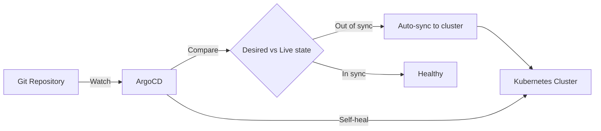

> 💡 **Quick Answer:** Deploy ArgoCD on Kubernetes running on Fedora. GitOps continuous delivery with automated sync, self-healing, and multi-cluster support.

## The Problem

You have a Kubernetes cluster on Fedora and need GitOps-based continuous delivery. ArgoCD watches your Git repository and automatically syncs changes to your cluster.

## The Solution

### Prerequisites

- Running Kubernetes cluster (see [Install Kubernetes on Fedora](/recipes/deployments/install-kubernetes-fedora/))
- kubectl configured and working
- Helm installed (see [Install Helm on Fedora](/recipes/helm/install-helm-fedora/))

### Install ArgoCD on Fedora

```bash
# Install ArgoCD
kubectl create namespace argocd
kubectl apply -n argocd -f https://raw.githubusercontent.com/argoproj/argo-cd/stable/manifests/install.yaml

# Wait for pods
kubectl wait --for=condition=ready pod -l app.kubernetes.io/name=argocd-server -n argocd --timeout=300s

# Install ArgoCD CLI
curl -sSL -o argocd https://github.com/argoproj/argo-cd/releases/latest/download/argocd-linux-amd64
chmod +x argocd
sudo mv argocd /usr/local/bin/

# Get initial admin password
kubectl -n argocd get secret argocd-initial-admin-secret -o jsonpath="{.data.password}" | base64 -d
echo

# Port-forward to access UI
kubectl port-forward svc/argocd-server -n argocd 8080:443 &

# Login
argocd login localhost:8080 --username admin --password $(kubectl -n argocd get secret argocd-initial-admin-secret -o jsonpath="{.data.password}" | base64 -d) --insecure

# Register your first application
argocd app create my-app \
  --repo https://github.com/myorg/my-app.git \
  --path k8s \
  --dest-server https://kubernetes.default.svc \
  --dest-namespace default \
  --sync-policy automated \
  --auto-prune \
  --self-heal

# Or declaratively
cat << 'EOF' | kubectl apply -f -
apiVersion: argoproj.io/v1alpha1
kind: Application
metadata:
  name: my-app
  namespace: argocd
spec:
  project: default
  source:
    repoURL: https://github.com/myorg/my-app.git
    targetRevision: HEAD
    path: k8s
  destination:
    server: https://kubernetes.default.svc
    namespace: default
  syncPolicy:
    automated:
      prune: true
      selfHeal: true
    syncOptions:
      - CreateNamespace=true
EOF

# Verify
argocd app list
argocd app get my-app
```

### Expose ArgoCD with Ingress

```yaml
apiVersion: networking.k8s.io/v1
kind: Ingress
metadata:
  name: argocd-server
  namespace: argocd
  annotations:
    nginx.ingress.kubernetes.io/ssl-passthrough: "true"
    nginx.ingress.kubernetes.io/backend-protocol: "HTTPS"
spec:
  ingressClassName: nginx
  rules:
    - host: argocd.example.com
      http:
        paths:
          - path: /
            pathType: Prefix
            backend:
              service:
                name: argocd-server
                port:
                  number: 443
  tls:
    - hosts:
        - argocd.example.com
      secretName: argocd-tls
```



## Common Issues

- **Can't get initial password** — secret `argocd-initial-admin-secret` is auto-deleted after first login in newer versions
- **Timeout connecting to ArgoCD** — ensure port-forward is running or ingress is configured
- **Sync failed** — check Application events: `argocd app get <name>`
- **Out of sync but won't auto-sync** — enable `automated` in syncPolicy

## Best Practices

- **Change the default admin password** immediately after first login
- **Use SSO/OIDC** instead of local accounts for production
- **Create ArgoCD Projects** to restrict which repos and clusters each team can use
- **Enable auto-prune and self-heal** for true GitOps

## Key Takeaways

- ArgoCD is the standard GitOps tool for Kubernetes
- It watches Git and automatically reconciles cluster state
- Install is a single kubectl apply — no Helm chart required
- Always secure the admin account and enable RBAC
