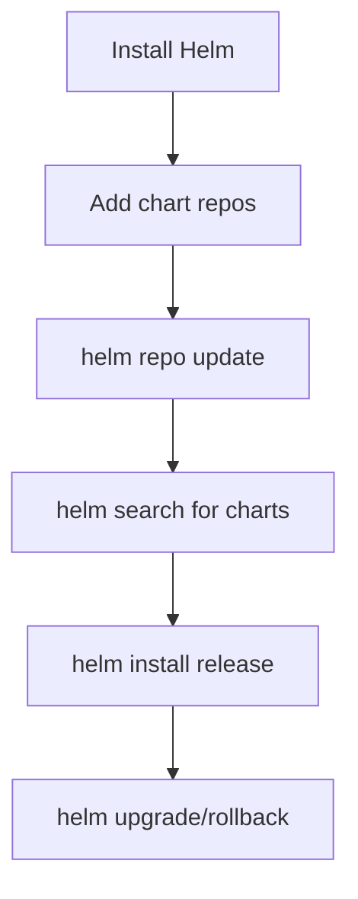

> 💡 **Quick Answer:** Install Helm 3 on Amazon Linux and configure chart repositories. Covers package manager install, script install, and shell completion for Amazon Linux 2023.

## The Problem

You need Helm installed on Amazon Linux (Amazon Linux 2023) to manage Kubernetes application deployments with charts.

## The Solution

### Install Helm on Amazon Linux

```bash
# Method 1: Official script (recommended)
curl https://raw.githubusercontent.com/helm/helm/main/scripts/get-helm-3 | bash

# Method 2: dnf/yum (via EPEL or Copr)
sudo dnf install -y helm
# Or download binary directly:
curl -fsSL -o get_helm.sh https://raw.githubusercontent.com/helm/helm/main/scripts/get-helm-3
chmod 700 get_helm.sh
./get_helm.sh

# Verify
helm version

# Add popular chart repos
helm repo add bitnami https://charts.bitnami.com/bitnami
helm repo add ingress-nginx https://kubernetes.github.io/ingress-nginx
helm repo add jetstack https://charts.jetstack.io
helm repo add prometheus-community https://prometheus-community.github.io/helm-charts
helm repo update

# Install your first chart
helm install my-nginx ingress-nginx/ingress-nginx \
  --namespace ingress-nginx --create-namespace

# Shell completion
echo 'source <(helm completion bash)' >> ~/.bashrc
source ~/.bashrc
```

### Verify Installation

```bash
helm version
# version.BuildInfo{Version:"v3.16.x", ...}

# List installed releases
helm list -A

# Search for charts
helm search repo nginx
helm search hub prometheus
```



### Method 3: Binary Download (Air-Gapped)

For environments without internet access:

```bash
# Download on a connected machine
HELM_VERSION=v3.16.3
curl -fsSL https://get.helm.sh/helm-${HELM_VERSION}-linux-amd64.tar.gz -o helm.tar.gz

# Transfer to Amazon Linux host, then:
tar -xzf helm.tar.gz
sudo mv linux-amd64/helm /usr/local/bin/helm
rm -rf linux-amd64 helm.tar.gz

helm version
```

### Amazon Linux 2 vs Amazon Linux 2023

| Feature | Amazon Linux 2 | Amazon Linux 2023 |
|---------|---------------|-------------------|
| Package manager | `yum` | `dnf` |
| Default Python | 3.7 | 3.9+ |
| Helm install | Script or binary | Script or binary |
| Shell | bash 4.2 | bash 5.2 |

```bash
# Amazon Linux 2 (yum-based)
curl https://raw.githubusercontent.com/helm/helm/main/scripts/get-helm-3 | bash

# Amazon Linux 2023 (dnf-based) — same script works
curl https://raw.githubusercontent.com/helm/helm/main/scripts/get-helm-3 | bash
```

### Configure Helm for EKS

```bash
# Update kubeconfig for your EKS cluster
aws eks update-kubeconfig --name my-cluster --region us-east-1

# Verify Helm can reach the cluster
helm list -A

# Install AWS Load Balancer Controller (common first chart)
helm repo add eks https://aws.github.io/eks-charts
helm install aws-load-balancer-controller eks/aws-load-balancer-controller \
  --namespace kube-system \
  --set clusterName=my-cluster \
  --set serviceAccount.create=false \
  --set serviceAccount.name=aws-load-balancer-controller
```

## Common Issues

**`helm: command not found` after install**

The script installs to `/usr/local/bin/`. If that's not in your PATH:
```bash
echo 'export PATH=$PATH:/usr/local/bin' >> ~/.bashrc
source ~/.bashrc
```

**`kubectl not configured` errors**

Helm uses your kubeconfig. Ensure `kubectl get nodes` works first. For EKS: `aws eks update-kubeconfig --name <cluster>`.

**Helm 2 vs Helm 3 confusion**

Helm 3 has no Tiller server component. If you see Tiller errors, you have Helm 2 installed. Remove it and install Helm 3:
```bash
sudo rm /usr/local/bin/helm
curl https://raw.githubusercontent.com/helm/helm/main/scripts/get-helm-3 | bash
```

**Repository not found or stale**

Always run `helm repo update` after adding repos and periodically to refresh chart indexes.

**Permission denied on Amazon Linux**

The install script needs root. Use `sudo` or run as root:
```bash
curl https://raw.githubusercontent.com/helm/helm/main/scripts/get-helm-3 | sudo bash
```

## Best Practices

- **Always use `--namespace` and `--create-namespace`** for clean isolation
- **Use `values.yaml` files** instead of `--set` flags for reproducibility
- **Pin chart versions** in production: `helm install --version 1.2.3`
- **Enable shell completion** — saves significant time: `source <(helm completion bash)`
- **Use `helm diff` plugin** before upgrades: `helm plugin install https://github.com/databus23/helm-diff`

## Key Takeaways

- The official install script is the most reliable method on Amazon Linux (AL2 and AL2023)
- Binary download works for air-gapped environments
- Helm uses your kubeconfig — ensure kubectl works first
- Add essential repos (bitnami, ingress-nginx, jetstack) after installation
- Shell completion and the helm-diff plugin are must-haves for productivity
