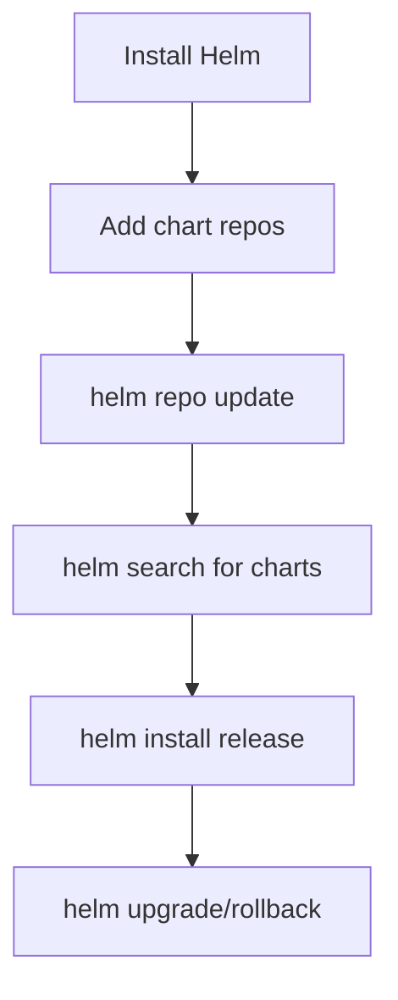

> 💡 **Quick Answer:** Install Helm 3 on openSUSE with package manager or script. Configure chart repos and shell completion for openSUSE Leap 15 / Tumbleweed.

## The Problem

You need Helm installed on openSUSE (openSUSE Leap 15 / Tumbleweed) to manage Kubernetes application deployments with charts.

## The Solution

### Install Helm on openSUSE

```bash
# Method 1: Official script (recommended)
curl https://raw.githubusercontent.com/helm/helm/main/scripts/get-helm-3 | bash

# Method 2: zypper (if available)
sudo zypper install helm
# Or download binary:
curl -fsSL -o get_helm.sh https://raw.githubusercontent.com/helm/helm/main/scripts/get-helm-3
chmod 700 get_helm.sh
./get_helm.sh

# Verify
helm version

# Add popular chart repos
helm repo add bitnami https://charts.bitnami.com/bitnami
helm repo add ingress-nginx https://kubernetes.github.io/ingress-nginx
helm repo add jetstack https://charts.jetstack.io
helm repo update

# Shell completion
echo 'source <(helm completion bash)' >> ~/.bashrc
```

### Verify Installation

```bash
helm version
# version.BuildInfo{Version:"v3.16.x", ...}

# List installed releases
helm list -A

# Search for charts
helm search repo nginx
helm search hub prometheus
```



## Common Issues

- **kubectl not configured** — Helm uses your kubeconfig; ensure `kubectl get nodes` works first
- **Helm 2 vs 3** — Helm 3 has no Tiller; if you see Tiller errors, you have Helm 2
- **Repository not found** — run `helm repo update` after adding repos

## Best Practices

- **Always use `--namespace` and `--create-namespace`** for clean isolation
- **Use `values.yaml` files** instead of `--set` flags for reproducibility
- **Pin chart versions** in production: `helm install --version 1.2.3`

## Key Takeaways

- Helm is the standard package manager for Kubernetes
- The official install script works on every Linux distro
- Always add and update repos before searching for charts
- Use shell completion for productivity
