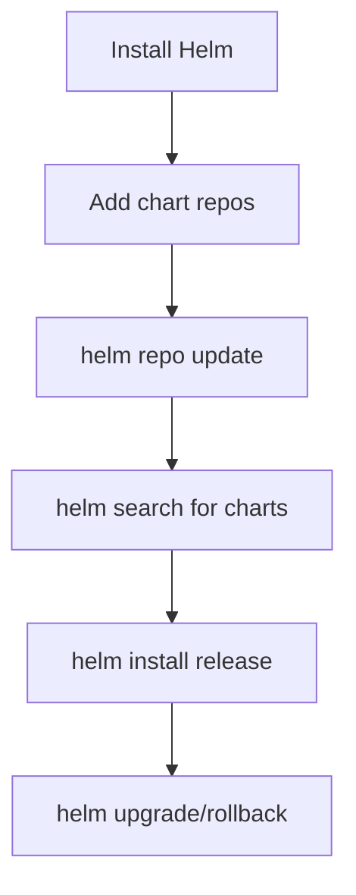

> 💡 **Quick Answer:** Install Helm 3 on Ubuntu and configure chart repositories. Covers package manager install, script install, and shell completion for Ubuntu 22.04/24.04.

## The Problem

You need Helm installed on Ubuntu (Ubuntu 22.04/24.04) to manage Kubernetes application deployments with charts.

## The Solution

### Install Helm on Ubuntu

```bash
# Method 1: Official script (works everywhere)
curl https://raw.githubusercontent.com/helm/helm/main/scripts/get-helm-3 | bash

# Method 2: apt repository
curl https://baltocdn.com/helm/signing.asc | gpg --dearmor | sudo tee /usr/share/keyrings/helm.gpg > /dev/null
echo "deb [arch=$(dpkg --print-architecture) signed-by=/usr/share/keyrings/helm.gpg] https://baltocdn.com/helm/stable/debian/ all main" | sudo tee /etc/apt/sources.list.d/helm-stable-debian.list
sudo apt-get update
sudo apt-get install helm

# Verify
helm version

# Add popular chart repos
helm repo add bitnami https://charts.bitnami.com/bitnami
helm repo add ingress-nginx https://kubernetes.github.io/ingress-nginx
helm repo add jetstack https://charts.jetstack.io
helm repo add prometheus-community https://prometheus-community.github.io/helm-charts
helm repo update

# Install your first chart
helm install my-nginx ingress-nginx/ingress-nginx \
  --namespace ingress-nginx --create-namespace

# Helm auto-completion
echo 'source <(helm completion bash)' >> ~/.bashrc
source ~/.bashrc
```

### Verify Installation

```bash
helm version
# version.BuildInfo{Version:"v3.16.x", ...}

# List installed releases
helm list -A

# Search for charts
helm search repo nginx
helm search hub prometheus
```



## Common Issues

- **kubectl not configured** — Helm uses your kubeconfig; ensure `kubectl get nodes` works first
- **Helm 2 vs 3** — Helm 3 has no Tiller; if you see Tiller errors, you have Helm 2
- **Repository not found** — run `helm repo update` after adding repos

## Best Practices

- **Always use `--namespace` and `--create-namespace`** for clean isolation
- **Use `values.yaml` files** instead of `--set` flags for reproducibility
- **Pin chart versions** in production: `helm install --version 1.2.3`

## Key Takeaways

- Helm is the standard package manager for Kubernetes
- The official install script works on every Linux distro
- Always add and update repos before searching for charts
- Use shell completion for productivity
