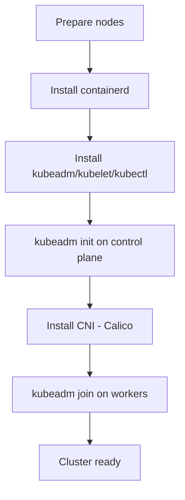

> 💡 **Quick Answer:** Step-by-step guide to install Kubernetes on RHEL with kubeadm. Covers containerd, kubeadm init, CNI setup, and worker node joining for RHEL 8/9.

## The Problem

You need to install a production-ready Kubernetes cluster on RHEL (RHEL 8/9). This guide covers the complete process from prerequisites to a running cluster.

## The Solution

### Prerequisites

- 2+ CPUs per node
- 2GB+ RAM per node
- Unique hostname, MAC address, and product UUID on each node
- Full network connectivity between nodes
- Swap disabled

### Install Kubernetes on RHEL

```bash
# Disable swap
sudo swapoff -a
sudo sed -i '/swap/d' /etc/fstab

# Disable SELinux (or set to permissive)
sudo setenforce 0
sudo sed -i 's/^SELINUX=enforcing$/SELINUX=permissive/' /etc/selinux/config

# Disable firewalld (or open required ports)
sudo systemctl disable --now firewalld

# Load kernel modules
cat << EOF | sudo tee /etc/modules-load.d/k8s.conf
overlay
br_netfilter
EOF
sudo modprobe overlay
sudo modprobe br_netfilter

# Sysctl params
cat << EOF | sudo tee /etc/sysctl.d/k8s.conf
net.bridge.bridge-nf-call-iptables  = 1
net.bridge.bridge-nf-call-ip6tables = 1
net.ipv4.ip_forward                 = 1
EOF
sudo sysctl --system

# Install containerd
sudo dnf install -y containerd
sudo mkdir -p /etc/containerd
containerd config default | sudo tee /etc/containerd/config.toml
sudo sed -i 's/SystemdCgroup = false/SystemdCgroup = true/' /etc/containerd/config.toml
sudo systemctl restart containerd
sudo systemctl enable containerd

# Add Kubernetes yum repository
cat << EOF | sudo tee /etc/yum.repos.d/kubernetes.repo
[kubernetes]
name=Kubernetes
baseurl=https://pkgs.k8s.io/core:/stable:/v1.31/rpm/
enabled=1
gpgcheck=1
gpgkey=https://pkgs.k8s.io/core:/stable:/v1.31/rpm/repodata/repomd.xml.key
EOF

# Install kubeadm, kubelet, kubectl
sudo dnf install -y kubelet kubeadm kubectl
sudo systemctl enable kubelet

# Initialize cluster (control plane node only)
sudo kubeadm init --pod-network-cidr=10.244.0.0/16

# Configure kubectl
mkdir -p $HOME/.kube
sudo cp /etc/kubernetes/admin.conf $HOME/.kube/config
sudo chown $(id -u):$(id -g) $HOME/.kube/config

# Install Calico CNI
kubectl apply -f https://raw.githubusercontent.com/projectcalico/calico/v3.28.0/manifests/calico.yaml

# Verify
kubectl get nodes
kubectl get pods -A
```

### Join Worker Nodes

On the control plane, generate the join command:

```bash
kubeadm token create --print-join-command
```

On each worker node, run the prerequisites above (containerd + kubeadm/kubelet), then:

```bash
# Paste the join command from above
sudo kubeadm join <control-plane-ip>:6443 --token <token> --discovery-token-ca-cert-hash sha256:<hash>
```

### Verify the Cluster

```bash
kubectl get nodes -o wide
# NAME          STATUS   ROLES           AGE   VERSION
# control-01    Ready    control-plane   5m    v1.31.0
# worker-01     Ready    <none>          2m    v1.31.0
# worker-02     Ready    <none>          2m    v1.31.0

kubectl get pods -A
```



## Common Issues

- **Swap not disabled** — kubeadm refuses to init with swap on
- **Containerd not using systemd cgroup** — causes kubelet crashes
- **Firewall blocking ports** — control plane needs 6443, 2379-2380, 10250-10252
- **Wrong CNI CIDR** — must match `--pod-network-cidr` in kubeadm init

## Best Practices

- **Pin package versions** — prevent accidental upgrades breaking your cluster
- **Use systemd cgroup driver** — matches kubelet's default on modern systems
- **Configure HA control plane** — 3+ control plane nodes for production
- **Back up etcd** — before any upgrade or change

## Key Takeaways

- kubeadm is the standard tool for bootstrapping Kubernetes clusters
- containerd with systemd cgroup is the recommended runtime
- Always install a CNI plugin after kubeadm init
- Pin kubelet, kubeadm, kubectl versions to prevent drift
