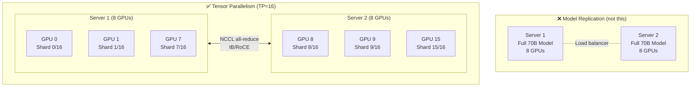
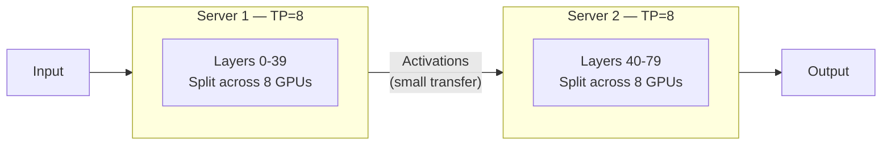

> 💡 **Quick Answer:** Inter-node tensor parallelism slices a single model's layers across GPUs on **different physical servers** — every GPU holds a unique shard, nothing is replicated. Set `--tensor-parallel-size=N` where N spans GPUs across nodes (e.g., 16 for 2 × 8-GPU servers). NCCL handles the all-reduce communication. This requires high-bandwidth interconnect (InfiniBand or RoCE) — TCP works but degrades throughput 5-10×.

## The Problem

Large models (70B+, 405B) don't fit on a single server. You have two choices:

1. **Pipeline parallelism (PP)** — split layers sequentially across nodes. Simple but creates pipeline bubbles (idle GPUs waiting for the previous stage).
2. **Tensor parallelism (TP)** — split each layer's weight matrices across all GPUs. Every GPU participates in every token. No bubbles, but requires all-reduce after every layer.

Most guides show TP within a single node (8 GPUs connected by NVLink). **Inter-node TP** extends this across physical servers — the model is truly distributed, not replicated.



## TP vs PP vs TP+PP: When to Use Each

| Strategy | Model Split | Communication | Best For |
|----------|-------------|---------------|----------|
| **TP only** (TP=16) | Each layer split across 16 GPUs | All-reduce every layer (high bandwidth) | Low latency, fast IB interconnect |
| **PP only** (PP=4) | Layers 0-19 on node 1, 20-39 on node 2, etc. | Forward/backward between stages (low bandwidth) | Slow interconnect, throughput-oriented |
| **TP+PP** (TP=8, PP=2) | TP within node, PP across nodes | NVLink intra-node + IB inter-node | Most common for 2+ node setups |

**Key insight:** Pure inter-node TP (TP=16 across 2 servers) requires ~400 Gb/s+ interconnect to avoid becoming the bottleneck. If you have InfiniBand HDR/NDR, pure TP works. If you're on 25-100 GbE, use TP+PP instead.

## The Solution

### vLLM: Inter-Node Tensor Parallelism

vLLM uses Ray to coordinate multi-node inference. Each node runs a Ray worker, and vLLM distributes tensor shards across all GPUs.

```yaml
# Ray head node
apiVersion: apps/v1
kind: Deployment
metadata:
  name: vllm-head
spec:
  replicas: 1
  selector:
    matchLabels:
      app: vllm-head
  template:
    metadata:
      labels:
        app: vllm-head
        role: head
    spec:
      containers:
        - name: vllm
          image: ghcr.io/vllm-project/vllm-openai:v0.8.0
          command: ["/bin/bash", "-c"]
          args:
            - |
              # Start Ray head
              ray start --head --port=6379 --dashboard-host=0.0.0.0
              
              # Wait for workers to join
              until [ $(ray status 2>/dev/null | grep -c "GPU") -ge 16 ]; do
                echo "Waiting for 16 GPUs... ($(ray status 2>/dev/null | grep -c GPU) connected)"
                sleep 5
              done
              
              # Start vLLM with TP=16 across both nodes
              python -m vllm.entrypoints.openai.api_server \
                --model meta-llama/Llama-3.1-70B-Instruct \
                --tensor-parallel-size 16 \
                --max-model-len 8192 \
                --gpu-memory-utilization 0.92 \
                --port 8000
          ports:
            - containerPort: 8000
              name: http
            - containerPort: 6379
              name: ray
          env:
            - name: HUGGING_FACE_HUB_TOKEN
              valueFrom:
                secretKeyRef:
                  name: hf-token
                  key: token
            # NCCL tuning for inter-node
            - name: NCCL_SOCKET_IFNAME
              value: "eth0"          # Or IB interface name
            - name: NCCL_IB_DISABLE
              value: "0"             # Enable IB if available
            - name: NCCL_DEBUG
              value: "INFO"          # Log transport selection
          resources:
            limits:
              nvidia.com/gpu: 8
              memory: 200Gi
            requests:
              nvidia.com/gpu: 8
              memory: 128Gi
          volumeMounts:
            - name: model-cache
              mountPath: /root/.cache/huggingface
            - name: shm
              mountPath: /dev/shm
      volumes:
        - name: model-cache
          persistentVolumeClaim:
            claimName: vllm-model-cache
        - name: shm
          emptyDir:
            medium: Memory
            sizeLimit: 16Gi           # Large SHM for NCCL buffers
---
# Ray worker node
apiVersion: apps/v1
kind: Deployment
metadata:
  name: vllm-worker
spec:
  replicas: 1
  selector:
    matchLabels:
      app: vllm-worker
  template:
    metadata:
      labels:
        app: vllm-worker
        role: worker
    spec:
      containers:
        - name: ray-worker
          image: ghcr.io/vllm-project/vllm-openai:v0.8.0
          command: ["/bin/bash", "-c"]
          args:
            - |
              ray start \
                --address=vllm-head-svc:6379 \
                --num-gpus=8 \
                --block
          env:
            - name: HUGGING_FACE_HUB_TOKEN
              valueFrom:
                secretKeyRef:
                  name: hf-token
                  key: token
            - name: NCCL_SOCKET_IFNAME
              value: "eth0"
            - name: NCCL_IB_DISABLE
              value: "0"
          resources:
            limits:
              nvidia.com/gpu: 8
              memory: 200Gi
          volumeMounts:
            - name: model-cache
              mountPath: /root/.cache/huggingface
            - name: shm
              mountPath: /dev/shm
      volumes:
        - name: model-cache
          persistentVolumeClaim:
            claimName: vllm-model-cache
        - name: shm
          emptyDir:
            medium: Memory
            sizeLimit: 16Gi
---
apiVersion: v1
kind: Service
metadata:
  name: vllm-head-svc
spec:
  selector:
    app: vllm-head
  ports:
    - port: 6379
      name: ray
    - port: 8000
      name: http
```

### LeaderWorkerSet: Production Inter-Node TP

For production, use `LeaderWorkerSet` (K8s SIG) for proper gang scheduling:

```yaml
apiVersion: leaderworkerset.x-k8s.io/v1
kind: LeaderWorkerSet
metadata:
  name: vllm-tp16
spec:
  replicas: 1                        # 1 replica = 1 model instance
  leaderWorkerTemplate:
    size: 2                           # 2 pods per replica (2 nodes)
    restartPolicy: RecreateGroupOnPodRestart
    leaderTemplate:
      metadata:
        labels:
          role: head
      spec:
        containers:
          - name: vllm
            image: ghcr.io/vllm-project/vllm-openai:v0.8.0
            command: ["/bin/bash", "-c"]
            args:
              - |
                ray start --head --port=6379
                sleep 30  # Wait for worker
                python -m vllm.entrypoints.openai.api_server \
                  --model meta-llama/Llama-3.1-70B-Instruct \
                  --tensor-parallel-size 16 \
                  --port 8000
            env:
              - name: NCCL_IB_DISABLE
                value: "0"
              - name: NCCL_SOCKET_IFNAME
                value: "eth0"
            resources:
              limits:
                nvidia.com/gpu: 8
            volumeMounts:
              - name: shm
                mountPath: /dev/shm
        volumes:
          - name: shm
            emptyDir:
              medium: Memory
              sizeLimit: 16Gi
    workerTemplate:
      spec:
        containers:
          - name: ray-worker
            image: ghcr.io/vllm-project/vllm-openai:v0.8.0
            command: ["/bin/bash", "-c"]
            args:
              - |
                ray start --address=$(LWS_LEADER_ADDRESS):6379 --num-gpus=8 --block
            env:
              - name: NCCL_IB_DISABLE
                value: "0"
              - name: NCCL_SOCKET_IFNAME
                value: "eth0"
            resources:
              limits:
                nvidia.com/gpu: 8
            volumeMounts:
              - name: shm
                mountPath: /dev/shm
        volumes:
          - name: shm
            emptyDir:
              medium: Memory
              sizeLimit: 16Gi
```

### NIM: Inter-Node TP with Helm

NVIDIA NIM supports multi-node TP natively:

```yaml
# values-multinode-tp16.yaml
image:
  repository: nvcr.io/nim/meta/llama-3.1-70b-instruct
  tag: "1.7.3"

model:
  name: meta/llama-3.1-70b-instruct
  jsonLogging: false                  # MUST be false for multi-node

resources:
  limits:
    nvidia.com/gpu: 8

replicaCount: 1

multiNode:
  enabled: true
  gpusPerNode: 8
  nodes: 2                            # 2 physical servers
  leaderWorkerSetVersion: v1

# TP=16 across 2 nodes (8 GPUs each)
# NIM auto-selects the profile
env:
  - name: NIM_TENSOR_PARALLEL_SIZE
    value: "16"
  - name: NCCL_IB_DISABLE
    value: "0"

extraVolumeMounts:
  - name: shm
    mountPath: /dev/shm
extraVolumes:
  - name: shm
    emptyDir:
      medium: Memory
      sizeLimit: 16Gi
```

```bash
helm install llama-tp16 nim-llm/nim-llm -f values-multinode-tp16.yaml
```

### TP=16 vs TP=8+PP=2: Choosing the Right Split

```bash
# Measure inter-node bandwidth first
# On node 1:
ib_write_bw --size=4096 --iters=10000

# On node 2:
ib_write_bw --size=4096 --iters=10000 <node1-ip>

# Or run NCCL all-reduce benchmark
kubectl exec -it nccl-test-0 -- \
  /opt/nccl-tests/build/all_reduce_perf \
  -b 1M -e 1G -f 2 -g 8
```

**Decision guide:**

| Inter-Node Bandwidth | Recommended Strategy | Why |
|----------------------|---------------------|-----|
| **400 Gb/s+ (NDR IB)** | TP=16 (pure TP) | Bandwidth matches NVLink; minimal overhead |
| **200 Gb/s (HDR IB)** | TP=16 works, TP=8+PP=2 safer | ~80% of NVLink bandwidth |
| **100 Gb/s (RoCE/Ethernet)** | TP=8 + PP=2 | TP all-reduce too expensive at this bandwidth |
| **25 Gb/s (standard Ethernet)** | TP=8 + PP=2 (or PP=4) | Pure TP will be 5-10× slower than single-node |

### TP+PP Hybrid Configuration

```yaml
# vLLM with TP=8 (intra-node) + PP=2 (inter-node)
# Each node handles full layers but different layer groups
args:
  - python -m vllm.entrypoints.openai.api_server
    --model meta-llama/Llama-3.1-70B-Instruct
    --tensor-parallel-size 8
    --pipeline-parallel-size 2
    --max-model-len 8192
    --port 8000
```



**Why TP+PP often beats pure TP across nodes:**
- TP requires all-reduce (all GPUs exchange data) after **every layer** — O(N) communication
- PP requires forward pass (one GPU sends activations to next stage) **once between stages** — much less data
- On 100GbE: TP all-reduce for 70B ≈ 2ms/layer × 80 layers = 160ms overhead. PP forward pass ≈ 5ms total.

### Network Requirements

| Component | Minimum | Recommended |
|-----------|---------|-------------|
| **Inter-node bandwidth** | 100 Gb/s (RoCE) | 400 Gb/s (NDR InfiniBand) |
| **Latency** | < 5 µs | < 2 µs |
| **NCCL version** | 2.18+ | 2.21+ |
| **GPU driver** | 535+ | 550+ |
| **Shared memory (/dev/shm)** | 8Gi | 16Gi+ |
| **GPUDirect RDMA** | Optional (for TCP) | Required (for IB/RoCE) |

### NCCL Tuning for Inter-Node TP

```yaml
env:
  # Essential for inter-node TP
  - name: NCCL_SOCKET_IFNAME
    value: "eth0"                    # Or IB interface (ib0, mlx5_0)
  - name: NCCL_IB_DISABLE
    value: "0"                       # 0 = enable IB (use 1 for TCP only)
  
  # Performance tuning
  - name: NCCL_IB_HCA
    value: "mlx5_0,mlx5_1"          # Use specific IB devices
  - name: NCCL_NET_GDR_LEVEL
    value: "5"                       # Enable GPUDirect RDMA
  - name: NCCL_IB_GID_INDEX
    value: "3"                       # RoCE v2 GID index
  
  # Buffer sizes for large all-reduce
  - name: NCCL_BUFFSIZE
    value: "8388608"                 # 8MB buffers
  - name: NCCL_NTHREADS
    value: "512"                     # More NCCL threads
  
  # Debug (remove in production)
  - name: NCCL_DEBUG
    value: "INFO"
  - name: NCCL_DEBUG_SUBSYS
    value: "NET,INIT"
```

### Verify the Model is Actually Sliced (Not Replicated)

```bash
# Check GPU memory usage — each GPU should hold 1/16th of the model
kubectl exec -it vllm-head-0 -- nvidia-smi

# For 70B model (140GB in FP16):
# TP=16 → each GPU should use ~9GB for weights + KV cache
# If any GPU shows ~140GB → model is replicated, not sharded!

# Check NCCL logs for inter-node communication
kubectl logs vllm-head-0 | grep "NCCL INFO"
# Should show: NET/IB or NET/Socket connections to worker node IPs

# Verify all 16 GPUs participate
kubectl exec -it vllm-head-0 -- python -c "
import ray
ray.init()
print(f'Total GPUs: {ray.cluster_resources().get(\"GPU\", 0)}')
# Should print: Total GPUs: 16.0
"
```

## Common Issues

| Issue | Cause | Fix |
|-------|-------|-----|
| NCCL timeout during model load | Inter-node connectivity issue | Check NCCL_SOCKET_IFNAME, verify network between nodes |
| Only 8 GPUs used (not 16) | Worker not connected to Ray head | Check Ray address, DNS resolution, port 6379 |
| OOM despite 16 GPUs | KV cache too large for split model | Lower `--max-model-len` or `--gpu-memory-utilization` |
| Throughput worse than single node | Slow interconnect + pure TP | Switch to TP=8+PP=2 (less inter-node traffic) |
| `NCCL WARN Connect to ...failed` | Firewall blocking NCCL ports | Open high ports (29400-29500) between nodes |
| Asymmetric GPU memory usage | Uneven TP shard sizes | Ensure TP divides model's attention heads evenly |
| Model works on 1 node but hangs on 2 | SHM too small for NCCL | Increase /dev/shm to 16Gi+ |

## Best Practices

- **Benchmark interconnect first** — run `ib_write_bw` or NCCL all-reduce tests before deploying
- **Use TP+PP for Ethernet clusters** — pure TP only makes sense with 200Gb/s+ InfiniBand
- **Pin NIM image versions** — use `1.7.3` not `latest` for reproducibility
- **16Gi /dev/shm minimum** — NCCL needs large shared memory buffers for inter-node transfers
- **GPUDirect RDMA where possible** — bypasses CPU for GPU-to-GPU transfers across nodes
- **TP size must divide attention heads** — Llama 70B has 64 heads, so TP=16 works (64/16=4 heads/GPU)
- **Monitor per-GPU utilization** — uneven utilization means the interconnect is the bottleneck
- **Use LeaderWorkerSet** — proper gang scheduling ensures both nodes start/stop together

## Key Takeaways

- Inter-node TP slices each layer across GPUs on different servers — nothing is replicated
- Requires high-bandwidth interconnect: 200Gb/s+ IB for pure TP, or use TP+PP hybrid on slower networks
- NCCL handles all-reduce communication automatically — tune with env vars
- Pure TP=16 across 2 nodes: lowest latency but highest bandwidth requirement
- TP=8+PP=2: each node handles different layers (less cross-traffic), better for 25-100GbE
- Always verify GPU memory usage — each GPU should hold 1/TP of the model weights
- /dev/shm must be 16Gi+ for inter-node NCCL buffers
