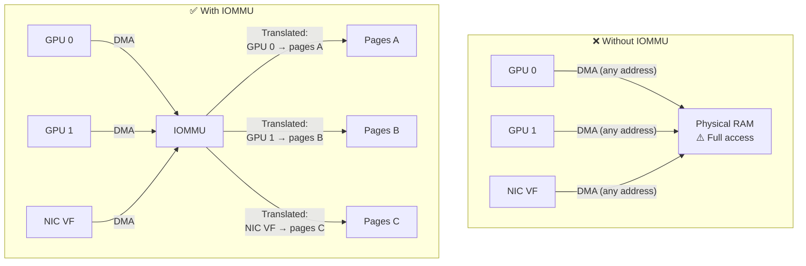

> 💡 **Quick Answer:** IOMMU (Input-Output Memory Management Unit) provides hardware-level device isolation — required for GPU passthrough (VFIO), SR-IOV virtual functions, and secure DMA. Enable with `intel_iommu=on` (Intel) or `amd_iommu=on` (AMD) kernel parameters. On OpenShift, use `MachineConfig`; on vanilla Kubernetes, update GRUB. Verify with `dmesg | grep -i iommu`. Without IOMMU, devices can DMA to any physical address — a security and stability risk.

## The Problem

By default, PCI devices (GPUs, NICs, NVMe) can read/write any physical memory address via DMA (Direct Memory Access). This means:

- A buggy GPU driver can corrupt kernel memory
- A malicious VM/container with a passed-through device can read host memory
- SR-IOV virtual functions from different tenants can access each other's DMA buffers

IOMMU interposes address translation between devices and physical memory — each device (or group of devices) gets its own virtual address space, like how the MMU isolates processes.



## When You Need IOMMU on Kubernetes

| Use Case | IOMMU Required? | Why |
|----------|----------------|-----|
| **GPU passthrough (VFIO)** | ✅ Mandatory | Guest VM needs isolated DMA to GPU |
| **SR-IOV virtual functions** | ✅ Mandatory | Each VF needs isolated DMA space |
| **KubeVirt GPU passthrough** | ✅ Mandatory | VM workloads with PCI devices |
| **GPUDirect RDMA** | ✅ Required | GPU and NIC DMA to each other's memory |
| **Secure multi-tenancy** | ✅ Recommended | Prevent DMA-based cross-tenant attacks |
| **Standard GPU (nvidia driver)** | ⚠️ Recommended | Works without, but no DMA isolation |
| **Confidential computing (SEV/TDX)** | ✅ Mandatory | Encrypted VM memory requires IOMMU |

## The Solution

### Enable IOMMU — Kernel Parameters

**Intel (VT-d):**
```bash
# Kernel parameters needed:
intel_iommu=on iommu=pt

# intel_iommu=on  → Enable Intel VT-d IOMMU
# iommu=pt        → Passthrough mode for performance
#                   (only devices explicitly bound to VFIO use IOMMU translation)
```

**AMD (AMD-Vi):**
```bash
# Kernel parameters needed:
amd_iommu=on iommu=pt
```

### OpenShift: MachineConfig

```yaml
apiVersion: machineconfiguration.openshift.io/v1
kind: MachineConfig
metadata:
  name: 99-iommu-enable
  labels:
    machineconfiguration.openshift.io/role: worker
spec:
  config:
    ignition:
      version: 3.2.0
  kernelArguments:
    - intel_iommu=on
    - iommu=pt
    # For AMD systems, use instead:
    # - amd_iommu=on
    # - iommu=pt
```

```bash
# Apply and wait for nodes to reboot
oc apply -f machineconfig-iommu.yaml

# Monitor rollout
oc get mcp worker -w
# NAME     CONFIG   UPDATED   UPDATING   DEGRADED
# worker   ...      False     True       False
# (wait for UPDATED=True)
```

### Vanilla Kubernetes: GRUB

```bash
# On each worker node:

# Intel:
sudo sed -i 's/GRUB_CMDLINE_LINUX="/GRUB_CMDLINE_LINUX="intel_iommu=on iommu=pt /' /etc/default/grub
# AMD:
sudo sed -i 's/GRUB_CMDLINE_LINUX="/GRUB_CMDLINE_LINUX="amd_iommu=on iommu=pt /' /etc/default/grub

# Rebuild GRUB
sudo grub2-mkconfig -o /boot/grub2/grub.cfg    # RHEL/CentOS
# or
sudo update-grub                                  # Ubuntu/Debian

# Reboot
sudo reboot
```

### DaemonSet Approach (Verify on All Nodes)

```yaml
# DaemonSet to verify IOMMU is enabled on all GPU nodes
apiVersion: apps/v1
kind: DaemonSet
metadata:
  name: iommu-verify
  namespace: kube-system
spec:
  selector:
    matchLabels:
      app: iommu-verify
  template:
    metadata:
      labels:
        app: iommu-verify
    spec:
      hostPID: true
      nodeSelector:
        nvidia.com/gpu.present: "true"
      containers:
        - name: verify
          image: registry.access.redhat.com/ubi9/ubi-minimal:latest
          command: ["/bin/bash", "-c"]
          args:
            - |
              echo "=== IOMMU Status ==="
              if dmesg | grep -qi "DMAR: IOMMU enabled\|AMD-Vi: IOMMU"; then
                echo "✅ IOMMU is ENABLED"
              else
                echo "❌ IOMMU is NOT enabled"
                echo "   Add 'intel_iommu=on iommu=pt' to kernel parameters"
              fi
              
              echo -e "\n=== IOMMU Mode ==="
              cat /proc/cmdline | grep -o 'iommu=[a-z]*' || echo "No iommu= parameter"
              cat /proc/cmdline | grep -o 'intel_iommu=[a-z]*' || echo "No intel_iommu= parameter"
              cat /proc/cmdline | grep -o 'amd_iommu=[a-z]*' || echo "No amd_iommu= parameter"
              
              echo -e "\n=== IOMMU Groups ==="
              for g in /sys/kernel/iommu_groups/*/devices/*; do
                group=$(echo $g | cut -d/ -f5)
                device=$(basename $g)
                desc=$(lspci -nns $device 2>/dev/null | head -1)
                echo "Group $group: $desc"
              done 2>/dev/null | head -40
              
              echo -e "\n=== GPU IOMMU Groups ==="
              for g in /sys/kernel/iommu_groups/*/devices/*; do
                device=$(basename $g)
                if lspci -nns $device 2>/dev/null | grep -qi "nvidia\|3d controller\|vga.*10de"; then
                  group=$(echo $g | cut -d/ -f5)
                  echo "Group $group: $(lspci -nns $device)"
                fi
              done 2>/dev/null
              
              sleep infinity
          securityContext:
            privileged: true
      tolerations:
        - operator: Exists
```

### Verify IOMMU is Active

```bash
# Method 1: dmesg
dmesg | grep -iE "DMAR|IOMMU|AMD-Vi"
# Intel expected output:
# DMAR: IOMMU enabled
# DMAR: Intel(R) Virtualization Technology for Directed I/O
# DMAR-IR: Enabled IRQ remapping in x2apic mode
#
# AMD expected output:
# AMD-Vi: AMD IOMMUv2 loaded and initialized
# AMD-Vi: Found IOMMU cap 0x40

# Method 2: Check kernel parameters
cat /proc/cmdline | grep -oE '(intel_|amd_)?iommu=[a-z]+'
# intel_iommu=on iommu=pt

# Method 3: Check IOMMU groups exist
ls /sys/kernel/iommu_groups/ | wc -l
# Should be > 0. If 0, IOMMU is not active.

# Method 4: Check specific device IOMMU group
# Find GPU PCI address
lspci | grep -i nvidia
# 41:00.0 3D controller: NVIDIA Corporation A100 80GB

# Find its IOMMU group
find /sys/kernel/iommu_groups/ -name "0000:41:00.0"
# /sys/kernel/iommu_groups/52/devices/0000:41:00.0
```

### IOMMU Groups — Understanding Device Isolation

```bash
# List all devices in each IOMMU group
#!/bin/bash
for g in $(ls /sys/kernel/iommu_groups/); do
  echo "IOMMU Group $g:"
  for d in /sys/kernel/iommu_groups/$g/devices/*; do
    echo "  $(lspci -nns $(basename $d))"
  done
done

# Example output:
# IOMMU Group 52:
#   41:00.0 3D controller [0302]: NVIDIA Corp A100 [10de:20b2] (rev a1)
# IOMMU Group 53:
#   42:00.0 3D controller [0302]: NVIDIA Corp A100 [10de:20b2] (rev a1)
# IOMMU Group 60:
#   81:00.0 Ethernet [0200]: Mellanox ConnectX-6 [15b3:101d]
#   81:00.1 Ethernet [0200]: Mellanox ConnectX-6 [15b3:101d]

# ⚠️ IMPORTANT: All devices in the same IOMMU group must be
# passed through together. You can't isolate one device from
# another in the same group.
```

### VFIO for GPU Passthrough (KubeVirt)

```yaml
# Bind GPU to VFIO driver for VM passthrough
apiVersion: machineconfiguration.openshift.io/v1
kind: MachineConfig
metadata:
  name: 99-vfio-gpu
  labels:
    machineconfiguration.openshift.io/role: worker
spec:
  config:
    ignition:
      version: 3.2.0
  kernelArguments:
    - intel_iommu=on
    - iommu=pt
    - "vfio-pci.ids=10de:20b2"       # NVIDIA A100 device ID
    # Find your device ID: lspci -nn | grep NVIDIA
---
# KubeVirt VM with GPU passthrough
apiVersion: kubevirt.io/v1
kind: VirtualMachine
metadata:
  name: gpu-vm
spec:
  template:
    spec:
      domain:
        devices:
          hostDevices:
            - name: gpu1
              deviceName: nvidia.com/A100
        resources:
          requests:
            memory: 64Gi
      volumes:
        - name: rootdisk
          containerDisk:
            image: quay.io/containerdisks/ubuntu:22.04
```

### IOMMU for SR-IOV

```bash
# SR-IOV requires IOMMU for VF isolation
# Each VF gets its own IOMMU mapping

# Enable VFs on NIC (requires IOMMU)
echo 8 > /sys/class/net/ens8f0/device/sriov_numvfs

# Verify VFs have separate IOMMU groups
for vf in /sys/class/net/ens8f0/device/virtfn*; do
  pci=$(basename $(readlink $vf))
  group=$(basename $(readlink /sys/bus/pci/devices/$pci/iommu_group))
  echo "VF $pci → IOMMU Group $group"
done
# Each VF should be in its own IOMMU group
```

### iommu=pt vs iommu=on

| Parameter | Meaning | Performance | Use Case |
|-----------|---------|-------------|----------|
| `iommu=on` | IOMMU active for ALL devices | Slower (~5% DMA overhead) | Maximum security |
| `iommu=pt` | Passthrough — only VFIO-bound devices use IOMMU | Native performance | **Recommended for Kubernetes** |
| `iommu=off` | IOMMU disabled | Native performance | No device isolation |

```bash
# Recommended for GPU clusters:
intel_iommu=on iommu=pt

# This means:
# - IOMMU hardware is enabled (required for VFIO/SR-IOV)
# - Devices NOT bound to VFIO use direct DMA (no overhead)
# - Devices bound to VFIO get full IOMMU isolation
# - Best of both: security where needed, performance everywhere else
```

### BIOS/UEFI Requirements

```
# Intel systems — enable in BIOS:
# - Intel VT-d (Virtualization Technology for Directed I/O)
# - Intel VT-x (for VM workloads)
# - SR-IOV (if using SR-IOV NICs)

# AMD systems — enable in BIOS:
# - AMD-Vi (AMD Virtualization - IOMMU)
# - SVM (Secure Virtual Machine)
# - SR-IOV (if using SR-IOV NICs)

# Verify BIOS setting is active:
dmesg | grep -i "DMAR: IOMMU enabled"
# If missing → check BIOS settings, VT-d may be disabled
```

## Common Issues

| Issue | Cause | Fix |
|-------|-------|-----|
| `DMAR: IOMMU not enabled` in dmesg | VT-d disabled in BIOS | Enable Intel VT-d / AMD-Vi in BIOS |
| No IOMMU groups (`/sys/kernel/iommu_groups/` empty) | Kernel parameter missing | Add `intel_iommu=on` to kernel cmdline |
| GPU and NIC in same IOMMU group | PCIe topology | Use ACS override patch or different PCIe slot |
| Performance drop with IOMMU | Using `iommu=on` without `pt` | Switch to `iommu=pt` for passthrough mode |
| SR-IOV VFs can't be created | IOMMU not enabled | Enable IOMMU + reboot |
| `vfio-pci: Cannot reset device` | IOMMU group conflict | All devices in group must use same driver |
| KubeVirt GPU passthrough fails | IOMMU not active on node | Verify with `dmesg | grep DMAR` |

## Best Practices

- **Always use `iommu=pt`** — passthrough mode avoids performance overhead for non-VFIO devices
- **Enable in BIOS first** — kernel parameter alone won't work if VT-d is off in firmware
- **Check IOMMU groups before passthrough** — devices in the same group can't be individually isolated
- **Use MachineConfig on OpenShift** — consistent kernel parameters across all workers
- **Verify after every kernel/driver update** — IOMMU can break with driver changes
- **GPUDirect RDMA requires IOMMU** — GPU and NIC need DMA access to each other's memory through IOMMU
- **ACS (Access Control Services)** — if multiple devices share an IOMMU group, check if PCIe ACS is enabled to split them

## Key Takeaways

- IOMMU provides hardware-level DMA isolation — required for VFIO, SR-IOV, and secure multi-tenancy
- Enable with `intel_iommu=on iommu=pt` (Intel) or `amd_iommu=on iommu=pt` (AMD)
- `iommu=pt` gives native performance for normal devices while isolating VFIO-bound ones
- Must be enabled in BIOS (VT-d/AMD-Vi) AND kernel parameters — both are required
- Each IOMMU group is an isolation unit — all devices in a group are passed through together
- SR-IOV VFs get their own IOMMU groups — enabling per-VF isolation for multi-tenant networking
- GPUDirect RDMA, KubeVirt, and confidential computing all depend on IOMMU
