> 💡 **Quick Answer:** Use **VirtualService** for routing rules (traffic splitting, header matching, retries) and **DestinationRule** for load balancing and circuit breakers. Example: split traffic 90/10 between versions with `route[].weight`. Enable fault injection with `fault.delay` or `fault.abort` for chaos testing.
>
> **Key commands:** `istioctl analyze` to validate config; `kubectl get virtualservice,destinationrule` to list rules.
>
> **Gotcha:** VirtualService routes apply to mesh traffic only if Gateway is not specified; for external traffic, define a Gateway and reference it in VirtualService.

## Problem

You need advanced traffic management capabilities beyond basic Kubernetes Services including intelligent request routing, traffic splitting for canary deployments, fault injection for resilience testing, and circuit breaking for failure handling.

## Solution

Use Istio service mesh to implement sophisticated traffic management with VirtualServices and DestinationRules, enabling fine-grained control over request routing, load balancing, and failure handling.

### Architecture

```mermaid
flowchart TB
    subgraph CP["⚙️ Istio Control Plane"]
        ISTIOD["🎛️ Istiod<br/>Config"]
        PILOT["🧭 Pilot<br/>Discovery"]
        CITADEL["🔐 Citadel<br/>mTLS"]
    end

    CP -->|"Config Distribution"| V1
    CP -->|"Config Distribution"| V2
    CP -->|"Config Distribution"| V3

    subgraph V1["📦 Service Pod v1 - 90% traffic (stable)"]
        ENV1["🔷 Envoy Sidecar"]
        APP1["📱 App Container"]
        ENV1 --> APP1
    end

    subgraph V2["📦 Service Pod v2 - 10% traffic (canary)"]
        ENV2["🔷 Envoy Sidecar"]
        APP2["📱 App Container"]
        ENV2 --> APP2
    end

    subgraph V3["📦 Service Pod v3 - 0% traffic (future)"]
        ENV3["🔷 Envoy Sidecar"]
        APP3["📱 App Container"]
        ENV3 --> APP3
    end

    TRAFFIC["🌐 Incoming Traffic"] --> V1
    TRAFFIC -.->|"canary"| V2
```



### Step 1: Install Istio

Install Istio using istioctl:

```bash
# Download Istio
curl -L https://istio.io/downloadIstio | sh -
cd istio-1.20.0
export PATH=$PWD/bin:$PATH

# Install Istio with default profile
istioctl install --set profile=default -y

# Verify installation
kubectl get pods -n istio-system

# Enable sidecar injection for namespace
kubectl label namespace production istio-injection=enabled
```

### Step 2: Deploy Application with Multiple Versions

Deploy service with v1 and v2 versions:

```yaml
# Service definition
apiVersion: v1
kind: Service
metadata:
  name: product-service
  namespace: production
  labels:
    app: product-service
spec:
  ports:
  - port: 8080
    name: http
  selector:
    app: product-service
---
# Deployment v1 (stable)
apiVersion: apps/v1
kind: Deployment
metadata:
  name: product-service-v1
  namespace: production
spec:
  replicas: 3
  selector:
    matchLabels:
      app: product-service
      version: v1
  template:
    metadata:
      labels:
        app: product-service
        version: v1
    spec:
      containers:
      - name: product-service
        image: product-service:v1.0
        ports:
        - containerPort: 8080
---
# Deployment v2 (canary)
apiVersion: apps/v1
kind: Deployment
metadata:
  name: product-service-v2
  namespace: production
spec:
  replicas: 1
  selector:
    matchLabels:
      app: product-service
      version: v2
  template:
    metadata:
      labels:
        app: product-service
        version: v2
    spec:
      containers:
      - name: product-service
        image: product-service:v2.0
        ports:
        - containerPort: 8080
```

### Step 3: Traffic Splitting with VirtualService

Implement percentage-based traffic splitting:

```yaml
apiVersion: networking.istio.io/v1beta1
kind: VirtualService
metadata:
  name: product-service
  namespace: production
spec:
  hosts:
  - product-service
  http:
  - match:
    - headers:
        user-group:
          exact: beta-testers
    route:
    - destination:
        host: product-service
        subset: v2
      weight: 100
  - route:
    - destination:
        host: product-service
        subset: v1
      weight: 90
    - destination:
        host: product-service
        subset: v2
      weight: 10
---
apiVersion: networking.istio.io/v1beta1
kind: DestinationRule
metadata:
  name: product-service
  namespace: production
spec:
  host: product-service
  subsets:
  - name: v1
    labels:
      version: v1
  - name: v2
    labels:
      version: v2
```

### Step 4: Header-Based Routing

Route traffic based on request headers:

```yaml
apiVersion: networking.istio.io/v1beta1
kind: VirtualService
metadata:
  name: reviews-routing
  namespace: production
spec:
  hosts:
  - reviews
  http:
  # Route by user identity
  - match:
    - headers:
        end-user:
          exact: jason
    route:
    - destination:
        host: reviews
        subset: v2
  # Route by geographic region
  - match:
    - headers:
        x-region:
          regex: "us-.*"
    route:
    - destination:
        host: reviews
        subset: us-version
  # Route by client type
  - match:
    - headers:
        user-agent:
          prefix: "Mobile"
    route:
    - destination:
        host: reviews
        subset: mobile-optimized
  # Default route
  - route:
    - destination:
        host: reviews
        subset: v1
```

### Step 5: URL Path-Based Routing

Route based on request URI:

```yaml
apiVersion: networking.istio.io/v1beta1
kind: VirtualService
metadata:
  name: api-routing
  namespace: production
spec:
  hosts:
  - api.example.com
  http:
  # Route /v2/* to new API version
  - match:
    - uri:
        prefix: "/v2/"
    rewrite:
      uri: "/"
    route:
    - destination:
        host: api-service
        subset: v2
  # Route /admin/* to admin service
  - match:
    - uri:
        prefix: "/admin/"
    route:
    - destination:
        host: admin-service
        subset: v1
  # Route /api/* to main API
  - match:
    - uri:
        prefix: "/api/"
    route:
    - destination:
        host: api-service
        subset: v1
  # Default route
  - route:
    - destination:
        host: frontend-service
```

### Step 6: Fault Injection for Resilience Testing

Inject delays and errors to test resilience:

```yaml
apiVersion: networking.istio.io/v1beta1
kind: VirtualService
metadata:
  name: fault-injection
  namespace: production
spec:
  hosts:
  - payment-service
  http:
  - match:
    - headers:
        x-test-scenario:
          exact: "latency"
    fault:
      delay:
        percentage:
          value: 100
        fixedDelay: 7s
    route:
    - destination:
        host: payment-service
  - match:
    - headers:
        x-test-scenario:
          exact: "error"
    fault:
      abort:
        percentage:
          value: 50
        httpStatus: 500
    route:
    - destination:
        host: payment-service
  # Production traffic - inject small failure rate
  - fault:
      abort:
        percentage:
          value: 0.1  # 0.1% error rate
        httpStatus: 503
    route:
    - destination:
        host: payment-service
```

### Step 7: Circuit Breaking

Configure circuit breaker to prevent cascade failures:

```yaml
apiVersion: networking.istio.io/v1beta1
kind: DestinationRule
metadata:
  name: circuit-breaker
  namespace: production
spec:
  host: backend-service
  trafficPolicy:
    connectionPool:
      tcp:
        maxConnections: 100
      http:
        http1MaxPendingRequests: 50
        http2MaxRequests: 100
        maxRequestsPerConnection: 2
        maxRetries: 3
    outlierDetection:
      consecutiveErrors: 5
      interval: 30s
      baseEjectionTime: 30s
      maxEjectionPercent: 50
      minHealthPercent: 40
    loadBalancer:
      simple: LEAST_REQUEST
  subsets:
  - name: v1
    labels:
      version: v1
```

### Step 8: Request Timeouts and Retries

Configure timeouts and retry policies:

```yaml
apiVersion: networking.istio.io/v1beta1
kind: VirtualService
metadata:
  name: timeout-retry
  namespace: production
spec:
  hosts:
  - api-service
  http:
  - route:
    - destination:
        host: api-service
    timeout: 10s
    retries:
      attempts: 3
      perTryTimeout: 2s
      retryOn: gateway-error,connect-failure,refused-stream,5xx
---
# More advanced retry configuration
apiVersion: networking.istio.io/v1beta1
kind: VirtualService
metadata:
  name: advanced-retry
  namespace: production
spec:
  hosts:
  - external-api
  http:
  - route:
    - destination:
        host: external-api
    timeout: 30s
    retries:
      attempts: 5
      perTryTimeout: 5s
      retryOn: 5xx,reset,connect-failure,refused-stream,retriable-4xx
      retryRemoteLocalities: true
```

### Step 9: Traffic Mirroring

Mirror production traffic to test environment:

```yaml
apiVersion: networking.istio.io/v1beta1
kind: VirtualService
metadata:
  name: traffic-mirroring
  namespace: production
spec:
  hosts:
  - api-service
  http:
  - route:
    - destination:
        host: api-service
        subset: v1
      weight: 100
    mirror:
      host: api-service
      subset: v2-test
    mirrorPercentage:
      value: 10.0  # Mirror 10% of traffic
```

### Step 10: Load Balancing Strategies

Configure different load balancing algorithms:

```yaml
apiVersion: networking.istio.io/v1beta1
kind: DestinationRule
metadata:
  name: load-balancing
  namespace: production
spec:
  host: database-service
  trafficPolicy:
    # Options: ROUND_ROBIN, LEAST_REQUEST, RANDOM, PASSTHROUGH
    loadBalancer:
      consistentHash:
        httpHeaderName: "x-user-id"  # Sticky sessions
---
# Locality-based load balancing
apiVersion: networking.istio.io/v1beta1
kind: DestinationRule
metadata:
  name: locality-lb
  namespace: production
spec:
  host: api-service
  trafficPolicy:
    loadBalancer:
      localityLbSetting:
        enabled: true
        distribute:
        - from: us-east/*
          to:
            "us-east/*": 80
            "us-west/*": 20
        failover:
        - from: us-east-1
          to: us-east-2
```

## Verification

Test traffic splitting:

```bash
# Generate traffic and observe distribution
for i in {1..100}; do
  kubectl exec -it curl-pod -- \
    curl -s http://product-service:8080/version
done | sort | uniq -c

# Check with specific headers
kubectl exec -it curl-pod -- \
  curl -H "user-group: beta-testers" \
  http://product-service:8080/version
```

Monitor traffic metrics:

```bash
# Install Prometheus and Grafana
kubectl apply -f samples/addons/prometheus.yaml
kubectl apply -f samples/addons/grafana.yaml

# Access Grafana
istioctl dashboard grafana

# View service graph
istioctl dashboard kiali

# Check Envoy stats
kubectl exec -it <pod-name> -c istio-proxy -- \
  curl localhost:15000/stats/prometheus
```

Test circuit breaker:

```bash
# Generate load to trigger circuit breaker
kubectl exec -it fortio-pod -- \
  fortio load -c 5 -qps 0 -n 100 \
  -loglevel Warning http://backend-service:8080/

# Check circuit breaker stats
kubectl exec -it <pod-name> -c istio-proxy -- \
  curl localhost:15000/stats | grep outlier
```

Verify fault injection:

```bash
# Test delay injection
kubectl exec -it curl-pod -- \
  curl -H "x-test-scenario: latency" \
  -w "@curl-format.txt" \
  http://payment-service:8080/

# Test error injection
for i in {1..20}; do
  kubectl exec -it curl-pod -- \
    curl -s -o /dev/null -w "%{http_code}\n" \
    -H "x-test-scenario: error" \
    http://payment-service:8080/
done
```

## Best Practices

1. **Start with simple rules** and add complexity gradually
2. **Test traffic rules** in non-production first
3. **Use meaningful subset names** for clarity
4. **Monitor request latency** when adding retries
5. **Set appropriate circuit breaker thresholds**
6. **Use traffic mirroring** before full canary rollout
7. **Implement gradual rollout** with traffic splitting
8. **Configure timeouts** for all external calls
9. **Use fault injection** for chaos engineering
10. **Monitor Envoy metrics** for troubleshooting

## Common Issues

**Traffic not routing as expected:**
- Verify VirtualService and DestinationRule are in same namespace
- Check subset labels match pod labels
- Review Istio proxy logs

**Circuit breaker not triggering:**
- Verify outlierDetection settings are appropriate
- Check connection pool limits
- Monitor actual error rates

**High latency with retries:**
- Reduce retry attempts
- Lower perTryTimeout
- Check upstream service performance

## Related Resources

- [Istio Traffic Management](https://istio.io/latest/docs/concepts/traffic-management/)
- [VirtualService Reference](https://istio.io/latest/docs/reference/config/networking/virtual-service/)
- [DestinationRule Reference](https://istio.io/latest/docs/reference/config/networking/destination-rule/)
- [Fault Injection](https://istio.io/latest/docs/tasks/traffic-management/fault-injection/)

---

## 📘 Go Further with Kubernetes Recipes

**Love this recipe? There's so much more!** This is just one of **100+ hands-on recipes** in our comprehensive **[Kubernetes Recipes book](https://amzn.to/3DzC8QA)**.

Inside the book, you'll master:
- ✅ Production-ready deployment strategies
- ✅ Advanced networking and security patterns  
- ✅ Observability, monitoring, and troubleshooting
- ✅ Real-world best practices from industry experts

> *"The practical, recipe-based approach made complex Kubernetes concepts finally click for me."*

**👉 [Get Your Copy Now](https://amzn.to/3DzC8QA)** — Start building production-grade Kubernetes skills today!
