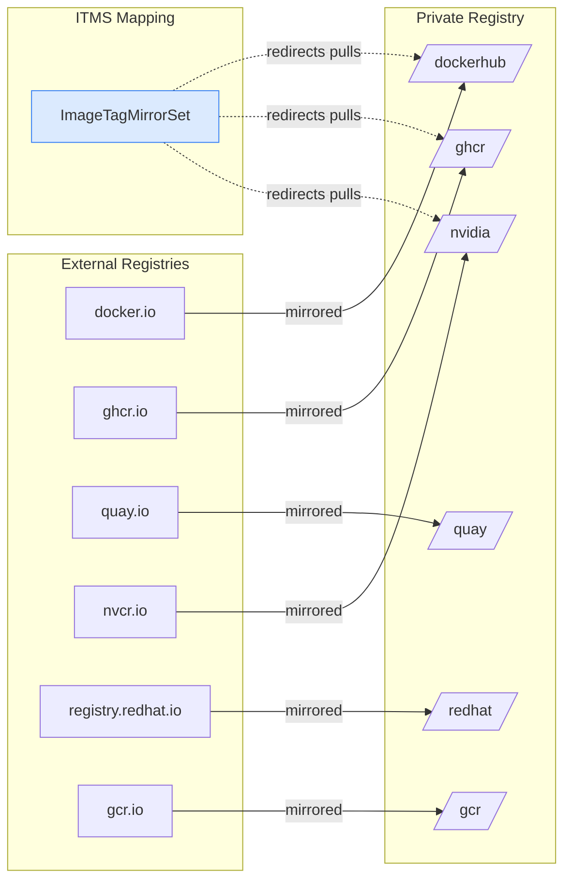

> 💡 **Quick Answer:** Create an `ImageTagMirrorSet` with `imageTagMirrors` entries mapping each external source registry to your private registry. Set `mirrorSourcePolicy: NeverContactSource` for air-gapped clusters or `AllowContactingSource` for fallback. Each entry maps a source prefix (e.g., `docker.io/library`) to one or more mirrors (e.g., `registry.example.com/dockerhub`). Apply the ITMS — MCO rolls out `registries.conf` changes to all nodes.

## The Problem

Production OpenShift clusters pull images from multiple external registries — Docker Hub, GHCR, Quay.io, NVIDIA NGC, Google GCR, and AWS ECR. This creates problems:

- **Rate limits** — Docker Hub limits anonymous pulls to 100/6h, authenticated to 200/6h
- **Air-gapped clusters** — disconnected environments can't reach external registries
- **Compliance** — regulated industries require all images sourced from approved internal registries
- **Reliability** — external registry outages break deployments
- **Egress costs** — cloud clusters pay for outbound traffic to external registries

## The Solution

### Complete External-to-External Registry Map

```yaml
# itms-all-registries.yaml
apiVersion: config.openshift.io/v1
kind: ImageTagMirrorSet
metadata:
  name: external-registry-mirrors
spec:
  imageTagMirrors:

    # ============================================
    # Docker Hub → Private Registry
    # ============================================
    # Official images (docker.io/library/*)
    - source: docker.io/library
      mirrors:
        - registry.example.com/dockerhub/library
      mirrorSourcePolicy: NeverContactSource

    # Docker Hub user/org images (docker.io/*)
    - source: docker.io
      mirrors:
        - registry.example.com/dockerhub
      mirrorSourcePolicy: NeverContactSource

    # ============================================
    # GitHub Container Registry → Private Registry
    # ============================================
    - source: ghcr.io
      mirrors:
        - registry.example.com/ghcr
      mirrorSourcePolicy: NeverContactSource

    # ============================================
    # Quay.io → Private Registry
    # ============================================
    - source: quay.io
      mirrors:
        - registry.example.com/quay
      mirrorSourcePolicy: NeverContactSource

    # ============================================
    # Red Hat Registries → Private Registry
    # ============================================
    - source: registry.redhat.io
      mirrors:
        - registry.example.com/redhat
      mirrorSourcePolicy: NeverContactSource

    - source: registry.access.redhat.com
      mirrors:
        - registry.example.com/redhat-access
      mirrorSourcePolicy: NeverContactSource

    # ============================================
    # NVIDIA NGC → Private Registry
    # ============================================
    - source: nvcr.io
      mirrors:
        - registry.example.com/nvidia
      mirrorSourcePolicy: NeverContactSource

    # ============================================
    # Google Container Registry → Private Registry
    # ============================================
    - source: gcr.io
      mirrors:
        - registry.example.com/gcr
      mirrorSourcePolicy: NeverContactSource

    - source: us-docker.pkg.dev
      mirrors:
        - registry.example.com/google-gar
      mirrorSourcePolicy: NeverContactSource

    # ============================================
    # AWS ECR Public → Private Registry
    # ============================================
    - source: public.ecr.aws
      mirrors:
        - registry.example.com/ecr-public
      mirrorSourcePolicy: NeverContactSource

    # ============================================
    # Kubernetes Registry → Private Registry
    # ============================================
    - source: registry.k8s.io
      mirrors:
        - registry.example.com/k8s
      mirrorSourcePolicy: NeverContactSource

    # ============================================
    # Microsoft MCR → Private Registry
    # ============================================
    - source: mcr.microsoft.com
      mirrors:
        - registry.example.com/mcr
      mirrorSourcePolicy: NeverContactSource

    # ============================================
    # Elastic → Private Registry
    # ============================================
    - source: docker.elastic.co
      mirrors:
        - registry.example.com/elastic
      mirrorSourcePolicy: NeverContactSource

    # ============================================
    # GitLab Registry → Private Registry
    # ============================================
    - source: registry.gitlab.com
      mirrors:
        - registry.example.com/gitlab
      mirrorSourcePolicy: NeverContactSource
```

### Apply and Verify

```bash
# Apply the ITMS
oc apply -f itms-all-registries.yaml

# Watch MCO rollout (triggers node-by-node restart)
oc get mcp -w
# NAME     CONFIG   UPDATED   UPDATING   DEGRADED   MACHINECOUNT   READYMACHINECOUNT
# master   ...      True      False      False      3              3
# worker   ...      False     True       False      5              3

# Wait for all nodes to be updated
oc wait mcp/worker --for=condition=Updated --timeout=30m

# Verify registries.conf on a node
oc debug node/worker-01 -- chroot /host cat /etc/containers/registries.conf.d/99-itms-external-registry-mirrors.conf
```

Expected `registries.conf` output:

```toml
[[registry]]
  prefix = ""
  location = "docker.io/library"
  mirror-by-digest-only = false

  [[registry.mirror]]
    location = "registry.example.com/dockerhub/library"

[[registry]]
  prefix = ""
  location = "docker.io"
  mirror-by-digest-only = false

  [[registry.mirror]]
    location = "registry.example.com/dockerhub"

[[registry]]
  prefix = ""
  location = "nvcr.io"
  mirror-by-digest-only = false

  [[registry.mirror]]
    location = "registry.example.com/nvidia"

# ... (one block per source)
```

### Mirror Images with skopeo

```bash
#!/bin/bash
# mirror-images.sh — Sync external images to private registry

DEST="registry.example.com"
CREDS="--dest-creds admin:${REGISTRY_PASSWORD}"

# Docker Hub official images
for img in nginx:1.27 redis:7.4 postgres:16 python:3.12-slim node:22-slim; do
  echo "Mirroring docker.io/library/${img}..."
  skopeo copy --all \
    docker://docker.io/library/${img} \
    docker://${DEST}/dockerhub/library/${img} ${CREDS}
done

# NVIDIA NGC images
for img in \
  "nvidia/tritonserver:24.12-trtllm-python-py3" \
  "nvidia/cuda:12.6.3-devel-ubi9" \
  "nvidia/nemo:24.12" \
  "nvidia/gpu-operator:v24.9.2"; do
  echo "Mirroring nvcr.io/${img}..."
  skopeo copy --all \
    docker://nvcr.io/${img} \
    docker://${DEST}/nvidia/${img} ${CREDS}
done

# Quay.io images
for img in \
  "argoproj/argocd:v2.13.3" \
  "coreos/etcd:v3.5.17" \
  "strimzi/operator:0.44.0"; do
  echo "Mirroring quay.io/${img}..."
  skopeo copy --all \
    docker://quay.io/${img} \
    docker://${DEST}/quay/${img} ${CREDS}
done

# GitHub Container Registry
for img in \
  "vllm-project/vllm-openai:v0.6.6" \
  "cert-manager/cert-manager-controller:v1.16.3"; do
  echo "Mirroring ghcr.io/${img}..."
  skopeo copy --all \
    docker://ghcr.io/${img} \
    docker://${DEST}/ghcr/${img} ${CREDS}
done

echo "Mirror sync complete"
```

### oc-mirror for Bulk Mirroring

```yaml
# imageset-config.yaml
apiVersion: mirror.openshift.io/v1alpha2
kind: ImageSetConfiguration
mirror:
  additionalImages:
    # Docker Hub
    - name: docker.io/library/nginx:1.27
    - name: docker.io/library/redis:7.4
    - name: docker.io/library/postgres:16
    # NVIDIA
    - name: nvcr.io/nvidia/tritonserver:24.12-trtllm-python-py3
    - name: nvcr.io/nvidia/cuda:12.6.3-devel-ubi9
    # Quay.io
    - name: quay.io/argoproj/argocd:v2.13.3
    # GHCR
    - name: ghcr.io/vllm-project/vllm-openai:v0.6.6
```

```bash
# Run oc-mirror to sync all images and generate ITMS
oc-mirror --config imageset-config.yaml \
  docker://registry.example.com/mirror \
  --dest-skip-tls

# oc-mirror auto-generates ITMS/IDMS manifests
ls oc-mirror-workspace/results-*/
# imageContentSourcePolicy.yaml  (legacy)
# imageTagMirrorSet.yaml          (OCP 4.13+)
# Apply the generated ITMS
oc apply -f oc-mirror-workspace/results-*/imageTagMirrorSet.yaml
```

### Granular Per-Namespace Mapping

```yaml
# For specific org/project mappings within a registry
apiVersion: config.openshift.io/v1
kind: ImageTagMirrorSet
metadata:
  name: project-specific-mirrors
spec:
  imageTagMirrors:
    # Map specific Docker Hub orgs to separate paths
    - source: docker.io/bitnami
      mirrors:
        - registry.example.com/dockerhub/bitnami
      mirrorSourcePolicy: NeverContactSource

    - source: docker.io/grafana
      mirrors:
        - registry.example.com/dockerhub/grafana
      mirrorSourcePolicy: NeverContactSource

    # Map NVIDIA sub-paths separately
    - source: nvcr.io/nvidia/tritonserver
      mirrors:
        - registry.example.com/nvidia/triton
      mirrorSourcePolicy: NeverContactSource

    - source: nvcr.io/nvidia/nemo
      mirrors:
        - registry.example.com/nvidia/nemo
      mirrorSourcePolicy: NeverContactSource

    - source: nvcr.io/nvidia/cuda
      mirrors:
        - registry.example.com/nvidia/cuda
      mirrorSourcePolicy: NeverContactSource
```

### With Fallback (Connected Clusters)

```yaml
# itms-with-fallback.yaml
# For connected clusters that want local caching with external fallback
apiVersion: config.openshift.io/v1
kind: ImageTagMirrorSet
metadata:
  name: registry-cache-with-fallback
spec:
  imageTagMirrors:
    # Try private mirror first, fall back to source
    - source: docker.io
      mirrors:
        - registry.example.com/dockerhub
      mirrorSourcePolicy: AllowContactingSource   # ← fallback enabled

    - source: nvcr.io
      mirrors:
        - registry.example.com/nvidia
      mirrorSourcePolicy: AllowContactingSource

    - source: ghcr.io
      mirrors:
        - registry.example.com/ghcr
      mirrorSourcePolicy: AllowContactingSource
```



## Common Issues

### More Specific Source Must Come First
```yaml
# ❌ WRONG — docker.io catches everything before docker.io/library
- source: docker.io
  mirrors: [registry.example.com/dockerhub]
- source: docker.io/library
  mirrors: [registry.example.com/dockerhub/library]

# ✅ CORRECT — more specific source first
- source: docker.io/library
  mirrors: [registry.example.com/dockerhub/library]
- source: docker.io
  mirrors: [registry.example.com/dockerhub]
```

### Image Not Found After ITMS Applied
```bash
# Verify image exists in mirror
skopeo inspect docker://registry.example.com/dockerhub/library/nginx:1.27

# Common cause: image not yet mirrored to private registry
# ITMS redirects pulls but doesn't copy images — you must mirror first
```

### ITMS vs IDMS — When to Use Each
```bash
# ITMS (ImageTagMirrorSet) — for tag-based references (:latest, :v1.2)
#   Use when: workloads reference images by tag
#   registries.conf: mirror-by-digest-only = false

# IDMS (ImageDigestMirrorSet) — for digest-based references (@sha256:...)
#   Use when: workloads pin images by digest (more secure)
#   registries.conf: mirror-by-digest-only = true

# You can use BOTH simultaneously — they don't conflict
```

### MCO Stuck After Applying ITMS
```bash
# Check MCP status
oc get mcp
# If DEGRADED=True:
oc describe mcp worker | grep -A5 "Degraded"

# Check node status
oc get nodes
oc debug node/<degraded-node> -- chroot /host journalctl -u crio --since "10m ago" | tail -20

# Force re-render if stuck
oc patch mcp/worker --type merge -p '{"spec":{"paused":false}}'
```

## Best Practices

1. **Mirror images before applying ITMS** — the redirect happens immediately but images must exist in the mirror
2. **Use `NeverContactSource` for air-gapped** — prevents accidental external pulls
3. **Use `AllowContactingSource` for connected** — local cache with fallback
4. **More specific sources first** — `docker.io/library` before `docker.io`
5. **Separate ITMS per concern** — one for NVIDIA, one for Docker Hub, etc. (easier to manage)
6. **Pause GPU MCP before applying** — prevent GPU node restarts during business hours
7. **Automate mirroring** — CronJob or oc-mirror pipeline to keep mirrors in sync
8. **Test with `skopeo inspect`** — verify mirror accessibility before applying ITMS

## Key Takeaways

- ITMS maps source registry prefixes to private registry mirrors transparently
- Pods reference original image names — CRI-O redirects to mirrors via `registries.conf`
- `NeverContactSource` = air-gapped (hard fail if mirror missing), `AllowContactingSource` = caching proxy (fallback to source)
- Apply ITMS triggers MCO rolling restart — plan for maintenance window
- Mirror images first with `skopeo copy --all` or `oc-mirror`, then apply ITMS
