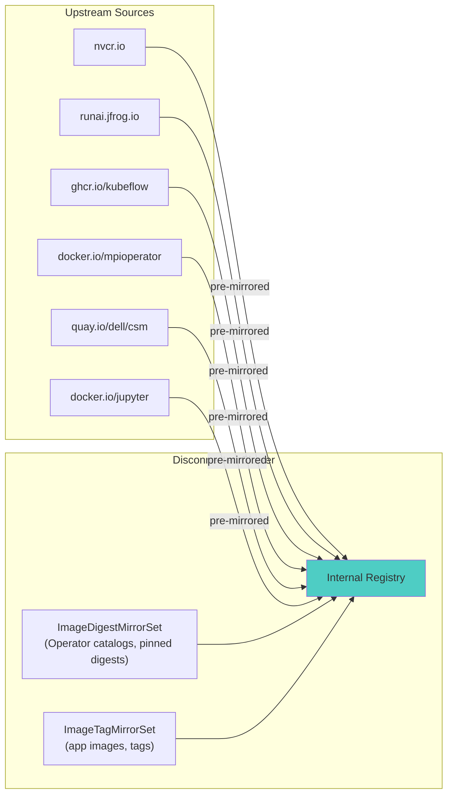

> 💡 **Quick Answer:** A disconnected GPU/AI platform pulls from far more registries than a typical cluster: NVIDIA NGC, Run:ai's JFrog registries, Kubeflow's GHCR images, MPI Operator, storage CSI drivers, and Jupyter notebook images. Map every one of them with a combined `ImageDigestMirrorSet` (digest-pinned Operator catalogs) and `ImageTagMirrorSet` (tag-based application images) so the Machine Config Operator writes a single consistent `registries.conf` to every node — one source registry left unmapped breaks image pulls the first time that specific component reconciles.

## The Problem

A GPU/AI platform on OpenShift pulls container images from many more sources than the base cluster does. Beyond the usual `quay.io` / `registry.redhat.io` traffic, a typical AI stack adds:

- **NVIDIA GPU Operator / drivers** — `nvcr.io`
- **Run:ai scheduler and control plane** — `runai.jfrog.io` (multiple repos: control-plane, cluster components, LLM-serving images)
- **Kubeflow pipelines / training operators** — `ghcr.io/kubeflow`
- **MPI Operator** (distributed training) — `docker.io/mpioperator` (or `registry-1.docker.io/mpioperator`)
- **Storage CSI drivers** for GPU-attached storage — e.g. `quay.io/dell/container-storage-modules`, `registry.k8s.io/sig-storage`
- **Notebook images** — `docker.io/jupyter/scipy-notebook`
- **Observability/database operators** used by the platform — `ghcr.io/cloudnative-pg`, MariaDB, etc.

In a disconnected or regulated environment, **every one of these has to be mirrored and mapped**, or the corresponding component fails to pull the first time it's installed, upgraded, or rescheduled to a new node — often weeks after the initial cluster build, when nobody remembers which registries were mirrored.



## The Solution

### 1. IDMS for digest-pinned sources (Operator catalogs)

Operator Lifecycle Manager and most catalog-driven installs (community operator pipelines, some GPU/observability operators) reference images **by digest**, which requires `ImageDigestMirrorSet`:

```yaml
# idms-ai-platform.yaml
apiVersion: config.openshift.io/v1
kind: ImageDigestMirrorSet
metadata:
  name: idms-ai-platform
spec:
  imageDigestMirrors:
    - source: quay.io/community-operator-pipeline-prod
      mirrors:
        - registry.example.com/mirror/community-operator-pipeline-prod
    - source: ghcr.io/grafana
      mirrors:
        - registry.example.com/mirror/grafana
    - source: docker.io/grafana
      mirrors:
        - registry.example.com/mirror/grafana
    - source: registry-1.docker.io/prom
      mirrors:
        - registry.example.com/mirror/prom
```

### 2. ITMS for tag-based application images

The bulk of the AI/GPU stack pulls by tag, so it belongs in `ImageTagMirrorSet`:

```yaml
# itms-ai-platform.yaml
apiVersion: config.openshift.io/v1
kind: ImageTagMirrorSet
metadata:
  name: itms-ai-platform
spec:
  imageTagMirrors:
    # --- Storage: Dell CSI drivers for GPU-attached storage ---
    - source: quay.io/dell/container-storage-modules
      mirrors:
        - registry.example.com/mirror/dell/container-storage-modules
    - source: registry.k8s.io/sig-storage
      mirrors:
        - registry.example.com/mirror/sig-storage

    # --- Run:ai: scheduler, control plane, LLM-serving images ---
    - source: runai.jfrog.io/op-containers-prod-virt
      mirrors:
        - registry.example.com/mirror/runai/op-containers
    - source: runai.jfrog.io/cp-containers-prod-virt
      mirrors:
        - registry.example.com/mirror/runai/cp-containers
    - source: runai.jfrog.io/core-llm
      mirrors:
        - registry.example.com/mirror/runai/core-llm

    # --- NVIDIA: GPU Operator, driver containers, Clara/cloud-native ---
    - source: nvcr.io/nvidia
      mirrors:
        - registry.example.com/mirror/nvidia
    - source: nvcr.io/nvidia/cloud-native
      mirrors:
        - registry.example.com/mirror/nvidia/cloud-native
    - source: nvcr.io/nvidia/clara
      mirrors:
        - registry.example.com/mirror/nvidia/clara
    - source: nvcr.io/nvidia/mellanox
      mirrors:
        - registry.example.com/mirror/nvidia/mellanox

    # --- Distributed training: Kubeflow + MPI Operator ---
    - source: ghcr.io/kubeflow
      mirrors:
        - registry.example.com/mirror/kubeflow
    - source: registry-1.docker.io/mpioperator
      mirrors:
        - registry.example.com/mirror/mpioperator

    # --- Multi-node inference: LeaderWorkerSet ---
    - source: registry.k8s.io/lws
      mirrors:
        - registry.example.com/mirror/lws

    # --- Notebooks ---
    - source: docker.io/jupyter/scipy-notebook
      mirrors:
        - registry.example.com/mirror/scipy-notebook

    # --- Platform database/observability operators ---
    - source: ghcr.io/cloudnative-pg
      mirrors:
        - registry.example.com/mirror/cloudnative-pg
    - source: docker-registry3.mariadb.com/mariadb-operator
      mirrors:
        - registry.example.com/mirror/mariadb-operator

    # --- Base images used across the stack ---
    - source: registry-1.docker.io/alpine
      mirrors:
        - registry.example.com/mirror/alpine
```

Group entries by platform component (as above) rather than alphabetically — when a new AI component is onboarded, the team adding it can find and extend the right block instead of hunting through an undifferentiated list.

### 3. Apply and roll out

```bash
oc apply -f idms-ai-platform.yaml
oc apply -f itms-ai-platform.yaml

# MCO rolls both out together — one reboot cycle instead of two
oc get mcp -w
oc wait mcp/worker --for=condition=Updated --timeout=30m

# Confirm both landed in registries.conf
oc debug node/<gpu-worker> -- chroot /host cat /etc/containers/registries.conf.d/*ai-platform*.conf
```

### 4. Verify nothing was missed

```bash
# List every registry a namespace's pods actually reference
oc get pods -A -o jsonpath='{range .items[*]}{range .spec.containers[*]}{.image}{"\n"}{end}{end}' | \
  awk -F/ '{print $1}' | sort -u

# Cross-check against your IDMS/ITMS source list — anything not covered
# above but present in this output is an unmirrored registry waiting to
# break the next time that image is pulled on a fresh node.
```

## Common Issues

| Issue | Cause | Fix |
|-------|-------|-----|
| Operator install works, then fails after upgrade | Catalog moved to a new digest not yet mirrored | Re-run the mirror sync (`oc-mirror` / `skopeo sync`) before every catalog version bump |
| Run:ai pod `ImagePullBackOff` only on new nodes | ITMS entry missing one of the three Run:ai repo prefixes (`op-containers`, `cp-containers`, `core-llm`) | Run:ai splits images across repos — mirror each prefix separately, not just the JFrog host |
| MPIJob pods fail to pull `mpioperator` launcher/worker images | `docker.io/mpioperator` vs `registry-1.docker.io/mpioperator` source mismatch | `registries.conf` matches by exact source string — mirror both forms if any workload references the `registry-1.` alias |
| Works in dev, breaks in disconnected prod | Dev cluster had `mirrorSourcePolicy: AllowContactingSource` (silent fallback), prod set `NeverContactSource` | Test with `NeverContactSource` in staging so missing mirrors surface before prod |
| Grafana/Prometheus operator images pull inconsistently | Same image published to both `ghcr.io` and `docker.io` (dual registry publishing) | Mirror both source registries to the same internal path so either reference resolves |

## Best Practices

- **Inventory registries from running pods, not documentation** — `oc get pods -A -o jsonpath=...` against the image field finds what's actually pulled, catching components docs forgot to mention
- **Split IDMS (digest-based, mostly Operators) from ITMS (tag-based, mostly application images)** — mixing them in one manifest makes it harder to reason about which mirror policy applies where
- **Mirror every repo prefix separately for multi-repo vendors** — Run:ai, NVIDIA, and Kubeflow each publish across several sub-paths; mirroring only the registry host misses the rest
- **Set `NeverContactSource` in a staging disconnected cluster before prod** — it turns a missing mirror into an immediate, loud pull failure instead of a silent fallback that later fails in prod
- **Re-mirror before every version bump** — GPU Operator, Run:ai, and Kubeflow all ship frequently; a stale mirror is the most common cause of "it worked in the demo, not in the air-gapped cluster"

## Key Takeaways

- AI/GPU platforms pull from significantly more registries than a base OpenShift cluster — NVIDIA, Run:ai, Kubeflow, MPI Operator, and storage CSI vendors each need explicit mirror entries
- Use `ImageDigestMirrorSet` for digest-pinned Operator catalogs and `ImageTagMirrorSet` for tag-based application images
- Multi-repo vendors (Run:ai, NVIDIA, Kubeflow) need each sub-path mirrored individually, not just the registry host
- Verify coverage by inspecting actual running pod images, not by trusting a static list
- Test with `NeverContactSource` before prod so unmirrored registries fail loudly in staging instead of silently in production
