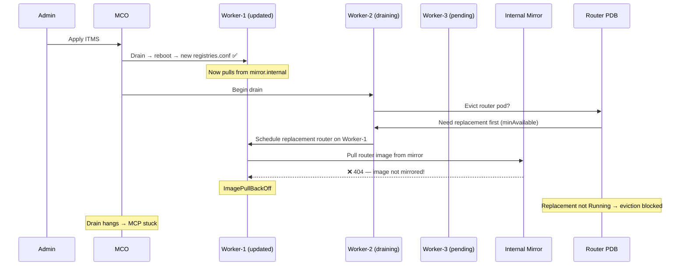

> 💡 **Quick Answer:** When an ITMS updates `registries.conf`, the MCO reboots nodes one-by-one. Nodes already updated resolve images via the new mirror. If the mirror is missing the ingress router image, replacement router pods can't pull on updated nodes → PDB blocks eviction on the next node → MCP deadlocks. Fix: pre-sync all images (especially ingress router images) to the mirror **before** applying the ITMS.

## The Problem

You apply an ImageTagMirrorSet (ITMS) to redirect image pulls from an external registry to an internal mirror. The MCO begins rolling the new `registries.conf` across worker nodes. Halfway through the rollout, the MCP stalls at `UPDATING=True`. Drains hang, nodes stay cordoned, and the cluster is in a split-brain state — some nodes have the old `registries.conf`, others have the new one.

The root cause is a **circular dependency** between the ITMS rollout and the ingress controller's ability to reschedule.

## The Race Condition — Step by Step



### What Happened

1. **ITMS applied** — MCO renders new `registries.conf` routing (e.g.) `quay.io/openshift-release-dev/*` → `mirror.internal.example.com/openshift-release-dev/*`

2. **Worker-1 updated first** — drained successfully (router pod evicted, replacement ran on Worker-3 with old registries.conf pulling from the original registry). Worker-1 reboots with new `registries.conf`.

3. **Worker-2 drain begins** — MCO tries to evict the router pod on Worker-2. The PDB requires `minAvailable: N`, so a replacement must schedule and pass readiness first.

4. **Replacement schedules on Worker-1** (already updated) — CRI-O on Worker-1 reads the **new** `registries.conf` and tries to pull the ingress router image from `mirror.internal.example.com`.

5. **Mirror doesn't have the router image** — the admin mirrored application images but forgot (or didn't know) the ingress router image needs to be in the mirror too. Image pull fails with `ImagePullBackOff`.

6. **PDB can't be satisfied** — the replacement pod never reaches Running. The original pod on Worker-2 can't be evicted. The drain hangs. The MCP is stuck.

7. **All further nodes are blocked** — Worker-3, Worker-4, etc. can't proceed because MCO processes sequentially.

### The Split-Brain State

At this point the cluster has:
- **Worker-1**: new `registries.conf` — pulls from mirror (some images may fail)
- **Worker-2**: cordoned, drain hanging — old `registries.conf` still active
- **Worker-3, 4, 5, 6**: old `registries.conf` — still pulling from original registry

Any pod rescheduled to Worker-1 that needs an image not in the mirror will also fail. The blast radius grows over time as pods are naturally rescheduled.

## The Solution

### Immediate Fix: Unblock the Stuck Rollout

```bash
# Step 1: Identify the stuck node
oc get mcp worker
oc get nodes -l node-role.kubernetes.io/worker= -o custom-columns=\
'NAME:.metadata.name,STATE:.metadata.annotations.machineconfiguration\.openshift\.io/state,CONFIG:.metadata.annotations.machineconfiguration\.openshift\.io/currentConfig'

# Step 2: Find the failing replacement pod
oc get pods -n openshift-ingress -o wide | grep -E "Pending|ImagePull|ErrImage"
# router-custom-7f8b9c-abc12   0/1   ImagePullBackOff   worker-1   ← On the updated node

# Step 3: Check what image is failing
oc describe pod router-custom-7f8b9c-abc12 -n openshift-ingress | grep -A3 "Events:"
# Failed to pull image "quay.io/openshift-release-dev/ocp-v4.0-art-dev@sha256:..."
# → mirror.internal.example.com resolved it but doesn't have it

# Step 4: Mirror the missing image NOW
skopeo copy \
  docker://quay.io/openshift-release-dev/ocp-v4.0-art-dev@sha256:abc123... \
  docker://mirror.internal.example.com/openshift-release-dev/ocp-v4.0-art-dev@sha256:abc123... \
  --src-creds=user:token --dest-tls-verify=false

# Step 5: Delete the failing pod to trigger re-pull
oc delete pod router-custom-7f8b9c-abc12 -n openshift-ingress

# Step 6: Watch the replacement come up
oc get pods -n openshift-ingress -o wide -w
# Once it's Running, the PDB is satisfied, drain unblocks, MCP continues
```

### Alternative: Scale Down to Unblock

If you can't mirror the image quickly:

```bash
# Temporarily scale down the router to unblock the drain
REPLICAS=$(oc get deploy router-custom -n openshift-ingress -o jsonpath='{.spec.replicas}')
oc scale deploy router-custom -n openshift-ingress --replicas=0

# Wait for drain to complete and node to reboot
watch oc get mcp worker

# After all nodes are updated, restore
oc scale deploy router-custom -n openshift-ingress --replicas=$REPLICAS
```

### Nuclear Option: Revert the ITMS

If too many images are missing from the mirror:

```bash
# Delete the ITMS to revert registries.conf
oc delete itms my-tag-mirror-set

# MCO will render a new MachineConfig WITHOUT the mirror entries
# and roll it out — but this means ANOTHER round of drains/reboots
oc get mcp worker -w
```

## Prevention: The Pre-Flight Checklist

### 1. Inventory ALL Images Before Applying ITMS

```bash
# List every image running in the cluster
oc get pods -A -o jsonpath='{range .items[*]}{range .spec.containers[*]}{.image}{"\n"}{end}{range .spec.initContainers[*]}{.image}{"\n"}{end}{end}' | sort -u > /tmp/all-cluster-images.txt

# Don't forget operator images, init containers, and sidecar injectors
oc get csv -A -o json | jq -r '.items[].spec.install.spec.deployments[].spec.template.spec.containers[].image' | sort -u >> /tmp/all-cluster-images.txt

# Check which images match your ITMS source patterns
grep "quay.io" /tmp/all-cluster-images.txt
```

### 2. Mirror ALL Matched Images

```bash
# For each image that matches the ITMS source:
while read img; do
  echo "Mirroring: $img"
  skopeo copy "docker://$img" \
    "docker://mirror.internal.example.com/${img#*/}" \
    --all --src-creds=user:token
done < /tmp/matched-images.txt
```

### 3. Verify Mirror Completeness

```bash
# Test that every matched image is accessible from the mirror
while read img; do
  MIRROR_IMG="mirror.internal.example.com/${img#*/}"
  if skopeo inspect "docker://$MIRROR_IMG" --tls-verify=false > /dev/null 2>&1; then
    echo "✅ $MIRROR_IMG"
  else
    echo "❌ MISSING: $MIRROR_IMG"
  fi
done < /tmp/matched-images.txt
```

### 4. Apply ITMS Only After Full Mirror Sync

```bash
# All images verified? Now safe to apply
oc apply -f itms.yaml
```

### 5. Use a Dedicated MCP for Critical Infra

Separate ingress/router nodes into their own MCP so they update independently:

```yaml
apiVersion: machineconfiguration.openshift.io/v1
kind: MachineConfigPool
metadata:
  name: infra
spec:
  machineConfigSelector:
    matchExpressions:
      - key: machineconfiguration.openshift.io/role
        operator: In
        values: [worker, infra]
  nodeSelector:
    matchLabels:
      node-role.kubernetes.io/infra: ""
  maxUnavailable: 1
  paused: true   # Update infra nodes manually after workers succeed
```

## Why This Race Condition Is Hard to Catch

1. **First node always succeeds** — Worker-1's router pod gets evicted and rescheduled to a node still on the OLD `registries.conf`, so the pull works fine from the original registry.

2. **Failure only appears on second+ node** — by then, the replacement targets Worker-1 (now on the NEW `registries.conf`), and the mirror lookup fails.

3. **Non-obvious image dependency** — admins think of application images but forget that infrastructure components (ingress routers, monitoring agents, logging collectors) also pull images affected by the ITMS.

4. **ITMS is tag-based** — unlike IDMS (digest-based), ITMS matches on tag patterns. A broad source like `quay.io` catches far more images than expected, including OpenShift infrastructure images.

## Common Issues

### Partial Mirror: Some Tags Work, Others Don't

```bash
# ITMS with mirrorSourcePolicy: NeverContactSource means NO fallback
# If the mirror is missing ANY matched image, it fails hard
spec:
  imageTagMirrors:
    - mirrors:
        - mirror.internal.example.com
      source: quay.io
      mirrorSourcePolicy: NeverContactSource   # ← Dangerous without full sync
```

Use `AllowContactingSource` during migration to allow fallback:
```yaml
      mirrorSourcePolicy: AllowContactingSource  # Falls back to original if mirror misses
```

### Multiple Ingress Controllers Compound the Problem

If you have 5 custom IngressControllers, each with `hostNetwork` and strict PDBs, the drain has 5× the chance of hitting a mirror miss.

### ITMS + IDMS Ordering Confusion

```bash
# Check which mirror sets are active
oc get itms,idms
# ITMS and IDMS entries are merged into registries.conf
# More specific sources take priority
```

## Best Practices

- **Always pre-sync mirrors before applying ITMS** — treat it like a database migration
- **Use `AllowContactingSource` initially** — switch to `NeverContactSource` only after verifying all images are mirrored
- **Include infrastructure images** in your mirror plan — ingress routers, monitoring, logging, operators
- **Pause MCP before applying ITMS** — sync mirrors while paused, then unpause
- **Separate critical infra into dedicated MCP** — control update order explicitly
- **Test with one node first** — `maxUnavailable: 1` and watch the full cycle complete before continuing

## Key Takeaways

- ITMS changes `registries.conf` via MCO — rolling reboot across all nodes in the MCP
- Race condition: updated nodes resolve images via mirror; if mirror is incomplete, pods fail to pull
- hostNetwork ingress routers with PDBs amplify the problem — drain deadlocks when replacements can't pull images
- **Pre-sync ALL images** (including infrastructure) to the mirror before applying ITMS
- Use `AllowContactingSource` as a safety net during migration
- First node success is deceptive — the failure only manifests on subsequent nodes
