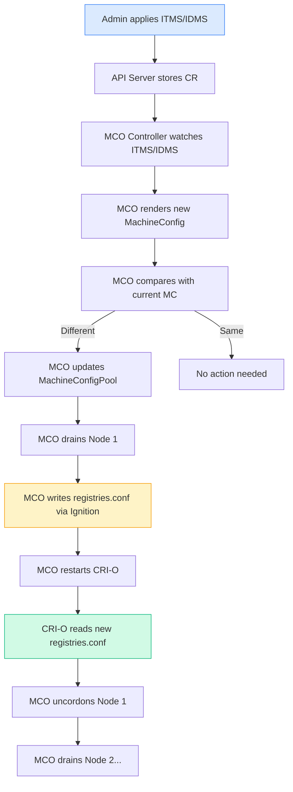

> 💡 **Quick Answer:** When you apply an ITMS/IDMS, the MCO (MachineConfig Operator) renders a new MachineConfig containing the updated `/etc/containers/registries.conf`. Since RHCOS is an immutable OS, the MCO is the only way to modify system files. It drains each node, writes the new `registries.conf` via Ignition, restarts CRI-O (which reads the new mirror rules), and uncordons the node. CRI-O then transparently redirects image pulls from source registries to mirrors — pods never know the difference.

## The Problem

OpenShift runs on **Red Hat CoreOS (RHCOS)**, an immutable operating system where:

- The root filesystem is **read-only** (OSTree-based)
- You **cannot SSH in and edit files** — changes don't survive reboots
- System configuration is managed exclusively through **MachineConfig** objects
- The only way to modify `/etc/containers/registries.conf` is through the **MachineConfig Operator (MCO)**

Understanding this chain is critical for troubleshooting air-gapped clusters when image pulls fail.

## The Solution

### The Complete Chain: ITMS → MCO → MachineConfig → registries.conf → CRI-O



### Step 1: ITMS Is Applied

```yaml
# What you apply
apiVersion: config.openshift.io/v1
kind: ImageTagMirrorSet
metadata:
  name: nvidia-mirror
spec:
  imageTagMirrors:
    - source: nvcr.io
      mirrors:
        - registry.example.com/nvidia
      mirrorSourcePolicy: NeverContactSource
```

```bash
oc apply -f itms-nvidia.yaml

# The ITMS is stored in etcd as a cluster-scoped resource
oc get itms nvidia-mirror -o yaml
```

### Step 2: MCO Detects the Change

The Machine Config Operator **watches** all ITMS, IDMS, and ICSP resources:

```bash
# MCO components involved
oc get pods -n openshift-machine-config-operator
# NAME                                         READY
# machine-config-controller-6b4f5c9b8d-xyz     1/1    ← watches ITMS/IDMS
# machine-config-daemon-abc12                  2/2    ← runs on every node
# machine-config-daemon-def34                  2/2
# machine-config-operator-7c5d8f9b6-xyz        1/1    ← manages the controller

# The controller logs show ITMS detection
oc logs -n openshift-machine-config-operator \
  deployment/machine-config-controller -c machine-config-controller | \
  grep -i "imagetagmirror\|registries"
```

### Step 3: MCO Renders a MachineConfig

The MCO translates the ITMS into a MachineConfig with the `registries.conf` drop-in file:

```bash
# List all MachineConfigs — look for the generated one
oc get mc --sort-by=.metadata.creationTimestamp | tail -10
# NAME                                          GENERATEDBYCONTROLLER   CREATED
# 99-worker-generated-registries                4.15.0-rc.1             5m ago
# 99-master-generated-registries                4.15.0-rc.1             5m ago

# Inspect the generated MachineConfig
oc get mc 99-worker-generated-registries -o jsonpath='{.spec.config.storage.files[0]}' | jq .
```

The generated MachineConfig contains:

```json
{
  "path": "/etc/containers/registries.conf.d/99-worker-generated-registries.conf",
  "mode": 420,
  "contents": {
    "source": "data:text/plain;charset=utf-8;base64,<base64-encoded-registries.conf>"
  }
}
```

Decode the actual content:

```bash
# Extract and decode the registries.conf from the MachineConfig
oc get mc 99-worker-generated-registries -o json | \
  jq -r '.spec.config.storage.files[0].contents.source' | \
  sed 's|data:text/plain;charset=utf-8;base64,||' | \
  base64 -d
```

Output — the actual `registries.conf` TOML:

```toml
# Generated by MCO from ImageTagMirrorSet/nvidia-mirror
[[registry]]
  prefix = ""
  location = "nvcr.io"
  mirror-by-digest-only = false

  [[registry.mirror]]
    location = "registry.example.com/nvidia"

# mirror-by-digest-only = false  ← ITMS (tag-based)
# mirror-by-digest-only = true   ← IDMS (digest-based)
```

### Step 4: MCO Rolls Out to Nodes

The MCO updates nodes one-by-one (or in batches per `maxUnavailable`):

```bash
# Watch the rollout
oc get mcp -w
# NAME     CONFIG                          UPDATED   UPDATING   DEGRADED   MACHINECOUNT   READYMACHINECOUNT
# master   rendered-master-abc123          False     True       False      3              1
# worker   rendered-worker-def456          False     True       False      5              2

# For each node, the MCO daemon performs:
# 1. Cordon (mark unschedulable)
# 2. Drain (evict pods)
# 3. Write files via Ignition
# 4. Restart CRI-O (and kubelet)
# 5. Uncordon (mark schedulable)

# Check individual node progress
oc get nodes -o custom-columns=\
  NAME:.metadata.name,\
  STATUS:.status.conditions[-1].type,\
  MCD:.metadata.annotations.machineconfiguration\\.openshift\\.io/state
```

### Step 5: registries.conf on the Node

```bash
# Debug a node to see the actual file
oc debug node/worker-01 -- chroot /host bash -c '
  echo "=== Main registries.conf ==="
  cat /etc/containers/registries.conf
  echo ""
  echo "=== Drop-in files ==="
  ls -la /etc/containers/registries.conf.d/
  echo ""
  echo "=== Generated ITMS config ==="
  cat /etc/containers/registries.conf.d/99-worker-generated-registries.conf
'
```

The file structure on RHCOS:

```
/etc/containers/
├── registries.conf                    # Base config (unblocked-registries, etc.)
└── registries.conf.d/
    ├── 00-unqualified-search.conf     # search = ["registry.redhat.io", "docker.io"]
    ├── 01-blocked.conf                # blocked registries (if any)
    └── 99-worker-generated-registries.conf  # ← MCO writes ITMS/IDMS rules here
```

### Step 6: CRI-O Uses the New Config

CRI-O reads `registries.conf` + all drop-in files on startup:

```bash
# CRI-O is restarted by MCO after writing the new config
oc debug node/worker-01 -- chroot /host systemctl status crio

# Verify CRI-O loaded the mirror config
oc debug node/worker-01 -- chroot /host journalctl -u crio --since "10m ago" | \
  grep -i "registries\|mirror"

# Test that CRI-O resolves mirrors correctly
oc debug node/worker-01 -- chroot /host crictl pull nvcr.io/nvidia/cuda:12.6.3-devel-ubi9
# CRI-O will try registry.example.com/nvidia/nvidia/cuda:12.6.3-devel-ubi9 first
# If NeverContactSource: fails if not in mirror
# If AllowContactingSource: falls back to nvcr.io
```

### Why Immutable OS Requires This

```bash
# RHCOS is OSTree-based — root filesystem is read-only
oc debug node/worker-01 -- chroot /host bash -c '
  # This FAILS on RHCOS:
  echo "test" > /etc/containers/registries.conf.d/test.conf
  # Error: Read-only file system

  # The only way to write system files is through MachineConfig
  # MCO temporarily remounts /etc as writable during config application

  # Verify OSTree status
  rpm-ostree status
'
```

The MCO daemon (`machine-config-daemon`) on each node:

1. Receives the new rendered MachineConfig
2. Compares it with the current on-disk state
3. If different: **drains the node**, applies changes via Ignition, **reboots** (or restarts CRI-O)
4. After reboot: verifies the config matches, reports success to MCO controller

### How Image Pull Resolution Works

When a pod specifies `image: nvcr.io/nvidia/tritonserver:24.12`:

```
1. kubelet calls CRI-O: "pull nvcr.io/nvidia/tritonserver:24.12"
2. CRI-O reads /etc/containers/registries.conf.d/*
3. CRI-O finds: nvcr.io → mirror registry.example.com/nvidia
4. CRI-O tries: registry.example.com/nvidia/nvidia/tritonserver:24.12
5a. If found → pull succeeds, pod starts
5b. If NOT found AND NeverContactSource → pull FAILS (ImagePullBackOff)
5c. If NOT found AND AllowContactingSource → try nvcr.io directly (fallback)
```

```bash
# Watch this in real-time with CRI-O debug logging
oc debug node/worker-01 -- chroot /host bash -c '
  # Temporarily enable debug logging
  crio config | grep log_level
  # Restart with debug:
  # Edit /etc/crio/crio.conf.d/99-debug.conf
  # [crio.runtime]
  # log_level = "debug"
  
  # Then check pulls:
  journalctl -u crio -f | grep -i "pull\|mirror\|registry"
'
```

### Manually Verifying the Full Chain

```bash
#!/bin/bash
# verify-itms-chain.sh — End-to-end ITMS verification

echo "=== 1. ITMS Resources ==="
oc get itms -o custom-columns=NAME:.metadata.name,MIRRORS:.spec.imageTagMirrors[*].source

echo ""
echo "=== 2. Generated MachineConfigs ==="
oc get mc | grep generated-registries

echo ""
echo "=== 3. MachineConfigPool Status ==="
oc get mcp -o custom-columns=\
  NAME:.metadata.name,\
  UPDATED:.status.conditions[?@.type==\"Updated\"].status,\
  UPDATING:.status.conditions[?@.type==\"Updating\"].status,\
  DEGRADED:.status.conditions[?@.type==\"Degraded\"].status

echo ""
echo "=== 4. Node registries.conf (worker-01) ==="
oc debug node/worker-01 --quiet -- chroot /host \
  cat /etc/containers/registries.conf.d/99-worker-generated-registries.conf 2>/dev/null || \
  echo "(no drop-in file found)"

echo ""
echo "=== 5. Test Pull Resolution ==="
# Deploy a test pod to verify mirror resolution
oc run mirror-test --image=nvcr.io/nvidia/cuda:12.6.3-base-ubi9 \
  --restart=Never --command -- sleep 10 2>&1
sleep 5
oc get pod mirror-test -o jsonpath='{.status.containerStatuses[0].imageID}'
oc delete pod mirror-test --ignore-not-found
```

## Common Issues

### registries.conf Not Updated After Applying ITMS
```bash
# Check if MCO is processing
oc get mcp worker -o jsonpath='{.status.conditions[?(@.type=="Updating")].status}'
# "True" = still rolling out
# "False" + Updated="False" = stuck

# Check MCO controller logs
oc logs -n openshift-machine-config-operator deploy/machine-config-controller \
  -c machine-config-controller --tail=50 | grep -i error
```

### Node Stuck in "Updating" State
```bash
# Find the stuck node
oc get nodes -o json | jq -r '.items[] | 
  select(.metadata.annotations["machineconfiguration.openshift.io/state"] == "Working") |
  .metadata.name'

# Check the MCD logs on that node
oc logs -n openshift-machine-config-operator \
  $(oc get pods -n openshift-machine-config-operator -l k8s-app=machine-config-daemon \
    --field-selector spec.nodeName=<stuck-node> -o name) \
  -c machine-config-daemon --tail=100
```

### ITMS Applied But Pulls Still Go to Source
```bash
# Verify the registries.conf drop-in exists and has correct content
oc debug node/worker-01 -- chroot /host cat \
  /etc/containers/registries.conf.d/99-worker-generated-registries.conf

# Check for conflicting configs
oc debug node/worker-01 -- chroot /host ls -la /etc/containers/registries.conf.d/

# Verify CRI-O was restarted after the change
oc debug node/worker-01 -- chroot /host systemctl show crio \
  --property=ActiveEnterTimestamp
```

### Understanding mirror-by-digest-only
```toml
# ITMS generates:
mirror-by-digest-only = false
# → Mirrors work for BOTH tag pulls (:v1.2) AND digest pulls (@sha256:...)

# IDMS generates:
mirror-by-digest-only = true
# → Mirrors ONLY work for digest pulls (@sha256:...)
# → Tag pulls (:v1.2) go directly to source (bypass mirror!)
```

## Best Practices

1. **Never manually edit files on RHCOS** — always use MachineConfig or ITMS/IDMS
2. **Monitor MCO rollout** before and after ITMS changes with `oc get mcp -w`
3. **Pause GPU/compute MCPs** before applying ITMS to control when those nodes restart
4. **Use `oc debug node`** to verify `registries.conf` content — don't assume
5. **Check CRI-O logs** when pulls fail — they show exactly which mirrors were tried
6. **Separate ITMS per concern** — easier to debug than one giant ITMS
7. **Test with `crictl pull`** on a debug node before deploying workloads
8. **Use ITMS for tags, IDMS for digests** — or ITMS for both (less restrictive)

## Key Takeaways

- RHCOS is immutable — `/etc/containers/registries.conf` can only be modified via MachineConfig
- ITMS/IDMS → MCO controller → rendered MachineConfig → MCO daemon → write file → restart CRI-O
- CRI-O reads `registries.conf` drop-in files and transparently redirects pulls to mirrors
- `NeverContactSource` = hard air-gap (pull fails if not in mirror)
- The entire chain is node-by-node rolling update: drain → write → restart CRI-O → uncordon
- Understanding this chain is essential for debugging ImagePullBackOff in air-gapped clusters
