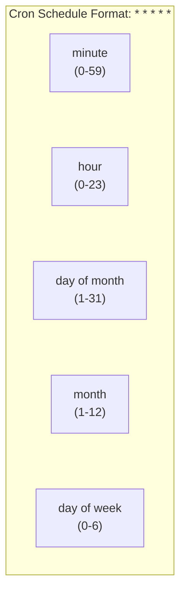

## The Problem

You need to run batch processing tasks or scheduled jobs in Kubernetes, not long-running services.

## The Solution

Use Jobs for one-time tasks and CronJobs for scheduled recurring tasks.

## Jobs

### Basic Job

```yaml
apiVersion: batch/v1
kind: Job
metadata:
  name: batch-job
spec:
  template:
    spec:
      containers:
      - name: worker
        image: busybox
        command: ["echo", "Hello from Kubernetes Job!"]
      restartPolicy: Never
  backoffLimit: 4
```

Run it:
```bash
kubectl apply -f job.yaml

# Watch progress
kubectl get jobs -w

# View pods
kubectl get pods -l job-name=batch-job

# Get logs
kubectl logs job/batch-job
```

### Job with Multiple Completions

Run a job multiple times:

```yaml
apiVersion: batch/v1
kind: Job
metadata:
  name: batch-job-multiple
spec:
  completions: 5        # Run 5 times
  parallelism: 2        # Run 2 at a time
  template:
    spec:
      containers:
      - name: worker
        image: busybox
        command: ["sh", "-c", "echo Processing item $JOB_COMPLETION_INDEX && sleep 5"]
      restartPolicy: Never
```

### Job with Indexed Completions

Each pod gets a unique index:

```yaml
apiVersion: batch/v1
kind: Job
metadata:
  name: indexed-job
spec:
  completions: 5
  parallelism: 5
  completionMode: Indexed
  template:
    spec:
      containers:
      - name: worker
        image: busybox
        command:
        - sh
        - -c
        - |
          echo "Processing item $JOB_COMPLETION_INDEX"
          # Index is available as JOB_COMPLETION_INDEX env var
      restartPolicy: Never
```

### Job Failure Handling

```yaml
apiVersion: batch/v1
kind: Job
metadata:
  name: resilient-job
spec:
  backoffLimit: 3           # Retry 3 times on failure
  activeDeadlineSeconds: 600 # Timeout after 10 minutes
  ttlSecondsAfterFinished: 3600 # Cleanup after 1 hour
  template:
    spec:
      containers:
      - name: worker
        image: myapp:latest
        command: ["./process.sh"]
      restartPolicy: OnFailure  # Restart container on failure
```

## CronJobs

### Basic CronJob

```yaml
apiVersion: batch/v1
kind: CronJob
metadata:
  name: cleanup-job
spec:
  schedule: "0 2 * * *"  # Run daily at 2 AM
  jobTemplate:
    spec:
      template:
        spec:
          containers:
          - name: cleanup
            image: busybox
            command:
            - /bin/sh
            - -c
            - echo "Running cleanup at $(date)"
          restartPolicy: OnFailure
```

### Cron Schedule Syntax



Common patterns:
| Schedule | Description |
|----------|-------------|
| `0 * * * *` | Every hour |
| `0 0 * * *` | Daily at midnight |
| `0 2 * * *` | Daily at 2 AM |
| `0 0 * * 0` | Weekly on Sunday |
| `0 0 1 * *` | Monthly on 1st |
| `*/15 * * * *` | Every 15 minutes |
| `0 9-17 * * 1-5` | Weekdays 9-5 |

### Production CronJob

```yaml
apiVersion: batch/v1
kind: CronJob
metadata:
  name: database-backup
spec:
  schedule: "0 3 * * *"
  timeZone: "America/New_York"  # K8s 1.27+
  concurrencyPolicy: Forbid      # Don't run if previous still running
  successfulJobsHistoryLimit: 3  # Keep last 3 successful jobs
  failedJobsHistoryLimit: 1      # Keep last failed job
  startingDeadlineSeconds: 200   # Start within 200s of scheduled time
  jobTemplate:
    spec:
      backoffLimit: 2
      activeDeadlineSeconds: 3600
      template:
        spec:
          containers:
          - name: backup
            image: postgres:15
            command:
            - /bin/sh
            - -c
            - |
              pg_dump -h $DB_HOST -U $DB_USER $DB_NAME | gzip > /backup/db-$(date +%Y%m%d).sql.gz
            env:
            - name: DB_HOST
              value: "postgres.default.svc"
            - name: DB_USER
              valueFrom:
                secretKeyRef:
                  name: db-credentials
                  key: username
            - name: PGPASSWORD
              valueFrom:
                secretKeyRef:
                  name: db-credentials
                  key: password
            - name: DB_NAME
              value: "myapp"
            volumeMounts:
            - name: backup
              mountPath: /backup
            resources:
              requests:
                memory: "256Mi"
                cpu: "100m"
              limits:
                memory: "512Mi"
                cpu: "500m"
          volumes:
          - name: backup
            persistentVolumeClaim:
              claimName: backup-pvc
          restartPolicy: OnFailure
```

### Concurrency Policies

| Policy | Behavior |
|--------|----------|
| `Allow` | Multiple jobs can run concurrently (default) |
| `Forbid` | Skip new job if previous still running |
| `Replace` | Cancel current job, start new one |

## Managing Jobs and CronJobs

```bash
# List all jobs
kubectl get jobs

# List CronJobs
kubectl get cronjobs

# Describe CronJob
kubectl describe cronjob database-backup

# View job history
kubectl get jobs --selector=job-name=database-backup

# Manually trigger a CronJob
kubectl create job --from=cronjob/database-backup manual-backup

# Suspend a CronJob
kubectl patch cronjob database-backup -p '{"spec":{"suspend":true}}'

# Delete completed jobs
kubectl delete jobs --field-selector status.successful=1
```

## Email/Slack Notification Example

```yaml
apiVersion: batch/v1
kind: Job
metadata:
  name: report-job
spec:
  template:
    spec:
      containers:
      - name: report
        image: myapp:latest
        command:
        - /bin/sh
        - -c
        - |
          ./generate-report.sh
          if [ $? -eq 0 ]; then
            curl -X POST $SLACK_WEBHOOK -d '{"text":"✅ Report generated successfully"}'
          else
            curl -X POST $SLACK_WEBHOOK -d '{"text":"❌ Report generation failed"}'
            exit 1
          fi
        env:
        - name: SLACK_WEBHOOK
          valueFrom:
            secretKeyRef:
              name: slack-webhook
              key: url
      restartPolicy: Never
```

## Best Practices

### 1. Set Deadlines

```yaml
spec:
  activeDeadlineSeconds: 3600  # Prevent jobs from running forever
```

### 2. Clean Up Completed Jobs

```yaml
spec:
  ttlSecondsAfterFinished: 86400  # Auto-delete after 24 hours
```

### 3. Use Resource Limits

```yaml
resources:
  limits:
    memory: "1Gi"
    cpu: "1"
```

### 4. Handle Failures Gracefully

```yaml
spec:
  backoffLimit: 3
  template:
    spec:
      restartPolicy: OnFailure
```

### 5. Use Init Containers for Dependencies

```yaml
initContainers:
- name: wait-for-db
  image: busybox
  command: ['sh', '-c', 'until nc -z postgres 5432; do sleep 2; done']
```

## Key Takeaways

- Jobs run tasks to completion
- CronJobs schedule recurring tasks
- Use `backoffLimit` for retry control
- Use `activeDeadlineSeconds` for timeouts
- Set `concurrencyPolicy: Forbid` to prevent overlap
- Always set resource limits for batch jobs

---

## 📘 Go Further with Kubernetes Recipes

**Love this recipe? There's so much more!** This is just one of **100+ hands-on recipes** in our comprehensive **[Kubernetes Recipes book](https://amzn.to/3DzC8QA)**.

Inside the book, you'll master:
- ✅ Production-ready deployment strategies
- ✅ Advanced networking and security patterns  
- ✅ Observability, monitoring, and troubleshooting
- ✅ Real-world best practices from industry experts

> *"The practical, recipe-based approach made complex Kubernetes concepts finally click for me."*

**👉 [Get Your Copy Now](https://amzn.to/3DzC8QA)** — Start building production-grade Kubernetes skills today!
