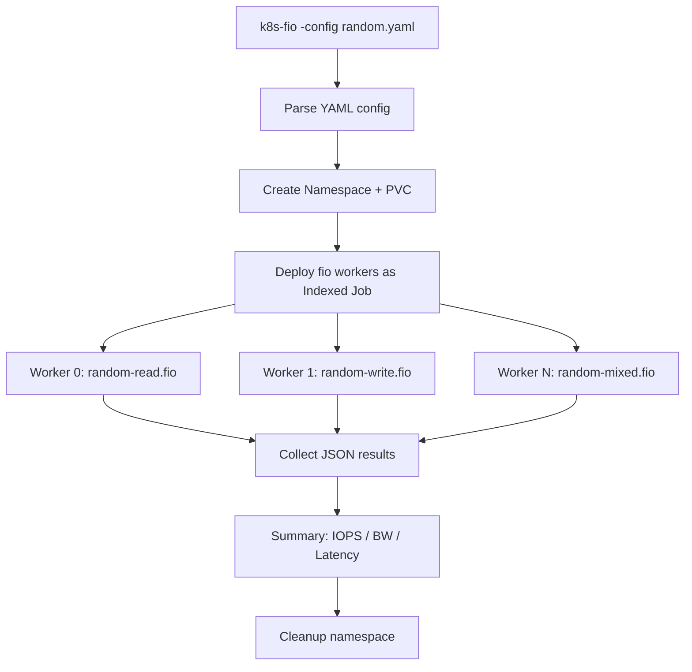

> 💡 **Quick Answer:** Benchmark OpenShift and Kubernetes storage using fio with YAML config profiles for random and sequential I/O patterns. Automate distributed fio testing with reusable configuration files.

## The Problem

Running ad-hoc `fio` commands with dozens of flags is error-prone and not reproducible. Teams need standardized, version-controlled benchmark profiles that can be executed consistently across different storage backends (ODF/Ceph, NFS, local NVMe, cloud CSI). You want to run something like:

```bash
k8s-fio -config config-fio-random.yaml
k8s-fio -config config-fio-sequential.yaml
```

And get reproducible, comparable results every time.

## The Solution

### Config-Driven fio Benchmark Framework

Create a reusable framework with YAML config files that define fio profiles, target StorageClasses, and worker count:

### Random I/O Config Profile

```yaml
# config-fio-random.yaml
# Random I/O benchmark — simulates database workloads (OLTP)
apiVersion: v1
kind: ConfigMap
metadata:
  name: fio-config-random
  labels:
    benchmark: fio
    profile: random
data:
  config.yaml: |
    profile: random
    storageClass: ocs-storagecluster-ceph-rbd
    volumeSize: 50Gi
    accessMode: ReadWriteOnce
    workers: 4
    timeout: 300
    cleanup: true
  
  random-read.fio: |
    [global]
    ioengine=libaio
    direct=1
    time_based
    runtime=120
    ramp_time=10
    group_reporting
    directory=/data
    size=4G

    [random-read-4k]
    description=Random 4K reads — measures IOPS
    rw=randread
    bs=4k
    numjobs=8
    iodepth=64
  
  random-write.fio: |
    [global]
    ioengine=libaio
    direct=1
    time_based
    runtime=120
    ramp_time=10
    group_reporting
    directory=/data
    size=4G

    [random-write-4k]
    description=Random 4K writes — worst case for storage
    rw=randwrite
    bs=4k
    numjobs=8
    iodepth=32
  
  random-mixed.fio: |
    [global]
    ioengine=libaio
    direct=1
    time_based
    runtime=120
    ramp_time=10
    group_reporting
    directory=/data
    size=4G

    [random-rw-70-30]
    description=Mixed random 70% read 30% write — realistic OLTP
    rw=randrw
    rwmixread=70
    bs=8k
    numjobs=8
    iodepth=32
```

### Sequential I/O Config Profile

```yaml
# config-fio-sequential.yaml
# Sequential I/O benchmark — simulates streaming, backup, ETL workloads
apiVersion: v1
kind: ConfigMap
metadata:
  name: fio-config-sequential
  labels:
    benchmark: fio
    profile: sequential
data:
  config.yaml: |
    profile: sequential
    storageClass: ocs-storagecluster-ceph-rbd
    volumeSize: 100Gi
    accessMode: ReadWriteOnce
    workers: 4
    timeout: 300
    cleanup: true
  
  seq-write.fio: |
    [global]
    ioengine=libaio
    direct=1
    time_based
    runtime=120
    ramp_time=10
    group_reporting
    directory=/data
    size=8G

    [sequential-write-1M]
    description=Sequential 1M writes — measures throughput (MB/s)
    rw=write
    bs=1M
    numjobs=4
    iodepth=32
  
  seq-read.fio: |
    [global]
    ioengine=libaio
    direct=1
    time_based
    runtime=120
    ramp_time=10
    group_reporting
    directory=/data
    size=8G

    [sequential-read-1M]
    description=Sequential 1M reads — streaming throughput
    rw=read
    bs=1M
    numjobs=4
    iodepth=32
  
  seq-mixed.fio: |
    [global]
    ioengine=libaio
    direct=1
    time_based
    runtime=120
    ramp_time=10
    group_reporting
    directory=/data
    size=8G

    [sequential-rw-1M]
    description=Sequential mixed read/write — backup/restore simulation
    rw=rw
    rwmixread=50
    bs=1M
    numjobs=4
    iodepth=16
```

### The k8s-fio Runner Script

```bash
#!/bin/bash
# k8s-fio — Run fio benchmarks on Kubernetes/OpenShift from config profiles
# Usage: k8s-fio -config config-fio-random.yaml
#        k8s-fio -config config-fio-sequential.yaml

set -euo pipefail

usage() {
  echo "Usage: $0 -config <config-file.yaml> [-namespace <ns>] [-output <dir>]"
  exit 1
}

CONFIG=""
NAMESPACE="fio-benchmark"
OUTPUT_DIR="./fio-results"

while [[ $# -gt 0 ]]; do
  case $1 in
    -config)   CONFIG="$2"; shift 2;;
    -namespace) NAMESPACE="$2"; shift 2;;
    -output)   OUTPUT_DIR="$2"; shift 2;;
    *)         usage;;
  esac
done

[[ -z "$CONFIG" ]] && usage

echo "╔══════════════════════════════════════════╗"
echo "║     k8s-fio Storage Benchmark Runner     ║"
echo "╚══════════════════════════════════════════╝"
echo "Config:    $CONFIG"
echo "Namespace: $NAMESPACE"
echo "Output:    $OUTPUT_DIR"
echo ""

# Apply the config
kubectl create namespace "$NAMESPACE" --dry-run=client -o yaml | kubectl apply -f -
kubectl apply -n "$NAMESPACE" -f "$CONFIG"

# Extract settings from the config.yaml inside the ConfigMap
CM_NAME=$(kubectl get configmap -n "$NAMESPACE" -l benchmark=fio -o jsonpath='{.items[0].metadata.name}')
PROFILE=$(kubectl get configmap "$CM_NAME" -n "$NAMESPACE" -o jsonpath='{.data.config\.yaml}' | grep profile | awk '{print $2}')
STORAGE_CLASS=$(kubectl get configmap "$CM_NAME" -n "$NAMESPACE" -o jsonpath='{.data.config\.yaml}' | grep storageClass | awk '{print $2}')
VOLUME_SIZE=$(kubectl get configmap "$CM_NAME" -n "$NAMESPACE" -o jsonpath='{.data.config\.yaml}' | grep volumeSize | awk '{print $2}')
ACCESS_MODE=$(kubectl get configmap "$CM_NAME" -n "$NAMESPACE" -o jsonpath='{.data.config\.yaml}' | grep accessMode | awk '{print $2}')
WORKERS=$(kubectl get configmap "$CM_NAME" -n "$NAMESPACE" -o jsonpath='{.data.config\.yaml}' | grep workers | awk '{print $2}')

echo "Profile:      $PROFILE"
echo "StorageClass: $STORAGE_CLASS"
echo "Volume:       $VOLUME_SIZE ($ACCESS_MODE)"
echo "Workers:      $WORKERS"
echo ""

# Create PVC
cat <<EOF | kubectl apply -n "$NAMESPACE" -f -
apiVersion: v1
kind: PersistentVolumeClaim
metadata:
  name: fio-data
spec:
  accessModes: [$ACCESS_MODE]
  storageClassName: $STORAGE_CLASS
  resources:
    requests:
      storage: $VOLUME_SIZE
EOF

echo "Waiting for PVC to bind..."
kubectl wait --for=jsonpath='{.status.phase}'=Bound pvc/fio-data -n "$NAMESPACE" --timeout=120s

# Get list of fio job files from ConfigMap
FIO_FILES=$(kubectl get configmap "$CM_NAME" -n "$NAMESPACE" -o json | \
  python3 -c "import sys,json; d=json.load(sys.stdin)['data']; print(' '.join(k for k in d if k.endswith('.fio')))")

mkdir -p "$OUTPUT_DIR"

for FIO_FILE in $FIO_FILES; do
  JOB_NAME="fio-${FIO_FILE%.fio}"
  echo ""
  echo "━━━━━━━━━━━━━━━━━━━━━━━━━━━━━━━━━━━━━━"
  echo "Running: $FIO_FILE"
  echo "━━━━━━━━━━━━━━━━━━━━━━━━━━━━━━━━━━━━━━"

  cat <<EOF | kubectl apply -n "$NAMESPACE" -f -
apiVersion: batch/v1
kind: Job
metadata:
  name: $JOB_NAME
  labels:
    benchmark: fio
    profile: $PROFILE
spec:
  completions: $WORKERS
  parallelism: $WORKERS
  completionMode: Indexed
  ttlSecondsAfterFinished: 600
  template:
    spec:
      restartPolicy: Never
      securityContext:
        runAsNonRoot: true
        runAsUser: 1000
        fsGroup: 1000
        seccompProfile:
          type: RuntimeDefault
      containers:
        - name: fio
          image: nixery.dev/fio
          command: ["/bin/sh", "-c"]
          args:
            - |
              WORKER=\$JOB_COMPLETION_INDEX
              mkdir -p /data/worker-\$WORKER
              echo "Worker \$WORKER running $FIO_FILE..."
              fio /etc/fio/$FIO_FILE \
                --directory=/data/worker-\$WORKER \
                --output-format=json \
                2>&1
          securityContext:
            allowPrivilegeEscalation: false
            capabilities:
              drop: [ALL]
          volumeMounts:
            - name: data
              mountPath: /data
            - name: fio-config
              mountPath: /etc/fio
          resources:
            requests:
              cpu: "2"
              memory: 2Gi
            limits:
              cpu: "4"
              memory: 4Gi
      volumes:
        - name: data
          persistentVolumeClaim:
            claimName: fio-data
        - name: fio-config
          configMap:
            name: $CM_NAME
EOF

  echo "Waiting for job $JOB_NAME to complete..."
  kubectl wait --for=condition=complete job/"$JOB_NAME" -n "$NAMESPACE" --timeout=600s

  # Collect results
  RESULT_FILE="$OUTPUT_DIR/${PROFILE}-${FIO_FILE%.fio}-$(date +%Y%m%d-%H%M).json"
  kubectl logs -n "$NAMESPACE" -l job-name="$JOB_NAME" --tail=-1 > "$RESULT_FILE"
  echo "Results saved: $RESULT_FILE"

  # Print summary
  echo ""
  echo "📊 Summary:"
  python3 -c "
import json, sys
results = []
for line in open('$RESULT_FILE'):
    line = line.strip()
    if line.startswith('{'):
        try:
            data = json.loads(line)
            for job in data.get('jobs', []):
                r_bw = job['read']['bw'] / 1024
                w_bw = job['write']['bw'] / 1024
                r_iops = job['read']['iops']
                w_iops = job['write']['iops']
                r_lat = job['read']['lat_ns']['mean'] / 1000
                w_lat = job['write']['lat_ns']['mean'] / 1000
                print(f'  Read:  {r_bw:8.1f} MB/s  {r_iops:10.0f} IOPS  {r_lat:8.1f} µs avg lat')
                print(f'  Write: {w_bw:8.1f} MB/s  {w_iops:10.0f} IOPS  {w_lat:8.1f} µs avg lat')
        except: pass
" 2>/dev/null || echo "  (parse results manually from $RESULT_FILE)"
done

# Cleanup
CLEANUP=$(kubectl get configmap "$CM_NAME" -n "$NAMESPACE" -o jsonpath='{.data.config\.yaml}' | grep cleanup | awk '{print $2}')
if [[ "$CLEANUP" == "true" ]]; then
  echo ""
  echo "Cleaning up..."
  kubectl delete namespace "$NAMESPACE" --wait=false
fi

echo ""
echo "╔══════════════════════════════════════════╗"
echo "║     Benchmark Complete!                  ║"
echo "║     Results in: $OUTPUT_DIR"
echo "╚══════════════════════════════════════════╝"
```

### Usage

```bash
# Make executable
chmod +x k8s-fio

# Run random I/O benchmark (database workload simulation)
./k8s-fio -config config-fio-random.yaml

# Run sequential I/O benchmark (streaming/backup simulation)
./k8s-fio -config config-fio-sequential.yaml

# Custom namespace and output
./k8s-fio -config config-fio-random.yaml -namespace storage-test -output /tmp/results

# OpenShift — same commands, works with oc too
oc login ...
./k8s-fio -config config-fio-random.yaml
```

### Compare Storage Backends

```bash
# Test Ceph RBD
sed 's/storageClass: .*/storageClass: ocs-storagecluster-ceph-rbd/' config-fio-random.yaml > config-rbd.yaml
./k8s-fio -config config-rbd.yaml -output ./results/rbd

# Test CephFS
sed 's/storageClass: .*/storageClass: ocs-storagecluster-cephfs/' config-fio-random.yaml > config-cephfs.yaml
sed 's/accessMode: .*/accessMode: ReadWriteMany/' -i config-cephfs.yaml
./k8s-fio -config config-cephfs.yaml -output ./results/cephfs

# Test NFS
sed 's/storageClass: .*/storageClass: nfs-csi/' config-fio-random.yaml > config-nfs.yaml
./k8s-fio -config config-nfs.yaml -output ./results/nfs

# Compare
echo "=== Ceph RBD ==="
cat results/rbd/*.json | grep -E '"bw"|"iops"'
echo "=== CephFS ==="
cat results/cephfs/*.json | grep -E '"bw"|"iops"'
echo "=== NFS ==="
cat results/nfs/*.json | grep -E '"bw"|"iops"'
```

### Additional Profiles

```yaml
# config-fio-latency.yaml — Low-latency validation
data:
  latency-check.fio: |
    [global]
    ioengine=libaio
    direct=1
    time_based
    runtime=60
    group_reporting
    directory=/data
    size=1G
    
    [latency-4k-read]
    description=Latency check — single thread, low queue depth
    rw=randread
    bs=4k
    numjobs=1
    iodepth=1
    # Target: <500µs for SSD, <100µs for NVMe

# config-fio-throughput.yaml — Maximum throughput
data:
  throughput-max.fio: |
    [global]
    ioengine=libaio
    direct=1
    time_based
    runtime=120
    ramp_time=10
    group_reporting
    directory=/data
    size=16G
    
    [max-throughput]
    description=Max sequential throughput — saturate the backend
    rw=write
    bs=4M
    numjobs=4
    iodepth=64
```

### OpenShift Security Context

```yaml
# For OpenShift restricted SCC — all benchmark pods comply
securityContext:
  runAsNonRoot: true
  runAsUser: 1000
  fsGroup: 1000
  seccompProfile:
    type: RuntimeDefault
containers:
  - securityContext:
      allowPrivilegeEscalation: false
      capabilities:
        drop: [ALL]
```

### Expected Results by Profile

| Profile | Metric | NVMe | Ceph RBD | CephFS | NFS | gp3 |
|---------|--------|------|----------|--------|-----|-----|
| Random 4K read | IOPS | 500K+ | 20-50K | 5-15K | 2-8K | 3K |
| Random 4K write | IOPS | 200K+ | 10-30K | 3-10K | 1-5K | 3K |
| Random mixed 70/30 | IOPS | 300K+ | 15-40K | 4-12K | 2-6K | 3K |
| Sequential 1M write | MB/s | 2000+ | 500-800 | 200-400 | 100-300 | 125 |
| Sequential 1M read | MB/s | 3000+ | 800-1200 | 300-600 | 100-500 | 125 |
| Latency 4K single | µs | 20-50 | 200-500 | 500-2000 | 1000-5000 | 200-500 |



## Common Issues

| Issue | Cause | Fix |
|-------|-------|-----|
| PVC stuck Pending | StorageClass doesn't exist | `kubectl get sc` — use correct name |
| Permission denied on OpenShift | SCC blocks fio | Use restricted-compliant security context |
| IOPS lower than expected | Cloud volume throttling | Check provisioned IOPS (gp3=3000 default) |
| Results inconsistent between runs | Page cache or warmup | Verify `direct=1` and `ramp_time=10` |
| Workers can't write to same PVC | AccessMode is RWO | Use RWX StorageClass or separate PVCs |
| fio OOMKilled | Size too large for memory limit | Reduce `size` or increase pod memory |

## Best Practices

- **Version control your config profiles** — commit them alongside infrastructure code
- **Run both random AND sequential** — they stress completely different components
- **Test at your expected scale** — 4 workers ≠ 40 pods in production
- **Baseline before and after changes** — storage upgrades, kernel tuning, network changes
- **Use `ramp_time`** — first 10 seconds of fio are noisy
- **Store results with metadata** — date, cluster version, storage backend, node type
- **Test read-after-write consistency** — important for distributed storage

## Key Takeaways

- Config-driven benchmarking ensures reproducible, comparable results
- Random 4K measures IOPS (database workloads), sequential 1M measures throughput (streaming/backup)
- Always run both profiles to understand storage characteristics
- OpenShift requires non-root security contexts — plan for restricted SCC
- Compare StorageClasses before committing to a storage backend
- Store and version your benchmark results for regression tracking
