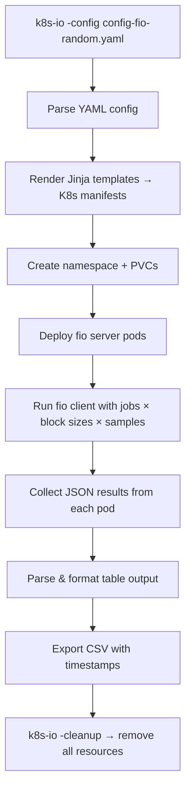

> 💡 **Quick Answer:** Run distributed fio and HammerDB benchmarks on Kubernetes with K8s-IO — a lightweight Go CLI that replaces heavy operator-based solutions. Config-driven with YAML, supports multiple samples, block sizes, and CSV result export.

## The Problem

Running storage and database benchmarks on Kubernetes traditionally requires deploying a full operator (like benchmark-operator) with cluster-wide CRDs and RBAC. For quick benchmark runs across different StorageClasses, you need something lighter — a CLI tool you can run from your laptop that creates benchmark pods, collects results, and cleans up.

## The Solution

### What is K8s-IO?

[K8s-IO](https://github.com/jtaleric/k8s-io) is a Go-based CLI tool by Joe Taleric (Red Hat) for running benchmark workloads on Kubernetes. It reuses Jinja templates from the benchmark-operator project but without any operator overhead.

**Supported benchmarks:**
- **fio** — Distributed I/O benchmark (storage performance)
- **HammerDB** — Database benchmark (PostgreSQL, MariaDB, MSSQL)

### Install K8s-IO

```bash
# Clone and build
git clone https://github.com/jtaleric/k8s-io.git
cd k8s-io
go mod tidy
go build -o k8s-io .

# Or cross-compile
GOOS=linux GOARCH=amd64 go build -o k8s-io-linux .
GOOS=darwin GOARCH=amd64 go build -o k8s-io-macos .

# Move to PATH
sudo mv k8s-io /usr/local/bin/
```

### fio Random I/O Config

```yaml
# config-fio-random.yaml
namespace: "benchmark-fio"
workload:
  name: "fio"
  args:
    kind: "pod"                    # "pod" or "vm" (KubeVirt)
    servers: 3                     # Number of FIO server pods
    samples: 3                     # Test iterations for statistical accuracy
    jobs: ["randread", "randwrite", "randrw"]  # Random I/O patterns
    bs: ["4KiB", "8KiB"]          # Block sizes
    numjobs: [4, 8]               # FIO processes per pod
    filesize: "4G"                 # File size per job
    storageclass: "ocs-storagecluster-ceph-rbd"  # Target StorageClass
    storagesize: "50Gi"           # PVC size
    fio_path: "/data"             # Test directory
    prefill: true                  # Prefill files before testing
```

### fio Sequential I/O Config

```yaml
# config-fio-sequential.yaml
namespace: "benchmark-fio-seq"
workload:
  name: "fio"
  args:
    kind: "pod"
    servers: 3
    samples: 3
    jobs: ["read", "write"]        # Sequential patterns
    bs: ["1MiB", "4MiB"]          # Large block sizes for throughput
    numjobs: [1, 4]
    filesize: "8G"
    storageclass: "ocs-storagecluster-ceph-rbd"
    storagesize: "100Gi"
    fio_path: "/data"
    prefill: true

# Optional: Prometheus metrics collection
prometheus:
  url: "http://prometheus.monitoring.svc.cluster.local:9091"
```

### Run Benchmarks

```bash
# Run distributed fio — random I/O
./k8s-io -config config-fio-random.yaml

# Run distributed fio — sequential I/O
./k8s-io -config config-fio-sequential.yaml

# Dry-run: generate manifests without applying
./k8s-io -config config-fio-random.yaml -dry-run

# Cleanup after benchmark
./k8s-io -config config-fio-random.yaml -cleanup
```

### Understanding fio Results

K8s-IO automatically parses fio JSON output and displays formatted results:

```
=== FIO Benchmark Results ===
Test ID                    Sample Job  Hostname      Read IOPS  Read BW   Write IOPS Write BW   Read P50  Read P95  Write P50 Write P95 Runtime
-------                    ------ ---  --------      ---------  -------   ---------- --------   --------  --------  --------- --------- -------
17586514_randread_4KiB_3   1      read worker-node-1 8284.2     33136     0.0        0          95.7      236.5     0.0       0.0       60
17586514_randread_4KiB_3   1      read worker-node-2 8105.7     32422     0.0        0          96.8      244.7     0.0       0.0       60
17586514_randread_4KiB_3   1      read worker-node-3 8291.1     33164     0.0        0          95.7      236.5     0.0       0.0       60
17586514_randread_4KiB_3   2      read worker-node-1 8545.0     34180     0.0        0          93.0      230.0     0.0       0.0       60
```

Results are also exported to CSV:

```
Results exported to: fio-results-17586514_randread_4KiB_3-20260408-120000.csv
```

### Key Metrics Explained

| Metric | What It Means | Good Values |
|--------|--------------|-------------|
| Read IOPS | Random read operations/sec | >10K (SSD), >50K (NVMe) |
| Write IOPS | Random write operations/sec | >5K (SSD), >30K (NVMe) |
| Read BW (KB/s) | Sequential read throughput | >500 MB/s (NVMe) |
| Write BW (KB/s) | Sequential write throughput | >300 MB/s (NVMe) |
| Read Lat P50 (µs) | Median read latency | <200µs (NVMe), <1ms (SSD) |
| Read Lat P95 (µs) | 95th percentile read latency | <500µs (NVMe), <5ms (SSD) |

### HammerDB Database Benchmark

```yaml
# config-hammerdb.yaml
namespace: "benchmark-hammerdb"
workload:
  name: "hammerdb"
  args:
    kind: "pod"
    db_type: "pg"                  # "pg", "mariadb", "mssql"
    db_init: true                  # Initialize TPC-C schema
    db_benchmark: true             # Run benchmark
    db_server: "postgresql.default.svc.cluster.local"
    warehouses: 10                 # TPC-C warehouses (scale factor)
    virtual_users: 5               # Concurrent users
    duration: 10                   # Test duration (minutes)
```

```bash
# Run database benchmark
./k8s-io -config config-hammerdb.yaml
```

### Compare Storage Classes

```bash
# Test Ceph RBD
cat > config-fio-rbd.yaml << 'EOF'
namespace: "bench-rbd"
workload:
  name: "fio"
  args:
    kind: "pod"
    servers: 3
    samples: 3
    jobs: ["randread", "randwrite"]
    bs: ["4KiB"]
    numjobs: [4]
    filesize: "4G"
    storageclass: "ocs-storagecluster-ceph-rbd"
    storagesize: "50Gi"
    prefill: true
EOF

# Test CephFS
cat > config-fio-cephfs.yaml << 'EOF'
namespace: "bench-cephfs"
workload:
  name: "fio"
  args:
    kind: "pod"
    servers: 3
    samples: 3
    jobs: ["randread", "randwrite"]
    bs: ["4KiB"]
    numjobs: [4]
    filesize: "4G"
    storageclass: "ocs-storagecluster-cephfs"
    storagesize: "50Gi"
    prefill: true
EOF

# Test local NVMe
cat > config-fio-local.yaml << 'EOF'
namespace: "bench-local"
workload:
  name: "fio"
  args:
    kind: "pod"
    servers: 3
    samples: 3
    jobs: ["randread", "randwrite"]
    bs: ["4KiB"]
    numjobs: [4]
    filesize: "4G"
    storageclass: "local-nvme"
    storagesize: "50Gi"
    prefill: true
EOF

# Run all three
./k8s-io -config config-fio-rbd.yaml
./k8s-io -config config-fio-cephfs.yaml
./k8s-io -config config-fio-local.yaml

# Compare CSV results
paste <(head -1 fio-results-*rbd*.csv) <(head -1 fio-results-*cephfs*.csv)
```

### KubeVirt VM Benchmarks

K8s-IO also supports running fio inside KubeVirt VMs:

```yaml
# config-fio-vm.yaml
namespace: "benchmark-fio-vm"
workload:
  name: "fio"
  args:
    kind: "vm"                     # Run inside KubeVirt VMs
    servers: 2
    samples: 2
    jobs: ["randread", "randwrite"]
    bs: ["4KiB"]
    numjobs: [4]
    filesize: "4G"
    storageclass: "ocs-storagecluster-ceph-rbd"
    fio_path: "/test"              # Default for VMs is /test
    prefill: true
```

### Prometheus Integration

```yaml
# Add Prometheus config for metric collection during benchmarks
prometheus:
  url: "http://prometheus.monitoring.svc.cluster.local:9091"
  # token: "optional-bearer-token"  # Auto-creates if omitted
```

This enables correlating fio results with:
- Storage backend CPU/memory usage
- Network throughput between pods and storage
- Ceph OSD latency and queue depth
- Node-level I/O wait metrics

### K8s-IO vs Alternatives

| Tool | Type | Overhead | Benchmarks | Results |
|------|------|----------|------------|---------|
| **K8s-IO** | CLI | None — runs from laptop | fio, HammerDB | Table + CSV |
| benchmark-operator | Operator | CRDs + controller pod | fio, HammerDB, iperf3, uperf | Elasticsearch |
| dbench | Pod | Single pod | fio only | Logs |
| Custom Jobs | YAML | Manual setup | Any | Manual |



## Common Issues

| Issue | Cause | Fix |
|-------|-------|-----|
| PVC pending | StorageClass doesn't exist | `kubectl get sc` — use correct name |
| Pods stuck creating | Image pull issues | Check node internet access |
| Low IOPS results | Prefill not enabled | Set `prefill: true` |
| Permission denied | OpenShift SCC | Use privileged SCC for benchmark ns |
| Results vary between samples | Not enough samples | Increase `samples: 5` for stability |
| Build fails | Go version too old | Requires Go 1.21+ |

## Best Practices

- **Run at least 3 samples** — single runs are noisy, use statistics
- **Enable prefill** — first-write penalty skews results without prefill
- **Test multiple block sizes** — 4K for IOPS, 1M for throughput
- **Compare StorageClasses** — run identical configs against each backend
- **Use dry-run first** — verify generated manifests before applying
- **Save CSV results** — track performance over time and across upgrades
- **Cleanup after tests** — `./k8s-io -cleanup` removes all benchmark resources
- **Use Prometheus integration** — correlate fio results with backend metrics

## Key Takeaways

- K8s-IO is a lightweight Go CLI for Kubernetes storage and database benchmarking
- No operator installation needed — runs from your laptop with kubeconfig access
- Config-driven: YAML files define benchmark parameters, easily version-controlled
- Automatic result parsing with formatted table output and CSV export
- Supports both pods and KubeVirt VMs as benchmark targets
- Reuses battle-tested templates from the benchmark-operator project
