> 💡 **Quick Answer:** Enable GPU sharing in KAI Scheduler by configuring **time-slicing** (workloads share GPU time) or **MIG partitioning** (hardware isolation). Set `nvidia.com/gpu-sharing` annotations and use fractional GPU requests like `nvidia.com/gpu: 0.5`. KAI's bin-packing optimizes placement to maximize utilization.
>
> **Key concept:** GPU sharing lets multiple pods use one GPU—time-slicing for light workloads, MIG for isolation.
>
> **Gotcha:** Time-slicing doesn't provide memory isolation—one workload can OOM others; use MIG for production isolation.

## The Problem

GPUs are expensive resources that often sit underutilized. Small inference workloads or interactive notebooks don't need a full GPU, yet standard scheduling allocates entire GPUs. This leads to poor utilization and wasted resources.

## The Solution

Use KAI Scheduler's GPU sharing capabilities with MIG (Multi-Instance GPU), time-slicing, or fractional GPU allocation. Combined with bin packing strategies, you can dramatically improve GPU utilization.

## GPU Sharing Architecture

```mermaid
flowchart TB
    subgraph cluster["☸️ KUBERNETES CLUSTER"]
        subgraph kai["🎯 KAI SCHEDULER"]
            BP["Bin Packing<br/>Algorithm"]
            GS["GPU Sharing<br/>Controller"]
        end
        
        subgraph gpu["🎮 NVIDIA A100 80GB"]
            direction TB
            subgraph mig["MIG PARTITIONS"]
                M1["1g.10gb"]
                M2["1g.10gb"]
                M3["2g.20gb"]
                M4["3g.40gb"]
            end
            subgraph ts["TIME-SLICING"]
                TS1["Slot 1"]
                TS2["Slot 2"]
                TS3["Slot 3"]
                TS4["Slot 4"]
            end
        end
        
        subgraph workloads["🚀 WORKLOADS"]
            W1["Notebook<br/>0.25 GPU"]
            W2["Small Inference<br/>0.5 GPU"]
            W3["Medium Training<br/>2g MIG"]
            W4["Large Training<br/>Full GPU"]
        end
    end
    
    workloads --> kai
    kai --> gpu
    W1 -.-> TS1
    W2 -.-> M1
    W3 -.-> M3
```



## Step 1: Enable GPU Sharing in KAI Scheduler

```bash
# Install KAI with GPU sharing enabled
helm upgrade -i kai-scheduler \
  oci://ghcr.io/nvidia/kai-scheduler/kai-scheduler \
  -n kai-scheduler \
  --version v0.12.10 \
  --set gpuSharing.enabled=true \
  --set gpuSharing.strategy=binpack  # or 'spread'
```

## Step 2: Configure GPU Operator for Time-Slicing

```yaml
# gpu-time-slicing-config.yaml
apiVersion: v1
kind: ConfigMap
metadata:
  name: time-slicing-config
  namespace: gpu-operator
data:
  any: |
    version: v1
    sharing:
      timeSlicing:
        renameByDefault: true
        failRequestsGreaterThanOne: false
        resources:
        - name: nvidia.com/gpu
          replicas: 4  # 4 time-slices per GPU
---
# Apply to GPU Operator
apiVersion: nvidia.com/v1
kind: ClusterPolicy
metadata:
  name: cluster-policy
spec:
  devicePlugin:
    config:
      name: time-slicing-config
      default: any
```

```bash
kubectl apply -f gpu-time-slicing-config.yaml
kubectl rollout restart daemonset nvidia-device-plugin-daemonset -n gpu-operator
```

## Step 3: Request Fractional GPUs

```yaml
# fractional-gpu-workloads.yaml
# Small workload requesting 1/4 GPU (time-sliced)
apiVersion: v1
kind: Pod
metadata:
  name: notebook-small
  namespace: ml-training
  labels:
    runai/queue: development
spec:
  schedulerName: kai-scheduler
  containers:
  - name: jupyter
    image: jupyter/pytorch-notebook:latest
    resources:
      limits:
        nvidia.com/gpu: 1  # Gets 1 time-slice (1/4 GPU)
    ports:
    - containerPort: 8888
---
# Medium workload requesting 1/2 GPU
apiVersion: v1
kind: Pod
metadata:
  name: inference-medium
  namespace: ml-training
  labels:
    runai/queue: inference
spec:
  schedulerName: kai-scheduler
  containers:
  - name: model-server
    image: nvcr.io/nvidia/tritonserver:24.01-py3
    resources:
      limits:
        nvidia.com/gpu: 2  # Gets 2 time-slices (1/2 GPU)
```

## Step 4: MIG-Based GPU Sharing

```yaml
# mig-sharing-config.yaml
apiVersion: v1
kind: ConfigMap
metadata:
  name: mig-config
  namespace: gpu-operator
data:
  config.yaml: |
    version: v1
    mig-configs:
      all-1g.10gb:
        - devices: all
          mig-enabled: true
          mig-devices:
            "1g.10gb": 7
      
      mixed-workload:
        - devices: all
          mig-enabled: true
          mig-devices:
            "1g.10gb": 2
            "2g.20gb": 1
            "3g.40gb": 1
      
      inference-optimized:
        - devices: all
          mig-enabled: true
          mig-devices:
            "1g.10gb": 4
            "2g.20gb": 1
```

```bash
kubectl apply -f mig-sharing-config.yaml

# Label nodes with desired MIG config
kubectl label node gpu-node-1 nvidia.com/mig.config=mixed-workload
```

## Step 5: Request Specific MIG Profiles

```yaml
# mig-workloads.yaml
# Small inference using 1g.10gb MIG slice
apiVersion: v1
kind: Pod
metadata:
  name: small-inference
  namespace: ml-training
spec:
  schedulerName: kai-scheduler
  containers:
  - name: inference
    image: nvcr.io/nvidia/tritonserver:24.01-py3
    resources:
      limits:
        nvidia.com/mig-1g.10gb: 1
---
# Medium training using 2g.20gb MIG slice
apiVersion: v1
kind: Pod
metadata:
  name: medium-training
  namespace: ml-training
spec:
  schedulerName: kai-scheduler
  containers:
  - name: trainer
    image: nvcr.io/nvidia/pytorch:24.01-py3
    resources:
      limits:
        nvidia.com/mig-2g.20gb: 1
---
# Large training using 3g.40gb MIG slice
apiVersion: v1
kind: Pod
metadata:
  name: large-training
  namespace: ml-training
spec:
  schedulerName: kai-scheduler
  containers:
  - name: trainer
    image: nvcr.io/nvidia/pytorch:24.01-py3
    resources:
      limits:
        nvidia.com/mig-3g.40gb: 1
```

## Step 6: Configure Bin Packing Strategy

```yaml
# bin-packing-config.yaml
apiVersion: v1
kind: ConfigMap
metadata:
  name: kai-scheduler-config
  namespace: kai-scheduler
data:
  config.yaml: |
    scheduling:
      strategy: binpack  # Pack pods onto fewest nodes
      binpacking:
        weights:
          gpu: 10        # Highest priority to pack GPUs
          cpu: 2
          memory: 1
        thresholds:
          gpu: 0.8       # Consider node "full" at 80% GPU
          cpu: 0.9
          memory: 0.9
```

```bash
kubectl apply -f bin-packing-config.yaml
kubectl rollout restart statefulset kai-scheduler -n kai-scheduler
```

## Step 7: Spread Scheduling for Resilience

```yaml
# spread-scheduling.yaml
apiVersion: apps/v1
kind: Deployment
metadata:
  name: inference-spread
  namespace: ml-inference
  annotations:
    # Request spread scheduling for this deployment
    scheduling.run.ai/scheduling-strategy: spread
spec:
  replicas: 4
  selector:
    matchLabels:
      app: inference
  template:
    metadata:
      labels:
        app: inference
        runai/queue: inference
    spec:
      schedulerName: kai-scheduler
      # Pod anti-affinity for additional spreading
      affinity:
        podAntiAffinity:
          preferredDuringSchedulingIgnoredDuringExecution:
          - weight: 100
            podAffinityTerm:
              labelSelector:
                matchLabels:
                  app: inference
              topologyKey: kubernetes.io/hostname
      containers:
      - name: server
        image: nvcr.io/nvidia/tritonserver:24.01-py3
        resources:
          limits:
            nvidia.com/gpu: 1
```

## Step 8: Monitor GPU Sharing Utilization

```bash
# View GPU utilization per node
kubectl exec -it -n gpu-operator \
  $(kubectl get pods -n gpu-operator -l app=nvidia-dcgm-exporter -o name | head -1) \
  -- dcgmi dmon -e 155,156,203

# Check MIG devices
kubectl get nodes -o custom-columns=\
'NAME:.metadata.name,MIG-1G:.status.allocatable.nvidia\.com/mig-1g\.10gb,MIG-2G:.status.allocatable.nvidia\.com/mig-2g\.20gb'

# View time-sliced GPUs
kubectl get nodes -o jsonpath='{range .items[*]}{.metadata.name}: {.status.allocatable.nvidia\.com/gpu}{"\n"}{end}'

# Check bin packing efficiency
kubectl get pods -A -o wide --field-selector spec.schedulerName=kai-scheduler | \
  awk '{print $8}' | sort | uniq -c | sort -rn
```

## GPU Sharing Strategies Comparison

| Strategy | Use Case | Pros | Cons |
|----------|----------|------|------|
| **MIG** | Production inference | Hardware isolation, guaranteed memory | Only A100/H100, fixed profiles |
| **Time-Slicing** | Development, notebooks | Any GPU, flexible | No memory isolation, context switching |
| **Fractional GPU** | Small workloads | Fine-grained allocation | Requires driver support |
| **Bin Packing** | Cost optimization | Maximum utilization | Less resilience |
| **Spread** | Production HA | Fault tolerance | Lower utilization |

## Step 9: DRA Integration for GPU Sharing

```yaml
# dra-gpu-sharing.yaml
apiVersion: resource.k8s.io/v1
kind: DeviceClass
metadata:
  name: nvidia.com/shared-gpu
spec:
  selectors:
  - cel:
      expression: 'device.driver == "nvidia.com/gpu"'
  config:
    opaque:
      driver: nvidia.com/gpu
      parameters:
        sharing:
          strategy: TimeSlicing
          replicas: 4
---
apiVersion: resource.k8s.io/v1
kind: ResourceClaimTemplate
metadata:
  name: shared-gpu-claim
  namespace: ml-training
spec:
  spec:
    devices:
      requests:
      - name: gpu
        deviceClassName: nvidia.com/shared-gpu
        count: 1
```

## Troubleshooting

### Time-sliced GPUs not appearing

```bash
# Check GPU Operator config
kubectl get clusterpolicy cluster-policy -o yaml | grep -A20 devicePlugin

# Verify time-slicing config
kubectl get configmap time-slicing-config -n gpu-operator -o yaml

# Check device plugin logs
kubectl logs -n gpu-operator -l app=nvidia-device-plugin-daemonset
```

### MIG profiles not available

```bash
# Check MIG mode on node
nvidia-smi -i 0 --query-gpu=mig.mode.current --format=csv

# List available MIG profiles
nvidia-smi mig -lgip

# Check node labels
kubectl get node <node> -o yaml | grep nvidia.com/mig
```

## Best Practices

| Practice | Description |
|----------|-------------|
| **Match sharing to workload** | Use MIG for production, time-slicing for dev |
| **Set appropriate quotas** | Account for shared GPU replicas in queue quotas |
| **Monitor memory usage** | Time-slicing shares memory, watch for OOM |
| **Use bin packing for cost** | Maximize utilization in cloud environments |
| **Use spread for production** | Ensure availability for critical inference |

## Summary

GPU sharing with KAI Scheduler maximizes expensive GPU utilization. By combining MIG partitioning, time-slicing, and intelligent bin packing, you can serve multiple workloads on single GPUs while maintaining appropriate isolation and performance guarantees.

---

## 📘 Go Further with Kubernetes Recipes

**Love this recipe? There's so much more!** This is just one of **100+ hands-on recipes** in our comprehensive **[Kubernetes Recipes book](https://amzn.to/3DzC8QA)**.

Inside the book, you'll master:
- ✅ Production-ready deployment strategies
- ✅ Advanced networking and security patterns  
- ✅ Observability, monitoring, and troubleshooting
- ✅ Real-world best practices from industry experts

> *"The practical, recipe-based approach made complex Kubernetes concepts finally click for me."*

**👉 [Get Your Copy Now](https://amzn.to/3DzC8QA)** — Start building production-grade Kubernetes skills today!
