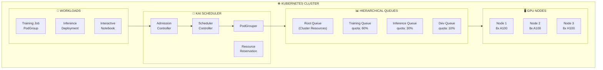

## The Problem

Standard Kubernetes schedulers aren't optimized for AI/ML workloads. They lack features like gang scheduling, GPU sharing, hierarchical resource quotas, and topology-aware placement that are essential for efficiently running training and inference workloads at scale.

## The Solution

Deploy NVIDIA KAI Scheduler, a robust scheduler designed for large-scale GPU clusters. It provides batch scheduling, hierarchical queues, GPU sharing, elastic workloads, and topology-aware scheduling optimized for AI workloads.

## KAI Scheduler Architecture



## Step 1: Verify Prerequisites

```bash
# Check Kubernetes version
kubectl version --short

# Verify GPU Operator is installed
kubectl get pods -n gpu-operator

# Check GPU nodes are available
kubectl get nodes -l nvidia.com/gpu.present=true

# Verify GPUs are discoverable
kubectl describe node <gpu-node> | grep nvidia.com/gpu
```

## Step 2: Install KAI Scheduler

```bash
# Create namespace
kubectl create namespace kai-scheduler

# Install from NVIDIA's container registry (recommended)
# Replace <VERSION> with latest from https://github.com/NVIDIA/KAI-Scheduler/releases
helm upgrade -i kai-scheduler \
  oci://ghcr.io/nvidia/kai-scheduler/kai-scheduler \
  -n kai-scheduler \
  --version v0.12.10

# Verify installation
kubectl get pods -n kai-scheduler
```

Expected output:
```
NAME                                    READY   STATUS    RESTARTS   AGE
kai-scheduler-0                         1/1     Running   0          60s
kai-scheduler-admission-xxx             1/1     Running   0          60s
kai-scheduler-podgrouper-xxx            1/1     Running   0          60s
kai-scheduler-resource-reservation-xxx  1/1     Running   0          60s
```

## Step 3: Configure Default Queues

```yaml
# queues.yaml
apiVersion: scheduling.run.ai/v2
kind: Queue
metadata:
  name: root
spec:
  displayName: "Root Queue"
  resources:
    gpu:
      quota: -1  # Unlimited (cluster total)
      limit: -1
---
apiVersion: scheduling.run.ai/v2
kind: Queue
metadata:
  name: training
spec:
  displayName: "Training Queue"
  parentQueue: root
  resources:
    gpu:
      quota: 16      # Guaranteed GPUs
      limit: 24      # Max GPUs (over-quota)
      overQuotaWeight: 2  # Priority for over-quota
---
apiVersion: scheduling.run.ai/v2
kind: Queue
metadata:
  name: inference
spec:
  displayName: "Inference Queue"
  parentQueue: root
  resources:
    gpu:
      quota: 8
      limit: 16
      overQuotaWeight: 1
---
apiVersion: scheduling.run.ai/v2
kind: Queue
metadata:
  name: development
spec:
  displayName: "Development Queue"
  parentQueue: root
  resources:
    gpu:
      quota: 4
      limit: 8
      overQuotaWeight: 0.5
```

```bash
kubectl apply -f queues.yaml
kubectl get queues
```

## Step 4: Create a Workload Namespace

```yaml
# workload-namespace.yaml
apiVersion: v1
kind: Namespace
metadata:
  name: ai-workloads
  labels:
    # Associate namespace with a queue
    runai/queue: training
```

```bash
kubectl apply -f workload-namespace.yaml
```

## Step 5: Submit a Simple GPU Workload

```yaml
# simple-gpu-job.yaml
apiVersion: batch/v1
kind: Job
metadata:
  name: gpu-test
  namespace: ai-workloads
  labels:
    runai/queue: training
spec:
  template:
    metadata:
      labels:
        runai/queue: training
    spec:
      schedulerName: kai-scheduler
      restartPolicy: Never
      containers:
      - name: cuda-test
        image: nvcr.io/nvidia/cuda:12.0-base
        command: ["nvidia-smi"]
        resources:
          limits:
            nvidia.com/gpu: 1
```

```bash
kubectl apply -f simple-gpu-job.yaml
kubectl get pods -n ai-workloads -w
kubectl logs job/gpu-test -n ai-workloads
```

## Step 6: Configure Priority Classes

```yaml
# priority-classes.yaml
apiVersion: scheduling.k8s.io/v1
kind: PriorityClass
metadata:
  name: kai-high-priority
value: 100
globalDefault: false
description: "High priority for production inference"
---
apiVersion: scheduling.k8s.io/v1
kind: PriorityClass
metadata:
  name: kai-normal-priority
value: 50
globalDefault: true
description: "Normal priority for training jobs"
---
apiVersion: scheduling.k8s.io/v1
kind: PriorityClass
metadata:
  name: kai-low-priority
value: 10
globalDefault: false
description: "Low priority for development/interactive"
preemptionPolicy: Never  # Won't preempt others
```

```bash
kubectl apply -f priority-classes.yaml
```

## Step 7: OpenShift Installation (Optional)

```bash
# For OpenShift with GPU Operator < v25.10.0
helm upgrade -i kai-scheduler \
  oci://ghcr.io/nvidia/kai-scheduler/kai-scheduler \
  -n kai-scheduler \
  --create-namespace \
  --version v0.12.10 \
  --set admission.gpuPodRuntimeClassName=null
```

## Step 8: Verify Scheduler is Working

```bash
# Check scheduler logs
kubectl logs -n kai-scheduler -l app=kai-scheduler --tail=100

# View queue status
kubectl get queues -o wide

# Check scheduled pods
kubectl get pods -A -o wide --field-selector spec.schedulerName=kai-scheduler

# View scheduling events
kubectl get events -n ai-workloads --field-selector reason=Scheduled
```

## KAI Scheduler Key Features

| Feature | Description |
|---------|-------------|
| **Batch Scheduling** | Gang scheduling - all pods scheduled together or none |
| **Hierarchical Queues** | Two-level queue hierarchy for organizational control |
| **GPU Sharing** | Multiple workloads share GPUs efficiently |
| **Bin Packing** | Minimize fragmentation by packing pods |
| **Spread Scheduling** | Distribute for resilience and load balancing |
| **Elastic Workloads** | Dynamic scaling within min/max bounds |
| **DRA Support** | Kubernetes ResourceClaims for vendor GPUs |
| **Topology-Aware** | Optimal placement for NVLink/NVSwitch |

## Troubleshooting

### Pods stuck in Pending

```bash
# Check pod events
kubectl describe pod <pod-name> -n <namespace>

# Check queue capacity
kubectl get queue training -o yaml

# View scheduler logs for the pod
kubectl logs -n kai-scheduler -l app=kai-scheduler | grep <pod-name>
```

### Queue not found

```bash
# Ensure queue label is correct
kubectl get pod <pod-name> -o jsonpath='{.metadata.labels.runai/queue}'

# List available queues
kubectl get queues

# Check namespace queue association
kubectl get namespace <ns> -o jsonpath='{.metadata.labels.runai/queue}'
```

## Best Practices

| Practice | Description |
|----------|-------------|
| **Dedicated workload namespace** | Never use kai-scheduler namespace for workloads |
| **Queue per team** | Create separate queues for different teams/projects |
| **Set quotas** | Define guaranteed and limit resources per queue |
| **Use priority classes** | Differentiate production vs development workloads |
| **Monitor queue utilization** | Track quota usage for capacity planning |

## Summary

KAI Scheduler provides enterprise-grade GPU scheduling for Kubernetes AI workloads. With hierarchical queues, batch scheduling, and GPU sharing, it optimizes resource utilization while maintaining fairness across teams and workloads.

---

## 📘 Go Further with Kubernetes Recipes

**Love this recipe? There's so much more!** This is just one of **100+ hands-on recipes** in our comprehensive **[Kubernetes Recipes book](https://amzn.to/3DzC8QA)**.

Inside the book, you'll master:
- ✅ Production-ready deployment strategies
- ✅ Advanced networking and security patterns  
- ✅ Observability, monitoring, and troubleshooting
- ✅ Real-world best practices from industry experts

> *"The practical, recipe-based approach made complex Kubernetes concepts finally click for me."*

**👉 [Get Your Copy Now](https://amzn.to/3DzC8QA)** — Start building production-grade Kubernetes skills today!
