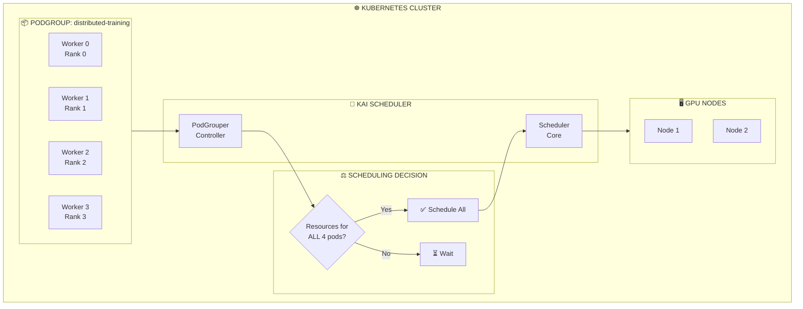

## The Problem

Distributed training jobs require all worker pods to start simultaneously. If only some pods are scheduled while others wait for resources, the running pods waste expensive GPU resources doing nothing. Standard Kubernetes scheduling doesn't guarantee all-or-nothing scheduling.

## The Solution

Use KAI Scheduler's PodGroups for gang (batch) scheduling. All pods in a group are scheduled together or none at all, preventing resource waste and deadlocks in distributed training scenarios.

## PodGroup Gang Scheduling Architecture



## Step 1: Understanding PodGroup Concepts

KAI Scheduler's PodGroup ensures:
- **All-or-nothing scheduling**: Either all pods are scheduled or none
- **Atomic resource allocation**: Resources reserved for entire group
- **Deadlock prevention**: Avoids partial scheduling that blocks other jobs
- **Hierarchical PodGroups**: Nested groups for complex workloads

## Step 2: Create a Basic PodGroup

```yaml
# basic-podgroup.yaml
apiVersion: scheduling.run.ai/v2
kind: PodGroup
metadata:
  name: training-job-pg
  namespace: ml-training
spec:
  minMember: 4  # Minimum pods required to start
  queue: training
  priority: 50
  scheduleTimeoutSeconds: 300  # Wait 5 minutes before timing out
```

```bash
kubectl apply -f basic-podgroup.yaml
```

## Step 3: Distributed PyTorch Training Job

```yaml
# pytorch-distributed-training.yaml
apiVersion: scheduling.run.ai/v2
kind: PodGroup
metadata:
  name: pytorch-ddp-training
  namespace: ml-training
spec:
  minMember: 4
  queue: training
  priority: 100
  scheduleTimeoutSeconds: 600
---
apiVersion: batch/v1
kind: Job
metadata:
  name: pytorch-ddp
  namespace: ml-training
spec:
  parallelism: 4
  completions: 4
  template:
    metadata:
      labels:
        runai/queue: training
      annotations:
        scheduling.run.ai/pod-group: pytorch-ddp-training
    spec:
      schedulerName: kai-scheduler
      restartPolicy: Never
      containers:
      - name: trainer
        image: nvcr.io/nvidia/pytorch:24.01-py3
        command:
        - python
        - -c
        - |
          import os
          import torch
          import torch.distributed as dist
          
          # Initialize distributed
          dist.init_process_group(backend='nccl')
          rank = dist.get_rank()
          world_size = dist.get_world_size()
          
          print(f"Rank {rank}/{world_size} initialized on {torch.cuda.get_device_name(0)}")
          
          # Simple all-reduce test
          tensor = torch.ones(1).cuda() * rank
          dist.all_reduce(tensor)
          print(f"Rank {rank}: All-reduce result = {tensor.item()}")
          
          dist.destroy_process_group()
        env:
        - name: MASTER_ADDR
          value: "pytorch-ddp-0"
        - name: MASTER_PORT
          value: "29500"
        - name: WORLD_SIZE
          value: "4"
        - name: NCCL_DEBUG
          value: "INFO"
        resources:
          limits:
            nvidia.com/gpu: 2
        ports:
        - containerPort: 29500
```

```bash
kubectl apply -f pytorch-distributed-training.yaml
kubectl get podgroup pytorch-ddp-training -n ml-training
kubectl get pods -n ml-training -l job-name=pytorch-ddp -w
```

## Step 4: Elastic PodGroup (Min/Max Members)

```yaml
# elastic-podgroup.yaml
apiVersion: scheduling.run.ai/v2
kind: PodGroup
metadata:
  name: elastic-training
  namespace: ml-training
spec:
  minMember: 2      # Start with minimum 2 workers
  maxMember: 8      # Scale up to 8 workers
  queue: training
  priority: 75
---
apiVersion: batch/v1
kind: Job
metadata:
  name: elastic-trainer
  namespace: ml-training
spec:
  parallelism: 8  # Request 8, but can start with fewer
  completions: 8
  template:
    metadata:
      annotations:
        scheduling.run.ai/pod-group: elastic-training
    spec:
      schedulerName: kai-scheduler
      restartPolicy: Never
      containers:
      - name: trainer
        image: nvcr.io/nvidia/pytorch:24.01-py3
        command: ["python", "elastic_train.py"]
        resources:
          limits:
            nvidia.com/gpu: 1
```

## Step 5: Hierarchical PodGroups for Complex Workloads

```yaml
# hierarchical-podgroups.yaml
# Parent PodGroup
apiVersion: scheduling.run.ai/v2
kind: PodGroup
metadata:
  name: ml-pipeline
  namespace: ml-training
spec:
  minMember: 2  # Need both sub-groups
  queue: training
  priority: 100
---
# Child PodGroup 1: Data preprocessing
apiVersion: scheduling.run.ai/v2
kind: PodGroup
metadata:
  name: data-preprocessors
  namespace: ml-training
spec:
  minMember: 2
  parentPodGroup: ml-pipeline
  queue: training
---
# Child PodGroup 2: Model trainers
apiVersion: scheduling.run.ai/v2
kind: PodGroup
metadata:
  name: model-trainers
  namespace: ml-training
spec:
  minMember: 4
  parentPodGroup: ml-pipeline
  queue: training
---
# Preprocessor pods
apiVersion: v1
kind: Pod
metadata:
  name: preprocessor-0
  namespace: ml-training
  annotations:
    scheduling.run.ai/pod-group: data-preprocessors
spec:
  schedulerName: kai-scheduler
  containers:
  - name: preprocess
    image: python:3.11
    command: ["python", "-c", "print('Preprocessing data...')"]
    resources:
      requests:
        cpu: "2"
        memory: "8Gi"
---
apiVersion: v1
kind: Pod
metadata:
  name: preprocessor-1
  namespace: ml-training
  annotations:
    scheduling.run.ai/pod-group: data-preprocessors
spec:
  schedulerName: kai-scheduler
  containers:
  - name: preprocess
    image: python:3.11
    command: ["python", "-c", "print('Preprocessing data...')"]
    resources:
      requests:
        cpu: "2"
        memory: "8Gi"
```

## Step 6: KubeRay Integration

```yaml
# ray-podgroup.yaml
apiVersion: ray.io/v1
kind: RayCluster
metadata:
  name: ray-cluster
  namespace: ml-training
  annotations:
    # KAI automatically creates PodGroup for Ray
    scheduling.run.ai/gang-scheduling: "true"
spec:
  rayVersion: '2.9.0'
  headGroupSpec:
    rayStartParams:
      dashboard-host: '0.0.0.0'
    template:
      spec:
        schedulerName: kai-scheduler
        containers:
        - name: ray-head
          image: rayproject/ray:2.9.0-py311-gpu
          resources:
            limits:
              nvidia.com/gpu: 1
              cpu: "4"
              memory: "16Gi"
  workerGroupSpecs:
  - replicas: 4
    minReplicas: 4  # Gang scheduling: all or nothing
    maxReplicas: 4
    groupName: gpu-workers
    rayStartParams: {}
    template:
      metadata:
        labels:
          runai/queue: training
      spec:
        schedulerName: kai-scheduler
        containers:
        - name: ray-worker
          image: rayproject/ray:2.9.0-py311-gpu
          resources:
            limits:
              nvidia.com/gpu: 2
              cpu: "8"
              memory: "32Gi"
```

## Step 7: Monitor PodGroup Status

```bash
# View PodGroup status
kubectl get podgroups -n ml-training

# Detailed PodGroup info
kubectl describe podgroup pytorch-ddp-training -n ml-training

# Check PodGroup phase
kubectl get podgroup pytorch-ddp-training -n ml-training \
  -o jsonpath='{.status.phase}'

# View pods in a PodGroup
kubectl get pods -n ml-training \
  -o jsonpath='{range .items[?(@.metadata.annotations.scheduling\.run\.ai/pod-group=="pytorch-ddp-training")]}{.metadata.name}{"\n"}{end}'

# Check scheduling events
kubectl get events -n ml-training --field-selector reason=PodGroupScheduled
```

## PodGroup Phases

| Phase | Description |
|-------|-------------|
| **Pending** | Waiting for resources to schedule minMember pods |
| **PreScheduling** | Evaluating if resources are available |
| **Scheduled** | All minMember pods have been scheduled |
| **Running** | Pods are running |
| **Failed** | Scheduling timeout or other failure |
| **Finished** | All pods completed |

## Step 8: Configure Scheduling Timeout and Retry

```yaml
# podgroup-with-timeout.yaml
apiVersion: scheduling.run.ai/v2
kind: PodGroup
metadata:
  name: training-with-timeout
  namespace: ml-training
spec:
  minMember: 8
  queue: training
  priority: 50
  scheduleTimeoutSeconds: 1800  # 30 minutes timeout
  # If timeout, pods go back to pending
  # Higher priority jobs may preempt and release resources
```

## Troubleshooting

### PodGroup stuck in Pending

```bash
# Check available resources
kubectl describe queue training

# View PodGroup conditions
kubectl get podgroup <name> -o yaml | grep -A10 conditions

# Check if minMember is achievable
kubectl get nodes -l nvidia.com/gpu.present=true \
  -o jsonpath='{range .items[*]}{.metadata.name}: {.status.allocatable.nvidia\.com/gpu}{"\n"}{end}'
```

### Partial scheduling (shouldn't happen)

```bash
# Verify all pods have the annotation
kubectl get pods -n <namespace> -o jsonpath='{range .items[*]}{.metadata.name}: {.metadata.annotations.scheduling\.run\.ai/pod-group}{"\n"}{end}'

# Check scheduler name
kubectl get pods -n <namespace> -o jsonpath='{range .items[*]}{.metadata.name}: {.spec.schedulerName}{"\n"}{end}'
```

## Best Practices

| Practice | Description |
|----------|-------------|
| **Set realistic minMember** | Don't require more pods than available GPU nodes |
| **Use appropriate timeouts** | Balance between waiting and failing fast |
| **Label pods consistently** | Ensure all pods have correct PodGroup annotation |
| **Use hierarchical groups** | For complex multi-stage workloads |
| **Monitor scheduling latency** | Track time from submission to running |

## Summary

PodGroups in KAI Scheduler provide essential gang scheduling for distributed training workloads. By ensuring all-or-nothing scheduling, you prevent resource waste from partial scheduling and deadlocks. Hierarchical PodGroups enable orchestrating complex multi-component AI pipelines.

---

## 📘 Go Further with Kubernetes Recipes

**Love this recipe? There's so much more!** This is just one of **100+ hands-on recipes** in our comprehensive **[Kubernetes Recipes book](https://amzn.to/3DzC8QA)**.

Inside the book, you'll master:
- ✅ Production-ready deployment strategies
- ✅ Advanced networking and security patterns  
- ✅ Observability, monitoring, and troubleshooting
- ✅ Real-world best practices from industry experts

> *"The practical, recipe-based approach made complex Kubernetes concepts finally click for me."*

**👉 [Get Your Copy Now](https://amzn.to/3DzC8QA)** — Start building production-grade Kubernetes skills today!
