> 💡 **Quick Answer:** Define `Queue` CRDs with `quota` (guaranteed resources) and `limit` (max borrowable). Create hierarchical queues for teams/projects and assign workloads via `queue` annotation. KAI uses **Dominant Resource Fairness (DRF)** to balance resource allocation across competing workloads.
>
> **Key pattern:** Parent queue with child queues—child quotas must sum to parent; excess capacity is shared via borrowing.
>
> **Gotcha:** Jobs without queue annotation go to default queue; set default queue limits to prevent resource monopolization.

## The Problem

In multi-tenant GPU clusters, different teams compete for limited resources. Without proper resource management, some teams may monopolize GPUs while others wait. You need fair resource distribution with guaranteed quotas and the ability to burst when resources are available.

## The Solution

Use KAI Scheduler's hierarchical queues with configurable quotas, over-quota weights, and Dominant Resource Fairness (DRF) to ensure equitable resource distribution while maximizing cluster utilization.

## Hierarchical Queue Architecture

```mermaid
flowchart TB
    subgraph cluster["☸️ CLUSTER RESOURCES: 64 GPUs"]
        subgraph root["🏢 ROOT QUEUE"]
            RQ["Total: 64 GPUs"]
        end
        
        subgraph l1["LEVEL 1 QUEUES"]
            direction LR
            PROD["Production<br/>quota: 40 GPUs<br/>limit: 56"]
            DEV["Development<br/>quota: 16 GPUs<br/>limit: 32"]
            RESEARCH["Research<br/>quota: 8 GPUs<br/>limit: 24"]
        end
        
        subgraph l2prod["PRODUCTION SUB-QUEUES"]
            direction LR
            TRAIN["Training<br/>quota: 24"]
            INFER["Inference<br/>quota: 16"]
        end
        
        subgraph l2dev["DEV SUB-QUEUES"]
            direction LR
            TEAM_A["Team A<br/>quota: 8"]
            TEAM_B["Team B<br/>quota: 8"]
        end
    end
    
    root --> l1
    PROD --> l2prod
    DEV --> l2dev
    
    style RQ fill:#e1f5fe
    style PROD fill:#c8e6c9
    style DEV fill:#fff3e0
    style RESEARCH fill:#f3e5f5
```



## Step 1: Create Root Queue

```yaml
# root-queue.yaml
apiVersion: scheduling.run.ai/v2
kind: Queue
metadata:
  name: root
spec:
  displayName: "Cluster Root Queue"
  resources:
    gpu:
      quota: -1      # Unlimited (use all cluster GPUs)
      limit: -1      # No limit
    cpu:
      quota: -1
      limit: -1
    memory:
      quota: -1
      limit: -1
```

```bash
kubectl apply -f root-queue.yaml
```

## Step 2: Create Department-Level Queues

```yaml
# department-queues.yaml
apiVersion: scheduling.run.ai/v2
kind: Queue
metadata:
  name: production
spec:
  displayName: "Production Workloads"
  parentQueue: root
  resources:
    gpu:
      quota: 40          # Guaranteed 40 GPUs
      limit: 56          # Can burst up to 56
      overQuotaWeight: 3 # High priority for over-quota
    cpu:
      quota: 200
      limit: 280
    memory:
      quota: "800Gi"
      limit: "1120Gi"
---
apiVersion: scheduling.run.ai/v2
kind: Queue
metadata:
  name: development
spec:
  displayName: "Development & Testing"
  parentQueue: root
  resources:
    gpu:
      quota: 16
      limit: 32
      overQuotaWeight: 1
    cpu:
      quota: 80
      limit: 160
    memory:
      quota: "320Gi"
      limit: "640Gi"
---
apiVersion: scheduling.run.ai/v2
kind: Queue
metadata:
  name: research
spec:
  displayName: "Research Projects"
  parentQueue: root
  resources:
    gpu:
      quota: 8
      limit: 24
      overQuotaWeight: 0.5  # Lower priority for over-quota
    cpu:
      quota: 40
      limit: 120
    memory:
      quota: "160Gi"
      limit: "480Gi"
```

```bash
kubectl apply -f department-queues.yaml
kubectl get queues
```

## Step 3: Create Team-Level Sub-Queues

```yaml
# team-queues.yaml
# Production sub-queues
apiVersion: scheduling.run.ai/v2
kind: Queue
metadata:
  name: training
spec:
  displayName: "ML Training"
  parentQueue: production
  resources:
    gpu:
      quota: 24
      limit: 40
      overQuotaWeight: 2
---
apiVersion: scheduling.run.ai/v2
kind: Queue
metadata:
  name: inference
spec:
  displayName: "Model Inference"
  parentQueue: production
  resources:
    gpu:
      quota: 16
      limit: 24
      overQuotaWeight: 3  # Higher priority - production serving
---
# Development sub-queues
apiVersion: scheduling.run.ai/v2
kind: Queue
metadata:
  name: team-alpha
spec:
  displayName: "Team Alpha"
  parentQueue: development
  resources:
    gpu:
      quota: 8
      limit: 16
      overQuotaWeight: 1
---
apiVersion: scheduling.run.ai/v2
kind: Queue
metadata:
  name: team-beta
spec:
  displayName: "Team Beta"
  parentQueue: development
  resources:
    gpu:
      quota: 8
      limit: 16
      overQuotaWeight: 1
```

```bash
kubectl apply -f team-queues.yaml
```

## Step 4: Associate Namespaces with Queues

```yaml
# namespaces.yaml
apiVersion: v1
kind: Namespace
metadata:
  name: ml-training
  labels:
    runai/queue: training
---
apiVersion: v1
kind: Namespace
metadata:
  name: ml-inference
  labels:
    runai/queue: inference
---
apiVersion: v1
kind: Namespace
metadata:
  name: team-alpha-dev
  labels:
    runai/queue: team-alpha
---
apiVersion: v1
kind: Namespace
metadata:
  name: team-beta-dev
  labels:
    runai/queue: team-beta
---
apiVersion: v1
kind: Namespace
metadata:
  name: research-projects
  labels:
    runai/queue: research
```

```bash
kubectl apply -f namespaces.yaml
```

## Step 5: Configure Fairness Policies

```yaml
# fairness-config.yaml
apiVersion: v1
kind: ConfigMap
metadata:
  name: kai-scheduler-config
  namespace: kai-scheduler
data:
  config.yaml: |
    fairnessPolicy: "DRF"  # Dominant Resource Fairness
    preemption:
      enabled: true
      withinQueue: true    # Allow preemption within same queue
      crossQueue: true     # Allow preemption across queues
    consolidation:
      enabled: true
      interval: "5m"       # Check for consolidation every 5 minutes
    timeBasedFairshare:
      enabled: true
      windowDuration: "24h"  # 24-hour fairness window
```

```bash
kubectl apply -f fairness-config.yaml
kubectl rollout restart statefulset kai-scheduler -n kai-scheduler
```

## Step 6: Submit Workloads to Different Queues

```yaml
# training-job.yaml
apiVersion: batch/v1
kind: Job
metadata:
  name: large-training
  namespace: ml-training
  labels:
    runai/queue: training
spec:
  parallelism: 4
  completions: 4
  template:
    metadata:
      labels:
        runai/queue: training
    spec:
      schedulerName: kai-scheduler
      restartPolicy: Never
      containers:
      - name: trainer
        image: nvcr.io/nvidia/pytorch:24.01-py3
        command: ["python", "-c", "import torch; print(f'GPUs: {torch.cuda.device_count()}')"]
        resources:
          limits:
            nvidia.com/gpu: 2
---
# inference-deployment.yaml
apiVersion: apps/v1
kind: Deployment
metadata:
  name: model-server
  namespace: ml-inference
  labels:
    runai/queue: inference
spec:
  replicas: 2
  selector:
    matchLabels:
      app: model-server
  template:
    metadata:
      labels:
        app: model-server
        runai/queue: inference
    spec:
      schedulerName: kai-scheduler
      priorityClassName: kai-high-priority
      containers:
      - name: server
        image: nvcr.io/nvidia/tritonserver:24.01-py3
        args: ["tritonserver", "--model-repository=/models"]
        resources:
          limits:
            nvidia.com/gpu: 1
```

```bash
kubectl apply -f training-job.yaml
kubectl apply -f inference-deployment.yaml
```

## Step 7: Monitor Queue Utilization

```bash
# View queue status
kubectl get queues -o wide

# Detailed queue info
kubectl describe queue training

# View resource allocation per queue
kubectl get queues -o custom-columns=\
'NAME:.metadata.name,GPU_QUOTA:.spec.resources.gpu.quota,GPU_LIMIT:.spec.resources.gpu.limit,PARENT:.spec.parentQueue'

# Check workloads per queue
kubectl get pods -A -l runai/queue=training

# View over-quota usage
kubectl get queue training -o jsonpath='{.status}'
```

## Step 8: Time-Based Fairshare Configuration

```yaml
# time-based-fairshare.yaml
apiVersion: scheduling.run.ai/v2
kind: Queue
metadata:
  name: research-burst
spec:
  displayName: "Research Burst Queue"
  parentQueue: research
  resources:
    gpu:
      quota: 4
      limit: 16
      overQuotaWeight: 2
  timeBasedFairshare:
    enabled: true
    windowDuration: "168h"  # Weekly fairness window
    # Queue gets fair share over the week, not instantaneously
```

Time-based fairshare ensures that a queue that underutilized its quota early in the period can catch up later, promoting overall fairness.

## Queue Resource Distribution

| Queue | Guaranteed | Limit | Over-Quota Weight | Priority |
|-------|------------|-------|-------------------|----------|
| production | 40 GPUs | 56 GPUs | 3 | Highest |
| training | 24 GPUs | 40 GPUs | 2 | High |
| inference | 16 GPUs | 24 GPUs | 3 | Critical |
| development | 16 GPUs | 32 GPUs | 1 | Normal |
| research | 8 GPUs | 24 GPUs | 0.5 | Low |

## Troubleshooting

### Queue over-quota but workloads pending

```bash
# Check if higher priority queues are using resources
kubectl get queues -o custom-columns='NAME:.metadata.name,ALLOCATED:.status.allocated.gpu'

# View preemption events
kubectl get events -A --field-selector reason=Preempted

# Check over-quota weight
kubectl get queue <queue-name> -o jsonpath='{.spec.resources.gpu.overQuotaWeight}'
```

### Workloads not respecting queue

```bash
# Verify queue label on pod
kubectl get pod <pod-name> -o jsonpath='{.metadata.labels.runai/queue}'

# Check namespace queue association
kubectl get ns <namespace> -o jsonpath='{.metadata.labels.runai/queue}'

# Ensure schedulerName is set
kubectl get pod <pod-name> -o jsonpath='{.spec.schedulerName}'
```

## Best Practices

| Practice | Description |
|----------|-------------|
| **Sum quotas ≤ cluster capacity** | Ensure guaranteed quotas don't exceed available resources |
| **Set meaningful limits** | Allow bursting but prevent single queue monopolization |
| **Use over-quota weights** | Differentiate priority for excess resource allocation |
| **Monitor utilization** | Track queue usage to adjust quotas based on actual demand |
| **Enable time-based fairshare** | Use for research/batch workloads with variable demand |

## Summary

Hierarchical queues in KAI Scheduler provide flexible multi-tenant resource management for GPU clusters. With quotas, limits, and fairness policies, you can ensure teams get guaranteed resources while maximizing overall cluster utilization through intelligent over-quota allocation.

---

## 📘 Go Further with Kubernetes Recipes

**Love this recipe? There's so much more!** This is just one of **100+ hands-on recipes** in our comprehensive **[Kubernetes Recipes book](https://amzn.to/3DzC8QA)**.

Inside the book, you'll master:
- ✅ Production-ready deployment strategies
- ✅ Advanced networking and security patterns  
- ✅ Observability, monitoring, and troubleshooting
- ✅ Real-world best practices from industry experts

> *"The practical, recipe-based approach made complex Kubernetes concepts finally click for me."*

**👉 [Get Your Copy Now](https://amzn.to/3DzC8QA)** — Start building production-grade Kubernetes skills today!
