## The Problem

Modern GPU servers have complex topologies with NVLink, NVSwitch, and PCIe interconnects. Placing workloads without considering topology leads to suboptimal performance—GPUs communicating over slow PCIe instead of fast NVLink can drastically slow distributed training.

## The Solution

Use KAI Scheduler's Topology-Aware Scheduling (TAS) to place workloads on GPUs with optimal interconnect topology. TAS understands NVLink domains, NVSwitch fabrics, and ensures distributed training jobs get GPUs with the fastest communication paths.

## GPU Topology Architecture

```mermaid
flowchart TB
    subgraph node["🖥️ DGX H100 NODE"]
        subgraph nvswitch["🔀 NVSwitch Fabric"]
            SW1["NVSwitch 1"]
            SW2["NVSwitch 2"]
            SW3["NVSwitch 3"]
            SW4["NVSwitch 4"]
        end
        
        subgraph gpus["🎮 8x H100 GPUs"]
            direction LR
            G0["GPU 0"]
            G1["GPU 1"]
            G2["GPU 2"]
            G3["GPU 3"]
            G4["GPU 4"]
            G5["GPU 5"]
            G6["GPU 6"]
            G7["GPU 7"]
        end
        
        subgraph domains["📦 NVLink Domains"]
            D1["Domain A<br/>GPU 0-3"]
            D2["Domain B<br/>GPU 4-7"]
        end
    end
    
    subgraph kai["🎯 KAI TAS"]
        TAS["Topology-Aware<br/>Scheduler"]
        TOPO["Topology<br/>Discovery"]
    end
    
    gpus <--> nvswitch
    domains --> kai
    kai --> gpus
```



## Step 1: Enable Topology-Aware Scheduling

```bash
# Install KAI with TAS enabled
helm upgrade -i kai-scheduler \
  oci://ghcr.io/nvidia/kai-scheduler/kai-scheduler \
  -n kai-scheduler \
  --version v0.12.10 \
  --set topologyAwareScheduling.enabled=true \
  --set topologyAwareScheduling.nvlinkAware=true
```

## Step 2: View GPU Topology

```bash
# Check GPU topology on a node
nvidia-smi topo -m

# Example output for 8-GPU system:
#         GPU0  GPU1  GPU2  GPU3  GPU4  GPU5  GPU6  GPU7
# GPU0     X    NV18  NV18  NV18  NV18  NV18  NV18  NV18
# GPU1    NV18   X    NV18  NV18  NV18  NV18  NV18  NV18
# ...

# NV18 = NVLink 18 lanes (fast)
# SYS = System/PCIe (slow)
# PHB = PCIe Host Bridge
# NODE = Same NUMA node
```

## Step 3: Label Nodes with Topology Information

```yaml
# topology-labels.yaml
apiVersion: v1
kind: Node
metadata:
  name: dgx-h100-01
  labels:
    nvidia.com/gpu.count: "8"
    nvidia.com/gpu.product: "NVIDIA-H100-80GB-HBM3"
    nvidia.com/nvswitch.present: "true"
    nvidia.com/nvlink.version: "4"
    topology.kubernetes.io/zone: "gpu-zone-1"
    # Custom topology labels
    gpu.topology/nvlink-domain-size: "8"
    gpu.topology/interconnect: "nvswitch"
```

```bash
kubectl label node dgx-h100-01 \
  nvidia.com/nvswitch.present=true \
  gpu.topology/interconnect=nvswitch
```

## Step 4: Configure TAS Policies

```yaml
# tas-config.yaml
apiVersion: v1
kind: ConfigMap
metadata:
  name: kai-scheduler-config
  namespace: kai-scheduler
data:
  config.yaml: |
    topologyAwareScheduling:
      enabled: true
      policies:
        # Prefer GPUs within same NVLink domain
        - name: nvlink-locality
          weight: 100
          topology: nvlink
          strategy: pack  # Pack within NVLink domain
        
        # Consider NUMA locality
        - name: numa-locality  
          weight: 50
          topology: numa
          strategy: pack
        
        # Prefer nodes with NVSwitch for multi-node
        - name: nvswitch-preference
          weight: 80
          topology: nvswitch
          strategy: prefer
      
      # Topology hierarchy
      levels:
        - name: gpu
          label: nvidia.com/gpu
        - name: nvlink-domain
          label: gpu.topology/nvlink-domain
        - name: numa-node
          label: topology.kubernetes.io/numa-node
        - name: node
          label: kubernetes.io/hostname
```

```bash
kubectl apply -f tas-config.yaml
kubectl rollout restart statefulset kai-scheduler -n kai-scheduler
```

## Step 5: Request Topology-Aware Placement

```yaml
# topology-aware-training.yaml
apiVersion: scheduling.run.ai/v2
kind: PodGroup
metadata:
  name: ddp-training-tas
  namespace: ml-training
spec:
  minMember: 4
  queue: training
  topologyPolicy:
    # All pods should be on same NVLink domain
    scope: nvlink-domain
    # Or: same node, same rack, etc.
---
apiVersion: batch/v1
kind: Job
metadata:
  name: ddp-nvlink-training
  namespace: ml-training
spec:
  parallelism: 4
  completions: 4
  template:
    metadata:
      annotations:
        scheduling.run.ai/pod-group: ddp-training-tas
        # Request topology-aware placement
        scheduling.run.ai/topology-policy: nvlink-locality
    spec:
      schedulerName: kai-scheduler
      containers:
      - name: trainer
        image: nvcr.io/nvidia/pytorch:24.01-py3
        command:
        - python
        - -c
        - |
          import torch
          import torch.distributed as dist
          import os
          
          dist.init_process_group(backend='nccl')
          rank = dist.get_rank()
          
          # Test NVLink bandwidth
          tensor = torch.randn(1024, 1024, 1024).cuda()
          
          import time
          start = time.time()
          for _ in range(100):
              dist.all_reduce(tensor)
          torch.cuda.synchronize()
          elapsed = time.time() - start
          
          if rank == 0:
              bandwidth = (tensor.numel() * 4 * 100 * 2) / elapsed / 1e9
              print(f"All-reduce bandwidth: {bandwidth:.2f} GB/s")
        resources:
          limits:
            nvidia.com/gpu: 2
        env:
        - name: NCCL_DEBUG
          value: "INFO"
        - name: NCCL_TOPO_DUMP_FILE
          value: "/tmp/nccl_topo.xml"
```

## Step 6: Multi-Node Topology-Aware Scheduling

```yaml
# multi-node-tas.yaml
apiVersion: scheduling.run.ai/v2
kind: PodGroup
metadata:
  name: multi-node-training
  namespace: ml-training
spec:
  minMember: 2  # 2 nodes
  queue: training
  topologyPolicy:
    scope: rack  # Place on nodes in same rack for low latency
    affinity:
      required:
        - key: nvidia.com/nvswitch.present
          operator: In
          values: ["true"]
---
apiVersion: v1
kind: Pod
metadata:
  name: trainer-node-0
  namespace: ml-training
  annotations:
    scheduling.run.ai/pod-group: multi-node-training
spec:
  schedulerName: kai-scheduler
  nodeSelector:
    nvidia.com/nvswitch.present: "true"
  containers:
  - name: trainer
    image: nvcr.io/nvidia/pytorch:24.01-py3
    resources:
      limits:
        nvidia.com/gpu: 8  # All GPUs on node
    env:
    - name: NCCL_IB_DISABLE
      value: "0"
    - name: NCCL_NET_GDR_LEVEL
      value: "5"
```

## Step 7: Disaggregated Serving with TAS

```yaml
# disaggregated-serving.yaml
# For architectures like Dynamo/Grove where components need topology awareness
apiVersion: scheduling.run.ai/v2
kind: PodGroup
metadata:
  name: llm-serving-pipeline
  namespace: ml-inference
spec:
  minMember: 3  # Router + Prefill + Decode
  queue: inference
  topologyPolicy:
    scope: node  # All components on same node for low latency
---
# Prefill worker - needs high memory bandwidth
apiVersion: v1
kind: Pod
metadata:
  name: prefill-worker
  namespace: ml-inference
  annotations:
    scheduling.run.ai/pod-group: llm-serving-pipeline
    scheduling.run.ai/topology-role: prefill
spec:
  schedulerName: kai-scheduler
  containers:
  - name: prefill
    image: vllm/vllm-openai:latest
    args:
    - --model=/models/llama-70b
    - --tensor-parallel-size=4
    - --pipeline-parallel-size=1
    resources:
      limits:
        nvidia.com/gpu: 4
---
# Decode worker - needs high compute
apiVersion: v1
kind: Pod
metadata:
  name: decode-worker
  namespace: ml-inference
  annotations:
    scheduling.run.ai/pod-group: llm-serving-pipeline
    scheduling.run.ai/topology-role: decode
spec:
  schedulerName: kai-scheduler
  containers:
  - name: decode
    image: vllm/vllm-openai:latest
    args:
    - --model=/models/llama-70b
    - --tensor-parallel-size=4
    resources:
      limits:
        nvidia.com/gpu: 4
```

## Step 8: Monitor Topology Placement

```bash
# View pod placement with GPU allocation
kubectl get pods -n ml-training -o wide

# Check NCCL topology detection
kubectl exec -it <pod-name> -n ml-training -- \
  cat /tmp/nccl_topo.xml

# View GPU assignments
kubectl exec -it <pod-name> -n ml-training -- \
  nvidia-smi -L

# Check NVLink status
kubectl exec -it <pod-name> -n ml-training -- \
  nvidia-smi nvlink -s

# Verify topology-aware scheduling worked
kubectl get events -n ml-training | grep -i topology
```

## Topology Scope Options

| Scope | Description | Use Case |
|-------|-------------|----------|
| **gpu** | Single GPU | Interactive notebooks |
| **nvlink-domain** | GPUs connected via NVLink | Single-node distributed training |
| **node** | All GPUs on a node | Large model training |
| **rack** | Nodes in same rack | Multi-node with low latency |
| **zone** | Availability zone | Geographic distribution |

## Step 9: Performance Comparison

```yaml
# benchmark-topology.yaml
apiVersion: batch/v1
kind: Job
metadata:
  name: nccl-benchmark
  namespace: ml-training
spec:
  template:
    metadata:
      annotations:
        scheduling.run.ai/topology-policy: nvlink-locality
    spec:
      schedulerName: kai-scheduler
      restartPolicy: Never
      containers:
      - name: benchmark
        image: nvcr.io/nvidia/pytorch:24.01-py3
        command:
        - bash
        - -c
        - |
          # Run NCCL tests
          cd /opt/nccl-tests/build
          
          echo "=== All-Reduce Bandwidth ==="
          ./all_reduce_perf -b 8 -e 1G -f 2 -g 4
          
          echo "=== All-Gather Bandwidth ==="
          ./all_gather_perf -b 8 -e 1G -f 2 -g 4
        resources:
          limits:
            nvidia.com/gpu: 4
```

Expected results with proper topology:
- NVLink: 400-600 GB/s
- PCIe: 20-30 GB/s

## Troubleshooting

### Pods not placed on same NVLink domain

```bash
# Check if TAS is enabled
kubectl get configmap kai-scheduler-config -n kai-scheduler -o yaml | grep topology

# View scheduler logs
kubectl logs -n kai-scheduler -l app=kai-scheduler | grep -i topology

# Check node labels
kubectl get nodes -L nvidia.com/nvswitch.present,gpu.topology/interconnect
```

### Poor NCCL performance despite TAS

```bash
# Check NCCL topology
kubectl exec -it <pod> -- nvidia-smi topo -m

# Verify NCCL is using NVLink
kubectl exec -it <pod> -- bash -c 'NCCL_DEBUG=INFO python -c "import torch.distributed"' 2>&1 | grep -i nvlink

# Check for PCIe fallback
kubectl exec -it <pod> -- bash -c 'NCCL_DEBUG=INFO python train.py' 2>&1 | grep -i "using network"
```

## Best Practices

| Practice | Description |
|----------|-------------|
| **Use NVLink for DDP** | Always request topology-aware for distributed training |
| **Match topology to workload** | Small jobs don't need NVSwitch nodes |
| **Test actual bandwidth** | Verify NCCL performance after placement |
| **Label nodes accurately** | Maintain correct topology labels |
| **Consider multi-node latency** | Use same-rack placement for multi-node |

## Summary

Topology-Aware Scheduling in KAI Scheduler ensures distributed training and inference workloads are placed on GPUs with optimal interconnect topology. By leveraging NVLink and NVSwitch awareness, you can achieve maximum GPU communication bandwidth and significantly faster training times.

---

## 📘 Go Further with Kubernetes Recipes

**Love this recipe? There's so much more!** This is just one of **100+ hands-on recipes** in our comprehensive **[Kubernetes Recipes book](https://amzn.to/3DzC8QA)**.

Inside the book, you'll master:
- ✅ Production-ready deployment strategies
- ✅ Advanced networking and security patterns  
- ✅ Observability, monitoring, and troubleshooting
- ✅ Real-world best practices from industry experts

> *"The practical, recipe-based approach made complex Kubernetes concepts finally click for me."*

**👉 [Get Your Copy Now](https://amzn.to/3DzC8QA)** — Start building production-grade Kubernetes skills today!
