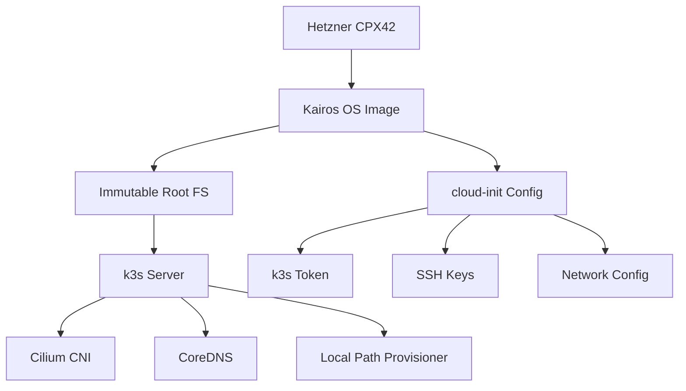

> 💡 **Quick Answer:** Kairos turns any Linux distro into an immutable, A/B-upgradeable OS for Kubernetes. Combined with k3s on a Hetzner CPX42 (8 vCPU / 16 GB), you get a production-capable single-node cluster for ~€15/month.

## The Problem

Traditional Kubernetes nodes accumulate drift over time — package updates break dependencies, configuration changes go untracked, and disaster recovery means rebuilding from scratch. You need a lightweight, immutable OS that boots directly into k3s with zero manual intervention.

## The Solution

Kairos provides an immutable OS layer that:
- Boots from a read-only squashfs image
- Upgrades atomically (A/B partition scheme)
- Configures entirely via cloud-init at first boot
- Runs k3s as the single workload orchestrator

### Architecture



### Step 1: Create the Cloud-Init Configuration

```yaml
# cloud-config.yaml
#cloud-config

hostname: k3s-prod-01
users:
  - name: admin
    ssh_authorized_keys:
      - ssh-ed25519 AAAAC3NzaC1lZDI1NTE5... admin@workstation
    sudo: ALL=(ALL) NOPASSWD:ALL
    shell: /bin/bash

k3s:
  enabled: true
  args:
    - --disable=traefik
    - --disable=servicelb
    - --flannel-backend=none
    - --disable-network-policy
    - --write-kubeconfig-mode=644
    - --tls-san=k3s.example.com
    - --cluster-cidr=10.42.0.0/16
    - --service-cidr=10.43.0.0/16

stages:
  initramfs:
    - name: "Set kernel parameters"
      sysctl:
        net.core.rmem_max: "26214400"
        net.core.wmem_max: "26214400"
        fs.inotify.max_user_instances: "1024"
        fs.inotify.max_user_watches: "524288"

  boot:
    - name: "Configure firewall"
      commands:
        - iptables -A INPUT -p tcp --dport 6443 -j ACCEPT
        - iptables -A INPUT -p tcp --dport 443 -j ACCEPT
        - iptables -A INPUT -p tcp --dport 80 -j ACCEPT
```

### Step 2: Deploy on Hetzner

```bash
# Install Kairos ISO via Hetzner rescue mode
# Or use the Hetzner API with custom image

# Option A: Upload custom ISO
hcloud server create \
  --name k3s-prod-01 \
  --type cpx42 \
  --location fsn1 \
  --image ubuntu-24.04 \
  --ssh-key admin-key \
  --user-data-from-file cloud-config.yaml

# Option B: Install Kairos from rescue mode
# Boot into rescue, then:
curl -LO https://github.com/kairos-io/kairos/releases/download/v3.3.1/kairos-opensuse-leap-15.6-standard-amd64-generic-v3.3.1.iso
kairos-agent install --config cloud-config.yaml
reboot
```

### Step 3: Verify the Cluster

```bash
# SSH into the node
ssh admin@k3s.example.com

# Check k3s status
sudo systemctl status k3s

# Get kubeconfig
sudo cat /etc/rancher/k3s/k3s.yaml

# Verify node is Ready (no CNI yet — will be NotReady until Cilium)
sudo k3s kubectl get nodes
# NAME           STATUS     ROLES                  AGE   VERSION
# k3s-prod-01   NotReady   control-plane,master   2m    v1.31.4+k3s1
```

### Step 4: Configure Immutable Upgrades

```yaml
# upgrade-plan.yaml — System Upgrade Controller
apiVersion: upgrade.cattle.io/v1
kind: Plan
metadata:
  name: kairos-upgrade
  namespace: system-upgrade
spec:
  concurrency: 1
  channel: https://github.com/kairos-io/kairos/releases
  version: v3.3.1
  nodeSelector:
    matchExpressions:
      - key: node-role.kubernetes.io/control-plane
        operator: Exists
  tolerations:
    - key: node-role.kubernetes.io/control-plane
      operator: Exists
  cordon: true
  drain:
    force: true
```

### Step 5: Hetzner CPX42 Resource Allocation

```yaml
# Recommended resource reservations for single-node
# CPX42: 8 AMD vCPU / 16 GB RAM / 240 GB NVMe
---
# k3s server process: ~500MB RAM, 0.5 CPU
# Cilium agent: ~256MB RAM, 0.2 CPU
# System overhead: ~1GB RAM
# Available for workloads: ~14GB RAM, 7 CPU
---
# kubelet resource reservation
apiVersion: v1
kind: ConfigMap
metadata:
  name: k3s-config
data:
  config.yaml: |
    kubelet-arg:
      - "system-reserved=cpu=500m,memory=1Gi"
      - "kube-reserved=cpu=500m,memory=512Mi"
      - "eviction-hard=memory.available<256Mi,nodefs.available<10%"
```

## Common Issues

| Issue | Cause | Fix |
|-------|-------|-----|
| Node stays NotReady | No CNI installed | Install Cilium (next recipe) |
| k3s fails to start | Port 6443 already in use | Check cloud-init didn't start multiple instances |
| Upgrade stuck | Drain failed | Check PDB blocking eviction |
| Disk full | Containerd images | `k3s crictl rmi --prune` |
| SSH timeout after reboot | Firewall reset | Add iptables rules to cloud-init `boot` stage |

## Best Practices

1. **Always disable Traefik and ServiceLB** — use Cilium's Gateway API instead
2. **Set `--flannel-backend=none`** — required for Cilium to manage networking
3. **Pin k3s version in cloud-init** — don't auto-upgrade the control plane
4. **Use Hetzner volumes for PVs** — local-path is fine for dev, not production stateful workloads
5. **Enable audit logging** from day one — `--kube-apiserver-arg=audit-log-path=/var/log/k8s-audit.log`

## Key Takeaways

- Kairos provides immutable infrastructure for k3s with zero-drift guarantees
- Hetzner CPX42 offers the best price/performance ratio for single-node clusters (~€15/month)
- Cloud-init configures everything at first boot — no SSH required for initial setup
- A/B upgrades mean zero-downtime OS updates
- Disable default k3s addons (Traefik, Flannel, ServiceLB) when using Cilium
