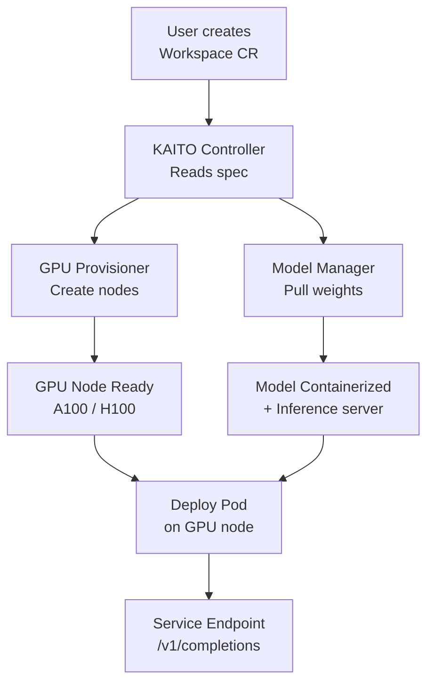

> 💡 **Quick Answer:** Create a KAITO `Workspace` CR specifying the model name and GPU requirements. KAITO automatically provisions GPU nodes, pulls model weights, containerizes the model, and deploys an inference endpoint — reducing LLM deployment from days to minutes.

## The Problem

Deploying AI models on Kubernetes requires multiple manual steps: provision GPU nodes, configure the GPU operator, pull model weights (often 50-200GB), build a serving container, create Deployments/Services, and configure autoscaling. KAITO automates the entire pipeline with a single custom resource.

## The Solution

### KAITO Architecture

KAITO operates as a Kubernetes operator with three main components:

1. **Workspace Controller** — watches Workspace CRs, orchestrates deployment
2. **GPU Provisioner** — auto-provisions GPU nodes via cloud APIs (Karpenter-based)
3. **Model Manager** — handles model weight download and containerization

### Install KAITO

```bash
# Install KAITO operator
helm repo add kaito https://azure.github.io/kaito/charts
helm repo update

helm install kaito-workspace kaito/kaito-workspace \
  --namespace kaito-workspace \
  --create-namespace \
  --set gpu-provisioner.enabled=true
```

### Deploy a Preset Model

```yaml
apiVersion: kaito.sh/v1alpha1
kind: Workspace
metadata:
  name: llama-3-70b
  namespace: inference
spec:
  resource:
    instanceType: "Standard_NC96ads_A100_v4"
    count: 2
    labelSelector:
      matchLabels:
        apps: llama-inference
  inference:
    preset:
      name: "llama-3-70b-instruct"
    adapters:
      - source:
          name: "fine-tuned-adapter"
          image: "registry.example.com/adapters/custom-lora:v1"
```

KAITO will:
1. Provision 2× A100 GPU nodes
2. Download Llama 3 70B weights
3. Deploy with tensor parallelism across 2 nodes
4. Create a Service endpoint

### Custom Model from Private Registry

```yaml
apiVersion: kaito.sh/v1alpha1
kind: Workspace
metadata:
  name: custom-model
  namespace: inference
spec:
  resource:
    instanceType: "Standard_NC24ads_A100_v4"
    count: 1
  inference:
    template:
      containers:
        - name: inference
          image: registry.example.com/models/custom-bert:v2
          ports:
            - containerPort: 8080
          resources:
            limits:
              nvidia.com/gpu: 1
          env:
            - name: MODEL_PATH
              value: /models/custom-bert
```

### Query the Model

```bash
# Get the service endpoint
export SVC_IP=$(kubectl get svc llama-3-70b -n inference -o jsonpath='{.status.loadBalancer.ingress[0].ip}')

# Inference request
curl -X POST http://${SVC_IP}/v1/completions \
  -H "Content-Type: application/json" \
  -d '{
    "model": "llama-3-70b-instruct",
    "prompt": "Explain Kubernetes pods in simple terms",
    "max_tokens": 256,
    "temperature": 0.7
  }'
```

### KAITO vs Manual Deployment

| Step | Manual | KAITO |
|------|--------|-------|
| GPU node provisioning | 10-30 min | Automatic |
| GPU operator setup | 15 min | Pre-configured |
| Model download (70B) | 10-20 min | Automatic + cached |
| Container build | 30 min | Automatic |
| K8s manifests | 30 min | 1 CR |
| Tensor parallelism | Complex config | Automatic |
| **Total** | **2-4 hours** | **10-15 minutes** |



## Common Issues

**Workspace stuck in Provisioning**

GPU instance type unavailable in region. Check cloud provider quota: `az vm list-usage --location eastus | grep NC`. Request quota increase or try a different instance type.

**Model download timeout**

Large models (70B+) take 10-20 minutes to download. KAITO caches model weights on PVCs — subsequent deployments use the cache. Ensure PVC storage class supports ReadWriteMany for multi-node.

## Best Practices

- **Use preset models for common LLMs** — Llama, Mistral, Phi — one-line deployment
- **Private registry for custom models** — use the template spec for full control
- **Cache model weights on PVC** — avoid re-downloading on pod restart
- **Label GPU nodes** for workload isolation — inference vs training vs notebooks
- **Monitor Workspace status** — `kubectl get workspace -w` shows provisioning progress

## Key Takeaways

- KAITO automates the full LLM deployment pipeline: GPU provisioning → model download → containerization → serving
- Single Workspace CR replaces hours of manual configuration
- Automatic GPU node provisioning via Karpenter-based provisioner
- Supports preset models (Llama, Mistral, Phi) and custom models from private registries
- LoRA adapter support for fine-tuned model variants without re-downloading base weights
